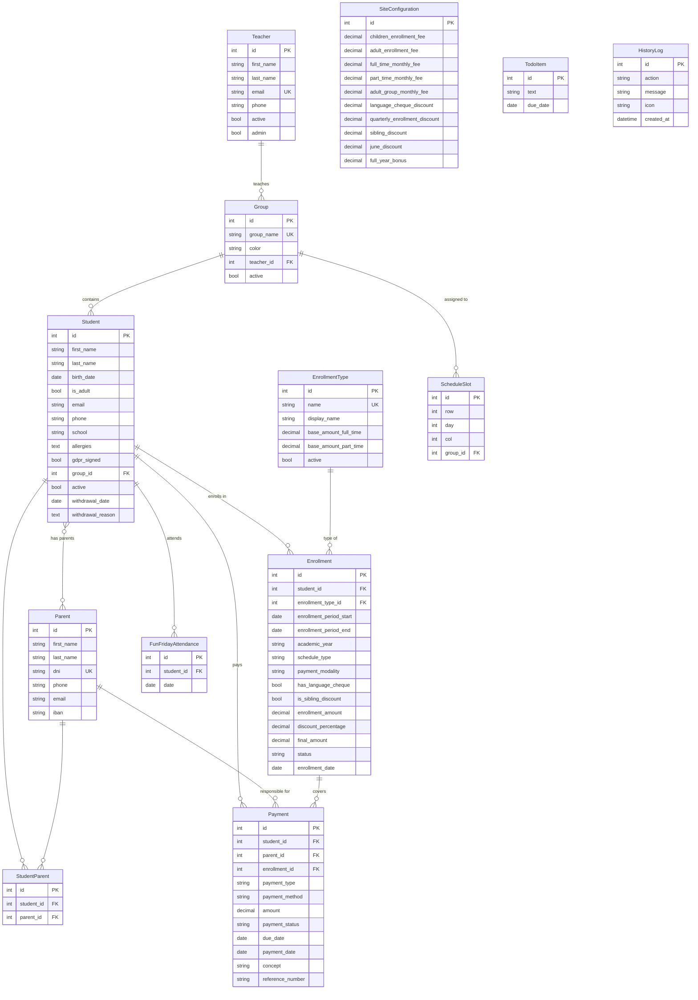
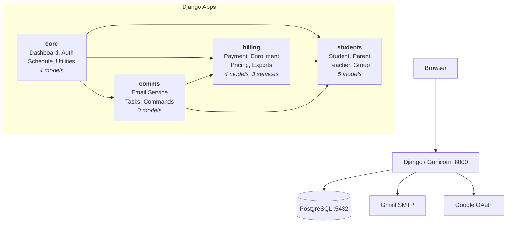
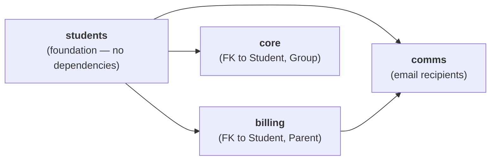

# Five a Day eVolution

<p align="center">
  
  <br>
  <em>Student Management System for Five a Day English Academy</em>
  <br>
  <em>Albacete, Spain</em>
</p>

<p align="center">
  <a href="https://github.com/starseeker-code-public/five-a-day/actions/workflows/ci.yml"></a>
  <a href="https://codecov.io/gh/starseeker-code-public/five-a-day"></a>
</p>

---

Built to centralize student records, automate billing cycles, and streamline parent communication for a small and lovely English academy.

### Project Status

<p align="center">
  
  &nbsp;|&nbsp;
  <a href="https://github.com/starseeker-code-public/five-a-day/actions/workflows/ci.yml?query=branch%3Amain"></a>
  &nbsp;|&nbsp;
  <a href="https://codecov.io/gh/starseeker-code-public/five-a-day"></a>
  &nbsp;|&nbsp;
  <a href="https://github.com/starseeker-code-public/five-a-day/actions/workflows/scorecard.yml"></a>
  &nbsp;|&nbsp;
  <a href="https://github.com/starseeker-code-public/five-a-day/security/dependabot"></a>
</p>


| Environment | Branch | Hosting | CI Status |
|-------------|--------|---------|-----------|
| **Production** | `main` | Pending — GCP Cloud Run + Cloud SQL (`europe-southwest1`) | [](https://github.com/starseeker-code-public/five-a-day/actions/workflows/ci.yml?query=branch%3Amain) |
| **Testing (QA)** | `testing` | [http://34.26.130.187:8000/](http://34.26.130.187:8000/) — GCP Compute Engine `e2-micro` (always-free tier, Docker Compose) | [](https://github.com/starseeker-code-public/five-a-day/actions/workflows/ci.yml?query=branch%3Atesting) |
| **Development** | `development` | [Local Docker](http://localhost:8000/) via `make up` | [](https://github.com/starseeker-code-public/five-a-day/actions/workflows/ci.yml?query=branch%3Adevelopment) |


| Version | Date | Description |
|---------|------|-------------|
| **v1.7.0** | 2026-07-02 | Reports dashboard: financial, collection, retention, group utilisation + PDF export |
| v1.5.0 | 2026-07-02 | Expense tracking with recurring templates + income vs expense widget |
| v1.4.0 | 2026-07-02 | Beat schedule for monthly payment generation + monthly report |

---

## Table of Contents

- [Five a Day eVolution](#five-a-day-evolution)
    - [Project Status](#project-status)
  - [Table of Contents](#table-of-contents)
  - [Version History \& Roadmap](#version-history--roadmap)
    - [Roadmap](#roadmap)
      - [v1.8 — SMS Notifications (Twilio)](#v18--sms-notifications-twilio)
      - [v1.9 — Parent Portal](#v19--parent-portal)
      - [v1.10 — Audit Log \& Security Hardening](#v110--audit-log--security-hardening)
      - [v1.11 — Stripe Payment Integration](#v111--stripe-payment-integration)
      - [v1.12 — Mobile Optimization \& PWA](#v112--mobile-optimization--pwa)
  - [Tech Stack](#tech-stack)
    - [Backend](#backend)
    - [Frontend](#frontend)
    - [Infrastructure \& Deployment](#infrastructure--deployment)
    - [Python Dependencies](#python-dependencies)
    - [Developer Tooling](#developer-tooling)
  - [Database Schema](#database-schema)
    - [ER Diagram](#er-diagram)
    - [Key Constraints](#key-constraints)
  - [Development \& Docker](#development--docker)
    - [Quick Start](#quick-start)
    - [.env template](#env-template)
    - [Make Commands](#make-commands)
    - [Environment Configuration](#environment-configuration)
    - [Environment Variables Reference](#environment-variables-reference)
    - [App Versioning](#app-versioning)
  - [Project Structure \& Architecture](#project-structure--architecture)
    - [Architecture Overview](#architecture-overview)
    - [App Dependency Flow](#app-dependency-flow)
    - [Directory Layout](#directory-layout)
    - [App: core](#app-core)
    - [App: students](#app-students)
    - [App: billing](#app-billing)
    - [App: comms](#app-comms)
    - [Design Decisions](#design-decisions)
  - [Features by View](#features-by-view)
    - [Home (Dashboard)](#home-dashboard)
    - [Students](#students)
    - [Student Create](#student-create)
    - [Student Detail \& Update](#student-detail--update)
    - [Payments](#payments)
    - [Schedule](#schedule)
    - [Fun Friday](#fun-friday)
    - [Apps (Email Tools)](#apps-email-tools)
    - [Management](#management)
    - [Database (All Info)](#database-all-info)
    - [Login](#login)
    - [Password Reset](#password-reset)
  - [Testing](#testing)
    - [Testing Overview](#testing-overview)
    - [Unit Tests](#unit-tests)
    - [Integration Tests](#integration-tests)
    - [Coverage Report](#coverage-report)
  - [Migrations](#migrations)
  - [Security](#security)
    - [Authentication](#authentication)
    - [Session \& Cookie Configuration](#session--cookie-configuration)
    - [CSRF Protection](#csrf-protection)
    - [Transport Security (HTTPS)](#transport-security-https)
    - [Security Headers](#security-headers)
    - [Infrastructure \& Deployment](#infrastructure--deployment-1)
      - [Docker](#docker)
      - [Google Cloud Run](#google-cloud-run)
    - [Secrets Management](#secrets-management)
    - [Email Security](#email-security)
    - [Data Protection \& Input Validation](#data-protection--input-validation)
    - [Logging \& Monitoring](#logging--monitoring)
    - [Future Security Improvements](#future-security-improvements)
  - [Testing Environment (QA)](#testing-environment-qa)
    - [What is the testing environment?](#what-is-the-testing-environment)
    - [How to access it](#how-to-access-it)
    - [What you can test](#what-you-can-test)
    - [How to report a problem](#how-to-report-a-problem)
    - [Error pages you might see](#error-pages-you-might-see)
    - [For developers: how the QA environment works](#for-developers-how-the-qa-environment-works)
      - [Access control for `/testing/`](#access-control-for-testing)
  - [CI/CD \& GitHub Actions](#cicd--github-actions)
    - [Pipeline Overview](#pipeline-overview)
    - [Branch Strategy](#branch-strategy)
    - [Workflows](#workflows)
    - [Automated Flows](#automated-flows)
    - [Branch Protection — `main`](#branch-protection--main)
    - [Branch Protection — `testing`](#branch-protection--testing)
    - [Public Repository Hardening](#public-repository-hardening)
    - [Required GitHub Secrets](#required-github-secrets)
    - [Email Notifications](#email-notifications)
    - [Dependabot](#dependabot)
    - [CodeQL Security Scanning](#codeql-security-scanning)
  - [Contributing](#contributing)
    - [Development Workflow](#development-workflow)
    - [Make Commands (Developer Tooling)](#make-commands-developer-tooling)
    - [Code Conventions](#code-conventions)
    - [Adding a Feature](#adding-a-feature)
  - [License](#license)

---

## Version History & Roadmap

<details id="v170" open>
<summary><strong>v1.7.0 — Reports & Analytics (current)</strong></summary>

- New `core.services.analytics_service` with `financial_summary_month`, `financial_summary_year`, `collection_rate`, `retention_snapshot`, `group_utilisation`, and a `dashboard_report` bundle used by both the HTML page and the PDF export.
- New `/reports/` page: month/year controls, 4-tile financial snapshot (income / pending / expenses / net), collection-rate + retention cards, per-group utilisation table (`enrolled/max_students` + waiters), and a 12-row yearly table.
- New `GET /reports/download.pdf` renders the same data through the reportlab pipeline (`billing.services.pdf_service`) — reuses the shared header/footer/styles for a consistent look with receipts and tax certificates.
- Sidebar gains a "Informes" entry (`bar_chart` icon, admin-only). Non-admin whitelist extended with `reports_view` + `reports_pdf` for future teacher-facing rollout.
- 15 tests covering every service function, the endpoint happy paths, and the PDF byte signature.

</details>

<details id="v150">
<summary><strong>v1.5.0 — Expense Tracking</strong></summary>

Adds the second half of the finance loop — the app can now record every euro
that leaves the academy alongside every euro that comes in.

**Model**

- New `Expense` model with `description`, `category` (rent / salaries / supplies / utilities / marketing / software / insurance / taxes / other), `amount`, `expense_date`, and free-form `notes`.
- Optional recurring-template mode via `is_recurring=True` + `recurring_day` (1–28). Templates are never counted in monthly totals; instead a Beat job materialises a concrete `Expense` row (with a `generated_from` FK) on the first of every month, keeping historical reports honest and idempotent.

**Views + UI**

- New `/expenses/` page with month/year/category filters, an income vs expense summary (Ingresos / Gastos / Beneficio neto), a create form, and a compact table listing.
- Recurring templates surface in a dedicated section at the bottom of the page so admins can prune / edit them without hunting.
- Sidebar gains a "Gastos" entry with the `receipt_long` icon, visible to admins and non-admin teachers alike.
- Non-admin Teacher whitelist extended with `expenses_list`, `create_expense`, and `delete_expense`.

**Beat integration**

- New `billing.tasks.materialize_recurring_expenses_task` runs on day 1 at 06:30 Europe/Madrid — right after the payment-generation job so the month's ledger is complete before the admin opens the dashboard.

**Testing**

- 17 tests (`tests/unit/test_expenses.py` + `tests/integration/test_expense_views.py`) covering the model constraints, the `monthly_totals` service (empty, mixed, recurring-excluded), the `materialize_recurring` idempotency, and the full CRUD endpoint surface.

</details>

<details id="v140">
<summary><strong>v1.4.0 — Celery Beat Schedule</strong></summary>

**Beat schedule additions**

- `generate-monthly-payments`: runs `billing.tasks.generate_monthly_payments_task` on day 1 of every month at 06:00 Europe/Madrid. Wraps the existing `python manage.py generate_payments` command so Beat and the CLI share exactly one code path.
- `send-monthly-report`: runs `comms.tasks.send_monthly_report_task` on day 28 at 20:00 Europe/Madrid. Aggregates expected / collected / outstanding totals for the current month via a single `Payment.objects.aggregate` call and emails them to `SUPPORT_EMAIL` (skips gracefully when unset).

**Task discovery**

- New `billing/tasks.py` module (previously the app had no async tasks). Adds the module to Celery's autodiscover surface — no manual imports needed.
- Pre-existing birthday-emails and payment-reminders schedules remain unchanged.

**Testing**

- 5 unit tests for the new tasks (`tests/unit/test_beat_tasks.py`) covering the CLI-command wrap, the "no recipient" skip path, and custom-recipient forwarding.
- 8 Beat-schedule sanity tests (`tests/unit/test_celery_config.py`) that assert both new entries are present, run on the right day-of-month, target the correct queue, and are registered with the Celery app.

</details>

<details id="v130">
<summary><strong>v1.3.0 — PDF Invoice Generation</strong></summary>

**PDF service**

- New `billing/services/pdf_service.py` built on **reportlab** (pure-Python, no cairo/pango deps — deploys cleanly on Cloud Run and the testing VM without touching the base image).
- Three public functions: `generate_payment_receipt(payment)`, `generate_quarterly_summary(student, payments, quarter_label)`, and `generate_tax_certificate(parent, year)`. All three return raw PDF bytes so callers can attach to email, stream as an HTTP response, or upload to Cloud Storage without intermediate buffering.
- Shared `AcademyInfo` dataclass pulls business info from SiteConfiguration when populated; falls back to hard-coded defaults so a fresh install still produces a valid document.
- Consistent header (academy name + title + subtitle) and footer ("generated on…" + website) across all three document types, with the primary violet as the accent colour.

**Endpoints**

- New `GET /payments/<id>/receipt.pdf` streams a receipt directly (Content-Disposition: attachment; filename="recibo-<id>.pdf"). No JS wrapper — links can be embedded in any template.

**Backwards-compatible integration with comms**

- `comms.services.email_functions.generate_tax_certificate_pdf` now delegates to the new service. The old HTML+WeasyPrint block is retained as a defence-in-depth fallback (unreachable in practice because reportlab is now a hard dependency).

**Testing**

- 7 unit tests in `tests/unit/test_pdf_service.py` covering: PDF byte signature (`%PDF-…%%EOF`), missing payment date, missing parent, empty payment list for quarterly, zero-payment tax certificate, non-trivial size when payments exist.
- 2 integration tests in `tests/integration/test_receipt_view.py` for the `/payments/<id>/receipt.pdf` endpoint (200 + application/pdf, 404 on missing id).

</details>

<details id="v120">
<summary><strong>v1.2.0 — Google Sheets Integration</strong></summary>

**Service layer**

- New `core/services/google_sheets_service.py` with `GoogleSheetsService` (spreadsheet client + export methods) and `ExportResult` (never-raise result object). Two credential sources supported: inline JSON in `GOOGLE_SHEETS_SERVICE_ACCOUNT_JSON` (recommended for Cloud Run + Secret Manager) or a JSON file path in `GOOGLE_SHEETS_SERVICE_ACCOUNT_FILE`. Both are optional — `is_configured()` reports False when either the credential or `GOOGLE_SHEETS_SPREADSHEET_ID` is missing, and every entry point checks it before touching the network.
- Two export methods so far: `export_students()` writes the active-students snapshot (name, group, age, adult flag, GDPR, waiting-list flag, parents) and `export_payments(academic_year=None)` writes the payments table for the given year (defaults to current). Both overwrite their worksheet — the sheet is always an authoritative snapshot rather than an append-only log.

**Endpoints**

- New `POST /api/sheets/export/` with `?target=students|payments|both` (default `both`). Returns 200 on success, 400 for bad targets, 502 on partial export failures, and 503 when the integration is unconfigured so the frontend can surface a specific "not configured" message instead of a generic error.
- New management command `python manage.py export_to_sheets` with `--students / --payments / --academic-year / --students-sheet / --payments-sheet` flags. Runs headless from cron / Cloud Scheduler — no UI dependency.

**Settings + wiring**

- Three new optional settings (`GOOGLE_SHEETS_SERVICE_ACCOUNT_JSON`, `GOOGLE_SHEETS_SERVICE_ACCOUNT_FILE`, `GOOGLE_SHEETS_SPREADSHEET_ID`) — all read from env vars, all default to empty so the feature stays dormant until deliberately enabled.
- New `HistoryLog` action `sheets_exported` fires after every successful export.

**Testing**

- 14 unit tests in `tests/unit/test_google_sheets_service.py` covering configuration detection (inline / file / missing / malformed), the export-students and export-payments happy paths, and error-object propagation when the worksheet client raises.
- 6 integration tests in `tests/integration/test_sheets_views.py` covering method restriction, unconfigured-503, target validation, and the 502-on-partial-failure semantics.

</details>

<details id="v110">
<summary><strong>v1.1.0 — Waiting List & Group Capacity</strong></summary>

**Waiting list**

- New `Student.is_waiting` flag + `waiting_since` timestamp (auto-set on flip, cleared when unset). Waiting-list students still live in the same `students` table and keep their preferred `group` FK, but they don't count against the group's enrolled capacity and are excluded from `/students/`.
- New `/students/waiting/` page with per-student cards, FIFO ordering (`waiting_since` asc), a per-group filter, and a header capacity summary showing enrolled / max / available spots for every active group.
- Quick-assign action (`POST /students/<id>/assign/`) promotes a waiting student to enrolled in one click: flips `is_waiting=False`, creates a default full-time monthly `Enrollment`, and a pending enrollment-fee `Payment`. Refuses to run when the group is already at cap.
- Reverse action (`POST /students/<id>/wait/`) moves an enrolled student back onto the waiting list.
- Non-admin Teacher whitelist updated: `waiting_list`, `assign_from_waiting_list`, `add_to_waiting_list` are all reachable in view+edit modes for Teachers, matching the existing student-management authority level.

**Group capacity**

- New `Group.max_students` (PositiveIntegerField, default `0`) — a soft cap on enrolled students. `0` means "no cap" for backwards compatibility with every existing group.
- Group model gains `enrolled_count`, `waiting_count`, `available_spots`, `is_full` computed properties. `enrolled_count` excludes both inactive and waiting students, so `available_spots` reflects the number of real active seats free.
- `group_capacity_summary()` helper returns annotated capacity + waiter counts for the dashboard and the waiting-list page in a single query (uses conditional `Count` aggregates — no N+1).
- Group admin now shows `max_students` / `enrolled_count` / `available_spots` in the list view.

**Dashboard integration**

- New dashboard card highlighting `waiting_count` alongside a chip list of groups that have free spots *and* waiters (`has_room_for_waiters`), each linking through to the waiting-list page.
- Sidebar gains a "Lista de Espera" entry with a `hourglass_top` icon, visible to admins and non-admin Teachers alike.

**Notifications**

- Post-save signal on `Student` fires when `active` transitions `True → False`; if the group has waiters, a `HistoryLog` entry (`waiting_list_spot_open`) is written so the dashboard history dropdown surfaces the newly available spot.
- Three new `HistoryLog` action choices: `waiting_list_added`, `waiting_list_assigned`, `waiting_list_spot_open`.

**Testing**

- 14 unit tests in `tests/unit/test_waiting_list.py` covering the group capacity properties, `waiting_since` auto-set / clear, `group_capacity_summary`, and the pre-save `active` transition capture.
- 16 integration tests in `tests/integration/test_waiting_list_views.py` covering the list page, quick-assign happy path, cap enforcement, HTTP method restriction, waiting-list exclusion from the main students list, and the dashboard widget context.

</details>

<details id="v1013">
<summary><strong>v1.0.13 — Env-File Consolidation, Settings Simplification & Render Removal</strong></summary>

**Env files: 7 → 3, no overlays**

- Deleted stale env files: `.env`, `.env2`, `.env.old`, `.env.final`, `.env.testing_users`. The repo now ships exactly three self-contained env files — `.env.development`, `.env.testing`, `.env.production` — each one fully usable on its own.
- Workflow: rename the one you want active to `.env` before `docker compose up` (or `make up`). No more "which overlay won" detective work.
- `.env.production` is a template for **local prod-simulation only**. Real Cloud Run reads env from `--set-env-vars` + Secret Manager — never from a file.
- `make setup` now intelligently copies `.env.development → .env` if no `.env` exists yet.

**Settings.py simplified**

- Dropped 20 lines of conditional overlay-loading (`.env.development` / `.env.testing_users`). Now a single `load_dotenv(".env")` call.
- Removed the dead SQLite database fallback — PostgreSQL is the only supported backend.
- Removed the broken `urlparse` validation that was silently rejecting Cloud Run's socket-style `DATABASE_URL` (e.g. `postgres://user:pass@/db?host=/cloudsql/...`).
- Dropped all "Render, Heroku" comments and stale Spanish docstrings.
- Net change: ~50 lines shorter.

**entrypoint.sh rewritten**

- Removed the `IS_RENDER` boolean and every Render-themed log line. The new signal for "skip the postgres TCP wait" is `DATABASE_URL` presence (Cloud SQL via socket).
- Removed the `createsuperuser` block — admin access is delegated to Teachers with `ADMIN=True` via the `post_save` signal that mirrors `is_staff` + `is_superuser`.
- Always `exec "$@"` so the Dockerfile CMD (gunicorn) drives the server choice; the dev compose still overrides with `runserver`.
- ~120 lines shorter, single code path for all environments.

**docker-compose.testing.yml slimmed**

- Removed the redundant `env_file: .env.testing` override (compose reads `.env` now).
- Removed the duplicated `POSTGRES_DB/USER/PASSWORD` `environment:` blocks on both `db` and `web` — these come from `.env`.
- Removed the hardcoded password in the DB healthcheck — it now uses `${POSTGRES_PASSWORD}` from `.env`.
- ~30 lines shorter; only the two genuine differences from base remain (gunicorn command + isolated `testing_postgres_data` volume).

**gcp-cloudrun.yaml deleted**

- The alternative Cloud Run deployment manifest had placeholders and had drifted from `DEPLOYMENT.md`'s direct-`gcloud run deploy` workflow. Deleted to avoid a second source of truth.

**Documentation overhaul**

- Three `CLAUDE.md` gotchas rewritten (`load_dotenv` semantics, the new 3-file layout replacing the overlay system, teacher-seed contract).
- `README.md` updates: Quick Start uses the rename workflow, `.env template` is now a single superset block with per-section "applies to" notes (removed `DJANGO_SUPERUSER_*` and `ACADEMY_WHATSAPP` rows), Make Commands table fully synced with the actual Makefile (dropped fictitious `make test-sqlite/test-local/test-coverage/test-models/test-services/test-views/test-fast/test-k` targets, added the celery + cleanup blocks), file structure tree updated for the three-file env layout, dev auth description corrected, Configuration files table for QA, App Versioning section now correctly states "four places" (was "two").
- `DEPLOYMENT.md` testing-VM section no longer references the `.env.testing_users` overlay.
- `Makefile` versioning comment corrected to four places.
- `seed_teachers` warning message points to the new env file names.

**Testing VM live**

- Deployed to GCP Compute Engine `e2-micro` (us-east1-c, always-free tier) with a reserved static external IP `34.26.130.187`. Reachable at `http://34.26.130.187:8000/` over plain HTTP. Runs the full Docker Compose stack (db + redis + web + celery_worker + celery_beat) on top of a 2 GB swap file (the e2-micro only has 1 GB RAM).
- All three seeded teachers (Claudia, Silvia, John Doe) log in successfully; admin Teachers reach `/admin/` via their email + password.
- GCP billing budget alert set at €0.01 — fires on any non-free-tier spend.

</details>

<details id="v1012">
<summary><strong>v1.0.12 — Teacher Login, Password Reset & Non-Admin Whitelist</strong></summary>

**Authentication overhaul** (ships roadmap item v1.6)

- `core/views/auth.py`: login view now dispatches by `DJANGO_ENV`. **Development** still compares against `LOGIN_USERNAME`/`LOGIN_PASSWORD` and get-or-creates a matching Django superuser so `/admin/` keeps working. **Testing/production** authenticates against `auth.User` via `django.contrib.auth.authenticate` — Teachers log in with their email + hashed password.
- Google OAuth callback get-or-creates a Django superuser and links it to an existing Teacher by email so a single OAuth login grants both app and `/admin/` access through the same `ModelBackend`.
- `_finalize_session_login(...)` unifies session setup across env-var, Teacher, and OAuth paths — every successful login now goes through `django.contrib.auth.login` *and* the legacy `session["is_authenticated"]` flag.
- Logout calls `django.contrib.auth.logout(...)` and then flushes the session.

**Teacher ↔ auth.User link**

- `students/models.py`: new `Teacher.user` `OneToOneField(auth.User, null=True, on_delete=SET_NULL, related_name="teacher")`. Migration `students.0003_teacher_user` ships the field as nullable so existing rows survive.
- `Teacher.ensure_user(password=None)` — idempotent helper that get-or-creates the linked user, syncs name/email, mirrors `Teacher.admin` onto `is_staff` + `is_superuser`, and optionally sets a hashed password. Omitting the password leaves the user with `unusable_password` so they must use `/password-reset/`.
- `post_save` signal on Teacher mirrors `admin` / email / first_name / last_name onto the linked User on every save.

**Authorization (non-admin Teacher whitelist)**

- `core/middleware.py`: `SimpleAuthMiddleware` now does two layers. Layer 1 (authentication) is unchanged; layer 2 (authorization) restricts non-admin Teachers to the `NON_ADMIN_ALLOWED_URL_NAMES` whitelist — admin-only routes redirect to the dashboard with a flash message, or return `{"success": False, "error": ...}` JSON 403 on `/api/*`.
- Public prefixes list now includes `/password-reset/` so locked-out teachers can still reach the reset flow.
- `core/context_processors.py`: exposes `is_admin_user` / `is_non_admin_teacher` flags so templates can hide admin-only UI (`base.html` swaps Payments/Apps/Database for Fun Friday in the sidebar; `management.html` becomes read-only).

**Password reset flow**

- New `core/views/password_reset.py`: branded subclasses of Django's built-in `PasswordResetView` / `Done` / `Confirm` / `Complete` plus a `build_reset_link(request, user)` helper.
- New URL patterns: `/password-reset/`, `/password-reset/sent/`, `/password-reset/confirm/<uidb64>/<token>/`, `/password-reset/complete/`.
- New branded templates under `project/templates/registration/` (`reset_base.html`, `password_reset_form.html`, `password_reset_done.html`, `password_reset_confirm.html`, `password_reset_complete.html`, plus `password_reset_email.txt` / `password_reset_subject.txt`) and a new HTML email template at `core/templates/emails/password_reset.html`.
- Login page renders "¿Has olvidado tu contraseña?" link only when `password_reset_available` is true (i.e. non-dev environments).

**Teacher seeding**

- New `core/management/commands/seed_teachers.py`: idempotent Teacher + linked-User creation from `TEACHER_SEED_<N>_*` env vars (numbered from 1, iteration stops at the first missing `FIRST_NAME`). Re-running updates name/phone/admin but never overwrites a password an admin later changed.
- `entrypoint.sh` invokes `python project/manage.py seed_teachers` on container start when `DJANGO_ENV` is `testing` or `production`. No-op in development.

**Settings**

- `project/project/settings.py`: after the base `.env` load, conditionally loads `.env.development` (`DJANGO_ENV=development`) or `.env.testing_users` (`DJANGO_ENV=testing`) as an overlay with `override=True`. Docker-injected process env vars still win over both. Both filenames are gitignored via `.env*`.
- Added explicit `LOGIN_URL`, `LOGIN_REDIRECT_URL`, `LOGOUT_REDIRECT_URL` so Django's auth helpers (and the password-reset `success_url` chain) resolve consistently.

**Tests (+49, suite at 623)**

- New `tests/integration/test_password_reset.py` (10): full reset round-trip including email rendering and the public-URL middleware exemption.
- New `tests/integration/test_teacher_auth_flow.py` (21): dev vs non-dev login dispatcher, OAuth user creation/linking, non-admin Teacher whitelist enforcement, dashboard role gating.
- New `tests/unit/test_seed_teachers_command.py` (8): creation, idempotent update, password persistence rule, gap-stop iteration.
- New `tests/unit/test_teacher_user_sync.py` (10): `Teacher.ensure_user()` paths and the `post_save` mirror signal.

</details>

<details id="v1011">
<summary><strong>v1.0.11 — Testing Environment Fixes, CI Hardening & Static File Cleanup</strong></summary>

**Testing environment**

- `docker-compose.testing.yml`: added explicit `POSTGRES_DB`, `POSTGRES_USER`, `POSTGRES_PASSWORD` overrides to both `db` and `web` services — the base `docker-compose.yml` uses `.env` credentials while the overlay uses `.env.testing` credentials; without these overrides the `db` container initialised with dev credentials while the `web` container tried to connect with testing credentials
- `settings.py`: `load_dotenv(override=True)` → `override=False` — Docker `environment:` values now take precedence over the volume-mounted `.env` file; `override=True` was silently overwriting credentials injected by the compose overlay
- `core/context_processors.py`: added `hasattr(request, "session")` guard before `request.session.get("username")` — prevents `AttributeError` 500 errors in admin views and error-handler requests that bypass `SessionMiddleware`

**Static files**

- `STATICFILES_DIRS = [BASE_DIR / "static"]` removed from `settings.py`; all static assets now live under `project/core/static/` (served via `APP_DIRS=True`) — no separate `STATICFILES_DIRS` needed
- Moved to `project/core/static/`: `css/admin_custom.css`, `css/email.css`, `images/logo_white_bg.png`
- Deleted legacy `project/static/` assets: `apple-touch-icon.png`, `favicon-32x32.png`, `favicon.ico`, `images/logo.png`

**CI/CD — new jobs and workflows**

- `ci.yml` lint job: added `pip-audit` CVE scan and Hadolint Dockerfile lint
- New CI job — **Docker build**: validates `Dockerfile` builds cleanly on every push/PR (with GHA cache)
- New CI job — **Trivy filesystem scan**: scans Python deps + filesystem for HIGH/CRITICAL CVEs; uploads SARIF to GitHub Security tab
- New CI job — **Docker publish**: on push to `main`/`testing`, builds and pushes image to GHCR (`ghcr.io/starseeker-code-public/five-a-day:<branch>` + `sha-<sha>`), then runs Trivy image scan
- `codecov-action` upgraded v4 → v5
- New `dependabot-auto-merge.yml`: automatically merges Dependabot minor/patch PRs once CI passes
- New `dependency-review.yml`: blocks PRs that introduce a HIGH/CRITICAL CVE dependency
- New `scorecard.yml`: OSSF Scorecard supply-chain security grading (weekly + on push to `main`); results published to GitHub Security tab

**Admin**

- `#nav-sidebar` right padding set to `1rem` in `admin_custom.css`

</details>

<details id="v1010">
<summary><strong>v1.0.10 — Branded Admin Theme, White-Bg Favicon & Social Meta</strong></summary>

**Social sharing & branding**

- Logo changed to `logo_white_bg.png` across README, `base.html` favicon, apple-touch-icon, Open Graph, and Twitter Card — white background improves rendering in light-themed link preview cards
- Favicon regenerated from `logo_white_bg.png`: multi-size ICO (16/32/48/64px), `favicon-32x32.png`, and `apple-touch-icon.png` (180×180) — dropped in both `project/static/` and `project/core/static/`
- `og:image:secure_url` added alongside `og:image` for Facebook's HTTPS-explicit crawler
- `twitter:image:alt` added to Twitter Card block
- Schema.org JSON-LD block added to `base.html` (`@type: WebApplication`, provider as `EducationalOrganization`) — covers Google Search previews, Gmail, and Google Chat link unfurling

**Django admin — Five a Day theme**

- `project/templates/admin/` created; `TEMPLATES.DIRS` now points to `project/templates/` so project-level overrides take priority over Django's built-ins
- `admin/base_site.html` — violet gradient header (`#4c1d95` → `#7c3aed`) with `logo_white_bg.png`, loads `admin_custom.css` on every admin page
- `admin/login.html` — card-style login page: logo, "Gestión Académica · Albacete" subtitle, Spanish field labels (Usuario / Contraseña / Entrar)
- `admin/index.html` — welcome banner with logo + Spanish action labels (Añadir / Editar / Ver / Acciones recientes)
- `project/static/css/admin_custom.css` — full CSS-variable override of Django admin (violet/purple palette, Trebuchet MS font, styled login card, fieldset headers, welcome banner)
- `core/admin.py` — `site_title` → "Five a Day · Admin", `index_title` → "Panel de administración"

**Dependencies (Dependabot)**

- `gunicorn` upgraded 22.0.0 → 23.0.0 (constraint widened `<23` → `<24`)
- `pandas` upgraded 2.3.3 → 3.0.2 (constraint widened `<3` → `<4`)

</details>

<details id="v109">
<summary><strong>v1.0.9 — Test Suite Restructure, 96% Coverage & CI Coverage Gates</strong></summary>

**Testing**

- Reorganised flat `project/tests/` into two subdirectories: `unit/` (direct calls, no HTTP stack) and `integration/` (Django test client through middleware)
- Expanded test suite from ~280 tests to **574 tests** across 30 files — coverage raised from ~70% to **96%**
- New unit test files: `test_tasks.py`, `test_student_view_internals.py`, `test_decorators.py`, `test_error_handlers.py`, `test_qa_error_middleware.py`, `test_payment_helpers.py`, `test_testing_tools_helpers.py`, expanded `test_email_functions.py`, `test_email_service.py`, `test_context_processors.py`, `test_models.py`, `test_services.py`
- New integration test files: `test_app_form_views.py`, `test_payment_views.py`, `test_student_views.py`, `test_management_views.py`, `test_testing_tools.py`, `test_auth_oauth.py`, `test_dashboard_views.py`, `test_parent_views.py`, `test_schedule_views.py`, `test_fun_friday_attendance_views.py`, `test_todo_views.py`, `test_support_views.py`

**CI/CD — Coverage enforcement**

- CI coverage step: hard floor ≥ 75% (fails CI), warning annotation < 90% (CI still passes)
- Pre-commit hook: `pytest-coverage` hook blocks commits when coverage drops below 75%
- `make test-cov-gate` target added for pre-commit integration
- Coverage threshold `fail_under = 75` set in `pyproject.toml`

**Dashboard**

- Quote-of-the-day rewritten: in-memory batch cache fetches up to 50 quotes from zenquotes.io per API call; each page load pops one; cookie stores the last served quote as ASCII fallback
- Thread-safety comment added to `_quotes` module-level list

**Developer tooling**

- `/pc-run` Claude skill: runs pre-commit in a loop, fixes failures, then asks `y` / `X.Y.Z` / `n` for version bumping
- `update-readme` skill: added Coverage Report subsection generation (§ k.1)
- Makefile: all em dashes and right-arrow Unicode replaced with ASCII equivalents
- `comms/tasks.py`: `raise Exception(...)` tightened to `raise RuntimeError(...)` across all four failure paths
- Mid-file imports with `# noqa: E402` removed from all test files — moved to file-top imports

</details>

<details id="v108">
<summary><strong>v1.0.8 — Lean README, docs/ Purge & Test-Suite Hygiene</strong></summary>

**README / docs**

- Removed the "Key objectives" bullet list and the "Live status for each environment…" subtitle — the header + intro sentence + Project Status table already communicate that
- Shortened the project intro line
- Recent Versions table rewritten to ≤10-word headline phrases; the dense per-version writeups now live only in the Version History `<details>` blocks below (where you're reading this)
- README header image sourced from `project/static/images/logo.png` now that the old `docs/resources/logo.png` is gone

**`docs/` asset cleanup**

- Deleted every tracked binary under `docs/` — UI screenshots, Gantt PNG/SVGs, legacy logos. `docs/` is already in `.gitignore`, so nothing gets re-tracked
- No remaining references to the deleted paths; header image is the only asset the README needed from there

**Documentation convention**

- `update-readme` skill (Step 3.1.c) and the README-maintenance checklist in `CLAUDE.md` now mandate **extremely brief** Recent Versions rows (≤10 words, headline only). Long-form content belongs in the Version History block. Future runs of the skill will enforce this.

**Test-suite hygiene**

- Removed `test_google_oauth_prefix_public` — the CI was failing because `core/views/auth.py::google_oauth_redirect` gracefully returns `redirect("login")` when `GOOGLE_CLIENT_ID` is unset (CI's state), which the test's assertion couldn't distinguish from a middleware-level block. The remaining `TestPublicPaths` cases (static, health, login) still cover the middleware's exemption logic.

**Developer tooling**

- `make pc-run` log line for the auto-staged `uv.lock` trimmed from `"Staged updated uv.lock — next git commit will not be blocked by it"` to `"Staged updated uv.lock"` — the explanatory tail was redundant in practice

</details>

<details id="v107">
<summary><strong>v1.0.7 — Favicon, Social Metadata & CI Test Fixes</strong></summary>

**Social sharing & branding**

- Multi-resolution `favicon.ico` (16/32/48/64/128/256) generated from `project/static/images/logo.png` — dropped in both `project/static/` and `project/core/static/` so both STATICFILES_DIRS paths serve it
- `base.html` now includes full social-sharing metadata: `<meta name="description">`, `<meta name="author">`, `<meta name="theme-color" content="#6d28d9">` (matches the violet palette), `apple-touch-icon`, full Open Graph set (`og:type`, `og:site_name`, `og:title`, `og:description`, `og:image`, `og:image:alt`, `og:url`, `og:locale`), and Twitter Card summary tags
- Every content field is wrapped in an overridable Django block (`meta_description`, `og_title`, `og_description`, `og_image`, `twitter_title`, `twitter_description`, `twitter_image`) so per-page templates can tailor link previews without touching `base.html`

**Test-suite fixes**

- `settings_test.py` now explicitly sets `SECURE_SSL_REDIRECT = False`, `SECURE_HSTS_SECONDS = 0`, `SESSION_COOKIE_SECURE = False`, `CSRF_COOKIE_SECURE = False` — the CI environment runs with `DJANGO_DEBUG=False`, which activated the production SSL redirect and turned every test request into a 301 to `https://testserver/...`. The test settings are now self-contained and correct regardless of `DJANGO_DEBUG`.
- `pytest.ini` adds `filterwarnings = ignore:No directory at:UserWarning` to silence the 142 WhiteNoise warnings that were emitted once per test request (the `staticfiles/` directory only exists after `collectstatic`, which isn't run before tests)

**Dashboard reliability**

- Zenquotes fetch in `core/views/dashboard.py` now targets `https://zenquotes.io/api/quotes` (no trailing slash — the old URL was getting 301-redirected) with `follow_redirects=True` as a guard against future URL changes
- Silent `except Exception: pass` replaced with proper `logger.warning(...)` calls — failures are still non-fatal but now visible in logs

**CI tooling**

- `mypy` job in `ci.yml` now sets `DJANGO_SETTINGS_MODULE=project.settings`, `DJANGO_DEBUG=True`, a dummy `DJANGO_SECRET_KEY`, and `PYTHONPATH=project` — `django-stubs` imports `settings.py` at load time, which previously raised the production secret-key guard
- `make version x.y.z` now also updates the README version badge via `sed`, regenerates `uv.lock` via `uv lock --quiet`, and prints a reminder to run the `update-readme` skill afterwards; running `make version` with no arg now shows both `pyproject.toml` and the README badge side-by-side and warns if they've drifted
- `make pc-run`'s auto patch-bump now also rewrites the README badge and regenerates `uv.lock` — the existing `git add uv.lock` tail stages the refreshed lockfile automatically

</details>

<details id="v106">
<summary><strong>v1.0.6 — Documentation Skill & Doc Overhaul</strong></summary>

**Documentation agent**

- New `update-readme` Claude skill at `.claude/skills/update-readme/SKILL.md` — routes staged files to the right docs (main README, CLAUDE.md, DEPLOYMENT.md, docs/, per-app READMEs), applies per-file checklists, and sweeps for stale references across the full documentation tree

**README overhaul**

- `readme.md` → `README.md` rename (case-sensitive file systems matter on GCP)
- Major reorganization of sections; expanded Environment Variables Reference; tightened Recent Versions table to 3 rows; populated Developer Tooling and Make Commands tables
- `.env template` is now the single authoritative source for local env-var structure, lives inline in the README as a fenced `bash` block

**Secrets hygiene**

- Removed `.env.testing.example` (its content now lives only inline in the README `.env template` block)
- `.gitignore` tightened: `.env*` matches everything, no `!.env.example` exception, no `.env*.example` carve-outs

**CI workflow refinements**

- `auto-merge.yml` — improved commit detection and PR creation for the `development` → `testing` → `main` cascade
- `notify-production.yml` — richer production deployment notification email with commit info and next-step `gcloud` commands

**Per-app docs**

- `project/core/README.md` and `project/comms/README.md` touched up to match post-refactor structure

</details>

<details id="v105">
<summary><strong>v1.0.5 — CI/CD Pipeline & Public Repo Hardening</strong></summary>

**GitHub Actions CI/CD** (new — see [docs/GITHUB.md](docs/GITHUB.md))

- `ci.yml` — three parallel jobs on every push/PR: Ruff + Bandit lint, mypy type check, pytest against a PostgreSQL 16 service container with coverage uploaded to Codecov
- `auto-merge.yml` — hourly cron that merges `development` → `testing` after 24 h of inactivity and CI passing, then auto-creates a PR `testing` → `main`
- `codeql.yml` — weekly Python security analysis (OWASP Top 10, Django-specific queries)
- `notify-production.yml` — emails `hellofiveaday@gmail.com` on every push to `main` with commit info and `gcloud` deploy instructions
- Owner email notifications when `development` → `testing` merge lands and a PR is opened to `main`
- `dependabot.yml` — grouped weekly Python and GitHub Actions updates targeting `development`
- `CODEOWNERS` — auto-request reviews from both owner accounts

**Public-repo hardening**

- Branch protection rules documented for `main` (14 protections) and `testing` (minimal)
- Secret scanning + push protection + CodeQL enabled (all free for public repos)
- Fork PR workflow restriction, read-only default workflow permissions, block-approvals-from-Actions
- `SECURITY.md` + `CODEOWNERS` + `LICENSE` required-file checklist in [docs/GITHUB.md](docs/GITHUB.md)

**Developer tooling**

- `make pc-run` auto-stages regenerated `uv.lock` as the final step — next `git commit` is no longer blocked by the lock file

</details>

<details id="v104">
<summary><strong>v1.0.4 — GCP Migration Plan, Quote Generator, Celery</strong></summary>

**GCP migration plan** (new — see [DEPLOYMENT.md](DEPLOYMENT.md))

- Full Cloud Run + Cloud SQL architecture documented
- Three environments: local Docker (dev), Compute Engine e2-micro free tier (testing), Cloud Run + Cloud SQL (production)
- Cost estimate: ~$15-27/month for production, $0/month for testing
- Celery replacement strategy using Cloud Scheduler + Cloud Run Jobs
- Cleaned legacy Render config — `render.yaml` removed; commented nginx and pgAdmin services removed from `docker-compose.yml`

**Dashboard enhancement**

- Inspirational quote generator on `/home` — fetches two daily quotes from `zenquotes.io`, stores them in a 48 h cookie, rotates daily (day 0 shows quote 1, day 1+ shows quote 2), graceful fallback to the default Spanish subtitle on API failure

**Developer tooling**

- `make version x.y.z` — positional argument (replaces `V=x.y.z`) with confirmation guard before writing
- `make pc-run` — renamed from `pre-commit-run`; after a clean pass, prompts to auto-increment the patch version in `pyproject.toml` and `project/settings.py`

**Celery**

- Celery worker and beat containers added to `docker-compose.yml` with correct permissions and health checks
- Several payment and enrollment issues fixed

</details>

<details id="v103">
<summary><strong>v1.0.3 — Test Coverage Expansion (70%)</strong></summary>

**Testing**

- 40+ new tests added across 13 new test files — overall suite around 280+ tests
- Coverage raised to **70%** across `core`, `students`, `billing`, `comms`
- New test files: `test_auth_views.py`, `test_app_form_views.py`, `test_constants.py`, `test_create_payment_views.py`, `test_exports.py`, `test_forms.py`, `test_parent_views.py`, `test_payment_views.py`, `test_schedule_views.py`, `test_student_forms.py`, `test_student_views.py`, `test_transactions.py`
- Additional parametrized test cases for email-form views and error pages

**Coverage tooling**

- Coverage badge pulled dynamically from Codecov (CI workflow uploads `coverage.xml` on every run)
- `make coverage-badge` retained for offline SVG generation

</details>

<details id="v102">
<summary><strong>v1.0.2 — UV Migration & Developer Tooling</strong></summary>

**Dependency management**

- Replaced Poetry with UV (see [docs/UV.md](docs/UV.md))
- `uv.lock` replaces `poetry.lock`
- All Make commands updated to use `uv run`

**Developer tooling**

- **Ruff** — unified lint + format (replaces flake8, isort, black)
- **mypy** with `django-stubs` — static type checking
- **bandit** — Python security linter
- **pip-audit** — dependency CVE scanning
- **pytest-xdist** — parallel test execution (`-n auto`)
- **pytest-randomly** — randomized test order with reproducible seeds
- **pytest-cov** — coverage reports (HTML + XML + terminal)
- **pre-commit** hooks — Ruff, mypy, bandit on every commit

All tools configured in `pyproject.toml` — single source of truth.

</details>

<details id="v101t">
<summary><strong>v1.0.1t — QA Testing Environment</strong></summary>

**Testing infrastructure**
- QA Docker Compose overlay (`docker-compose.testing.yml`) — Gunicorn, `DEBUG=False`, separate DB volume
- `.env.testing` with dedicated credentials and `DJANGO_ENV=testing`
- Database seeding command (`seed_testdata`) — 15+ students, parents, enrollments, payments
- HTTPS documentation (`HTTPS.md`) — local Docker (Nginx + self-signed cert) and GCP Cloud Run

**Testing dashboard (`/testing/`)**
- Project info card — version, environment, last commit (branch, hash, author, date)
- Error reporting toggle — sends unhandled exceptions to SUPPORT_EMAIL with full traceback
- Database seeding UI — seed or wipe-and-reseed via AJAX
- Backlog — create tasks with priority, each emailed to support automatically

**Access control**
- `qa_access_required` decorator in `core/decorators.py`
- Gated by `DJANGO_ENV=testing` + `DEBUG=False` + session username matches `QA_TESTING_USERNAME`
- Returns 404 (not 403) for unauthorized users — page appears not to exist
- Sidebar icon hidden for all non-QA users via context processor

**Bug fixes**
- Added `STATICFILES_DIRS` for `project/static/` — email CSS was missing from collectstatic manifest
- Added `SECURE_PROXY_SSL_HEADER` for HTTPS behind reverse proxies
- `QAErrorEmailMiddleware` for automated error reporting to support email

</details>

<details id="v100">
<summary><strong>v1.0.0 — Architecture Refactor & Test Suite</strong></summary>

**Architecture**
- Split monolithic `core` app into 4 apps: `students`, `billing`, `comms`, `core`
- Created service layer: EnrollmentService, PaymentService, PricingService
- Split 3,648-line views.py into 12 focused modules
- Fixed module-level querysets, wildcard imports, dual pricing source of truth

**Frontend**
- Replaced 1,178-line pre-compiled Tailwind with CDN + custom violet palette config
- Extracted ~1,400 lines of inline JS into 13 static modules
- Removed `#webcrumbs` CSS scoping wrapper
- base.html: 610 lines reduced to 305 lines

**Testing**
- 132 pytest tests: 41 model, 26 service, 65 view tests
- Tests run against PostgreSQL (same as production)
- Found and fixed Payment `active` field bug

**Templates**
- Renamed all Spanish-named email templates to English (e.g., `matricula_niño.html` -> `enrollment_child.html`)

**Documentation**
- Comprehensive README with all sections
- Per-app README.md files (core, students, billing, comms)
- CLAUDE.md for AI-assisted development
- DEPLOYMENT.md for Google Cloud Platform

</details>

<details id="v0302">
<summary><strong>v0.30.2 — Docker & History System</strong></summary>

- Docker Compose with PostgreSQL 16 + Django
- Makefile with 40+ commands for development workflow
- HistoryLog system for tracking user actions (capped at 1,000 entries)
- GDPR tracking for adult students
- Improved entrypoint script for Docker

</details>

<details id="v0290">
<summary><strong>v0.29.0 — Enrollment & Email System</strong></summary>

- Enrollment system with 3 plans (monthly full/part-time, quarterly)
- Discount engine: language cheque, sibling, quarterly, June end-of-year
- Adult student support with separate pricing
- 12 email templates with preview and test-send
- Fun Friday attendance tracking
- Support ticket system

</details>

### Roadmap

<details id="roadmap">
<summary><strong>Click to expand full roadmap (v1.1 — v1.12)</strong></summary>

#### v1.8 — SMS Notifications (Twilio)

SMS as an alternative notification channel for payment reminders and urgent communications. Opt-in per parent. Fallback to email when SMS fails.

#### v1.9 — Parent Portal

Read-only web portal for parents to view enrollment status, payment history, upcoming events, and download receipts/certificates. Separate authentication from admin panel.

#### v1.10 — Audit Log & Security Hardening

Full audit trail for all data changes (who changed what, when). Rate limiting on login and API endpoints. Two-factor authentication for admin users.

#### v1.11 — Stripe Payment Integration

Online payment via Stripe. Parents receive payment links by email. Automatic reconciliation with pending payments. Receipts generated on completion.

#### v1.12 — Mobile Optimization & PWA

Progressive Web App support: installable on mobile, offline-capable dashboard, push notifications for overdue payments and birthdays.

</details>

---

## Tech Stack

### Backend

| Technology | Version | Purpose |
|-----------|---------|---------|
| [](https://python.org) | 3.12+ | Runtime |
| [](https://djangoproject.com) | 5.2.5 | Web framework |
| [](https://postgresql.org) | 16 (Alpine) | Database (production, development, and testing) |
| Celery | 5.5.3 | Async task queue (eager mode without Redis, full async with Redis in v1.4) |
| Celery Beat | (bundled with Celery) | Scheduled task execution (birthday emails, payment generation — v1.4) |
| Redis | 7 (Alpine) | Message broker for Celery (planned, v1.4) |
| Gunicorn | 23.0.0 | Production WSGI server |
| WhiteNoise | 6.11.0 | Static file serving in production |

### Frontend

| Technology | Purpose |
|-----------|---------|
| [Tailwind CSS](https://tailwindcss.com/) (CDN) | Utility-first CSS with custom violet primary palette |
| [Google Fonts](https://fonts.google.com/) | Material Symbols Outlined (icons), Montserrat Alternates (login), Parisienne (login accent) |
| Vanilla JavaScript | 13 static modules — zero build tools, no framework |

### Infrastructure & Deployment

| Technology | Purpose |
|-----------|---------|
| Docker | Multi-stage build, non-root `django` user |
| Docker Compose | Service orchestration (PostgreSQL + Django) |
| Google Cloud Platform | Production hosting: Cloud Run + Cloud SQL |
| Gmail SMTP | Email sending (app password authentication) |
| Google OAuth 2.0 | Optional admin authentication |
| Make | 45+ development commands |

### Python Dependencies

| Package | Purpose |
|---------|---------|
| `django-cors-headers` | CORS handling for future API consumers |
| `django-filter` | Query filtering utilities |
| `django-extensions` | Development utilities (shell_plus, graph_models) |
| `django-gsheets` + `gspread` | Google Sheets integration (v1.2) |
| `django-redis` | Redis cache backend (v1.4) |
| `django-storages` | Cloud storage backends (future) |
| `pandas` | Data processing for exports |
| `openpyxl` | Excel file generation (.xlsx) |
| `httpx` | HTTP client for external API calls |
| `psycopg2-binary` | PostgreSQL database adapter |
| `dj-database-url` | Database URL parsing for cloud deployments |
| `python-dotenv` | Environment variable loading from .env |
| `markdown` | Markdown rendering |
| `pytest` + `pytest-django` | Testing framework |
| `pytest-xdist` | Parallel test execution (`-n auto`) |
| `pytest-randomly` | Randomized test ordering (catches order-dependent bugs) |
| `pytest-cov` + `coverage-badge` | Coverage reporting + SVG badge generation |

### Developer Tooling

| Tool | Purpose |
|------|---------|
| [UV](https://docs.astral.sh/uv/) | Dependency management (replaces Poetry). PEP 621, `uv.lock`. See `docs/UV.md` |
| [Ruff](https://docs.astral.sh/ruff/) | Linting + formatting (replaces flake8, black, isort). Config in `pyproject.toml` |
| [mypy](https://mypy-lang.org/) + `django-stubs` | Static type checking with Django ORM support |
| [bandit](https://bandit.readthedocs.io/) | Security linter (hardcoded secrets, SQL injection, etc.) |
| [pip-audit](https://github.com/pypa/pip-audit) | Dependency vulnerability scanning against PyPI CVE database |
| [pre-commit](https://pre-commit.com/) | Git hooks: ruff, ruff-format, mypy, bandit |

---

## Database Schema

### ER Diagram



### Key Constraints

| Constraint | Model | Rule |
|-----------|-------|------|
| Singleton | SiteConfiguration | Always pk=1, cannot be deleted |
| Unique active | Enrollment | Only one active enrollment per student |
| Unique pair | StudentParent | (student, parent) |
| Unique pair | FunFridayAttendance | (student, date) |
| Unique triple | ScheduleSlot | (row, day, col) |
| Unique | Teacher.email, Group.group_name, Parent.dni, EnrollmentType.name | |

---

## Development & Docker

### Quick Start

```bash
# Clone the repository
git clone https://github.com/starseeker-code-public/five-a-day.git
cd five-a-day

# Create the three env files from the template below — all three are
# gitignored, so they don't exist after clone. You can edit them in place
# and pick which one is active by renaming it to `.env`:
#   .env.development   for local Docker dev
#   .env.testing       for the QA stack (testing VM or local prod-simulation)
#   .env.production    template for Cloud Run (real prod reads env from
#                      Secret Manager + --set-env-vars, not this file)

# Activate development locally:
mv .env.development .env
make up                # Start PostgreSQL + Redis + Django + Celery → http://localhost:8000
```

**Local development (no Docker):**

```bash
uv sync                # Install dependencies
cd project
python manage.py migrate
python manage.py runserver
```

> **Important** — only ONE file named `.env` is read by `settings.py`. The `.env.*` files in the repo are alternative environments; you switch by renaming. Before starting, the active `.env` must set at minimum:
>
> - `DJANGO_ENV` — `development` / `testing` / `production`
> - `DJANGO_DEBUG` — `True` in development, `False` everywhere else
> - `POSTGRES_PASSWORD` — required for database connection
> - `DJANGO_SECRET_KEY` — generate with `python -c 'from django.core.management.utils import get_random_secret_key; print(get_random_secret_key())'`

### .env template

All `.env*` files are gitignored. The repo ships three of them (`.env.development`, `.env.testing`, `.env.production`) — each is self-contained, and the one you want active is renamed to `.env` before bringing the stack up.

The template below is the **superset** of all keys. Not every key applies to every environment — the comments call out which environment each block is for. Use it as a reference to author your three env files.

```bash
# ============================================================================
# DJANGO  (all environments)
# ============================================================================
DJANGO_ENV=development            # development | testing | production
DJANGO_DEBUG=True                 # True in dev, False everywhere else
# Generate with: python -c 'from django.core.management.utils import get_random_secret_key; print(get_random_secret_key())'
DJANGO_SECRET_KEY=
DJANGO_ALLOWED_HOSTS=localhost,127.0.0.1

# ============================================================================
# HTTPS & SECURITY  (testing + production only — defaults are correct in dev)
# ============================================================================
SECURE_SSL_REDIRECT=False         # True in production (Cloud Run terminates TLS)
SESSION_COOKIE_SECURE=False       # True in production
CSRF_COOKIE_SECURE=False          # True in production
SESSION_COOKIE_SAMESITE=Lax       # Strict in production
CSRF_COOKIE_HTTPONLY=True
CSRF_COOKIE_SAMESITE=Lax          # Strict in production
CSRF_TRUSTED_ORIGINS=             # Comma-separated http(s):// origins for non-localhost hosts

# ============================================================================
# DATABASE  (all environments)
# ============================================================================
# POSTGRES_HOST + POSTGRES_PORT are injected by docker-compose.yml (POSTGRES_HOST=db).
# On Cloud Run, use DATABASE_URL with the Unix-socket query instead:
#   postgres://user:pass@/dbname?host=/cloudsql/PROJECT:REGION:INSTANCE
DATABASE=postgres
POSTGRES_DB=fiveaday_db
POSTGRES_USER=fiveaday_user
POSTGRES_PASSWORD=                # openssl rand -base64 32
# DATABASE_URL=

# ============================================================================
# AUTHENTICATION  (development only — testing/production use Teacher login)
# ============================================================================
# In development, /login/ matches against these two values directly and
# get-or-creates a Django superuser with username=LOGIN_USERNAME so /admin/
# keeps working. Omit both in testing/production: Teachers authenticate via
# auth.User (email + password) seeded by TEACHER_SEED_* below.
LOGIN_USERNAME=
LOGIN_PASSWORD=

# QA dashboard — only visible to the user with this username (testing only)
QA_TESTING_USERNAME=

# ============================================================================
# EMAIL  (all environments — Gmail SMTP + App Password)
# ============================================================================
EMAIL_HOST_USER=                  # your-academy@gmail.com
EMAIL_SECRET=                     # 16-char Gmail App Password
SUPPORT_EMAIL=                    # where support tickets are sent
EMAIL_TEST_1=                     # dev/QA test recipient 1
EMAIL_TEST_2=                     # dev/QA test recipient 2

# ============================================================================
# GOOGLE OAUTH  (optional — recommended in production)
# ============================================================================
GOOGLE_CLIENT_ID=
GOOGLE_CLIENT_SECRET=
GOOGLE_REDIRECT_URI=              # http(s)://YOUR_HOST/auth/google/callback/

# ============================================================================
# TEACHER SEEDING  (testing + production only — read by `manage.py seed_teachers`)
# ============================================================================
# Numbered blocks (N starts at 1, iteration stops at the first missing
# FIRST_NAME). FIRST_NAME / LAST_NAME / EMAIL are required; PHONE / ADMIN /
# PASSWORD are optional. Omit PASSWORD to make the teacher activate via the
# password-reset email (Gmail SMTP must work).
TEACHER_SEED_1_FIRST_NAME=
TEACHER_SEED_1_LAST_NAME=
TEACHER_SEED_1_EMAIL=
TEACHER_SEED_1_PHONE=
TEACHER_SEED_1_ADMIN=True
TEACHER_SEED_1_PASSWORD=

# ============================================================================
# ACADEMY BUSINESS INFO  (prefilled in payment-reminder email forms)
# ============================================================================
ACADEMY_IBAN=
ACADEMY_IBAN_HOLDER=
ACADEMY_PHONE=
```

A few keys are intentionally absent from the template:

- **`APP_VERSION`** — derived from `pyproject.toml`. Setting it as an env var silently overrides the runtime value, so don't.
- **`POSTGRES_HOST` / `POSTGRES_PORT`** — `docker-compose.yml` injects `POSTGRES_HOST=db` and `5432` is the Postgres default. Only set them if running outside Docker against a non-default Postgres.
- **`CELERY_BROKER_URL` / `CELERY_RESULT_BACKEND`** — Docker compose injects `redis://redis:6379/0` for the worker/beat containers. On Cloud Run, leaving them unset triggers Celery eager mode automatically.

### Make Commands

Run `make` or `make help` for the full list. Key commands:

| Command | Description |
|---------|-------------|
| **Lifecycle** | |
| `make up` | Start all services (detached) |
| `make down` | Stop and remove containers |
| `make dev` / `make dev BUILD=1` | Start in foreground (logs visible); optionally build first |
| `make rebuild` / `make rebuild SERVICE=web` | Full rebuild without cache + start |
| `make restart` / `make stop` / `make start` | Lifecycle for one or all services (`SERVICE=x`) |
| **Monitoring** | |
| `make logs` / `make logs SERVICE=web` | Tail logs |
| `make ps` / `make stats` | Show running services / resource usage |
| `make health` | Full health check (services + Django + DB + `/health/`) |
| `make url` | Print access URLs |
| **Django** | |
| `make shell` / `make bash` | Django shell / bash in the web container |
| `make migrate` | Apply migrations |
| `make makemigrations` | Create migrations (all 4 apps) |
| `make createsuperuser` | Create Django superuser |
| `make collectstatic` | Collect static files |
| `make check` / `make check-deploy` | Django system checks / deployment checklist |
| **Database** | |
| `make dbshell` | PostgreSQL shell |
| `make backup` | Dump DB to `backups/` |
| `make restore FILE=backups/X.sql` | Restore from a SQL dump |
| `make reset-db` | Drop and recreate the database (destructive — y/N prompt) |
| **Testing** | |
| `make test` | All tests in Docker against PostgreSQL with coverage |
| `make test unit` / `make test integration` | Only that suite |
| `make test coverage` | All tests with HTML coverage report (`htmlcov/`) |
| `make test K=payment` | Filter by keyword |
| `make test ARGS='--lf'` | Pass raw pytest flags through |
| `make test-cov-gate` | Coverage gate — fails if coverage drops below 75% (used by pre-commit) |
| **Payments** | |
| `make generate-payments` / `make generate-payments-dry` | Generate the current month / preview only |
| **Celery** | |
| `make celery-logs` / `make celery-restart` | Tail or restart worker + beat |
| `make celery-status` / `make celery-test-task` | Inspect active tasks / queue a debug task |
| **Versioning** | |
| `make version` | Show current pyproject + README badge values, warn on drift |
| `make version 1.1.0` | Update `pyproject.toml`, `settings.py`, README badge, regenerate `uv.lock` (with y/N confirmation) |
| **Developer Tooling** | |
| `make sync` | Install all deps (including dev) via uv |
| `make lint` / `make lint FIX=1` | Run Ruff linter (optionally auto-fix) |
| `make format` / `make format DRY=1` | Run Ruff formatter (DRY=1 = check only) |
| `make mypy` | Run mypy type checker |
| `make bandit` / `make audit` | Bandit security linter / `pip-audit` for dependency CVEs |
| `make coverage-badge` | Regenerate `coverage.svg` from the latest test run |
| `make pre-commit-install` | Install the git pre-commit hook |
| `make pc-run` | Run pre-commit on all files; on clean pass, offer to auto-bump patch version; auto-stages regenerated `uv.lock` |
| **Cleanup** | |
| `make clean` | Remove stopped containers + system prune |
| `make clean-all` | Remove everything including volumes (y/N prompt) |

### Environment Configuration

The project supports three environments, controlled by `DJANGO_ENV` and `DJANGO_DEBUG`:

| Environment | `DJANGO_ENV` | `DJANGO_DEBUG` | Database | Static Files | Use Case |
|------------|-------------|---------------|----------|-------------|----------|
| **Production** | `production` | `false` | PostgreSQL (Cloud SQL) | WhiteNoise + collectstatic | Live deployment |
| **Testing** | (via settings_test.py) | `false` | PostgreSQL (Docker) | Simple storage | `make test` |
| **Development** | `development` | `true` | PostgreSQL (Docker) | Django dev server | Local coding |


> **Defaults are production-safe**: `DJANGO_DEBUG` defaults to `false` and `DJANGO_ENV` defaults to `development`. In production, always set `DJANGO_ENV=production` and ensure `DJANGO_SECRET_KEY` is a strong random value.

The database is **always PostgreSQL** — in Docker development, in tests, and in production. Tests run against the same Docker PostgreSQL container to ensure realistic behavior.

### Environment Variables Reference

The table below describes every variable in the [.env template](#env-template) above, plus a few advanced overrides not included in the template. See the template for the full `.env` structure.

| Variable | Description | Required | Default |
|----------|-------------|----------|---------|
| **Django core** | | | |
| `DJANGO_ENV` | Environment: `development` / `production` / `testing` | No | `development` |
| `DJANGO_DEBUG` | Debug mode: `true` / `false` | No | `false` |
| `DJANGO_SECRET_KEY` | Secret key | **Yes in production** | dev fallback |
| `DJANGO_ALLOWED_HOSTS` | Comma-separated hosts | No | `localhost,127.0.0.1` |
| `SECURE_SSL_REDIRECT` | Force HTTPS redirects | No | `True` when `DEBUG=False` |
| **Database** | | | |
| `DATABASE` | Set to `postgres` for PostgreSQL | No | `postgres` |
| `DATABASE_URL` | Full URL (Cloud deployments) | No | — |
| `POSTGRES_DB` | Database name | No | `fiveaday_db` |
| `POSTGRES_USER` | Database user | No | `fiveaday_user` |
| `POSTGRES_PASSWORD` | Database password | **Yes** | — |
| `POSTGRES_HOST` | Database host | No | `db` (Docker) |
| `POSTGRES_PORT` | Database port | No | `5432` |
| **Email** | | | |
| `EMAIL_HOST_USER` | Gmail address | For email features | — |
| `EMAIL_SECRET` | Gmail app password | For email features | — |
| `SUPPORT_EMAIL` | Support ticket recipient | No | — |
| `EMAIL_TEST_1` / `EMAIL_TEST_2` | Test email recipients | No | — |
| **Auth** | | | |
| `LOGIN_USERNAME` | Dev-only basic-auth username (compared by the login view when `DJANGO_ENV=development`). Ignored in testing/production. | **Yes in dev** | — (login refused if missing) |
| `LOGIN_PASSWORD` | Dev-only basic-auth password. Ignored in testing/production — Teachers log in via `auth.User` (seed them with `TEACHER_SEED_*`). | **Yes in dev** | — (login refused if missing) |
| `QA_TESTING_USERNAME` | Extra user allowed to see `/testing/` dashboard | No (QA only) | — |
| `GOOGLE_CLIENT_ID` | OAuth client ID | For Google login | — |
| `GOOGLE_CLIENT_SECRET` | OAuth client secret | For Google login | — |
| `GOOGLE_REDIRECT_URI` | OAuth callback URL | For Google login | auto-detected |
| `GOOGLE_ALLOWED_EMAIL` | Restrict Google login to one email | No | `EMAIL_HOST_USER` |
| **Teacher seeding** (read by `manage.py seed_teachers`; runs automatically on container start in testing/production) | | | |
| `TEACHER_SEED_<N>_FIRST_NAME` | First name for the Nth teacher block (N from 1; iteration stops at first missing FIRST_NAME) | For testing/prod | — |
| `TEACHER_SEED_<N>_LAST_NAME` | Last name | For testing/prod | — |
| `TEACHER_SEED_<N>_EMAIL` | Email — used as the Django `User.username` and login credential | For testing/prod | — |
| `TEACHER_SEED_<N>_PHONE` | Phone | No | — |
| `TEACHER_SEED_<N>_ADMIN` | `True` / `False` — controls dashboard access tier and mirrors onto `is_staff` + `is_superuser` | No | `False` |
| `TEACHER_SEED_<N>_PASSWORD` | Initial password. Omit to force activation via `/password-reset/`. Re-running seed never overwrites a password an admin later changed. | No | unusable password |
| **Celery / Redis** | | | |
| `CELERY_BROKER_URL` | Redis URL for Celery | No | eager mode (tasks run inline) |
| `CELERY_RESULT_BACKEND` | Redis URL for results | No | same as broker |
| **Academy business info** (prefills payment-reminder email forms) | | | |
| `ACADEMY_IBAN` | Bank account for payment reminders | No | — |
| `ACADEMY_IBAN_HOLDER` | IBAN account holder | No | — |
| `ACADEMY_PHONE` | Phone for Bizum payments | No | — |
| **Logging / misc** | | | |
| `LOG_LEVEL` | App log level | No | `DEBUG` in dev, `INFO` in prod |
| `DJANGO_LOG_LEVEL` | Django framework log level | No | inherits `LOG_LEVEL` |
| `APP_VERSION` | Version string override | No | from `settings.py` default |
| `SESSION_COOKIE_AGE` | Session duration (seconds) | No | `86400` (24 h) |

### App Versioning

The app version is defined in **four places** and `make version x.y.z` updates all four together:

1. **`pyproject.toml`** — `version = "x.y.z"` (package metadata)
2. **`project/project/settings.py`** — `APP_VERSION = os.getenv("APP_VERSION", "x.y.z")` (runtime fallback)
3. **`README.md`** — the header version badge URL
4. **`uv.lock`** — regenerated via `uv lock --quiet` so the lockfile's own `[[package]]` entry stays in sync

`make version x.y.z` prompts `Version A will become the new version B, are you sure?` before writing. Running `make version` with no argument prints both the pyproject and README badge values side-by-side and warns if they've drifted. `make pc-run` also auto-bumps the patch digit on successful pre-commit (y/N prompt) and stages the regenerated `uv.lock` automatically.

The version appears in:
- `/health/` endpoint response
- Support ticket emails
- Can be overridden at runtime via the `APP_VERSION` environment variable (do **not** leave a legacy value like `0.x.y` in `.env` — remove the line so the default in `settings.py` takes effect)

---

## Project Structure & Architecture

### Architecture Overview



### App Dependency Flow



### Directory Layout

```text
five-a-day/
├── project/
│   ├── project/                  Django settings module
│   │   ├── settings.py           Main settings
│   │   ├── settings_test.py      Test overrides (PostgreSQL or SQLite)
│   │   ├── urls.py               Root URL conf → includes 4 app URL files
│   │   ├── celery.py             Celery configuration
│   │   └── wsgi.py / asgi.py
│   │
│   ├── core/                     Dashboard, Auth, Schedule, Utilities
│   │   ├── models.py             TodoItem, HistoryLog, FunFridayAttendance, ScheduleSlot
│   │   ├── views/                14 view modules (dashboard, auth, password_reset,
│   │   │                         students, parents, payments, management, app_forms,
│   │   │                         schedule, fun_friday_attendance, todos, support,
│   │   │                         errors, testing_tools)
│   │   ├── constants.py          DIAS_ES, MESES_ES, SCHEDULED_APPS
│   │   ├── middleware.py         SimpleAuthMiddleware (auth + non-admin teacher whitelist), QAErrorEmailMiddleware
│   │   ├── decorators.py         qa_access_required (testing env gate)
│   │   ├── context_processors.py Notifications + is_admin_user / is_non_admin_teacher flags
│   │   ├── transactions.py       Optimized queryset builders
│   │   ├── templates/            ALL HTML templates (base, pages, emails, password_reset email)
│   │   ├── static/               CSS (app.css) + JS (13 modules) + images
│   │   └── management/commands/  seed_teachers (idempotent Teacher + auth.User seed)
│   │
│   ├── students/                 People Management
│   │   ├── models.py             Student, Parent, StudentParent, Teacher (with auth.User link), Group
│   │   ├── forms.py              StudentForm, ParentForm, ParentFormSet
│   │   ├── admin.py              Custom admin with inlines
│   │   ├── urls.py               12 URL patterns
│   │   └── migrations/0003_teacher_user.py  Adds Teacher.user OneToOne to auth.User
│   │
│   ├── billing/                  Financial Management
│   │   ├── models.py             SiteConfiguration, EnrollmentType, Enrollment, Payment
│   │   ├── forms.py              EnrollmentForm (delegates to service)
│   │   ├── constants.py          Pricing seeds, choice tuples
│   │   ├── services/             EnrollmentService, PaymentService, PricingService
│   │   ├── exports.py            Excel/CSV builders
│   │   ├── admin.py              Payment + Enrollment admin with actions
│   │   ├── urls.py               20 URL patterns
│   │   └── management/commands/  generate_payments, seed_testdata
│   │
│   ├── comms/                    Communications
│   │   ├── services/             EmailService + 12 email functions + PDF gen
│   │   ├── tasks.py              6 Celery tasks
│   │   ├── urls.py               10 URL patterns
│   │   └── management/commands/  send_email, test_all_emails
│   │
│   ├── tests/                    pytest suite (623 tests, 96 % coverage) — unit/ + integration/
│   ├── templates/registration/   Password-reset templates (form, done, confirm, complete + email body)
│   ├── templates/admin/          Django admin overrides (branded theme)
│   └── conftest.py               Shared fixtures (models + authenticated_client)
│
├── .github/                      CI/CD — see docs/GITHUB.md
│   ├── workflows/
│   │   ├── ci.yml                     Lint + typecheck + tests + Docker build + CVE scan on every push/PR
│   │   ├── auto-merge.yml             Hourly development → testing merge + PR to main
│   │   ├── codeql.yml                 Weekly Python security scan
│   │   ├── notify-production.yml      Email on push to main
│   │   ├── dependabot-auto-merge.yml  Auto-merge Dependabot minor/patch PRs
│   │   ├── dependency-review.yml      Block PRs introducing HIGH/CRITICAL CVEs
│   │   └── scorecard.yml              OSSF Scorecard supply-chain security (weekly)
│   ├── dependabot.yml            Weekly dependency updates
│   └── CODEOWNERS                Auto-request reviews from owner accounts
│
├── docs/
│   ├── GITHUB.md                 Full CI/CD + branch protection reference
│   ├── HTTPS.md                  HTTPS setup (Docker Nginx + Cloud Run)
│   ├── UV.md                     UV dependency management guide
│   ├── CELERY.md                 Celery worker/beat reference
│   └── TODO.md                   Open tasks
│
├── scripts/                      Dev helpers (docker_smoke_test, etc.)
├── backups/                      DB dumps from `make backup` (gitignored)
│
├── Dockerfile                    Multi-stage build (builder + runtime)
├── docker-compose.yml            PostgreSQL + Redis + Django + Celery worker + beat
├── docker-compose.testing.yml    QA override (Gunicorn, DEBUG=False)
├── Makefile                      45+ commands (`make help`)
├── pyproject.toml                Dependencies (uv-managed) + tool config
├── uv.lock                       Reproducible dependency lock
├── entrypoint.sh                 Docker entrypoint (migrate, collectstatic, start)
├── .env.development /            Gitignored env files (`.env*` matches all variants).
│   .env.testing /                One of them is renamed to `.env` before bringing the
│   .env.production               stack up — that's the file settings.py loads.
├── CLAUDE.md                     AI development context (project rules)
├── DEPLOYMENT.md                 GCP deployment guide (all 3 environments)
└── README.md                     This file
```

### App: core

Dashboard, authentication, scheduling, and shared utilities. Owns all views and templates.

| Component | Details |
|-----------|---------|
| **Models** | TodoItem, HistoryLog (1000-entry cap), FunFridayAttendance, ScheduleSlot |
| **Views** | 14 modules: auth, password_reset, dashboard, students, parents, payments, management, app_forms, schedule, fun_friday_attendance, todos, support, errors, testing_tools |
| **Middleware** | SimpleAuthMiddleware — two layers: session auth (public allow-list incl. `/password-reset/`) + non-admin teacher URL-name whitelist |
| **Templates** | base.html (layout), 15+ page templates, 13 email templates, error pages, plus `templates/registration/` for the password-reset flow |
| **Static** | app.css (sidebar/icons), 13 JS modules, logo |
| **Commands** | seed_teachers (Teacher + auth.User from env vars), seed_testdata (in billing) |

See [core/README.md](project/core/README.md) for details.

### App: students

People management — the foundation app with no external dependencies.

| Component | Details |
|-----------|---------|
| **Models** | Student (with age calc, withdrawal tracking), Parent (DNI unique), Teacher (with optional `auth.User` link for login), Group, StudentParent (M2M through) |
| **Forms** | StudentForm (birth_date validation), ParentForm (DNI validation), ParentFormSet |
| **Admin** | StudentAdmin with StudentParentInline, ParentAdmin with ParentStudentInline |
| **URLs** | 12 patterns: CRUD + search + fun friday attendance |
| **Auth integration** | `Teacher.ensure_user(password=...)` get-or-creates the linked Django user; `post_save` signal mirrors admin / email / name onto `auth.User` |

See [students/README.md](project/students/README.md) for details.

### App: billing

Financial management with a dedicated service layer.

| Component | Details |
|-----------|---------|
| **Models** | SiteConfiguration (singleton pricing), EnrollmentType (plan types), Enrollment (with discount flags), Payment (with overdue detection) |
| **Services** | EnrollmentService (creation + discounts), PaymentService (generation + calculations), PricingService (centralized config access) |
| **Constants** | Pricing seeds, ENROLLMENT_TYPE_CHOICES, SCHEDULE_TYPE_CHOICES, PAYMENT_METHOD_CHOICES, etc. |
| **Exports** | build_database_workbook() → multi-sheet .xlsx |
| **Commands** | `generate_payments --month X --year Y [--dry-run]` |
| **URLs** | 20 patterns: payment CRUD, enrollment API, management, exports |

See [billing/README.md](project/billing/README.md) for details.

### App: comms

Email communications — no database models, pure service layer.

| Component | Details |
|-----------|---------|
| **EmailService** | Generic HTML email sender with inline images and attachments |
| **Email functions** | 12 convenience functions (birthday, welcome, enrollment, payment reminder, receipts, tax cert, etc.) |
| **Celery tasks** | 6 tasks with retry logic: welcome, birthday (single + batch), payment reminders, generic, enrollment confirmation |
| **Commands** | `send_email --template X [--test]`, `test_all_emails [--only X,Y]` |
| **URLs** | 10 patterns: all email app form views |

See [comms/README.md](project/comms/README.md) for details.

### Design Decisions

| Decision | Rationale |
|----------|-----------|
| Views stay in core | Models split across apps, but all views in `core/views/` avoids template/URL fragmentation. Each app's `urls.py` imports from core. |
| Service layer in billing | Business logic (pricing, discounts, payment generation) extracted from forms/views into testable services. |
| SiteConfiguration singleton | All pricing editable from UI. Auto-creates with defaults. No hardcoded prices in views. |
| Two-mode auth | Dev compares against `LOGIN_USERNAME`/`LOGIN_PASSWORD` env vars; testing/production authenticates Teachers via the linked `auth.User`. SimpleAuthMiddleware adds a non-admin Teacher whitelist on top so role-based gating is enforced even on direct URL access. |
| Tailwind CDN | Zero build tools. All utilities available instantly. Custom violet palette in config block. |
| PostgreSQL everywhere | Same database engine in development, testing, and production. Avoids SQLite behavioral differences. |

---

## Features by View

### Home (Dashboard)

The main landing page. Shows real-time operational data for the current month.

- **Pending payments card** — count + student names with amounts. Click count to expand modal with full student list and individual amounts.
- **Birthdays card** — monthly count with today's birthdays highlighted by name.
- **Upcoming events** — Fun Fridays and scheduled email sends for the rest of the month, linked to their form views.
- **Monthly revenue** — expected total (all due this month) vs completed total (paid this month), with payment count.
- **Todo list** — create tasks with date selector (today / this week's Friday / custom date picker). Overdue items shown in red. Check to complete (deletes + logs to HistoryLog). Sorted by due date.
- **History dropdown** — lazy-loaded, paginated (20 per page) log of all actions: payments completed, students enrolled, emails sent, config changes.
- **Notification bell** — badge count of today's due tasks + today's scheduled email sends.

### Students

Student management with toolbar, inline actions, and real-time filtering.

- **Student table** — columns: name, group (color badge), enrollment type, Fun Friday status icon. Rows have `data-*` attributes for client-side filtering.
- **Search** — real-time filter by name (client-side, no server round-trip).
- **Sort** — 4-state cycle: date ascending → date descending → name A-Z → name Z-A.
- **Fun Friday toggle** — per-row button. States: green check (registered this week), amber check (this + last week), amber X (only last week), grey X (neither). AJAX POST to `/api/students/{id}/fun-friday/toggle/`.
- **Fun Friday filter** — 3-state cycle: all → not this week → this week only.
- **Type filter** — 4-state cycle: all → children only → adults only → language cheque students.
- **New student dropdown** — choose creation flow: new parent → new student, existing parent → new student, or adult student (no parent).

### Student Create

Multi-step creation form with live price calculator.

- **Parent selection** — either create new (name, DNI, phone, email, IBAN) or search existing parents with pagination (6 per page).
- **Student fields** — first name, last name, birth date (validated: not future), school, allergies, GDPR consent, group selector.
- **Enrollment plan** — dropdown: monthly full-time (2 days/week), monthly part-time (1 day/week), quarterly. Checkboxes: language cheque discount, sibling discount (with sibling search), special/manual price.
- **Live price calculator** — updates as you change plan/discounts. Shows base price, strikethrough, final price, and breakdown text (e.g., "trimestral incl. -5%, -20 cheque").
- **Adult mode** — no parent needed, email/phone on student, fixed adult_group pricing.
- **On submit** — atomic transaction creates: Student → StudentParent link → Enrollment (active) → Payment (enrollment fee, pending) → HistoryLog entry → Celery welcome email task.
- **Success page** — shows student name, enrollment fee amount. Auto-redirects to student list after 4 seconds. Option to "create sibling" (pre-fills same parent).

### Student Detail & Update

- **Detail view** — personal info, linked parents with contact details, enrollment history (all enrollments, active highlighted), payment history, Fun Friday dates with add/remove.
- **Enrollment modality toggle** — switch monthly ↔ quarterly via AJAX.
- **Update view** — same form as create, pre-filled. Saves student changes + finishes old enrollment + creates new enrollment.

### Payments

Payment management with search, filtering, pagination, and quick-complete.

- **Stats bar** — 4 cards: expected total, completed total, pending total, overdue total. All for the current period.
- **Payment table** — columns: student, parent, concept, amount, method, status badge, due date, payment date. Client-side pagination (10 per page).
- **Search** — real-time filter by student name, parent name, concept, or reference number.
- **Status filter** — 4-state cycle: all → pending → completed → overdue.
- **Type filter** — 5-state: all → enrollment → monthly → quarterly → other.
- **Quick complete** — click a pending status badge → dropdown with 3 payment methods (cash / transfer / card) → one click marks as completed with today's date, logs to history.
- **Create payment** — autocomplete student search → autocomplete parent search → validates student-parent relationship → select type, method, amount, dates, concept.
- **Detail view** — read-only display of all payment fields.
- **Export** — CSV download (all payments) and Excel download (full database: students + enrollments + payments as multi-sheet .xlsx).

### Schedule

Weekly class timetable with drag-and-drop group assignment.

- **Grid** — 5 columns (Mon-Fri) × 3 time rows × 2 sub-columns. Time slots: 16:10-17:30, 17:40-19:00, 19:10-20:30. Friday: 16:00-17:20.
- **Edit mode** — toggle button. In edit mode, click any cell → dropdown to assign a group. Saves via AJAX to `/api/schedule/slot/save/`.
- **Cell display** — group color, group name, teacher first name, student first names.

### Fun Friday

Dedicated attendance management for the weekly Fun Friday event.

- **Student list** — all non-adult active students, grouped by class group.
- **Toggle buttons** — same icon system as student list. AJAX toggles.
- **This week / Last week panels** — lists of registered students for each Friday.
- **Search, sort, filter** — same tools as student list.

### Apps (Email Tools)

Hub page listing all 10 email communication tools. Each follows a consistent pattern:

1. **Form** — fields specific to the email type (dates, activity description, year, etc.)
2. **Email preview** — collapsible panel showing the rendered email HTML. "Refresh" button fetches live preview with current form data via AJAX.
3. **Test send** — sends to `EMAIL_TEST_1` / `EMAIL_TEST_2` env vars for verification before bulk send.
4. **Send** — iterates over qualifying parent emails, sends individually, counts success/failures, logs to HistoryLog, shows flash messages.

| App | Email Template | Recipients | Trigger |
|-----|---------------|------------|---------|
| Fun Friday | `fun_friday.html` | Parents with active non-adult students | Weekly, manual |
| Payment Reminder | `payment_reminder.html` | Parents with active students | Monthly, manual |
| Vacation Closure | `vacation_closure.html` | All parents | Manual |
| Tax Certificate | `tax_certificate.html` | Parents with completed payments in year | Yearly (April) |
| Monthly Report | `monthly_report.html` | All parents (personalized per parent) | Monthly, manual |
| Birthday | `happy_birthday.html` | Parents of today's birthday students | Daily, manual |
| Receipts (child) | `receipt_quarterly_child.html` | Parents with active children | Quarterly, manual |
| Receipts (adult) | `receipt_adult.html` | Adult students | Monthly, manual |
| Welcome | `welcome_student.html` | Parent of new student | On creation (auto) |
| Enrollment | `enrollment_child.html` / `enrollment_adult.html` | Parent of enrolled student | On enrollment |

### Management

Admin configuration panel with live editing.

- **Pricing config** — all fees and discounts from SiteConfiguration. Toggle edit mode → modify values → save via AJAX. Fields: children/adult enrollment fees, full-time/part-time/adult monthly fees, 8 discount types.
- **Teachers** — create via modal (name, email, phone, admin flag). Validates unique email. Lists active teachers.
- **Groups** — create via modal (name, color picker, teacher dropdown). Teacher list populated via AJAX from `/api/teachers/`. Validates unique name.
- **Language cheque API** — `GET /api/students/language-cheque/` returns all students with active language cheque for government reporting.

### Database (All Info)

Paginated read-only tables of all data.

- **Students tab** — sortable by creation date, ID, first name, last name. Paginated (20 per page).
- **Payments tab** — sortable by creation date or student name. Paginated (20 per page).
- **Excel export button** — downloads complete database as `five_a_day_YYYYMMDD.xlsx`.

### Login

Standalone page with custom styling (does not extend base.html). The login view dispatches by environment:

- **Development** — credentials checked against `LOGIN_USERNAME` / `LOGIN_PASSWORD` from the active `.env`. A matching Django superuser is get-or-created so `/admin/` works in the same session.
- **Testing / production** — credentials checked against `auth.User` via `ModelBackend`. Teachers log in with their email + hashed password (seeded by `manage.py seed_teachers` from `TEACHER_SEED_*` env vars). Non-admin Teachers reach a slimmed-down dashboard with the SimpleAuthMiddleware whitelist enforcing URL-level gating.
- **Google OAuth** — optional. Button shown if `GOOGLE_CLIENT_ID` and `GOOGLE_CLIENT_SECRET` are configured. Validates email matches `GOOGLE_ALLOWED_EMAIL`, get-or-creates a Django superuser, links it to an existing Teacher by email if one exists, and stores Google credentials in session for Gmail/Sheets API access. The same login also grants `/admin/`.
- **"¿Has olvidado tu contraseña?"** — shown in non-dev environments, links into the password-reset flow below.
- **Session** — every successful login goes through `django.contrib.auth.login(...)` (sets `_auth_user_id`) *and* the legacy `session["is_authenticated"]` flag for the middleware. 24-hour expiry.

### Password Reset

Public flow at `/password-reset/...` that lets a teacher recover access without admin intervention.

- **Request page** (`/password-reset/`) — enter email; if it matches a `auth.User`, an HTML email is sent (template at `core/templates/emails/password_reset.html`) with a signed reset link.
- **Sent confirmation** (`/password-reset/sent/`) — generic confirmation that does not disclose whether the email existed.
- **Confirm form** (`/password-reset/confirm/<uidb64>/<token>/`) — new-password form using Django's signed token machinery; rejects expired or replayed links.
- **Complete page** (`/password-reset/complete/`) — confirms the change and links back to login.
- All four URLs are listed in `SimpleAuthMiddleware.PUBLIC_PREFIXES` so a locked-out teacher can reach them. Branded templates live under `project/templates/registration/`.

---

## Testing

### Testing Overview

| Metric | Value |
|--------|-------|
| **Total tests** | 623 |
| **Test files** | 36 (19 unit + 17 integration) |
| **Coverage** | 96% |
| **Coverage thresholds** | **≥ 90%** (target, no warning) / **75-89%** (CI warning, pre-commit still blocks below 75) / **< 75%** (CI fails, pre-commit rejects the commit) |
| **Runtime** | ~19 seconds (8 parallel workers via pytest-xdist) |
| **Database** | PostgreSQL (same as production) — **always use `make test`** |
| **Framework** | pytest 9 + pytest-django + pytest-cov + pytest-xdist + pytest-randomly |
| **Type checking** | mypy + django-stubs (pre-commit hook) |
| **Security** | bandit security linter (pre-commit hook) |
| **Dependency audit** | pip-audit for CVE scanning |
| **Linting** | Ruff (check + format) via pre-commit hooks |
| **Settings** | `project/settings_test.py` |
| **Fixtures** | `conftest.py` — 15 shared fixtures |

```bash
make test              # Inside Docker (PostgreSQL, parallel, with coverage)
make test-unit         # Only unit tests (tests/unit/)
make test-integration  # Only integration tests (tests/integration/)
make test-cov-gate     # Same as make test + fails if coverage < 75%
                       # (invoked by the pytest-coverage pre-commit hook)
make test-local        # Local against Docker PostgreSQL
make test-sqlite       # Local with SQLite (no Docker)
make test-coverage     # Generate HTML coverage report
make test-fast         # Stop on first failure
make test-k K=payment  # Run tests matching keyword
```

**Coverage gates at every stage of the pipeline:**

| Stage | What enforces it | Behavior |
| --- | --- | --- |
| Pre-commit | `pytest-coverage` hook in `.pre-commit-config.yaml` → `make test-cov-gate` | Runs full suite inside Docker; rejects commit if coverage < 75%. Bypass with `git commit --no-verify` if containers are down (CI will still catch it). |
| CI (GitHub Actions) | `Check coverage threshold` step in `ci.yml` after `Run tests` | Parses `coverage.xml`. **< 75% fails the job** with an `::error::` annotation. **75-89% passes with a `::warning::`** annotation (visible in the PR checks UI). **≥ 90% silent pass.** |
| Local dev | `pyproject.toml` `[tool.coverage.report].fail_under = 75` | Applies to any tool that reads the coverage config (e.g. `coverage report` standalone). Same 75% floor as the other stages. |

Raise `fail_under` in `pyproject.toml` and the `FLOOR` / `TARGET` values in `ci.yml` as coverage grows.

Tests split cleanly into two directories, each with a 1:1 file-to-source-module mapping:

- **[project/tests/unit/](project/tests/unit/)** — direct-call tests. No HTTP stack, no URL resolver, no template rendering. Service-layer, pure-function, Celery-task, model, and helper tests live here. Tests that exercise view-object internals via `RequestFactory` also belong here.
- **[project/tests/integration/](project/tests/integration/)** — full HTTP-stack tests. Django's test client sends real requests through `SimpleAuthMiddleware` → URL resolver → view → template renderer and back. Uses the `authenticated_client` fixture.

Within each file, related tests are grouped into classes. Where a large file absorbed "extra" content or gap-filling edge cases, a `# ===` comment divider marks the section and a separate class name (e.g. `TestEmailServiceExtra`, `TestStudentCreateViewErrors`) keeps the cohesion visible at a glance. Shared fixtures live in [`project/conftest.py`](project/conftest.py); pytest discovers both subdirectories automatically.

### Unit Tests

| File | Count | Coverage |
| --- | --- | --- |
| [`unit/test_models.py`](project/tests/unit/test_models.py) | 48 | Every model across `students`, `billing`, `core` — properties (`full_name`, `age`, `is_overdue`, `remaining_amount`, `is_paid`), `__str__`, unique constraints, FK behavior, academic-year helpers (`current_academic_year`, `academic_year_start_date`, `academic_year_end_date`), SiteConfiguration singleton, HistoryLog cap + debounce |
| [`unit/test_services.py`](project/tests/unit/test_services.py) | 27 | `PricingService` (all fee + discount combos), `EnrollmentService` (all plans, language cheque, sibling, both, minimum-amount floor, adult enrollment, edge cases), `PaymentService` (monthly + quarterly amounts, June bonus, academic month/quarter validation, payment completion), service error paths |
| [`unit/test_student_view_internals.py`](project/tests/unit/test_student_view_internals.py) | 25 | `StudentUpdateView` view-object method branches (quarterly, part-time, no enrollment, exception-handling) via `RequestFactory` to sidestep missing template, plus unreferenced helper functions `handle_student_form`, `student_detail`, `update_student` called directly |
| [`unit/test_tasks.py`](project/tests/unit/test_tasks.py) | 24 | Celery tasks called synchronously with `email_service` mocked: `send_welcome_email_task` (parent + adult-student + missing + failure paths), `send_birthday_email_task`, `send_birthday_emails_task`, `send_payment_reminders`, `send_generic_email_task`, `send_enrollment_confirmation_task` (success + missing + attachments + failure) |
| [`unit/test_email_service.py`](project/tests/unit/test_email_service.py) | 18 | `EmailService.send_email`: string + list recipients, CC/BCC, attachments, inline images (existing + missing path), `fail_silently` on and off, exception-raises-when-not-silent, `send_bulk_emails` mixed success/failure, `get_email_config` |
| [`unit/test_email_functions.py`](project/tests/unit/test_email_functions.py) | 17 | All convenience wrappers (`send_birthday_email`, `send_welcome_email`, `send_payment_reminder`, `send_monthly_report`, `send_enrollment_confirmation_email`, `send_quarterly_receipt_email`, `send_fun_friday_email`, `send_vacation_closure_email`, `send_tax_certificate_email`, `send_all_tax_certificates`) plus tax-certificate PDF generation branches |
| [`unit/test_context_processors.py`](project/tests/unit/test_context_processors.py) | 13 | `today_notifications`: expected keys, todos due today vs other day, scheduled apps on Friday vs Monday, monthly apps excluded on day 15, history count, unauthenticated early-return |
| [`unit/test_constants.py`](project/tests/unit/test_constants.py) | 13 | Pure functions: `calculate_discount` (flat/percentage/invalid/edge), `get_monthly_fee_by_schedule`, `get_enrollment_fee` |
| [`unit/test_transactions.py`](project/tests/unit/test_transactions.py) | 10 | Query helpers: `get_active_students`, `get_payments_for_last_two_school_years`, `get_all_payments_unrestricted` — ordering, select_related, school-year filtering |
| [`unit/test_teacher_user_sync.py`](project/tests/unit/test_teacher_user_sync.py) | 10 | `Teacher.ensure_user()` (create + link + sync + password) and the `post_save` mirror signal (`admin` → `is_staff`/`is_superuser`, email/name/username sync) |
| [`unit/test_forms.py`](project/tests/unit/test_forms.py) | 9 | `EnrollmentForm` validation + `create_enrollment()` delegation to `EnrollmentService` (quarterly, monthly full/part, manual amount, sibling checkbox, adult, below-minimum rejection) |
| [`unit/test_seed_teachers_command.py`](project/tests/unit/test_seed_teachers_command.py) | 8 | `manage.py seed_teachers`: creation, idempotent update, password-persistence rule (no overwrite once a teacher has a usable password), gap-stop iteration, missing-field skip |
| [`unit/test_student_forms.py`](project/tests/unit/test_student_forms.py) | 7 | `StudentForm` + `ParentForm` validation: future birth date rejected, DNI minimum length, required fields, both date formats |
| [`unit/test_exports.py`](project/tests/unit/test_exports.py) | 7 | Excel workbook generation via `openpyxl`: Students, Enrollments, Payments sheets + combined workbook; empty-database edge case |
| [`unit/test_payment_helpers.py`](project/tests/unit/test_payment_helpers.py) | 7 | `parse_date_value` (6 formats including invalid) + `payment_detail` AJAX helper called directly via `RequestFactory` |
| [`unit/test_decorators.py`](project/tests/unit/test_decorators.py) | 5 | `@qa_access_required`: allow when `IS_TESTING_ENV + QA_TESTING_USERNAME + session.username` all match, 404 on any missing condition |
| [`unit/test_error_handlers.py`](project/tests/unit/test_error_handlers.py) | 5 | `handler400`/`handler403`/`handler404`/`handler405`/`handler500` render with correct status codes |
| [`unit/test_qa_error_middleware.py`](project/tests/unit/test_qa_error_middleware.py) | 5 | `QAErrorEmailMiddleware.process_exception` via `RequestFactory`: pass-through, disabled config, no support email, send success, send failure swallowed |
| [`unit/test_testing_tools_helpers.py`](project/tests/unit/test_testing_tools_helpers.py) | 2 | `_git_info` helper: success path + non-zero returncode branch with `subprocess.run` mocked |

### Integration Tests

| File | Count | Coverage |
| --- | --- | --- |
| [`integration/test_app_form_views.py`](project/tests/integration/test_app_form_views.py) | 97 | Every email form GET page, POST `action=preview` (JSON HTML), `test_send` with/without EMAIL_TEST_* env vars, main send-to-parents for every form (fun_friday, payment_reminder, vacation_closure, tax_certificate, monthly_report, birthday, receipts × 3, newsletter, enrollment/welcome), invalid-date fallbacks, missing-field errors, no-parents-with-email edge cases, per-recipient exception swallowing, welcome_form redirect |
| [`integration/test_views.py`](project/tests/integration/test_views.py) | 54 | Cross-cutting top-level HTTP coverage: auth flow, dashboard, `all_info`, student/parent list + detail + create + search, payment list + create + detail + CRUD + stats + CSV + validation, todos + history API, management admin, email form pages (parametrized), enrollment API, error pages (parametrized), schedule, Fun Friday, support |
| [`integration/test_payment_views.py`](project/tests/integration/test_payment_views.py) | 37 | All HTTP payment endpoints: list (search, stats), create (+ invalid parent + unexpected exception), detail-view (+ 404), update (JSON + FormData + all error branches), delete (success + exception 500), deactivate (success + exception 400), quick-complete (success + invalid method + broken JSON), get-details (success + exception), search payments/parents (short query + hits), validate student-parent (all branches), export DB to Excel |
| [`integration/test_student_views.py`](project/tests/integration/test_student_views.py) | 22 | `StudentListView` (search, exclude inactive, context), `StudentDetailView` (parents visible, 404), `StudentCreateView` (form + adult mode + success + full POST + error paths including invalid parent, existing-parent mode, create_sibling flag, email-task swallow), `search_students` FBV |
| [`integration/test_teacher_auth_flow.py`](project/tests/integration/test_teacher_auth_flow.py) | 21 | Login dispatcher branches (dev env-var vs `auth.User`-backed Teacher login), OAuth user creation/Teacher-linking, `_finalize_session_login` setting both `_auth_user_id` and `is_authenticated`, `SimpleAuthMiddleware` whitelist behaviour for non-admin Teachers (allowed routes, 403 JSON for `/api/*`, dashboard redirect with flash for HTML), template gating (sidebar swap, read-only management) |
| [`integration/test_testing_tools.py`](project/tests/integration/test_testing_tools.py) | 20 | QA dashboard `/testing/` gated by `@qa_access_required` (via `override_settings`): dashboard renders + git failure handled, `api_seed_database` (success + reset + command error 500 + non-QA 404), `api_create_backlog_task` (all branches + email send/swallow), `api_update_backlog_task` (success + invalid status + 404), `api_toggle_error_email` (on + off + bad JSON) |
| [`integration/test_management_views.py`](project/tests/integration/test_management_views.py) | 19 | `gestion_view` + `update_site_config` (all fields + bad JSON), `create_teacher` (success + duplicate + missing field + bad JSON), `create_group` (success + missing fields + duplicate + nonexistent teacher + bad JSON), `api_get_teachers`, `update_enrollment_modality` (success + invalid + no enrollment + student not found), `language_cheque_students` |
| [`integration/test_schedule_views.py`](project/tests/integration/test_schedule_views.py) | 13 | Schedule page (groups + slots in context), `save_schedule_slot` (assign + clear + reject GET + invalid JSON), Fun Friday page (loads, excludes adults, with attendance) |
| [`integration/test_auth_oauth.py`](project/tests/integration/test_auth_oauth.py) | 13 | OAuth callback flow with `google_auth_oauthlib.flow.Flow` mocked: state missing, state mismatch, `fetch_token` failure, id-token verification failure, email whitelist mismatch, successful session establishment; login view extras (already-auth redirect, missing env, OAuth-available flag); logout clears session |
| [`integration/test_dashboard_views.py`](project/tests/integration/test_dashboard_views.py) | 11 | `home` view quote-cookie branches (valid cookie, corrupt cookie → API, API failure, API empty, `[AUTH]` placeholder filtered, with pending payments), `all_info` sort variants (default, first_name, last_name, id_asc, payments_sort=student_asc) |
| [`integration/test_password_reset.py`](project/tests/integration/test_password_reset.py) | 10 | Full password-reset round-trip: request form renders, valid email triggers branded HTML email send, confirm page accepts new password with valid uidb64+token, complete page renders, all four URLs reachable while unauthenticated (`SimpleAuthMiddleware.PUBLIC_PREFIXES` exemption) |
| [`integration/test_parent_views.py`](project/tests/integration/test_parent_views.py) | 8 | `ParentCreateView`: GET renders, POST new + existing DNI + invalid + exception-triggers-form-invalid |
| [`integration/test_todo_views.py`](project/tests/integration/test_todo_views.py) | 8 | `create_todo` (missing text + missing date + invalid date + success), `complete_todo`, `history_list` (default + offset + invalid offset) |
| [`integration/test_middleware.py`](project/tests/integration/test_middleware.py) | 8 | `SimpleAuthMiddleware`: public paths (login, health, static, media, OAuth prefix), protected paths redirect to login, authenticated requests pass |
| [`integration/test_auth_views.py`](project/tests/integration/test_auth_views.py) | 7 | Login view: render for unauth'd, redirect for authenticated, valid + invalid credentials, logout, OAuth redirect (no creds → login) |
| [`integration/test_fun_friday_attendance_views.py`](project/tests/integration/test_fun_friday_attendance_views.py) | 6 | `toggle_fun_friday_this_week` (adult rejected + toggle on/off), `add_fun_friday_attendance` (success + invalid), `remove_fun_friday_attendance` (success + invalid) |
| [`integration/test_support_views.py`](project/tests/integration/test_support_views.py) | 5 | `submit_support_ticket`: success (send_mail called), short message rejected, no support email configured → 500, bad JSON, unexpected exception |

### Coverage Report

| File | Stmts | Miss | Cover | Missing lines |
| --- | --- | --- | --- | --- |
| `billing/models.py` | 143 | 7 | 95% | 282-292, 361, 366 |
| `billing/services/enrollment_service.py` | 69 | 5 | 93% | 97, 107-110, 140 |
| `billing/services/payment_service.py` | 55 | 3 | 95% | 38, 41, 48 |
| `comms/services/email_functions.py` | 97 | 5 | 95% | 514-516, 559-560 |
| `comms/services/email_service.py` | 59 | 6 | 90% | 55, 118-122 |
| `core/context_processors.py` | 25 | 5 | 80% | 15-16, 22, 33-34 |
| `core/middleware.py` | 50 | 2 | 96% | 51-52 |
| `core/models.py` | 91 | 4 | 96% | 48, 61, 147, 167 |
| `core/transactions.py` | 19 | 1 | 95% | 28 |
| `core/views/app_forms.py` | 615 | 46 | 93% | 51, 138-140, 152-154, 168-171, 188-189, 211, 267-268, 291-292, 342-344, 375, 527-529, 535, 673, 695, 714, 788, 792, 814, 825, 901, 927, 940, 953, 965, 976, 987, 1098, 1144, 1172-1173, 1201-1202 |
| `core/views/auth.py` | 103 | 11 | 89% | 65, 69-85, 100, 129 |
| `core/views/dashboard.py` | 111 | 6 | 95% | 104-111, 152, 168 |
| `core/views/parents.py` | 26 | 3 | 88% | 24-29 |
| `core/views/payments.py` | 226 | 4 | 98% | 320-321, 349-350 |
| `core/views/schedule.py` | 59 | 1 | 98% | 45 |
| `core/views/students.py` | 298 | 11 | 96% | 53-54, 96, 181-183, 289, 506, 509-511 |
| `students/models.py` | 88 | 1 | 99% | 135 |

**42 files** have 100% coverage (skipped above). Total coverage: **96%** across 2,809 statements. Coverage is **very good**. Coverage is enforced at three levels: pre-commit hook (≥ 75%), CI hard floor (≥ 75%), and CI warning (< 90%).

---

## Migrations

All migrations were regenerated from scratch during the v1.0.0 multi-app split.

| App | Migration | Changes | Depends On |
|-----|-----------|---------|------------|
| `students` | `0001_initial` | Teacher, Group, Parent, Student, StudentParent | — |
| `students` | `0002` | Student gender field, StudentParent UniqueConstraint | `students.0001` |
| `students` | `0003_teacher_user` | Adds `Teacher.user` OneToOneField → `auth.User` (nullable, `on_delete=SET_NULL`) | `students.0002`, `auth` |
| `billing` | `0001_initial` | SiteConfiguration, EnrollmentType, Enrollment, Payment | `students.0001` |
| `billing` | `0002` | Enrollment academic_year index | `billing.0001`, `students.0002` |
| `core` | `0001_initial` | TodoItem, HistoryLog, FunFridayAttendance, ScheduleSlot | `students.0001` |
| `core` | `0002` | UniqueConstraint for FunFridayAttendance and ScheduleSlot (replaces unique_together) | `core.0001`, `students.0002` |
| `core` | `0003_qa_backlog_and_config` | QA backlog model and config fields | `core.0002` |
| `comms` | — | (no models) | — |

```bash
# After modifying models:
make makemigrations   # Creates migrations for all 4 apps
make migrate          # Applies them
```

---

## Security

This section documents every security decision, mechanism, and configuration in the project.

### Authentication

**Mechanism**: Django `ModelBackend` everywhere, with the login view dispatching by `DJANGO_ENV` and `SimpleAuthMiddleware` enforcing role-based gating on top.

| Component | File | How it works |
|-----------|------|-------------|
| Login view (dev) | `core/views/auth.py` | When `DJANGO_ENV=development`, compares username/password against `LOGIN_USERNAME`/`LOGIN_PASSWORD` env vars and get-or-creates a matching Django superuser so `/admin/` works. No hardcoded fallbacks — if env vars are missing, login is refused. |
| Login view (testing/prod) | `core/views/auth.py` | Authenticates Teachers against `auth.User` via `django.contrib.auth.authenticate` — email is the username, password is hashed by Django's PBKDF2. Teachers are linked to a User via `Teacher.user` (OneToOne) and seeded from `TEACHER_SEED_<N>_*` env vars by the `seed_teachers` command. |
| Google OAuth | `core/views/auth.py` | Full OAuth 2.0 code flow via `google-auth-oauthlib`. State token stored in session and verified on callback. ID token verified server-side via Google's public keys. Only the email matching `GOOGLE_ALLOWED_EMAIL` (or `EMAIL_HOST_USER` / `DJANGO_SUPERUSER_EMAIL`) is authorized. Get-or-creates a Django superuser and links it to an existing Teacher by email — the same session also grants `/admin/`. |
| Session finalisation | `core/views/auth.py::_finalize_session_login` | Every successful login (dev, Teacher, OAuth) calls `django.contrib.auth.login(...)` to set `_auth_user_id` *and* sets the legacy `session["is_authenticated"]` flag used by the middleware. |
| Auth middleware — Layer 1 | `core/middleware.py` | `SimpleAuthMiddleware` protects all routes. Public URLs use exact match for `/login/` and prefix match for `/health/`, `/static/`, `/media/`, `/auth/google/`, `/password-reset/`. All other paths require `session["is_authenticated"]`. |
| Auth middleware — Layer 2 | `core/middleware.py::NON_ADMIN_ALLOWED_URL_NAMES` | When the session belongs to a Teacher with `admin=False`, requests are restricted to a URL-name whitelist. Admin-only routes return 403 JSON on `/api/*` or redirect to the dashboard with a flash message on HTML routes. Admin Teachers and OAuth/dev-superuser sessions bypass this layer. |
| Password reset | `core/views/password_reset.py` | Branded subclasses of Django's built-in views, served at `/password-reset/...`. URLs are in `PUBLIC_PREFIXES` so a locked-out teacher can still reach them. Uses Django's signed token machinery; HTML email rendered from `emails/password_reset.html`. |
| OAuth credentials | `core/views/auth.py` | Google tokens (access, refresh) are stored in session server-side. `client_secret` is never sent to the frontend. Allowed email check is backend-only. |

**Design decisions**:

- **Django User model is now in use** — testing and production both authenticate Teachers through `auth.User` (hashed passwords + Django's auth machinery). Dev still uses env-var basic-auth for ergonomic reasons; an underlying superuser is auto-mirrored so the experience matches.
- **Two-tier role model** — admin Teachers see everything; non-admin Teachers see the dashboard, students, fun friday, and a read-only management page. Role mapping flows from `Teacher.admin` → `auth.User.is_staff`/`is_superuser` via `Teacher.ensure_user` and a `post_save` signal.
- Google OAuth is optional — if `GOOGLE_CLIENT_ID`/`GOOGLE_CLIENT_SECRET` are not set, the OAuth button is hidden.
- `OAUTHLIB_INSECURE_TRANSPORT` is only set when `DEBUG=True` (for local HTTP testing).
- The password-reset email is the only path to activate a Teacher whose seed block omits `..._PASSWORD` — Gmail SMTP must work in any environment that issues real reset links.

### Session & Cookie Configuration

All cookie flags are enforced via `settings.py` with environment-aware defaults:

| Setting | Development | Production | Purpose |
|---------|------------|------------|---------|
| `SESSION_COOKIE_AGE` | 86400 (24h) | 86400 (24h) | Session lifetime |
| `SESSION_COOKIE_HTTPONLY` | `True` | `True` | Prevents JavaScript access to session cookie |
| `SESSION_COOKIE_SAMESITE` | `Lax` | `Strict` | Prevents cross-site request forgery via session cookies |
| `SESSION_COOKIE_SECURE` | `False` | `True` | Requires HTTPS for cookie transmission |
| `CSRF_COOKIE_HTTPONLY` | `False` | `True` | Prevents JavaScript access to CSRF cookie in production |
| `CSRF_COOKIE_SAMESITE` | `Lax` | `Strict` | Prevents cross-site CSRF cookie leakage |
| `CSRF_COOKIE_SECURE` | `False` | `True` | Requires HTTPS for CSRF cookie |

Production defaults are applied automatically when `DEBUG=False` — no manual override needed in env vars.

### CSRF Protection

- Django's `CsrfViewMiddleware` is active in the middleware stack.
- All POST endpoints receive CSRF validation. JavaScript AJAX requests use `getCsrfToken()` (reads from cookies) and send via `X-CSRFToken` header.
- `CSRF_TRUSTED_ORIGINS` is configured per deployment via the `CSRF_TRUSTED_ORIGINS` env var (see [DEPLOYMENT.md](DEPLOYMENT.md)).
- Only exception: `@csrf_exempt` on `/health/` endpoint (GET-only, returns `{"status": "healthy"}`).

### Transport Security (HTTPS)

When `DEBUG=False`, the following are enforced via `settings.py`:

| Setting | Value | Effect |
|---------|-------|--------|
| `SECURE_SSL_REDIRECT` | `True` | All HTTP requests redirected to HTTPS |
| `SECURE_HSTS_SECONDS` | `31536000` (1 year) | Browser remembers to use HTTPS |
| `SECURE_HSTS_INCLUDE_SUBDOMAINS` | `True` | HSTS applies to all subdomains |
| `SECURE_HSTS_PRELOAD` | `True` | Eligible for browser HSTS preload lists |

All settings are environment-controlled and only activate when `DEBUG=False`.

### Security Headers

| Header | Setting | Value | Effect |
|--------|---------|-------|--------|
| `X-Frame-Options` | `X_FRAME_OPTIONS` | `DENY` | Prevents clickjacking — page cannot be embedded in iframes |
| `X-Content-Type-Options` | `SECURE_CONTENT_TYPE_NOSNIFF` | `True` | Prevents MIME type sniffing attacks |
| `X-XSS-Protection` | `SECURE_BROWSER_XSS_FILTER` | `True` | Enables browser XSS filter (legacy, supplementary) |

### Infrastructure & Deployment

#### Docker

| Decision | Implementation |
|----------|---------------|
| Non-root container | `Dockerfile` creates user `django` (uid 1000) and runs as `USER django` |
| Multi-stage build | Builder stage compiles dependencies; runtime stage uses `python:3.12-slim` without build tools |
| No secrets in image | `.dockerignore` excludes `.env*`, `scripts/`, `.git/` |
| DB port restricted | `docker-compose.yml` binds PostgreSQL to `127.0.0.1:5432` only (not exposed to network) |
| Health checks | Database has auth-checking healthcheck; web service uses `/health/` endpoint |
| Seed script guard | `scripts/reset_seed_dev_data.py` aborts if `DJANGO_ENV=production` or `DEBUG=False` |

#### Google Cloud Run

Full deployment walkthrough in [DEPLOYMENT.md](DEPLOYMENT.md). Security-relevant decisions:

| Decision | Implementation |
|----------|---------------|
| Secret Manager | All credentials (`DJANGO_SECRET_KEY`, `LOGIN_*`, `EMAIL_SECRET`, `POSTGRES_*`, `GOOGLE_*`) injected at startup from GCP Secret Manager |
| Cloud SQL Auth Proxy | PostgreSQL connection goes through the proxy — no public IP on the database |
| Autoscaling | min=0 (cold starts acceptable) or min=1 (~$7/mo) for always-warm, max=2 instances |
| Probes | Startup probe + liveness probe on `/health/` |
| TLS | Managed automatically by Cloud Run (custom domain + Google-managed certificate) |
| SSL enforced | `SECURE_SSL_REDIRECT=True`, all cookie secure flags enabled when `DEBUG=False` |
| Strict cookies | `SESSION_COOKIE_SAMESITE=Strict`, `CSRF_COOKIE_SAMESITE=Strict`, `CSRF_COOKIE_HTTPONLY=True` |

### Secrets Management

| Rule | Implementation |
|------|---------------|
| No hardcoded credentials | Dev auth refuses login when `LOGIN_USERNAME`/`LOGIN_PASSWORD` are missing; testing/prod auth refuses any password not matching a hashed `auth.User` record |
| No secrets in YAML | Production credentials live in GCP Secret Manager, injected into Cloud Run at startup — never in the repo |
| No secrets in GitHub Actions for deploy | CI uses only non-production Gmail SMTP + Codecov upload token. Production deploy runs manually with the operator's `gcloud` credentials |
| No secrets in Docker image | `.dockerignore` excludes all `.env*` files |
| `.gitignore` coverage | `.env*` pattern excludes all env file variants |
| Production startup validation | `settings.py` raises `ValueError` if `SECRET_KEY` is the dev default and `DEBUG=False` |

### Email Security

| Decision | Implementation |
|----------|---------------|
| TLS enforced | `EMAIL_USE_TLS=True`, port 587 (STARTTLS) |
| App Password | Uses Gmail App Password (not account password) via `EMAIL_SECRET` env var |
| `fail_silently` | Defaults to `False` for single sends (raises on failure); `True` for bulk sends (logs failures) |
| No PII in logs | Celery tasks log by ID (`student_id=X`) not by name/email/DNI |
| Template auto-escaping | All email templates use Django's default auto-escaping — `{{ variable }}` is HTML-safe |
| Inline images | Attached via MIME `Content-ID` headers, not external URLs |

### Data Protection & Input Validation

| Layer | Mechanism |
|-------|-----------|
| **Models** | `DecimalField` with `MinValueValidator` for all money fields. `UniqueConstraint` for enrollment/schedule/attendance integrity. `PROTECT` on foreign keys prevents orphaned records. |
| **Forms** | Django `ModelForm` with `clean_*()` validators. Date fields accept `%Y-%m-%d` and `%d/%m/%Y`. DNI validated for minimum length. |
| **Views** | `get_object_or_404` for safe lookups. `@require_http_methods` on all AJAX endpoints. `Decimal(str(...))` for safe numeric conversion. `json.JSONDecodeError` caught explicitly. |
| **Services** | `transaction.atomic()` wraps multi-model writes (enrollment creation, payment completion). `ValueError` raised for missing config. |
| **GDPR** | `gdpr_signed` field on Student. No student data exposed without authentication. PII removed from log messages. |

### Logging & Monitoring

- Console logging via `StreamHandler` with configurable `LOG_LEVEL` env var.
- Separate loggers for `django` framework and project modules.
- `HistoryLog` model tracks user actions (payment completed, student enrolled, config updated) — capped at 1000 entries with automatic cleanup.
- Celery tasks log by entity ID, not PII.

### Future Security Improvements

These are not blockers but would strengthen the system for scale or compliance:

| Priority | Improvement | Why |
|----------|------------|-----|
| **High** | Rate limiting on login (`django-ratelimit`, 5 attempts/15 min per IP) | Prevents brute force. Currently no protection. |
| **High** | Content-Security-Policy header | Prevents XSS. Currently absent — Tailwind CDN requires `unsafe-inline` for styles, but scripts can be locked down. |
| **High** | Referrer-Policy header (`strict-origin-when-cross-origin`) | Prevents referrer leakage to external links. Currently absent. |
| **Medium** | Session rotation on OAuth login (`request.session.create()`) | Prevents session fixation. Currently session ID persists through OAuth flow. |
| **Medium** | Inactivity timeout (30 min idle logout) | 24h session is long for sensitive student data. |
| **Medium** | Security event audit log (failed logins with IP, CSRF failures) | Currently no visibility into attack attempts. |
| **Medium** | Permissions-Policy header | Disables camera, microphone, geolocation APIs the app doesn't need. |
| **Medium** | `Argon2` password hasher | Stronger than the default PBKDF2 now used for Teacher passwords. Switch `PASSWORD_HASHERS` once `argon2-cffi` is added to deps. |
| **Low** | Request ID tracking (`X-Request-ID` middleware) | Enables log correlation across services. |
| **Low** | `detect-secrets` pre-commit hook | Prevents accidental secret commits in the future. |
| **Low** | Migrate to OAuth-only (deprecate password login) | Reduces credential attack surface to zero. |
| **Low** | Web Application Firewall (WAF) rules at cloud provider level | Blocks common attack patterns before they reach Django. |

---

## Testing Environment (QA)

> **This section is for testers, teachers, and anyone helping us try out the application before it goes live.**
> You do not need to be a programmer to use the testing environment. If something looks wrong or confusing, that is exactly the kind of feedback we need.

### What is the testing environment?

The testing environment is a copy of the real application that runs on the internet, just like the final version will. It looks and works exactly the same, but it uses **fake data** — fake students, fake parents, fake payments. Nothing you do here affects real people or real money.

Think of it as a **rehearsal stage**: you can click anything, try any feature, and even break things. We can always reset it.

### How to access it

| | |
|---|---|
| **Web address** | *(will be provided once deployed on GCP)* |
| **Username** | Your Teacher email — seeded into the system via `TEACHER_SEED_<N>_EMAIL` |
| **Password** | The initial password set by the development team (or set yours via the "¿Has olvidado tu contraseña?" link if you weren't given one) |

Credentials are seeded from `TEACHER_SEED_<N>_*` env vars in `.env.testing` and are **never committed to the repository**. Ask the development team if you need them. If you weren't issued a password, use the password-reset link on the login page — you'll receive an email with a one-time activation link.

1. Open the web address in your browser (Chrome, Firefox, Safari, or Edge all work).
2. You will see a login page. Type the username and password you were given.
3. After logging in you will see the **Dashboard** — the home screen with today's tasks, pending payments, and birthdays.

### What you can test

Here is a quick checklist of things to try. If anything does not work, take note of what happened and tell the development team.

- **Dashboard** — Does it load? Do the numbers make sense?
- **Students** — Can you see the list of students? Open a student's profile? Search by name?
- **Create a student** — Fill in the form and save. Does the new student appear in the list?
- **Payments** — Open the payments page. Try marking a payment as completed. Try filtering by status.
- **Schedule** — Open the weekly schedule. Can you see groups assigned to time slots?
- **Fun Friday** — Toggle a student's attendance on or off.
- **Email forms** (Apps section) — Open each email form. You do not need to send real emails; just verify the forms load correctly.
- **Management** — Can you update the site configuration (pricing)? Create a teacher or group?
- **General navigation** — Does the sidebar work? Do all links go to the right page? Is the text readable?
- **Testing Tools** (the blue "info" icon at the bottom of the sidebar) — This is your QA control panel:
  - **Project Info** — shows the current software version, last commit, server status
  - **Error Reporting toggle** — turn this ON so every server error is automatically emailed to the development team with full details
  - **Database Seeding** — click to populate the database with test data, or wipe and start fresh
  - **QA Backlog** — report bugs and suggestions directly from this page; each new task is emailed to the development team

### How to report a problem

When something goes wrong, please note:

1. **What page you were on** — copy the web address from your browser's address bar, or describe the page ("I was on the payments list").
2. **What you did** — "I clicked the green Complete button on a payment" or "I searched for a student named Sofia".
3. **What happened** — "The page showed an error" or "Nothing happened" or "It showed the wrong information".
4. **Screenshot** — If possible, take a screenshot (press the Print Screen key or use the Snipping Tool on Windows).

Send this information to the development team. Even a short message like "The payments page shows an error when I click Export" is helpful.

### Error pages you might see

| Page | What it means |
|------|--------------|
| **Login page** (you are sent back to login) | Your session expired. Just log in again. |
| **Page not found (404)** | You followed a link that does not exist. Go back to the Dashboard. |
| **Server error (500)** | Something broke inside the application. This is a bug — please report it. |
| **Forbidden (403)** | The application blocked your action for security reasons. Try logging in again. |

### For developers: how the QA environment works

The testing environment mirrors production:

| Setting | Value | Why |
|---------|-------|-----|
| `DEBUG` | `False` | Hides technical details from error pages, same as production |
| `DJANGO_ENV` | `testing` | Like production (collectstatic, Gunicorn, secure cookies) but enables the `/testing/` dashboard |
| Server | Gunicorn (2 workers) | Same as production (not Django's development server) |
| HTTPS cookies | `Secure=True`, `SameSite=Strict` | Same cookie policy as production |
| HTTPS | Via Nginx reverse proxy (local) or Cloud Run (GCP) | See [HTTPS.md](docs/HTTPS.md) for full setup guide |
| `SECURE_PROXY_SSL_HEADER` | Trusts `X-Forwarded-Proto` from reverse proxy | Enables Django to detect HTTPS behind Nginx/Cloud Run |
| Database | PostgreSQL 16 (separate volume) | Isolated from the development database |
| Login | Teacher email + password via `auth.User`; seeded by `manage.py seed_teachers` from `TEACHER_SEED_<N>_*` env vars | Same login path as production — exercises the real Teacher auth flow |
| Password reset | `/password-reset/...` (public, branded templates) | Lets QA teachers without an initial password activate via email |
| Admin panel | `/admin/` — same Teacher session (admin teachers only) | Django admin for inspecting raw data; non-admin teachers don't see it |

**Configuration files:**

| File | Purpose |
|------|---------|
| `.env.testing` | Self-contained env file for QA — Django, database, security flags, Gmail SMTP, and the `TEACHER_SEED_<N>_*` blocks. Rename to `.env` before bringing the stack up. |
| `docker-compose.testing.yml` | Docker overlay that switches `web` to Gunicorn and isolates `db` into a separate volume (`testing_postgres_data`). |
| `seed_testdata` command | Populates the database with realistic fake data |
| `seed_teachers` command | Idempotently creates Teacher rows + linked `auth.User` accounts from `TEACHER_SEED_*` env vars; runs automatically on container start |
| `HTTPS.md` | Full guide for HTTPS setup with Docker (Nginx + self-signed cert) and GCP Cloud Run |
| `/testing/` | In-app QA dashboard with project info, seeding, backlog, and error reporting toggle |
| `core/decorators.py` | `qa_access_required` decorator — reusable access gate for QA-only views |

#### Access control for `/testing/`

The testing dashboard and all its API endpoints are protected by three conditions that must **all** be true:

| Condition | Setting | Where it's checked |
|---|---|---|
| Environment is `testing` | `DJANGO_ENV=testing` | `settings.IS_TESTING_ENV` |
| Debug is off | `DJANGO_DEBUG=False` | `settings.IS_TESTING_ENV` |
| User matches QA username | `QA_TESTING_USERNAME` in `.env.testing` | `core/decorators.py` via session |

If any condition fails, the page returns **404 Not Found** (not 403) so the URL appears not to exist. The sidebar icon is also hidden — controlled by the `show_testing_tools` context variable injected by `core/context_processors.py`.

This means:
- In **development** (`DEBUG=True`): the page doesn't exist, no sidebar icon.
- In **production** (`DJANGO_ENV=production`): the page doesn't exist, no sidebar icon.
- In **testing** with a **non-QA user**: the page doesn't exist, no sidebar icon.
- In **testing** with the **QA user** (`manitas`): full access, sidebar icon visible.

The QA username is configured in `.env.testing` (never hardcoded) via `QA_TESTING_USERNAME`. To grant another user access, change the value in the env file.

**Running locally (for developers):**

```bash
# Activate the QA env file
mv .env.testing .env

# Start the QA stack (Gunicorn + isolated DB volume)
docker compose -f docker-compose.yml -f docker-compose.testing.yml up -d --build

# Populate with test data (students, parents, payments, etc.)
docker compose exec web python project/manage.py seed_testdata

# Wipe everything and re-seed from scratch
docker compose exec web python project/manage.py seed_testdata --reset

# View logs
docker compose logs -f

# Stop the stack (keeps the testing_postgres_data volume)
docker compose -f docker-compose.yml -f docker-compose.testing.yml down

# Switch back to dev
mv .env .env.testing && mv .env.development .env
```

The `seed_testdata` command creates:
- 3 teachers, 5 groups
- 6 parents, 12 child students, 3 adult students, 1 inactive student
- Active enrollments with monthly and quarterly payment plans
- Payments in various states (completed, pending, overdue)
- Schedule slots, todo items, and history log entries

Use `--reset` to wipe and re-seed, or `--small` for a minimal dataset (6 children only).

> **Deploying the QA environment** — see [DEPLOYMENT.md](DEPLOYMENT.md) for the full GCP plan. Testing runs on a Compute Engine e2-micro (free tier) with Docker Compose, while production uses Cloud Run + Cloud SQL.

---

## CI/CD & GitHub Actions

The project runs a fully automated CI/CD pipeline on GitHub Actions. Every push is tested, every merge is audited, and production is reached only through a protected pull request. The full configuration reference is in [docs/GITHUB.md](docs/GITHUB.md) — this section is the overview.

### Pipeline Overview

```text
Push to development
        │
        ▼
CI runs (lint + typecheck + tests) + CodeQL
        │
        │  hourly cron
        ▼
Auto-merge check
  • development ahead of testing?
  • last commit ≥ 24 h old?
  • CI passing on that commit?
  • version bumped in pyproject.toml (dev > testing)?
        │ all yes
        ▼
git merge development → testing
(commit: "YYYY-MM-DD - <last commit message>")
        │
        ├── CI re-runs on testing
        └── PR created: testing → main
        │
        ▼
Email to owners (OWNER_EMAILS)
        │
        ▼
Manual review + Code Owner approval
        │
        ▼
Merge to main (protected — all checks required)
        │
        ▼
Email to hellofiveaday@gmail.com
(production deploy ready)
```

### Branch Strategy

| Branch        | Purpose                                  | Protected                | Direct push              |
|---------------|------------------------------------------|--------------------------|--------------------------|
| `main`        | Production. Every commit is deployable.  | Full protection          | No (PR + review only)    |
| `testing`     | Staging. Auto-merged from development.   | Minimal (no force/delete)| Only from auto-merge flow|
| `development` | Active development. Day-to-day work.     | None                     | Yes                      |

Feature branches off `development` are welcome for non-trivial work, but the expected flow is: work on `development` → wait 24 h → auto-promoted to `testing` → manual merge to `main`.

### Workflows

| Workflow | File | Triggers | Purpose |
|----------|------|----------|---------|
| **CI** | [`ci.yml`](.github/workflows/ci.yml) | Push to `development`/`testing`/`main`; PRs to `testing`/`main` | Six jobs — **Lint** (Ruff + Bandit + pip-audit + Hadolint), **Type check** (mypy), **Tests** (pytest + PostgreSQL 16 + Codecov), **Docker build** (validates Dockerfile), **Trivy** (filesystem CVE scan → Security tab), **Docker publish** (GHCR push + image scan, on `main`/`testing` only) |
| **Auto-merge** | [`auto-merge.yml`](.github/workflows/auto-merge.yml) | Hourly cron + manual dispatch | Merges `development` → `testing` when conditions pass, creates PR to `main`, emails owners |
| **CodeQL** | [`codeql.yml`](.github/workflows/codeql.yml) | Push to `main`/`testing`/`development`; PRs to `main`; Monday 04:30 UTC | Python static security analysis (OWASP Top 10, Django-specific queries) |
| **Notify production** | [`notify-production.yml`](.github/workflows/notify-production.yml) | Push to `main` | Emails `hellofiveaday@gmail.com` with commit info and `gcloud` deploy instructions |
| **Dependabot auto-merge** | [`dependabot-auto-merge.yml`](.github/workflows/dependabot-auto-merge.yml) | Pull request (Dependabot only) | Enables auto-merge for minor/patch Dependabot PRs once CI passes |
| **Dependency review** | [`dependency-review.yml`](.github/workflows/dependency-review.yml) | Pull request | Blocks PRs that introduce a HIGH/CRITICAL CVE dependency |
| **OSSF Scorecard** | [`scorecard.yml`](.github/workflows/scorecard.yml) | Push to `main`; weekly Monday 06:00 UTC; branch protection rule changes | Grades supply-chain security posture; uploads SARIF to GitHub Security tab |
| **Dependabot** | [`dependabot.yml`](.github/dependabot.yml) | Weekly (Mondays 08:00 Madrid) | Grouped Python and GitHub Actions updates targeting `development` |

Concurrent CI runs on the same branch cancel each other automatically — new pushes always produce a fresh run.

### Automated Flows

**1. You push to `development`**

- CI triggers immediately (lint, typecheck, tests run in parallel, ~2-4 min)
- CodeQL triggers immediately (weekly scan also runs independently)
- The hourly auto-merge cron promotes to `testing` only when **all four** conditions hold: dev is ahead of testing, the last commit is ≥ 24 h old, CI is green, **and the version in `pyproject.toml` has been bumped** (strictly higher than `testing`'s version). Without a version bump the merge is skipped even with 24 h of new commits on dev — run `make pc-run` (answer yes) or `make version x.y.z` before the next tick to unlock it.

**2. Auto-merge fires**

- Creates a `--no-ff` merge commit on `testing` titled `YYYY-MM-DD - <your last commit message>`
- Pushes to `testing` (which triggers CI on `testing`)
- **Creates and pushes an annotated staging tag `testing-vX.Y.Z`** on the new testing merge commit
- Opens PR `testing → main` if one is not already open (title matches the merge commit)
- Sends an HTML email to `OWNER_EMAILS` with version bump, staging tag, and a "Review PR" button

**2b. You merge the PR → release tag on main**

- `notify-production.yml` reads `version` from `pyproject.toml` on `main`'s new HEAD
- **Creates and pushes an annotated release tag `vX.Y.Z`** on that commit (skipped if tag already exists)
- Sends an HTML email to `hellofiveaday@gmail.com` with the release tag and `gcloud` deploy steps

The two tag namespaces (`testing-vX.Y.Z` and `vX.Y.Z`) are fully independent — the `testing → main` PR can use any merge strategy (merge commit, squash, or rebase) because the release tag is derived from `pyproject.toml`, not from commit SHA continuity.

**3. You review and merge the PR**

- All required checks must pass (Lint, Type check, Tests, CodeQL alerts, Code Owner approval)
- You cannot approve your own PR — the second owner account approves
- On merge, `main` is updated

**4. Production notification fires**

- `notify-production.yml` sends an email to `hellofiveaday@gmail.com`
- Email contains commit info, file-change summary, and the exact `gcloud` commands to deploy to Cloud Run

### Branch Protection — `main`

Configure at **Settings → Branches → Add ruleset**, target `main`:

**Required status checks** (names must match CI job names exactly):

| Check | Workflow |
|-------|----------|
| `Lint` | ci.yml |
| `Type check` | ci.yml |
| `Tests` | ci.yml |
| `Analyze Python` | codeql.yml |

**Protection rules** (every item below enabled):

| Rule | Setting |
|------|---------|
| Require a pull request before merging | ✓ |
| Required approvals | **1** (higher if you add collaborators) |
| Dismiss stale reviews when new commits are pushed | ✓ |
| Require review from Code Owners | ✓ |
| Require status checks to pass | ✓ |
| Require branches to be up to date before merging | ✓ |
| Require conversation resolution before merging | ✓ |
| Require signed commits | ✓ (strongly recommended for a public repo) |
| Require linear history | ✓ (enforces squash/rebase merges) |
| Restrict who can push to matching branches | ✓ |
| Do not allow bypassing the above settings | ✓ (admins follow the same rules) |
| Allow force pushes | ✗ |
| Allow deletions | ✗ |

### Branch Protection — `testing`

`testing` needs direct pushes from the auto-merge workflow, so PR requirements are **not** enforced. Apply only safety rails:

| Rule | Setting |
|------|---------|
| Require a pull request before merging | ✗ |
| Allow force pushes | ✗ |
| Allow deletions | ✗ |
| Require status checks to pass (optional) | ✓ — lets CI block a broken auto-merge from polluting `testing` further |

### Public Repository Hardening

Because this repository is **public**, extra care is taken to prevent accidental secret leaks, abuse of the CI, and unreviewed contributions:

| Control | Where | Why |
|---------|-------|-----|
| **GitHub Secret Scanning** | Settings → Code security | Free for public repos — detects committed secrets across history |
| **Push Protection** | Settings → Code security | Free for public repos — blocks pushes that contain secrets before they land |
| **CodeQL** | `codeql.yml` + Settings → Code security | Free for public repos — weekly security analysis |
| **OSSF Scorecard** | `scorecard.yml` + Settings → Code security | Free for public repos — weekly supply-chain security grading (branch protection, dependency pinning, CI, secret scanning) |
| **Dependency review** | `dependency-review.yml` | Blocks PRs that introduce a new HIGH/CRITICAL CVE dependency — catches supply-chain attacks before they merge |
| **Dependabot alerts + security updates** | Settings → Code security | Free for public repos — fixes known CVEs in dependencies |
| **Require 2FA for all contributors** | Organization settings (if in an org) | Prevents compromised account pushes |
| **Restrict fork PRs from running CI with secrets** | Settings → Actions → Fork PR workflows: require approval for first-time contributors | Prevents secret exfiltration via malicious PRs from forks |
| **Actions allow-list** | Settings → Actions → Allow specific actions | Prevents supply-chain attacks — pin to verified creators only |
| **Workflow permissions default: read-only** | Settings → Actions → Workflow permissions | Individual workflows explicitly request `write` where needed |
| **Block workflows from approving PRs** | Settings → Actions → Allow GitHub Actions to create and approve pull requests: **only allow create, not approve** | Humans must approve, even automated PRs |
| **SECURITY.md** | Root of the repo | Public disclosure policy so researchers know how to report vulnerabilities privately |
| **License file** | Root of the repo | Required for a public repo — defines what others can legally do with the code |

The `.env` file is gitignored and **never** committed. Production secrets live in GCP Secret Manager (see [DEPLOYMENT.md](DEPLOYMENT.md)), not in the repository or in GitHub Secrets. GitHub Secrets are used only for CI operations (sending notification emails, uploading coverage).

### Required GitHub Secrets

Configure at **Settings → Secrets and variables → Actions**:

| Secret | Required by | Purpose |
|--------|-------------|---------|
| `GH_PAT` | auto-merge.yml | Fine-grained Personal Access Token. Pushes to `testing` and creates PRs *while triggering downstream CI* (which the default `GITHUB_TOKEN` cannot do). Permissions: Contents RW, Pull requests RW, Checks R, Metadata R |
| `EMAIL_HOST_USER` | auto-merge.yml, notify-production.yml | Gmail address used to send notification emails |
| `EMAIL_SECRET` | auto-merge.yml, notify-production.yml | Gmail App Password — can be the same one the application uses for transactional email |
| `OWNER_EMAILS` | auto-merge.yml | Comma-separated recipient list for the `development → testing` merge notification |
| `CODECOV_TOKEN` | ci.yml | Optional — only needed for private repos. Public repos push coverage anonymously |

**Rotate `GH_PAT` annually.** Without it, the auto-merge falls back to the default `GITHUB_TOKEN`, which cannot trigger CI on PRs it creates — breaking the pipeline silently.

### Email Notifications

| Event | Recipient | Sent by |
|-------|-----------|---------|
| `development → testing` merged + PR opened to `main` | `OWNER_EMAILS` (secret) | auto-merge.yml |
| New commit on `main` (production ready to deploy) | `hellofiveaday@gmail.com` (hardcoded) | notify-production.yml |

Both use Gmail SMTP via the `dawidd6/action-send-mail@v3` action. Emails include HTML formatting, links to the commit/PR, and actionable next steps.

### Dependabot

Dependabot opens **weekly PRs on `development`** (Mondays, 08:00 Europe/Madrid) for:

- **Python packages** — minor and patch updates grouped into a single PR. Django major version bumps are intentionally ignored (require manual upgrade planning).
- **GitHub Actions** — updates to `actions/*`, `astral-sh/setup-uv`, `dawidd6/action-send-mail`, etc.

PRs are labelled `dependencies` + `python` or `github-actions` for easy filtering. The normal 24 h cycle carries merged updates to `testing` and then to `main`.

### CodeQL Security Scanning

Runs on every push and PR to `main`, plus a full scan every Monday at 04:30 UTC. Uses the `security-and-quality` query suite — covers OWASP Top 10, CWE Top 25, and Django-specific queries (SQL injection, path traversal, hardcoded credentials, insecure deserialization, etc.).

Results appear in **Security → Code scanning alerts**. A new alert on `main` does not auto-block future merges unless branch protection is configured to require the CodeQL check.

---

## Contributing

### Development Workflow

```bash
# First-time setup
uv sync --no-install-project   # Install all dependencies (UV — see docs/UV.md)
make pre-commit-install        # Install the git pre-commit hook
make up                        # Start Docker (PostgreSQL + Redis + Django + Celery)
```

1. Work on `development` (or a short-lived branch off `development`)
2. Make changes following the conventions below
3. Run `make pc-run` — Ruff + mypy + bandit all pass, offers to auto-bump the patch version on success, and auto-stages `uv.lock` if regenerated
4. Run `make test` — all 623 tests must pass (PostgreSQL via Docker, parallel, with coverage)
5. `git commit` with a message like `v1.0.6 - Short description` (version comes first — conventions match every other commit in the project)
6. `git push origin development`
7. CI runs automatically on your push (see [CI/CD](#cicd--github-actions))
8. ~24 h later, the auto-merge pipeline promotes your commit to `testing` and opens a PR to `main` for your review

Pre-commit hooks run **Ruff** (lint + format), **mypy** (type checking), and **bandit** (security) automatically on every `git commit`. If a hook modifies files (e.g. mypy regenerates `uv.lock`), the commit aborts — running `make pc-run` once resolves this by staging the regenerated lock file.

### Make Commands (Developer Tooling)

| Tool | Purpose | Command |
|------|---------|---------|
| **UV** | Dependency management | `uv sync`, `uv add`, `uv lock` |
| **Ruff** | Lint + format | `make lint`, `make format` |
| **mypy** | Type checking | `make mypy` |
| **bandit** | Security linting | `make bandit` |
| **pip-audit** | Dependency CVE scanning | `make audit` |
| **pytest-xdist** | Parallel test execution | Built into `make test` (`-n auto`) |
| **pytest-randomly** | Randomized test ordering | Built into `make test` (seed printed) |
| **pytest-cov** | Coverage reporting + badge | `make test`, `make coverage-badge` |
| **pre-commit** | Git hooks: ruff, ruff-format, mypy, bandit | `make pre-commit-install` (first-time), `make pc-run` (dry-run all hooks + auto bump) |
| **make version** | Bump version in both `pyproject.toml` and `settings.py` | `make version x.y.z` (positional, with `y/N` confirmation) |

All tools are configured in `pyproject.toml` and installed as dev dependencies via `uv sync`.

### Code Conventions

| Area | Convention |
|------|-----------|
| **Language** | Code in English, UI/templates in Spanish, comments mixed |
| **Models** | Explicit `db_table`, `created_at`/`updated_at` timestamps, BigAutoField PKs |
| **Views** | CBVs for CRUD, FBVs for everything else. AJAX returns `{"success": bool, ...}` |
| **Forms** | ModelForms for data entry. Business logic delegates to services. |
| **Templates** | Extend `base.html`. Blocks: `title`, `page_title`, `content`, `extra_js` |
| **JS** | External files in `core/static/js/`. Django data via `data-*` attrs or `window.CONFIG` |
| **Services** | Pure business logic in `billing/services/`. No request/response objects. |
| **Tests** | pytest with fixtures in `conftest.py`. `authenticated_client` for view tests. |
| **Imports** | Always explicit — no `from app.models import *` |
| **Pricing** | Always from `SiteConfiguration.get_config()`, never hardcoded |
| **Template names** | Always in English (e.g., `enrollment_child.html`, not `matricula_niño.html`) |

### Adding a Feature

1. **Model** → correct app (students/billing/core), explicit `db_table`
2. **Service** → `billing/services/` or new service if it has business logic
3. **View** → appropriate `core/views/` module, add to `__init__.py` re-exports
4. **URL** → correct app's `urls.py`
5. **Template** → `core/templates/`, extend `base.html`
6. **Tests** → fixtures in `conftest.py`, tests in correct test file
7. **Admin** → correct app's `admin.py`
8. **Docs** → update this README, app README, CLAUDE.md if needed

---

## License

Private project — all rights reserved.

Developed for Five a Day English Academy, Albacete, Spain.
