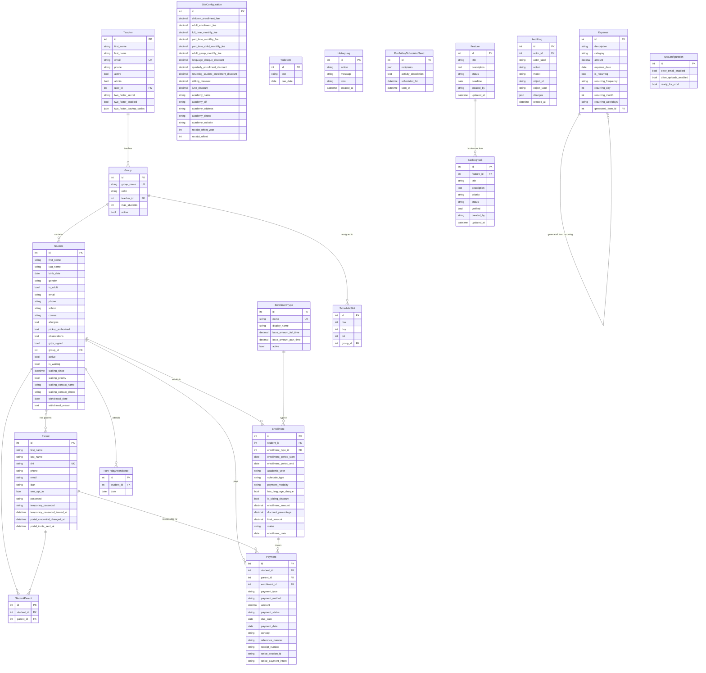
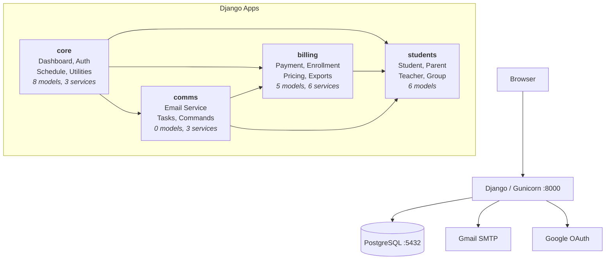
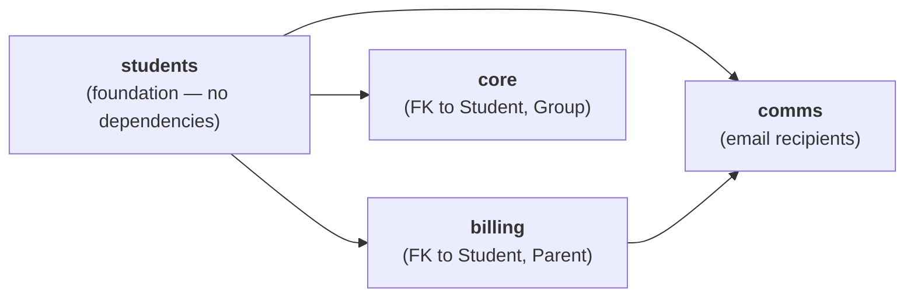

# Five a Day Evolution

<p align="center">
  
  <br>
  <em>Student Management System for Five a Day English Academy</em>
  <br>
  <em>Albacete, Spain</em>
</p>

---

Built to centralize student records, automate billing cycles, and streamline parent communication for a small and lovely English academy.

### Project Status

<p align="center">
  
  &nbsp;|&nbsp;
  <a href="https://github.com/starseeker-code-public/five-a-day/actions/workflows/ci.yml?query=branch%3Amain"></a>
  &nbsp;|&nbsp;
  
  &nbsp;|&nbsp;
  <a href="https://github.com/starseeker-code-public/five-a-day/actions/workflows/scorecard.yml"></a>
  &nbsp;|&nbsp;
  <a href="https://github.com/starseeker-code-public/five-a-day/security/dependabot"></a>
</p>


| Environment | Branch | Hosting | CI Status |
|-------------|--------|---------|-----------|
| **Production** | `main` | [https://fiveaday-332600671945.europe-southwest1.run.app/login/](https://fiveaday-332600671945.europe-southwest1.run.app/login/) — GCP Cloud Run + Cloud SQL (PostgreSQL 16, `europe-southwest1`) | [](https://github.com/starseeker-code-public/five-a-day/actions/workflows/ci.yml?query=branch%3Amain) |
| **Testing (QA)** | `testing` | [http://34.26.130.187:8000/](http://34.26.130.187:8000/) — GCP Compute Engine `e2-micro` (always-free tier, Docker Compose) | [](https://github.com/starseeker-code-public/five-a-day/actions/workflows/ci.yml?query=branch%3Atesting) |
| **Development** | `development` | [Local Docker](http://localhost:8000/) via `make up` | [](https://github.com/starseeker-code-public/five-a-day/actions/workflows/ci.yml?query=branch%3Adevelopment) |


| Version | Date | Description |
|---------|------|-------------|
| **v1.29.5** | 2026-09-14 | Overdue payment chasing, production-only Drive archive, real type gate |
| v1.29.4 | 2026-09-13 | Media jornada infantil, per-teacher student scoping, parent portal off |
| v1.29.3 | 2026-09-13 | Pickup-authorised persons, cheque idioma line, test send, Sep/Jun/Apr reminders |

---

## Table of Contents

- [Five a Day Evolution](#five-a-day-evolution)
    - [Project Status](#project-status)
  - [Table of Contents](#table-of-contents)
  - [Version History](#version-history)
  - [Tech Stack](#tech-stack)
    - [Backend](#backend)
    - [Frontend](#frontend)
    - [Infrastructure \& Deployment](#infrastructure--deployment)
    - [Python Dependencies](#python-dependencies)
    - [Developer Tooling](#developer-tooling)
  - [Database Schema](#database-schema)
    - [ER Diagram](#er-diagram)
    - [Key Constraints](#key-constraints)
  - [Development \& Docker](#development--docker)
    - [Quick Start](#quick-start)
    - [.env template](#env-template)
    - [Make Commands](#make-commands)
    - [Environment Configuration](#environment-configuration)
    - [Environment Variables Reference](#environment-variables-reference)
  - [Project Structure \& Architecture](#project-structure--architecture)
    - [Architecture Overview](#architecture-overview)
    - [App Dependency Flow](#app-dependency-flow)
    - [Directory Layout](#directory-layout)
    - [App: core](#app-core)
    - [App: students](#app-students)
    - [App: billing](#app-billing)
    - [App: comms](#app-comms)
    - [Design Decisions](#design-decisions)
  - [Features by View](#features-by-view)
    - [Home (Dashboard)](#home-dashboard)
    - [Students](#students)
    - [Student Create](#student-create)
    - [Student Detail \& Update](#student-detail--update)
    - [Payments](#payments)
    - [Expenses](#expenses)
    - [Reports](#reports)
    - [Schedule](#schedule)
    - [Fun Friday](#fun-friday)
    - [Waiting List](#waiting-list)
    - [Apps (Email Tools)](#apps-email-tools)
    - [Management](#management)
    - [Database (All Info)](#database-all-info)
    - [Login](#login)
    - [Password Reset](#password-reset)
    - [Two-Factor Authentication](#two-factor-authentication)
    - [Parent Portal](#parent-portal)
    - [PWA (Installable App)](#pwa-installable-app)
  - [Testing](#testing)
    - [Testing Overview](#testing-overview)
    - [Unit Tests](#unit-tests)
    - [Integration Tests](#integration-tests)
    - [Coverage Report](#coverage-report)
  - [Migrations](#migrations)
  - [Security](#security)
    - [Authentication](#authentication)
    - [Session \& Cookie Configuration](#session--cookie-configuration)
    - [CSRF Protection](#csrf-protection)
    - [Transport Security (HTTPS)](#transport-security-https)
    - [Security Headers](#security-headers)
    - [Infrastructure \& Deployment](#infrastructure--deployment-1)
      - [Docker](#docker)
      - [Google Cloud Run](#google-cloud-run)
      - [Cold-start behaviour on Cloud Run](#cold-start-behaviour-on-cloud-run)
    - [Secrets Management](#secrets-management)
    - [Email Security](#email-security)
    - [Data Protection \& Input Validation](#data-protection--input-validation)
    - [Logging \& Monitoring](#logging--monitoring)
    - [Future Security Improvements](#future-security-improvements)
  - [Testing Environment (QA)](#testing-environment-qa)
    - [What is the testing environment?](#what-is-the-testing-environment)
    - [How to access it](#how-to-access-it)
    - [What you can test](#what-you-can-test)
    - [How to report a problem](#how-to-report-a-problem)
    - [Error pages you might see](#error-pages-you-might-see)
    - [For developers: how the QA environment works](#for-developers-how-the-qa-environment-works)
      - [Access control for `/testing/`](#access-control-for-testing)
  - [CI/CD \& GitHub Actions](#cicd--github-actions)
    - [Pipeline Overview](#pipeline-overview)
    - [Branch Strategy](#branch-strategy)
    - [Workflows](#workflows)
    - [Automated Flows](#automated-flows)
    - [Public Repository Hardening](#public-repository-hardening)
    - [Email Notifications](#email-notifications)
    - [Dependabot](#dependabot)
    - [CodeQL Security Scanning](#codeql-security-scanning)
  - [Contributing](#contributing)
    - [Development Workflow](#development-workflow)
    - [Make Commands (Developer Tooling)](#make-commands-developer-tooling)
    - [Code Conventions](#code-conventions)
    - [Adding a Feature](#adding-a-feature)
  - [License](#license)

---

## Version History

<details id="v1295" open>
<summary><strong>v1.29.5 — Overdue debt is chased again, the Drive archive is production-only, the type gate made real (current)</strong></summary>

**The weekly payment reminder chases overdue debt — and reaches adult students**

- `send_payment_reminders` filtered `due_date__gte=today`, so a payment stopped being chased at
  the exact moment it became a debt: the row still counted as expected revenue on every dashboard
  and nothing ever asked the family for it again. **The lower bound is gone.** A pending row is
  re-included every week until it is paid or cancelled, so `payment_status="pending"` is now the
  only exit condition.
- The upper bound is **half-open** (`due_date__lt=today + 7d`, not `__lte`). The task runs weekly,
  so two consecutive inclusive `today..today+7` windows overlapped on exactly one day and a
  payment falling due on that weekday was reminded **twice**.
- **Adult students are reminded now.** The loop read `payment.parent.email` and skipped anything
  with no parent — but `Payment.parent` is nullable *precisely* for adults, who have no guardian,
  so an adult's pending payment was never chased at all. It falls back to `student.email`, the
  same way the receipt task resolves a recipient, so the two paths cannot disagree about who a
  payment's recipient is. No SMS is attempted for a parentless payment (the opt-in lives on
  `Parent`).
- `emails/payment_reminder_simple.html` grew an **overdue variant** — light-tint red box, "hay un
  pago **vencido** … (hace N días)" — because the window now reaches back: "con vencimiento el
  30/09" read on 15 November is true and tells the family nothing.

**The Google Drive receipt archive is PRODUCTION-ONLY**

- Those folders are the academy's real, permanent archive — the one its accountant opens — and
  nothing in a receipt PDF says which environment produced it. A QA seed run or a developer
  clicking "marcar cobrado" filed fictional receipts beside the genuine ones, unrecoverably.
- **`drive_service.drive_uploads_allowed()` is the one predicate.** Production: always, decided
  **without touching the database**, so a DB blip can never switch the real archive off. The QA VM
  (`IS_TESTING_ENV`): only while the new `/testing/` **"Recibos a Drive"** toggle is on
  (`QAConfiguration.drive_uploads_enabled`, migration `core/0016`, **off by default**), and then
  only into a `testing/` **subfolder** of the month (`archive_subfolder()`) — a separate folder
  rather than a filename prefix, because a human scrolling the month must never see a fake receipt
  at all. Development, Docker and the test suite: never, whatever the flag says. Fails **closed**
  on a database error.
- Three readers, deliberately: `DriveReceiptService.upload_receipt` (the true enforcement point,
  checked *before* `is_configured()` so a disallowed environment does not even parse the
  credentials), `upload_receipt_to_drive_task` (so it does not render a PDF it will throw away —
  production runs Celery eager, i.e. inside the "marcar cobrado" request), and
  `backfill_drive_receipts`, which builds its own service and now refuses up front with a
  `CommandError` naming the switch: a refusal reported once per payment reads like a Drive outage
  rather than a switched-off feature.
- New `api_toggle_drive_uploads` endpoint beside `api_toggle_error_email`; both now go through one
  `_set_qa_flag` helper whose field name is chosen by the view and never taken from the payload,
  and the page wires both switches with one handler that reverts itself on failure.

**Five dead pricing columns dropped**

- `old_student_discount`, `full_year_bonus`, `half_month_discount`, `one_week_discount` and
  `three_week_discount` were seeded in `0001_initial` and read by **no** service, view, task,
  template, form, admin or JS file. `update_site_config` had already been made to refuse writing
  them, because `old_student_discount` is visually the twin of the **live**
  `returning_student_enrollment_discount` — a price sitting in the database looking authoritative
  and applying to nothing.
- Migration `billing/0017` is **destructive** (`RemoveField`), so the production deploy's
  pre-mutation gate will refuse the release without the `ack_destructive` dispatch input — **not**
  `force`, which would also skip the QA sign-off, the provenance gate and the version compare.

**No model or admin imports from `core/views/` any more**

- Three helpers were living in view modules and being imported *upwards*, against the dependency
  flow, each forced into a function-body import to dodge an app-loading cycle:
  - `notify_capacity_freed` → new **`core/services/capacity_service.py`** (its only caller is the
    `post_save` signal on `students.Student`; `core/views/waiting_list.py`, where it lived, never
    called it). The module imports `core.models` and nothing else, so it stays a leaf.
  - `send_portal_temporary_password` / `send_portal_invitation_once` and the
    `PORTAL_TEMPORARY_PASSWORD_COOLDOWN` → new **`core/services/portal_access_service.py`**. Two
    of the three callers are not views (`ParentAdmin.resend_portal_invitation` and
    `ParentCreateView`), so an admin action depended on a view module's internals. Both kill-switch
    checks moved with them.
  - `_queue_payment_receipt` → **`comms.tasks.dispatch_payment_completed_on_commit`**, next to the
    dispatch it defers. `billing/admin.py` was importing that **private** name out of a view module
    to get its receipts sent — which is exactly how a completion side effect gets added to one of
    the app's two completion paths and silently missed on the other.

**The type and lint gates are real now**

- **`check_untyped_defs = true`.** It was `false`, and with 487 of 711 functions carrying no
  annotation mypy skipped most of the codebase's bodies. Turning it on surfaced 20 real type errors
  in production code and — the reason `tests/` is deliberately **not** excluded — a test calling
  `EnrollmentService.create_enrollment` with six keyword arguments the method has never had, inside
  `except (TypeError, ValueError): pass`: named for the sibling discount, asserting nothing, unable
  to fail.
- **`BLE001`, `S608` and `RUF100` enabled in Ruff.** There were already ~57 `# noqa: BLE001` /
  `# noqa: S608` directives in the tree, every one carrying a written reason and every one **inert**
  because neither rule was on. The obvious cleanup (`--select RUF100 --fix`) deletes the whole
  comment, reason included — 57 pieces of intent documentation traded for a clean lint run — so the
  rules were switched on instead, which makes the directives load-bearing and forces the same
  decision at every new blind catch. That found 12 sites with no directive at all, two of them
  over-broad.

**Narrowed exception handlers (the two that were hiding something)**

- `SimpleAuthMiddleware`'s two `resolve()` calls caught bare `Exception`, so **inside an auth gate**
  any unexpected failure silently became "unknown URL" — fail-closed, so nothing broke, but a real
  URL-resolution bug would have been invisible there forever. Both are `except Resolver404` now.
- `GoogleSheetsService._get_or_create_worksheet` read *every* failure as "not there yet" — an auth
  error, a revoked share, a 429 — and answered it by trying to **create** the worksheet, replacing
  the real cause with whatever `add_worksheet` failed with next. Narrowed to `WorksheetNotFound`.
- `PaymentAdmin`'s `student_link` / `parent_link` narrowed to `NoReverseMatch` (the one expected
  failure, which degrades to plain text) and log it; genuine breakage used to become a cell that
  merely stopped being a link, with nothing anywhere saying why.

**Support tickets: the category is validated, not trusted**

- The client supplied both the category **and** its display label, and the raw category went
  straight into the subject line of a mail to `SUPPORT_EMAIL`. Django refuses newlines in headers so
  it was never header injection, but it was a free-text channel nobody validated. Both now come from
  a server-side `SUPPORT_CATEGORIES` map; an unrecognised key falls back to `exception`, which is
  what the widget already sends for "Otro".

**Timezone correctness sweep**

- Eight more bare `datetime.now()` calls replaced with `timezone.localtime()` — the QA error email's
  "Server time", the `/testing/` server-time card, the backlog and Desarrollos CSV/JSON export
  stamps, the "ready to ship" notification and the database xlsx export filename. The container runs
  `TZ=Europe/Madrid` so these were only wrong where the value was formatted from an **aware**
  column, but a stamp that disagrees with the rows beside it is the same class of bug the v1.29.1
  `backlog_task_json` fix closed.
- `celery.debug_task` logs through `logger` instead of `print`: production ships worker output to
  Cloud Logging via the logging config, so the one task whose entire job is to prove the worker is
  alive was the one task whose output could go missing.

**Refactors — behaviour unchanged, pinned by tests**

- **`create_payment` / `update_payment`** split into resolve → build → apply helpers.
  `update_payment` was 165 lines and 34 branches and had yielded three separate status-transition
  bugs across two review rounds; its six `except` branches each re-spelled the same
  JSON-or-flash-message response, which is where the seventh forgets the JSON shape. One
  `_payment_write_error` owns that contract now. A dead
  `if payment.payment_status == "completed"` branch in `create_payment` was removed — the status is
  hard-coded `pending` three lines above it.
- **The dashboard** was a single 203-line function assembling a twenty-key context; it is now one
  builder per card (`_pending_payments_card`, `_birthdays_card`, `_upcoming_events_card`,
  `_revenue_card`, `_capacity_card`), each returning exactly the keys its card renders. Query count
  is unchanged and `test_query_cost_and_idempotency.py` now pins it flat between 3 and 30 families.
- `payments/_status_badge.html` requires `classes=""` to be passed explicitly. Reading a variable
  absent from the context logs a full `VariableDoesNotExist` traceback to `django.template` at
  DEBUG on **every** render, so a 50-row payments list wrote 50 tracebacks per page load in
  development — and `` does not avoid it, because the log happens inside
  `Variable._resolve_lookup` before `ignore_failures` is consulted.
- `_git_info` checks git's **return code** for the branch read instead of trusting empty stdout: a
  detached HEAD and a git failure were indistinguishable, and the card showed "—" either way.

**Removed: `STRIPE_PUBLISHABLE_KEY`**

- A publishable key exists for Stripe.js / Elements — collecting card details in *our* page. This
  app uses hosted **Checkout** (the server creates a session and the browser is redirected to
  Stripe's own page), so the key was read into a setting nothing ever rendered. An unread secret
  still has to be provisioned, rotated and audited.

**Tooling and documentation**

- New **`sync-branches`** skill: stash → fast-forward `main`/`testing`/`development` → merge `main`
  down into the other two → push → restore the work staged. It never pushes `main`, never
  force-pushes, never resets, and resolves its stash by a unique message rather than `stash@{0}`
  (a `git stash push` on a clean tree exits 0 without creating anything, so a blind pop would
  restore an unrelated older stash). `update-readme` now runs it as Step 0 — documenting on a
  `development` that is behind `main` writes last release's version numbers.
- The auto-generated `testing → main` release PR body was rewritten: how the PR got here (which
  gates passed), what happens after it merges (tag → arm → human approval → three pre-mutation
  gates → backup/repoint/migrate/roll/verify), and an 11-item pre-merge checklist covering the
  destructive-migration acknowledgement, Cloud Run job/schedule inventory and the QA sign-off.

**Testing**

- Suite at **2,391 tests, 95.30 % coverage** (7,381 statements, 347 uncovered, 54 files at 100 %).
  New `unit/test_v1295_review_fixes.py` covers the reminder changes end to end — an overdue pending
  row is chased while a completed or cancelled one never is, an adult is reminded at their own
  address and one with no email is skipped rather than crashing, no SMS is attempted for a
  parentless payment, and the boundary day of the half-open window belongs to the next run.
- `integration/test_drive_receipts.py` and `unit/test_drive_service.py` grew the environment gate
  (an autouse fixture declares `ENVIRONMENT="production"`, because the suite otherwise runs as
  development and every upload assertion would be testing the refusal);
  `integration/test_testing_tools.py` covers the new toggle including its 404 outside QA;
  `integration/test_support_views.py` pins the category allow-list; and
  `integration/test_query_cost_and_idempotency.py` now holds the dashboard's query cost flat
  between 3 and 30 families, which is what proves the per-card split moved no query.

</details>

<details id="v1294">
<summary><strong>v1.29.4 — Media jornada infantil, a teacher sees only their own students, the family portal switched off</strong></summary>

**Media jornada infantil — a third children's price band**

- New `schedule_type` **`part_time_child`** ("Infantil (1 día/semana)") and enrollment plan
  `monthly_part_child`, priced from the new `SiteConfiguration.part_time_child_monthly_fee`
  (seed 32 €, migration `billing/0016`) and editable from `/management/` like every other fee.
  It is the **same one-session-a-week timetable as `part_time`** at the reduced rate the academy
  charges the youngest children.
- Modelled as a **price band, not a discount**: every discount (hermano, cheque idioma, junio)
  layers on top of it exactly as it does on the other bands, and the schedule → fee mapping is
  still the single `billing.money.monthly_fee_for`, so the ficha's live preview and the invoice
  cannot price it differently. The create form's `priceConfig` key matches the plan value
  exactly — a missing key would silently preview €0 rather than error.
- The payment-reminder emails print it as a **sub-line under "Cuota 1 sesión semanal"**, not as a
  sixth row: it is the same class at another price, and a sixth line in a five-line table reads
  like a sixth product. The September and June variants show it beside their own "mes completo" /
  "cuota habitual" figures.
- Deliberately not validated against `Student.is_adult` — an adult resolves to `adult_group`
  before the plan is read, and the academy picks this band by hand in a handful of cases a year.

**A non-admin teacher sees only their own students**

- **`core.transactions.visible_students_for(request, queryset)` is the one place that rule is
  written.** A non-admin teacher now sees only the students in the groups they teach
  (`Group.teacher`); admins take an early return and are unaffected. It is read by the roll
  (`StudentListView`), the **ficha** (`StudentDetailView.get_queryset`, so anyone else's student
  is a plain 404), the autocomplete (`search_students`) and the language-cheque endpoint.
- The ficha was the hole worth closing: `student_detail` is deliberately in
  `NON_ADMIN_ALLOWED_URL_NAMES` because it is this role's core surface, so without the scope a
  teacher could read **any** family's name, school, allergies, guardians, addresses and phone
  numbers by typing an id into the URL. The autocomplete had the same shape — a
  name-and-guardian directory for the whole academy, reachable from any page.
- Two deliberate edges: **waiting-list placeholders stay visible** (a waiting entry is nobody's
  student yet, usually has no group, and managing that queue is in this role's whitelist —
  scoping them out would 404 a teacher on the ficha they had just created), and a restricted
  session with **no Teacher row sees nothing**, matching how every other control here fails.
- The "mostrando N de M" notice counts the teacher's own roll, not the academy's.

**Fun Friday is admin-only**

- `fun_friday_view` and all three attendance endpoints (`toggle_fun_friday_this_week`,
  `add_fun_friday_attendance`, `remove_fun_friday_attendance`) left
  `NON_ADMIN_ALLOWED_URL_NAMES` **and** gained `@admin_required` — both controls, as everywhere
  else. Deciding who comes on a Friday is the academy's call, and the page listed every child on
  the roll, which was also the last place a teacher could see students outside their own groups.
  The sidebar entry moved into the admin branch (it used to be the one page a teacher had that an
  admin did not).
- Teachers keep the **read**: the Fun Friday column on the students list renders as a plain icon
  and the ficha still lists the dates, both without the add/remove controls. The icon is a
  `<span>` rather than a disabled `<button>` — `students.js` binds every `.ff-toggle-btn`, so the
  class is what has to be absent, otherwise the control 403s on click and silently reverts on
  screen.

**The family portal is switched off**

- New `PARENT_PORTAL_ENABLED` setting, **default `False`**. While it is off every `/parent/` URL —
  login and recovery included — is a 404, so a family holding an old link finds nothing rather
  than a form that cannot help them, and **no access email is sent at all**.
- Exactly three places read it, each marked `PARENT PORTAL KILL SWITCH`:
  `SimpleAuthMiddleware._portal_gate`, `send_portal_temporary_password` /
  `send_portal_invitation_once`, and `ParentAdmin.resend_portal_invitation` (which stamps the
  once-only guard *before* it sends, so it has to stop before the stamp rather than rely on the
  sender refusing). `Parent.portal_invite_sent_at` is deliberately **not** stamped while the
  portal is off, so re-enabling it later still invites every family exactly once.
- Done as a switch, not a deletion: removing the URLs would make the mailer's
  `reverse("parent_portal_login")` raise `NoReverseMatch`, turning a flag into a refactor. Setting
  it to `True` brings the whole portal back with nothing else to change.
- The feature is switched off, not withdrawn, so the suite keeps exercising it:
  `settings_test.py` turns it **on**, and `integration/test_parent_portal_disabled.py` is the one
  file that overrides it back off to prove the switch bites.

**The September reminder's "medio mes" is actually half**

- `SEPTEMBER_CLASSES_START_DAY` is **16, not 15**. September has 30 days and `proration_fraction`
  counts the joining day, so the 16th bills 15/30 — exactly the half month the academy tells
  families about. The 15th billed 16/30 = 53 %, so the email's own explanatory text and its
  figures disagreed with each other on the academy's most-read parent email.
- **No Cheque Idioma box in September or June.** The cheque is a fixed amount per month and the
  academy applies it in neither the first (half) month nor the last month of the course, so the
  box quoted a price nobody is charged. Both variants now override that block empty; April and
  every ordinary month keep it, and the form's help text says which is which.

**Deploy: "the job exists" was never the same question as "the job can start"**

- A Cloud Run **Job carries its own env set**, and `gcloud run services update` never reaches it —
  so the service can be correct while all 12 jobs are not. The vars feeding the production posture
  guard in `settings.py` are asserted at **import** time, so a job missing one does not fail its
  task: it cannot start, and a Cloud Scheduler trigger reports nothing when it doesn't. `CACHE_DB`
  was the live case — the service had it, no job ever did, and they only kept working because the
  deployed image predated the guard. The first release carrying it died at `migrate` with
  `CACHE_URL or CACHE_DB must be set in production` and auto-rolled back; had migrate not run
  first, all 12 scheduled tasks would have stopped silently.
- Gate 2 of `deploy-production.yml` now asserts **job-vs-service env parity** over
  `POSTURE_ENV_KEYS` plus "CACHE_DB or CACHE_URL", reading the expected value **from the service**
  so it cannot drift from what production actually runs. The inventory gate had only ever asked
  whether each job existed.
- **`PAUSED_OK_SCHEDULES` is now empty.** `purge-sessions` and `archive-gcp-costs` sat there while
  v1.23.0 and v1.26.0 rolled out; both shipped, both schedules are enabled and firing, and the
  entries had turned into dead tolerance — the two schedules the gate would have waved through
  were exactly the two most likely to hide a silent pause.
- `ACADEMY_IBAN_HOLDER` is finally correct **where it is used**: the payment reminder is sent by a
  job, and every previous repair had targeted the service, so `fiveaday-payment-reminders` still
  held `Carl?n` while the docs said the bug was fixed. All 12 jobs now carry the ASCII value.
- The deploy service account needs `roles/cloudscheduler.viewer`; without it the inventory gate
  fails with `PERMISSION_DENIED`, which is a gap in the **check**, not evidence about the
  schedules. `DEPLOYMENT.md` documents both the parity rule and the IAM repair.

**Testing**

- Suite at **2,355 tests, 95.09 % coverage** (7,333 statements, 360 uncovered, 53 files at 100 %). New `unit/test_part_time_child_modality.py`,
  `unit/test_deploy_posture_gate.py` (the workflow's env-parity and paused-schedule rules parsed
  straight out of the YAML) and `integration/test_parent_portal_disabled.py`; the teacher
  auth-flow, mass-mail and QA reminder suites gained the scoping and special-month cases.

</details>

<details id="v1293">
<summary><strong>v1.29.3 — Pickup-authorised persons, a legible cheque line, working test sends, special-month reminders</strong></summary>

Four QA requests from the first weeks of the 2026-2027 course.

**Autorizados para la recogida**

- New `Student.pickup_authorized` (migration `students/0018`): free text, one person per
  line, "nombre y DNI (opcional)" — the shape families actually hand in. It is on the
  new-student form (children only; an adult collects themself), the edit form, the ficha
  ("Autorizados recogida"), the admin's *Salud, recogida y preferencias* fieldset and the
  students sheet of the database export. Deliberately not a structured table: nothing in
  the app looks a collector up, the ficha is read at the door, and a DNI column would
  demand the one thing families most often leave out.

**The receipt's Cheque Idioma line reads −20 €**

- On a family's first, prorated September receipt the line read **"Cheque idioma −10,67 €"**:
  the cheque was scaled by the same 16/30 as the month. The total was right — `(base − 20) × f`
  and `base × f − 20 × f` are the same number — but the line described a cheque nobody had
  been given. `PaymentService.price_breakdown()` now takes the cheque off the FULL period
  (whole cheques, one per month the period spans: "Cheque idioma −20,00 €", or
  "Cheque idioma (3 meses) −60,00 €" on a quarter) and the proration scales what is left.
  Same total to the cent, pinned by a test; the line order is the order the ficha's own
  preview already explains it in (`final × effective / months`).

**"Enviar prueba" works without `EMAIL_TEST_*`**

- The button on every one of the ten mail forms only ever mailed `EMAIL_TEST_1` /
  `EMAIL_TEST_2`, and the QA VM's `.env` never defined them, so it answered
  "no configurados" everywhere — reported as "los correos de prueba no funcionan".
  `_test_send_recipients()` now tries the env vars, then the **logged-in teacher's own
  address**, then `SUPPORT_EMAIL`, and only then refuses — with a message that names all
  three. A test send is a diagnostic; it must not itself depend on undocumented config.

**September, June and April get their own payment reminder**

- `PricingService.payment_reminder_special(config, month)` is the one source: it picks the
  template (`payment_reminder_september` / `_june` / `_april`, each extending the regular
  `payment_reminder.html` and overriding only the explanation box, the tariff rows and the
  Cheque Idioma box), adjusts the five tariff rows and the cheque figure for that month, and
  supplies the subject suffix. Every figure is the output of
  `PaymentService.calculate_period_amount` on a bare carrier — never a `fee − 20` typed in
  the service — so the email quotes exactly what the generator bills.
- **September — medio mes.** Classes start on `SEPTEMBER_CLASSES_START_DAY` (15; the form
  can override it for a year that starts on another day), so each monthly row is the
  standard fee prorated from that day with `proration_fraction`, shown beside the full-month
  figure. The wording says "medio mes" because that is how the academy explains it; the
  amount is the billed one, so a family transferring the figure in the email is never short
  against the payment the app is waiting for.
- **June — último mes.** Every monthly fee carries the fin-de-curso discount (adults
  excluded, as in billing); the quarterly row is unchanged, because a quarterly family saw it
  in April. **April** — the quarterly row is the April–June block, which contains June and
  therefore carries the discount; monthly rows are unchanged.
- The form shows the *Día de inicio de las clases* input only when September is selected,
  ignores the operator's full-month Cheque Idioma figure in the three special months, and
  the page opens on the current month's variant. `test_all_emails` previews all three.
- Housekeeping: `billing/0015` is the `AlterConstraint` for the Spanish violation message
  `unique_receipt_number` gained in v1.29.x without its migration — metadata only, but
  `makemigrations --check` was red.

**Testing**

- Suite at **2,302 tests, 95.12 % coverage** (7,295 statements, 356 uncovered, 54 files at
  100 %). New `integration/test_qa_pickup_receipts_and_reminders.py` (32) covers the four fixes; the
  template-title check in `test_v1175_fixes.py` now includes the three reminder variants.
  Four older "test send without env vars" tests also clear `SUPPORT_EMAIL`, since that is now
  a legitimate recipient.

</details>

<details id="v1292">
<summary><strong>v1.29.2 — One transition table for payment status, one status badge</strong></summary>

A review pass over the payment surface. It shipped to `development` on 2026-09-13 but its
version bump never reached `pyproject.toml`, so the badge, the Recent Versions table and this
section skipped it; v1.29.3 restores the record and carries both releases to production.

**Money that was collected cannot be quietly voided**

- **`Payment.assert_transition(previous, new)` is the one status rule, enforced in `save()`.**
  `completed` is never reachable from a dead status, `failed` / `cancelled` never from collected
  or refunded money, `refunded` only from `completed`, and `pending` from anywhere — reopening is
  the auditable repair path. The rule used to be opt-in per caller, and three releases running
  found a path that skipped it: `quick_complete_payment` missing `refunded`, and both the
  payments-list "Cancelar" button and `update_payment` voiding a completed row with a plain
  `save()`, which never runs `clean()`. Views still pre-check so they can answer a friendly 400.
- **`Payment.is_open`** (`OPEN_STATUSES` = pending, failed) gates the list's cobrar / cancelar
  buttons, the portal's "Pagar online" and `create_checkout_link` — so a `failed` charge stays
  payable everywhere at once instead of in whichever template remembered it.
- **`Payment.is_deletable` / `assert_deletable()`** refuses a hard delete of a completed,
  refunded or receipt-numbered row: a `YYYY-NNN` number continues the academy's paper books.
  Read by `delete_payment` **and** by `PaymentAdmin.has_delete_permission` / `delete_queryset`,
  which previously deleted anything.
- `update_payment` keeps the row coherent — changing the student re-points the enrollment, and a
  receipt-numbered payment freezes its amount and student. Malformed JSON on the payment
  endpoints is a 400, not a 500.

**One status badge instead of four**

- `core/templates/payments/_status_badge.html` replaces a five-branch `` chain that had
  been written out in four templates and had drifted: `all_info.html` hard-coded its own labels,
  coloured `pending` red, and had **no `refunded` branch at all**, so a refunded payment rendered
  no badge there. The label now always comes from `get_payment_status_display`, so a renamed
  status cannot leave a stale word behind.

**Housekeeping**

- Dropped `SECURE_BROWSER_XSS_FILTER` — the legacy `X-XSS-Protection` header, removed from modern
  browsers and from Django's own recommendations — from `settings.py`, the `.env` template and
  the security tables.
- Dead front-end code removed from `fun-friday.js`, `home.js`, `students.js` and
  `student-detail.js`; bulk re-enrolment no longer lets each student's start date drift.

**Testing**

- New `integration/test_v1292_review_fixes.py` (30 tests): the transition table from every
  direction, hard-delete refusal in both the view and the admin, the Stripe checkout link
  refusing a dead charge, `update_payment` coherence, and 400-not-500 on malformed JSON.

</details>

<details id="v1291">
<summary><strong>v1.29.1 — Receipts describe what was actually charged</strong></summary>

A QA follow-up on the v1.29.0 receipt work. The theme is *one source per rule*:
several documents and screens were each re-deriving a figure the generator had
already decided, and every one of those copies had drifted.

**Receipts are issued for collected money only**

- **A receipt number is never minted for a pending charge.**
  `Payment.assign_receipt_number()` returns blank unless the payment is
  `completed`, and both receipt endpoints — the admin
  `/payments/<id>/receipt.pdf` and the parent portal's — now filter on it.
  Rendering a receipt is what *assigns* the permanent `YYYY-NNN` number, so a
  hand-typed URL on a pending row used to issue an official receipt for money the
  academy had not received and burn a number out of a fiscal sequence that
  continues the academy's paper books. The PDF still renders, headed plain
  `RECIBO`, rather than failing.
- **`Payment.receipt_date`** is now one property (`payment_date` → `due_date` →
  today), read by both the receipt number's YEAR and the Drive archive's
  `Curso`/`<Mes>` folders. Two copies of that fallback chain meant a receipt
  numbered `2026-6xx` could be filed under a different year's folder with nothing
  erroring.
- Numbering no longer pulls the whole year's receipt numbers into Python inside
  the config lock — it reads the highest as one ordered row, so the first full
  `backfill_drive_receipts` run is no longer quadratic against the archive.

**The receipt breakdown reconstructs the price or says nothing**

- **`PaymentService.price_breakdown()`** is now THE pricing arithmetic, returning
  the itemised lines *and* the total; `_price_months` is the total-only face of
  the same call. The receipt PDF had grown its own copy of the discount order and
  it drifted immediately: it charged the cheque idioma x3 on the one-month June
  stub every quarterly family gets, gated sibling/cheque on `student.is_adult`
  where the generator gates on `schedule_type`, and rounded each line separately
  so the default quarterly+sibling prices printed a phantom `Ajuste +0,01 EUR`.
- The breakdown is shown **only when re-pricing the period reproduces
  `payment.amount` to the cent**. Anything else — a hand-priced special, a manual
  correction, a close-out block, or simply a receipt re-downloaded after prices
  changed in `/management/` — falls back to the bare `Importe` line. Previously
  any disagreement was silently relabelled `Prorrateo primer periodo` or `Ajuste`
  on a document families keep for tax purposes.
- The matrícula breakdown gates `Descuento antiguo alumno` on the enrollment's own
  category instead of on the arithmetic. Deriving it from `base - amount` printed
  a returning-student discount for a family that had never studied here, whenever
  a negotiated matrícula came in under the standard fee.
- **One schedule → fee mapping.** `PaymentService._get_base_monthly_fee` and
  `PricingService.get_monthly_fee` were two hand-rolled copies of
  `billing.money.monthly_fee_for`; both now delegate to it.

**One statement of what happens when money lands**

- **`comms.tasks.dispatch_payment_completed()`** fires the receipt email and the
  Drive archive, each in its own `try`. The admin "marcar cobrado" path and the
  Stripe webhook each carried their own copy of that pair, so a third side effect
  would have had to be written twice to be right. The views keep only the part
  they genuinely differ on — on-commit timing.
- Both receipt tasks and the backfill command `select_related` everything the
  receipt touches, saving three lazy queries per payment — which production
  (eager Celery) spends inside the completion request.

**Bulk mail no longer dies mid-batch**

- `EmailService.send_bulk_emails` **drops the shared SMTP session on any failure**
  and lets the rest of the batch reconnect. Django's SMTP backend never reopens a
  connection it still holds, so one mid-batch disconnect — Gmail drops idle
  sockets and enforces a per-session message cap — turned every remaining send
  into a guaranteed failure. 130 payment reminders were lost to a socket that died
  after the 20th.

**One definition of "the roll"**

- **`core.transactions.students_on_the_roll()`** — active, not a waiting-list
  placeholder, enrolled in one of the relevant academic years (both cohorts during
  the May–August overlap). The students list, Fun Friday and the re-enrolment pool
  each spelled this out inline, so fixing it in one did not fix it in the others.

**Bulk re-enrolment goes through the supersede path**

- "Antiguo alumno" now closes the prior enrollment via
  `EnrollmentService.supersede_enrollment` like every other plan change, instead of
  finishing it by hand. The hand-rolled close skipped `close_out_periods`, and
  `generate_payments` only visits ACTIVE enrollments — so any month the old plan
  taught and never invoiced became structurally unbillable the instant the view
  finished it. It also refuses (and says so) when every remaining month is already
  invoiced, rather than re-billing them.
- The plan dropdown is rendered from `ENROLLMENT_PLAN_CHOICES` — the same list the
  POST validates against — instead of a second copy typed into the template, which
  had already forked on its labels.
- The POST re-checks only the submitted ids against the candidacy rule instead of
  fetching the whole pool with its display prefetches.

**Google Drive archive hardening**

- **Every Drive call is bounded at 10 s.** googleapiclient's default is no timeout
  at all, and production runs Celery eager — so a stalled connection would have
  parked a Gunicorn worker inside the "marcar cobrado" request indefinitely. Never
  raising is not the same as never blocking.
- **Concurrent folder creation converges.** Find-then-create is not atomic and
  Drive allows duplicate names, so two payments completing on two instances could
  each create `Septiembre 26` and file receipts into different folders, defeating
  the per-payment idempotency check with nothing erroring. After creating, the
  service re-lists and keeps the oldest match, so every instance writes to the same
  folder.
- The service-account credential is parsed once per instance rather than per
  payment, and month names come from `core.constants.MESES_ES` instead of a second
  local list — Drive folders are matched BY NAME, so one drifted accent would have
  filed receipts into a differently-spelled folder beside the real one.
- `backfill_drive_receipts` now raises `CommandError` when Drive is unconfigured.
  It runs as a Cloud Run Job, where exiting 0 with an empty archive reported success
  for a run that did nothing. Its dry run also stops streaming the whole joined
  archive to count rows it had already counted.

**Frontend fixes**

- **Date pickers: `window.setDateValue()` / `window.dateInputElement()`.** After
  flatpickr enhancement the original input is `type=hidden` behind a separate
  visible field, so `el.value = ...` filled a form invisibly and toggling `hidden`
  or calling `.focus()` did nothing. The expenses edit modal showed a blank date on
  a row that has one, and the dashboard's "Fecha" todo option left the field
  permanently invisible while silently taking today's date. `form.reset()` now
  re-syncs the visible field too.
- **The flatpickr calendar has a dark theme.** The vendored stylesheet is
  light-only, so the picker opened as a bright white panel over every dark page —
  on a control that sits on every date input in the app.
- The waiting-list delete confirmation moved from an inline `onsubmit` to
  `data-confirm`, which `base.js` handles: an inline event attribute cannot carry a
  nonce, so the enforced CSP dropped it and the confirmation on a destructive
  action silently disappeared.
- Two leftover dark-palette hex values in the monthly-report emails (invisible
  white-on-white after the v1.28.2 light migration), and the QA backlog's AJAX
  timestamps (printed in UTC beside server-rendered Europe/Madrid rows, so a task
  created at 00:30 showed as 22:30 the previous day).

**Email templates**

- The green WhatsApp contact box existed as **fifteen inline copies**; it is now
  `emails/_contact_box.html`, included with a `topic` (and optional `heading` /
  `body`). The v1.28.2 light migration had to restyle two hex values across
  thirteen files in lockstep, and one missed copy would have left a dark box on the
  new white card. `static/css/email.css` is deleted — an email template can never
  reference a `static` tag (the Celery worker never runs `collectstatic`), so the
  file had no reader.

**Special enrollments**

- `EnrollmentForm` now owns the invariant that a pre-filled `manual_amount`
  implies "Personalizar también la cuota", rather than each caller remembering to
  tick it — forgetting it turned every save of a hand-priced student's ficha, even
  a phone-number edit, into a silent no-op.

**Security / CI — the image gate goes green**

- **The runtime image no longer ships pip**, which clears the two fixable HIGHs that
  were failing `Publish image & scan`: `msgpack 1.1.2` (GHSA-6v7p-g79w-8964) and
  `setuptools 70.3.0` (CVE-2025-47273). Neither was a project dependency, and
  **neither could be fixed by bumping anything** — `uv.lock` already carries
  msgpack 1.2.1 (exactly the version the advisory asks for) and setuptools 83.0.0,
  both are dev-only transitives (`pip-audit` → cachecontrol → msgpack,
  `coverage-badge` → setuptools), and the image builds `uv sync --no-dev`, so
  neither is in `/app/.venv` at all. The versions Trivy reported came from **pip's
  own vendored-dependency manifest** (`pip/_vendor/vendor.txt`) in the
  `python:3.14-slim` base image — a file uv does not manage and Dependabot cannot
  bump.
- Deleting it is a real fix rather than a suppression: the vendored msgpack code is
  genuinely present and genuinely removed. (The setuptools line was a phantom —
  `pip/_vendor/setuptools/` does not exist in the image; Trivy reads the manifest,
  not the filesystem.) `.github/trivyignore` was deliberately **not** used, since an
  ignore would have left the vulnerable code in place and disabled the control.
- Dropping an installer from a production container is also hardening in its own
  right. Nothing needs it: the venv is resolved and built by uv in the builder stage
  and copied in, `uv` remains on `PATH` for anything ad-hoc, and `make test` syncs
  dev dependencies with **uv** inside the container, so the dev workflow is
  unchanged. The `RUN` ends in two negated assertions that fail the build if any pip
  metadata survives a future base-image bump.
- Verified end to end locally: the same Trivy invocation the gate uses reports
  **2 fixable HIGH/CRITICAL before, 0 after**, with Hadolint clean and Django,
  Gunicorn, `uv sync` and pytest all working in the rebuilt image.

**Testing**

- Suite at **2,237 tests, 95.10 % coverage** (7,169 statements, 351 uncovered, 54 files at
  100 %), up 10. `test_v1282_qa_fixes.py` grew from 8 to 15 cases, all on the two receipt rules:
  the **reconstruct-or-say-nothing** breakdown (the June stub not priced as a full quarter, the
  breakdown withheld once prices have changed since, a negotiated matrícula below the standard fee
  not reported as a returning-student discount) and **numbering** (a pending payment consumes no
  number, a completed one is numbered exactly once, the sequence crossing 999, a malformed stored
  number not breaking the next issue). The two receipt endpoints each gained a test that a
  **pending** payment is refused — `test_receipt_view.py` asserts no number is consumed, and
  `test_parent_portal.py` asserts a family is refused their OWN pending charge, which is the case
  ownership checks alone would let through. `test_drive_service.py` pins the failure labelling of
  each Drive error cause.
- Not covered by tests, and worth knowing: the SMTP mid-batch reconnect, the Drive call timeout and
  the convergent folder creation are all verified by reading rather than pinned — each needs a
  fake that fails partway through a live session, which the current email/Drive fakes cannot express.

</details>

<details id="v1290">
<summary><strong>v1.29.0 — Google Drive receipt archive</strong></summary>

Completed-payment receipts are now mirrored to the academy's Google Drive, the
same place the paper receipts are filed.

**What it does**

- When a payment is marked **completed** (the moment the receipt email is sent —
  the manual "cobrar" flow, the admin bulk action, and the Stripe webhook), the
  receipt PDF is also uploaded to Drive under
  `Curso YYYY/YYYY+1 / Recibos / <Mes> YY / <paymentID>_<nombre>_<apellidos>.pdf`,
  find-or-creating each folder. The Curso rolls over in **August** (Aug–Dec →
  the new course), matching how the academy files by hand.
- **`manage.py backfill_drive_receipts`** pushes receipts for payments completed
  before the feature existed (dry run by default; `--apply`, `--academic-year`,
  `--limit`). Idempotent — it skips any receipt already in its month folder.

**Robustness (the whole point)**

- **Best-effort and never fails the payment.** The upload runs in its own Celery
  task with its own `try/except`, separate from the receipt email, so a Drive
  outage, an unshared folder or a bad credential leaves payment completion and
  the email untouched. The service never raises — it returns a status, and the
  common failures are logged by cause (permission → "share the folder with the
  service account", wrong id → "folder not found", plus transient HTTP).
- **Disabled unless configured.** Set `GOOGLE_DRIVE_RECEIPTS_FOLDER_ID` (the base
  "Five a Day" folder id) and give the existing Sheets **service account** Editor
  access to it; it authenticates with the `drive` scope. Unset, the whole feature
  is a silent no-op.
- Idempotent by payment id, so re-completing a payment or re-running the backfill
  never duplicates a receipt.

**Full-project review — 13 verified findings fixed**

A whole-codebase `/code-review` + `/simplify` + `/security-review` pass (every
finding adversarially verified before fixing). The security review found **no
exploitable vulnerabilities**; the correctness pass found and fixed:

- **`/payments/create/` was unusable** — the page JS still bound to the
  `payment_status` field v1.28.2 removed, and the TypeError killed the student
  autocomplete and the submit guard.
- **Special (hand-priced) pricing, two coupled bugs** — the "Nueva matrícula"
  modal never rendered `Personalizar también la cuota`, so a typed special
  cuota was silently discarded (billing the standard rate) or rejected; and the
  edit ficha neither pre-ticked that box (every save of a hand-priced student
  was a silent no-op) nor pre-filled the un-discounted base, so sibling/cheque
  discounts compounded on every re-issue. The enrollment form's errors now
  render on the edit page.
- **Bulk re-enrolment ("Antiguo alumno") failed for its target population** —
  a lapsed student still carries an active prior-year enrollment, which
  collided with `unique_active_enrollment_per_student`; the flow now finishes
  it first (old owed cuotas stay owed).
- **`is_returning_student` counted *later* years as history** — a future-year
  enrollment granted the antiguo-alumno matrícula discount to a brand-new
  family; the check is now strictly earlier-years-only.
- **Monthly-report email counted cancelled money as "esperado"** — the
  aggregate now filters on `LIVE_PAYMENT_STATUSES` like every other consumer.
- **Receipt fixes** — `assign_receipt_number` re-checks inside the config lock
  (parallel email/Drive tasks could renumber the same payment), and the June
  discount prints as its own "Descuento junio" line instead of a false
  "Prorrateo primer periodo".
- Smaller: test-send feedback read a key the server never returns (always
  rendered red); Sheets export returned raw exception text to the client and
  now pins `RAW` input (formula-injection guard); a Fun Friday failure logged a
  family's email address; a task result echoed `str(e)`.

**Quality (simplify pass)**

- One predicate each for QA-tool access (`may_use_qa_tools`, now enforcing
  `Teacher.active` at the gate), the payment titular (`Student.titular_parent`),
  the waiting-mode intent, and the backlog-task JSON shape; `hand_priced_amount`
  now uses `Enrollment.is_hand_priced` + the shared money rounding;
  `send_bulk_emails` reuses one SMTP session per batch (payment reminders no
  longer pay one TLS+AUTH handshake per family).

**Branch hygiene**

- Merged `testing` (which contains `main`) into the release line, pre-resolving
  the dev/testing conflict: the correct `billing/money.py` leaf-module fix for
  the CodeQL cyclic-import alert is kept over the Copilot autofix on testing
  (which referenced fields that don't exist in this schema), and the Dockerfile
  takes the `python:3.14-slim` digest from the Dependabot bump.

**Testing**

- Suite at **2,227 tests**. New `unit/test_drive_service.py` (folder-path logic,
  idempotency, the never-raises guarantee) and `integration/test_drive_receipts.py`
  (the task's guard rails + the backfill command); a new decorator test pins the
  deactivated-admin 404, and the tests that pinned pre-fix behaviour (Sheets
  `str(e)`, future-year returning history) now pin the corrected rules.

</details>

<details id="v1282">
<summary><strong>v1.28.2 — QA fix pass: emails that actually send, dd/mm dates, numbered receipts</strong></summary>

The first post-"complete" pass, fixing what QA found on the running system.

**Email delivery (the big one)**

- **Worker-dispatched emails were silently failing to send.** `base_email.html`
  linked ``, and under `ManifestStaticFilesStorage`
  that raises `Missing staticfiles manifest entry` on the Celery **worker**
  container, which never runs `collectstatic`. Every async email — welcome,
  payment reminders, receipts, tax certificates, temporary passwords — died at
  render. The `<link>` is stripped by every major client anyway, so it is gone;
  email rendering no longer depends on the staticfiles manifest at all.
- **Emails are a single light theme that opts out of client dark-mode.** A white
  card with near-black text, declared `color-scheme: light` (meta + CSS) so
  Outlook/Windows no longer auto-inverts it to dark — the recurring "it's always
  dark / unreadable" reports were Outlook darkening the email off the OS theme.
  The old dark-only (v1.26.8) and a brief adaptive attempt both failed that test.
- **Email layout is a fluid-hybrid table.** Outlook's Word engine ignores
  `max-width`/`border-radius` on `<div>`, so the card is a 600px table (fixed for
  Outlook via MSO conditionals, fluid elsewhere); a `@media (max-width: 600px)`
  block bumps the font on phones so it no longer renders tiny.

**Billing & receipts**

- **Receipts are numbered `YYYY-NNN`, restarting each January.** 2026 continues
  the academy's paper sequence (last paper receipt 632 → first app receipt
  **2026-633**); from 2027 January restarts at 001. The number is assigned the
  first time a receipt is issued and never changes (new `Payment.receipt_number`,
  `SiteConfiguration.receipt_offset[_year]`, migration `billing/0014`).
- **Receipts show the discount breakdown** — precio base − descuentos = importe,
  itemising sibling and cheque-idioma discounts (and the antiguo-alumno matrícula
  discount), with a prorated-first-period line so the column always sums to the
  amount charged.
- **Special enrollments can be customised atomically.** "Precio especial" now
  customises the matrícula on its own; a new "Personalizar también la cuota"
  toggle reveals the recurring-price field. A special no longer forces a manual
  cuota — matrícula only, cuota only, or both.
- **Manual payments are always created *Pendiente*.** The "Estado" selector was
  removed from payment creation; a payment is marked cobrado from the list, which
  is the path that stamps the date and emails the receipt.

**Students & lists**

- **"Antiguo estudiante"** — a 4th "Nuevo Estudiante" option to re-enrol prior
  (often inactive) students in **bulk**: pick several, choose plan / start date /
  matrícula once, and each gets a new returning-student enrollment (inactive ones
  are reactivated).
- **Fun Friday lists only current students** — active children enrolled this
  academic year, excluding waiting-list entries and lapsed students.
- **Waiting-list entries can be removed** — a delete action on the waiting list
  (they are placeholders, not real students), and the entry form still needs only
  a first name and a contact phone (no surname).
- **"Sesión activa" was removed** from the sidebar.

**Frontend**

- **Dates are dd/mm/aaaa everywhere.** A native `<input type="date">` renders in
  the OS locale (mm/dd/yyyy on English machines); every date input is now a
  vendored flatpickr calendar (Spanish, no CDN) that shows d/m/Y while still
  submitting ISO to Django.

**CI / code quality**

- Cleared the CodeQL findings on the release PR: two log-injection sinks in the
  Stripe webhook, two cyclic-import edges (`billing.models`↔`pricing_service` via
  the new leaf `billing/money.py`; `waiting_list`↔`students` via
  `core/date_utils.py`), and an unused variable.

**Testing**

- Suite at **1,912 tests, 95.03 % coverage**. New `test_v1282_qa_fixes.py` plus
  updated form/view/schedule tests for the changed billing and Fun Friday rules.

</details>

<details id="v1281">
<summary><strong>v1.28.1 — First complete version: the review ledger closed</strong></summary>

The release that declares the app feature-complete. It folds the two sweeps over the same
numbered review ledger into one version — the iteration-1/2/4 pass and the closing pass that took
it to ~98 items. Nothing here is a new feature; it is the accumulated set of things the app got
wrong, ranked by what they cost the academy.

**Time: the container ran on UTC**

- `python:slim` is UTC and nothing set otherwise, so every naive `date.today()` / `datetime.now()`
  — roughly **65 call sites** — returned the UTC calendar date, a day behind Madrid for the 1–2 h
  after local midnight. A cash payment recorded at 00:40 on the 1st therefore booked into the
  **previous** month, and every income figure filters on `payment_date`, so the money landed in a
  month already reported. The image now sets `TZ=Europe/Madrid` and installs `tzdata` (without
  which the variable resolves to no real zoneinfo and DST is lost); all three Compose files pass
  it too. `USE_TZ=True` still stores aware UTC in the database — this only aligns the naive local
  clock the app reads.
- The same bug in the browser: `new Date().toISOString()` is the **UTC** date, so between local
  midnight and 01:00/02:00 it returns yesterday. `localDateISO()` now lives in `base.js`;
  `home.js` was stamping "Hoy" todos with yesterday's date, and a just-after-midnight cash payment
  was dated into the closed month.

**Billing: charged twice, charged the wrong amount, or never charged at all**

- **A student with no `Parent` row accrued zero mensualidades for the whole year.** The generator
  skipped them while the ficha showed the family as up to date. `Payment.parent` is nullable and
  `Payment.clean()` only validates the relationship when a parent is present — which is exactly
  what adult students rely on — and a child can legitimately lack one (a waiting-list entry
  promoted from the ficha keeps its contact on `waiting_contact_*`). They are billed now.
- **A May–August enrollment was structurally unbillable.** `current_academic_year` rolls over in
  May, when enrolment for the next course opens, so a 15 May starter was stamped with the **next**
  course — whose teaching months begin in September. The May and June they actually attended could
  never be billed, and the enrollment was invisible to every May–August cron run.
  `enrollment_academic_year` now joins the **running** course for a Sep–Jun start, and
  `student-create.js` mirrors the rule so the preview agrees with the invoice.
- **A fully discounted matrícula wrote a €0.00 pending payment.** The fee minus the
  returning-student discount can reach zero, and `objects.create()` never validates — so the row
  bypassed `Payment.amount`'s `MinValueValidator`, sat on the ficha as an uncollectable debt and
  was chased by the reminder cron forever. Nothing to collect now creates nothing.
- **A quarterly enrollment created outside the form priced 162.00 while the generator billed
  153.90** — `Enrollment.save()`'s `final_amount` fallback summed three months and omitted the
  quarterly discount that `EnrollmentService._resolve_plan` applies.
- **A cancelled or refunded payment could be resurrected.** `quick_complete_payment` refused
  `cancelled` but not `refunded`, and saved with a plain `.save()`, which never runs `clean()`.
  The rule moved onto the model as `Payment.assert_completable()` / `Payment.DEAD_STATUSES`, so
  every write path that validates is covered. The admin's bulk complete action used
  `exclude("completed")`, which also caught `cancelled` / `failed` / `refunded` — it resurrected
  them, dated them today (re-booking the money as this month's income) and emailed a receipt for a
  refund. `_bulk_set_status` gained the mirror-image guard, refusing to move a **completed**
  payment into failed/cancelled and silently drop collected income out of a closed month. This
  matters because cancelling **frees the month** under the pending-only
  `unique_pending_periodic_payment_per_month` index, so the schedule may already have re-billed it.
- **`reconcile_payment_schedule` aborted mid-run with a raw traceback.** That index is scoped to
  the **student** while the command's already-billed set is scoped to one **enrollment**, so a
  pending row left on a superseded enrollment occupied the month and collided. That is "already
  billed", not a fault: it now skips and keeps repairing, exactly as
  `schedule_academic_year_payments` does — previously one collision stopped the run *after* earlier
  enrollments had committed.
- Changing a payment cadence re-billed months already collected, and a mid-month re-enrollment
  either double-billed the transition month or left it unbilled. Both now go through one canonical
  `EnrollmentService.supersede_enrollment`; the v1.27.1 block below carries the full derivation.
- The **enrollment start date** is bounded to `relevant_academic_years()` — one course most of the
  year, two in the May–August overlap. Unbounded, a mistyped year filed the enrollment under an old
  `academic_year`, which dropped the student out of every list view **and** back-filled a year of
  already-overdue payments that the reminder cron then chased.
- A price edit re-derives the `EnrollmentType.base_amount_*` mirror, five inert discount fields are
  no longer persisted, and `SiteConfiguration` gained the five `academy_*` fiscal fields —
  `pdf_service` had always read them via `getattr` and they had never existed, so **the CIF was
  blank on every tax certificate the academy ever issued**, on a document that asserts IRPF
  deductibility.

**A recurrence typo took down the whole expenses page**

- `Expense.weekday_set()` `int()`s the `recurring_weekdays` CSV and raises `ValueError` on junk
  ("L,M,V", "lunes"). `ModelForm._post_clean` only catches `ValidationError`, and the admin had no
  validated form of its own — so saving that value produced a field-less **500 on `/expenses/` for
  every user** and aborted the daily materialiser for every weekly and yearly template. The admin
  now runs the model's own `full_clean()`, and the template property is defensive about a
  malformed row written before the fix.

**Authentication and authorization**

- **An offboarded teacher's open tab kept full access for up to six hours.** The middleware checked
  only `session["is_authenticated"]`, and the non-admin predicate answered "not a non-admin" for a
  session whose Teacher row was gone — handing it the *unrestricted* set, so revocation escalated
  the session. Sessions whose backing account no longer resolves are now rejected outright and the
  predicate fails closed.
- **The template gate and the middleware gate were computed independently, and disagreed.**
  `context_processors` now derives the teacher-role flags from the *same* predicate the middleware
  enforces with. For an authenticated user with no Teacher row the UI trimmed itself while the
  middleware treated the session as admin, or the reverse.
- **Deactivating a Teacher did not stop them logging in.** `Teacher.active` is mirrored onto the
  linked `auth.User`, and both role predicates check it **before** the superuser/staff hatch —
  those flags are mirrored from `Teacher.admin`, so a deactivated admin still carried them.
- The non-admin whitelist was tightened to match what the sidebar already hid. Waiting-list
  promotion and `add_to_waiting_list` are admin-only: promotion is enrolling by another name, and
  adding **cancels the student's active enrollment** — a one-way financial write that stops billing
  a family, whose only undo path is admin-only re-enrolment. `update_expense` and `delete_expense`
  had crept in, handing the least-privileged role a destructive financial write on a page the
  sidebar hides from them; expenses are read + create only, exactly as the comment had always
  claimed. `/reports/` left too — income, receivables and collection rate are the precise figures
  the trimmed non-admin dashboard exists to withhold.
- `@admin_required` now states the role requirement at **48 views**, instead of leaving the
  URL-name allowlist as the sole control on every financial write endpoint — a deny-by-omission
  list in a file nobody edits when adding a URL.
- Turning 2FA off wipes the secret **and** the backup codes, and a failed login spends the same
  hashing work a successful one does (`_no_credential_dummy_hash()`), so "no such account" is not
  measurably faster than "wrong password".
- `Parent.email` is resolved with `iexact` plus explicit ambiguity handling: Postgres compares
  case-sensitively, so a bare `.get()` both missed a differently-cased address and raised an opaque
  `MultipleObjectsReturned` on a mailbox two parents legitimately share.

**The parent portal**

- **Changing the portal password now logs out every other device.**
  `Parent.portal_credential_changed_at` (migration `students/0016`) is stamped on every credential
  change, and each portal session records the value it was opened with — a session carrying an
  older stamp is rejected. It is the portal's equivalent of Django's session-auth-hash. The session
  that performed the change is re-stamped so it survives its own change. Without it a reset ended
  only the browser that performed it, and every other logged-in session survived on its rolling
  six-hour expiry.
- A temporary password is a plaintext credential sitting in an inbox, so logging in with one forces
  an immediate change — and the forced flow now refuses to keep that same value as the permanent
  password. The voluntary flow's `password == current` guard cannot catch it, because the forced
  flow deliberately never asks for the current one.
- The login view resolves the **Parent row**, not just the session key. A session lingering after
  the row was deleted (an admin delete, or a QA `seed_database --reset`) sent the visitor to the
  dashboard, which bounced them to login, which bounced them back — an infinite redirect. A stale
  session is cleared and the form renders normally.
- The recovery endpoint could be replayed to **deny a family their own recovery**: every hit
  rotated the temporary password, so the credential in their inbox was dead before they could type
  it. It is now 3 requests / 15 min, coalesced by a per-family cooldown, with the send moved after
  the response is written so latency is not an enumeration oracle, and an unknown address pays the
  same `make_password()` cost as a known one. The address is deliberately not logged — the log is a
  place the "is this email registered" story leaks from.
- Blanket `/parent/` is out of `PUBLIC_PREFIXES`, so a new portal URL is protected by default;
  Stripe checkout goes through the shared portal gate and honours both the credential stamp and the
  must-change-password pin; both logout views require POST.

**Error mail and logging**

- **A 500 in a password change emailed the new plaintext password to `SUPPORT_EMAIL`.** `password`
  was redacted but `password_confirm` and the portal change form's own field names were not, and
  they carry the same value. The list was audited endpoint by endpoint and a
  `RedactingExceptionReporterFilter` added, because Django only cleanses bodies for views using
  `@sensitive_post_parameters` — which none of this app's hand-rolled auth views do.
- **JSON bodies were not redacted at all.** `_redact_body` handled urlencoded and multipart and
  then bailed out on `"=" not in raw`, so every `/api/` POST — including both password-change
  endpoints — reached the inbox verbatim. `_redact_json` blanks sensitive values in a possibly
  truncated preview.
- `ADMINS` plus a throttled `AdminEmailHandler` gives production its first error alerting.

**Mass mail and email delivery**

- **The app reported success during a mail outage.** `send()` returns the number of messages the
  backend *accepted*; with `fail_silently=True` a total SMTP failure returns 0 without raising, and
  that value was discarded in favour of `return True`. Every counter said "0 fallidos",
  `HistoryLog` recorded tickets for mail nobody received, and the portal told families to check a
  mailbox nothing had arrived at.
- **Waiting-list families received every mass mail** — the recipient queries filtered on active
  children without excluding waiting entries. Addresses are now de-duplicated case-insensitively
  (`Parent.email` is legitimately not unique), parents with no email no longer inflate the counts,
  and the counted set and the sent set are the same set.
- Each batch shares **one SMTP session** instead of reconnecting per message; `EMAIL_TIMEOUT` is
  20 s, because a hung socket inherited smtplib's multi-minute OS default and the mass-mail views
  send synchronously inside the request, so one blackholed port 587 could park a Gunicorn worker
  until it was killed. A connection failure now reports a tally instead of a 500, and ~400 lines of
  near-duplicate preview/send/tally blocks in `app_forms.py` collapsed into two helpers.
- **`send_fun_friday_emails_task` was removed.** It had no code callers, but was advertised as the
  manual-send path while bypassing the `WHERE sent_at IS NULL` claim guard — so anyone following
  the README could double-mail every family. Every send now goes through a persisted
  `FunFridayScheduledSend` row, drained immediately when its slot has already passed.
- The `send_email` command's argparse defaults were literals, and argparse always populates
  options — so the `.get(..., "")` fallbacks in the send code never fired and the command shipped a
  **placeholder IBAN nobody could pay into** and a cheque-idioma price of 40 € where the app
  derives 34 €. The defaults are `None` now, so `SiteConfiguration` and the environment are the
  sources, and the Bizum number is read from `ACADEMY_PHONE` (there is no `ACADEMY_BIZUM_PHONE` on
  the service).
- The Fun Friday card scans a rolling **35-day window** rather than "the rest of this month": the
  old scan died at the month boundary — from the last Friday of September to the 30th it showed
  zero upcoming sends while three were pending — and the monthly cadence could only ever match on
  the 1st itself.

**Frontend: saves that reported success without saving**

- **A mistyped price showed a green "guardado" while the old price stayed live.** The validation
  loop in `management.js` used `return`, which skips one input rather than aborting — so the bad
  field was dropped from the payload, the request fired anyway, and `update_site_config` saved the
  rest. It aborts the whole save now.
- **A failed schedule save was invisible.** The dropped promise left the grid showing the new group
  after a 302 to `/login/` or a 403 on a stale CSRF token, so the timetable emailed to parents
  reflected an assignment the server never stored.
- The Fun Friday toggle used read-then-create, so two overlapping POSTs — a double-click, on an
  endpoint non-admin teachers reach — both saw "no row" and the second hit the `(student, date)`
  unique constraint. That 500's HTML error page landed in a `fetch()` expecting JSON, so the toggle
  silently reverted on screen with no error shown. It is `get_or_create` now.
- Cancelling a payment is a **two-click** arm-then-commit rather than a native `confirm()`:
  sandboxed webviews silently return false and make the dialog a no-op, and completing a cancelled
  row is now refused, so the only undo is `/admin/` — unreachable for the non-admin teachers who
  use that page.
- The CSRF reader was duplicated 6+ times and `testing_tools.html` had it **inverted**
  (cookie-first), which silently 403s every POST wherever `DEBUG=False` — exactly where `/testing/`
  lives. A second, weaker `escapeHtml` that did not escape quotes was in use in an attribute
  position.
- The Tailwind palette had been copied inline into three shells and had already drifted
  (`verify.html`'s copy was missing `fontFamily`); it now lives in `tailwind-config.js` +
  `palette.css`, with a test asserting the two agree. A new test scans inline `style=""` attributes
  by perceived lightness and immediately found four pre-existing dark-mode bugs.
- Focus trap, Escape and restore-focus for all nine dialogs; ~55 icon-only controls and 14 sidebar
  controls got accessible names; 21 `fetch` sites report an expired session as such rather than
  "Error de conexión"; `<html lang>` corrected to `es` on the two widest-cascading templates.
  `export_payments` had **no entry point anywhere in the UI** — a working endpoint nobody could
  reach — and now has a link that honours the page's filters.

**Admin, exports and audit**

- `GroupAdmin`'s enrolled count excludes waiting-list students, `StudentForm` enforces
  `Group.max_students` on **write** rather than only redirecting afterwards, and `/reports/`
  rejects an out-of-range month like every other view.
- The Excel export sized columns by walking **every cell** — ~1.7 M `len(str())` calls on a
  full-history payments sheet, for a cosmetic width. It now samples the header plus the first N
  data rows, caps at the real content, and streams model rows with `.iterator()`.
- `Student.waiting_priority` (a queue-jumping decision) and the recurrence cadence fields added in
  `billing/0006` were untracked by the audit signals, so both could change without a trace.
- `billing/0008` now depends on `core`'s audit table. Every write in it is a queryset `.update()`
  that emits no signals, so it was safe by accident of style; the dependency makes it safe by
  construction.

**Configuration and start-up**

- **`TRUSTED_PROXY_COUNT` defaults per environment.** Production sits behind Cloud Run's front end
  — exactly one trusted hop — but the QA VM and the dev stack bind Gunicorn straight to the
  interface with **no** proxy. There a default of 1 read the rate-limit bucket key from a header
  only the client writes, so a rotating `X-Forwarded-For` gave every request a fresh window and
  defeated every credential throttle on an internet-exposed host.
- `ALLOWED_HOSTS` entries are stripped, as the CSRF list always was. `"host1, host2"` produced
  `" host2"`, which matches no `Host` header — that host answered 400 `DisallowedHost` while
  `/health/` on the first one stayed green.
- `LOG_LEVEL` is normalised and validated: `dictConfig` raises on an unknown level, so a
  well-meaning lowercase `LOG_LEVEL=info` **prevented the whole app from booting**. `_env_int()`
  gives the numeric env vars the same tolerance for sloppy values.
- `EMAIL_BACKEND` is env-overridable. The QA VM runs the full Beat schedule and, hard-wired to
  Gmail, would autonomously mail whatever addresses its database holds — a real hazard the moment a
  production dump is restored onto it. Production stays on the SMTP default.
- `GOOGLE_DRIVE_RECEIPTS_URL` is empty by default and the "Consultar recibos" buttons are
  **hidden** when it is unset, rather than shipping the old placeholder link to Drive's generic
  home page.
- `entrypoint.sh` parses `CACHE_DB` case-insensitively to match `settings.py`, which accepts
  `true/1/t/TRUE/…`. The old exact-literal check meant `CACHE_DB=TRUE` selected `DatabaseCache` in
  Django while **skipping the cache-table creation here**, so every `cache.add()` raised and the
  limiter failed open silently. `RUN_MIGRATIONS_ON_START=false` lets a pipeline that owns migrations
  stop the Cloud Run *service* self-migrating on every cold start and bypassing that ordering and
  its pre-deploy backup. `seed_enrollment_types` failing is now fatal (without its four rows nobody
  can be enrolled at all) and the database wait is bounded.
- The production start-up guard also asserts the cache backend — dropping `CACHE_DB` fell back to a
  per-process `LocMemCache`, multiplying every rate limit by workers × instances.

**CI/CD and infrastructure**

- **The auto-merge gate now checks the commit subject against `pyproject.toml`.** A release commit
  titled `v1.26.8` over a tree carrying 1.27.0 produced a PR with a v1.26.8 title, a v1.27.0 body
  and a v1.27.0 staging tag — a reviewer cannot tell which half to trust. This fails the run
  **loudly** rather than taking the quiet `should_merge=false` skip, because it is a repo-state
  error, not a "not yet" state. The subject is only ever read through a quoted variable and the
  extracted version is regex-constrained to digits and dots.
- **The production deploy asserts `DJANGO_ENV` explicitly.** Dropped or mistyped, it silently
  switches **off** the `settings.py` production posture guard (DEBUG-off, Secure cookies, HSTS, no
  `*` in `ALLOWED_HOSTS`) or flips **on** `IS_TESTING_ENV`, exposing `/testing/` and the QA
  error-body emails on live data. The version compare passes either way, so it is now asserted.
- The nightly testing deploy had a **winter cron gap**: under CET only one of its two ticks landed
  inside the deploy window, and observed scheduler drift exceeded the window entirely — producing
  silently green nights while the VM drifted (it once sat on v1.20.0 against testing's v1.23.1).
  Three ticks and a 01:00–05:59 window.
- The production auto-rollback loop had no job-count guard, so an empty list produced "Los 0 jobs
  vuelven a apuntar…" in a success-toned email while every job stayed on the failed image. Rollback
  now also fires on cancellation, every job has a `timeout-minutes`, `ci.yml` got a least-privilege
  `permissions` block, and Trivy actually gates on HIGH/CRITICAL.
- **Compose is now three files.** `docker-compose.yml` is the image as shipped;
  `docker-compose.override.yml` (dev only, auto-loaded by a bare `docker compose`) carries the
  source mount. The testing overlay previously inherited that mount, so **QA ran the VM's git tree
  instead of the built, scanned image** — the artifact QA signed off was not the one production ran.
- `make clean-all` / `reset-db` refuse to run against a testing or production `.env`, and
  `djangorestframework`, `django-filter` and `django-cors-headers` were removed — zero imports,
  pure CVE surface, and a DRF advisory had already forced an unrelated release.

**Housekeeping**

- **The end-to-end smoke test passes for the first time.** It had never once run: the import was
  wrong, and the comment claiming that was fixed was itself wrong. Nothing in the repo invoked it,
  which is why nobody noticed — there is a `make smoke` now.
- `prune_audit_log` — the only code path that deletes from a deliberately immutable table — had
  zero test references for eight versions and would have wiped the entire trail on `--days 0`. It
  now has a retention floor, a `--dry-run` and 16 tests.
- `seed_testdata --reset` left orphaned `auth.User` rows carrying working superuser credentials
  with no Teacher row to explain them, and its `@fiveaday.test` filter was deleting seeded accounts
  it never created.
- Documentation corrections where the docs were actively **wrong**, not merely stale:
  `recurring_day` is 1–31 (not 1–28), `RUN_MIGRATIONS_ON_START` is implemented, production deploys
  use Workload Identity Federation, the portal emails a temporary password rather than a
  "single-use link", and the Gmail 500/day cap is roughly one mass-mail run rather than a
  comfortable margin.

**Testing**

- Suite at **1,899 tests, 95.39 % coverage** (6,790 statements, 313 uncovered, 54 files at 100 %).
  The first sweep added `test_iteration1_fixes.py`, `test_iteration2_fixes.py` and
  `test_iteration4_fixes.py` — regressions for the numbered ledger items — and the closing sweep
  added `test_auth_hardening_fixes.py`, `test_enrollment_transition_fixes.py`,
  `test_frontend_template_fixes.py`, `test_mass_mail_fixes.py`,
  `test_students_periphery_fixes.py` and `test_audit_pruning.py`.

</details>

<details id="v1271">
<summary><strong>v1.27.1 — A full review pass: money that cannot be billed twice, sessions that end when they should, and mass mail that survives the roll</strong></summary>

A single sweep closing a ~98-item review ledger. Nothing here is a new feature; it is the
accumulated set of things the app got wrong, ranked by what they cost the academy.

**Billing: three ways a family could be charged twice**

- **Changing a payment cadence re-billed months already collected.** `update_enrollment_modality`
  mutated the live enrollment in place, and billed-month idempotency is keyed on `payment_type` —
  so a completed *monthly* September was invisible to a newly-anchored *quarter*, and the next
  `generate_payments` run charged it again. The pending-only, same-type database constraint could
  not see it either. The change now **supersedes**: `EnrollmentService.change_payment_modality`
  closes the old enrollment (kept as the record of what it billed) and anchors a replacement at the
  first month not covered by any non-cancelled periodic payment **of either cadence**. Both
  directions were affected; a completed quarter switched to monthly back-filled three paid months.
- **A mid-month re-enrollment either double-billed the transition month or left it unbilled.** The
  gap-fill issued that month as a *full* period at the old price; with the same cadence it then
  suppressed the replacement's prorated first period, and with a different cadence the
  cancel-window cancelled the row the same call chain had just created — leaving the taught head
  days billed by nobody and the month permanently occupied by a cancelled row no cron could
  repair. There is now **one** canonical `EnrollmentService.supersede_enrollment`, and the
  handover moves to the 1st of the following month when the closing enrollment still teaches a
  mid-month start, so every taught month is billed exactly once by construction. All three
  endpoints report the effective date, so the adjustment is never silent.
- **A refunded payment could be resurrected.** `quick_complete_payment` refused `cancelled` but
  not `refunded`, and saved with a plain `.save()` — which never runs `clean()`, so the model guard
  covering both was bypassed. The result was a receipt emailed for money already returned and the
  amount re-booked into the current month's income. `Payment.assert_completable()` is now the one
  rule, called from both the model and the view.
- `_bulk_set_status` in the admin had no status guard, so "Marcar como fallidos" and "Cancelar"
  silently voided **completed** payments, dropping collected income out of closed months.
- Payment writes are wrapped in `transaction.atomic()` and the receipt dispatched via
  `transaction.on_commit` — a `HistoryLog` failure used to show an error on a payment that had
  already committed, so a retry duplicated it.
- `SiteConfiguration` gained the five `academy_*` fiscal fields. `pdf_service` had always read
  them via `getattr`, and they had never existed — so **the CIF was blank on every tax certificate
  the academy ever issued**, on a document that asserts IRPF deductibility.

**Authentication and authorization**

- **An offboarded teacher's open tab kept full access for up to six hours.** The middleware checked
  only `session["is_authenticated"]`, and the non-admin predicate answered "not a non-admin" for a
  session whose Teacher row was gone — handing it the *unrestricted* set. Revocation escalated the
  session. Sessions whose backing account no longer resolves are now rejected outright, and the
  predicate fails closed. Both it and its sibling also check `Teacher.active` **before** the
  superuser/staff hatch, because those flags are mirrored from `Teacher.admin` and a deactivated
  admin still carries them.
- `@admin_required` (`core/decorators.py`) now states the role requirement at **48 views**. The
  URL-name allowlist was the sole control on every financial write endpoint — a deny-by-omission
  list in a file nobody edits when adding a URL.
- `confirm_password` was missing from the error-mail redaction list, so a 500 in the
  change-password flow emailed the new plaintext password. The list was audited endpoint by
  endpoint, and a `RedactingExceptionReporterFilter` was added because Django only cleanses bodies
  for views using `@sensitive_post_parameters` — which none of this app's hand-rolled auth views do.
- The portal recovery endpoint could be replayed to **deny a family their own recovery**: every hit
  rotated the temporary password, so the credential in their inbox was dead before they could type
  it. It is now 3 requests / 15 min (matching the staff reset), coalesced by a per-family cooldown,
  with the send moved after the response is written so latency is not an enumeration oracle.
- Blanket `/parent/` is out of `PUBLIC_PREFIXES` — a new portal URL is now protected by default.
  Stripe checkout goes through the shared portal gate, so it honours the credential stamp and the
  must-change-password pin. Both logout views require POST.
- The production start-up guard now asserts the cache backend: dropping `CACHE_DB` fell back to a
  per-process `LocMemCache`, multiplying every rate limit by workers × instances. `ADMINS` +
  throttled `AdminEmailHandler` gives production its first error alerting.

**Mass mail**

- **Waiting-list families received every mass mail** — every recipient query filtered on active
  children without excluding waiting entries. Addresses are now de-duplicated case-insensitively
  (`Parent.email` is legitimately not unique), parents without an email no longer inflate the
  counts, and the counted set and the sent set are the same set.
- Each batch shares one SMTP session instead of reconnecting per message, and a connection failure
  reports a tally instead of returning a 500. ~400 lines of near-duplicate preview/send/tally
  blocks in `app_forms.py` collapsed into two helpers.

**Frontend**

- `localDateISO()` moved into `base.js`: `home.js` was still stamping "Hoy" todos with
  **yesterday's** date between local midnight and 02:00 Madrid.
- The CSRF reader was duplicated 6+ times and `testing_tools.html` had it **inverted** (cookie
  first) — which silently 403s every POST wherever `DEBUG=False`, i.e. exactly where `/testing/`
  lives. A second, weaker `escapeHtml` that did not escape quotes was being used in an attribute
  position.
- The Tailwind palette had been copied inline into three shells and had already drifted
  (`verify.html`'s copy was missing `fontFamily`); it now lives in `tailwind-config.js` +
  `palette.css`, with a test asserting the two agree. A new test scans inline `style=""`
  attributes by perceived lightness and immediately found four pre-existing dark-mode bugs.
- Focus trap, Escape and restore-focus for all nine dialogs; ~55 icon-only controls and 14 sidebar
  controls got accessible names; 21 `fetch` sites now report an expired session as such rather than
  "Error de conexión"; `<html lang>` corrected to `es` on the two widest-cascading templates.
- `export_payments` had **no entry point anywhere in the UI** — a working endpoint nobody could
  reach. It now has a link, and honours the page's filters.

**CI/CD and infrastructure**

- The nightly testing deploy had a **winter cron gap**: under CET only one of its two ticks landed
  inside the deploy window, and observed scheduler drift exceeded the window entirely — producing
  silently green nights while the VM drifted (it once sat on v1.20.0 against testing's v1.23.1).
  Three ticks and a 01:00–05:59 window.
- The production auto-rollback loop had no job-count guard, so an empty list produced
  "Los 0 jobs vuelven a apuntar…" in a success-toned email while every job stayed on the failed
  image. Rollback now also fires on cancellation, every job has a `timeout-minutes`, `ci.yml` got a
  least-privilege `permissions` block, and Trivy actually gates on HIGH/CRITICAL.
- **Compose is now three files.** `docker-compose.yml` is the image as shipped;
  `docker-compose.override.yml` (dev only, auto-loaded by a bare `docker compose`) carries the
  source mount. The testing overlay previously inherited that mount, so **QA ran the VM's git tree
  instead of the built, scanned image** — the artifact QA signed off was not the one production ran.
- `seed_enrollment_types` failing is now fatal in `entrypoint.sh` (without its four rows nobody can
  be enrolled at all), the DB wait is bounded, and `make clean-all` / `reset-db` refuse to run
  against a testing or production `.env`.
- `djangorestframework`, `django-filter` and `django-cors-headers` removed — zero imports, pure CVE
  surface. A DRF advisory had already forced an unrelated release.

**Housekeeping**

- **The end-to-end smoke test passes for the first time.** It had never once run: the import was
  wrong, and the comment claiming that was fixed was itself wrong. Nothing in the repo invoked it,
  which is why nobody noticed — there is now a `make smoke`.
- `prune_audit_log` — the only code path that deletes from a deliberately immutable table — had
  zero test references for eight versions and would have wiped the entire trail on `--days 0`. It
  now has a retention floor, a `--dry-run`, and 16 tests.
- `seed_testdata --reset` left orphaned `auth.User` rows that kept working superuser credentials
  with no Teacher row to explain them, and its `@fiveaday.test` filter was deleting seeded accounts
  it never created.
- Documentation corrections where the docs were actively wrong, not merely stale: `recurring_day`
  is 1–31 (not 1–28), `RUN_MIGRATIONS_ON_START` is implemented, production deploys use Workload
  Identity Federation, the portal emails a temporary password rather than a "single-use link", and
  the Gmail 500/day cap is roughly one mass-mail run rather than a comfortable margin.

</details>

<details id="v1270">
<summary><strong>v1.27.0 — The parent portal gets a real password, a real theme, and downloads you can see</strong></summary>

**Families log in with an email and a password, like everybody else**

- The portal was **magic-link only**: a family typed their address, waited for an email, and
  clicked a token that expired in 30 minutes. Every visit meant another round trip through a
  mailbox. `/parent/login/` is now an ordinary email + password form, the same shape as the
  staff login, and the link survives only where a link belongs — proving control of the
  mailbox once, when the credential is first created.
- A **temporary password is emailed when the parent record is created**, and exactly once.
  `Parent.portal_invite_sent_at` is the guard, so a family with three children still gets one
  invitation; the second and third trips through the enrolment flow send nothing. The stamp
  is written *before* the send is queued — a duplicate invite is worse than a missed one,
  because a missed one is recoverable and a duplicate is an unexplained second email about a
  family's payment history.
- **`¿Has olvidado tu contraseña?`** covers both recovery and a never-opened invitation, which
  is why the page never says whether a password already exists. It re-issues a temporary
  password, replacing any previous one, so an old recovery email stops working the moment a
  new one is sent.
- The password is a Django hash on `Parent`, **not an `auth.User`**. `_authenticate_teacher`
  authenticates any `auth.User`, so a family holding one would hold a staff login into the
  academy's admin app. Two tests pin this: no `auth.User` is created for a parent, and a
  portal credential is refused by `/login/`.
- **`temporary_password` is a second column, not an overwrite of `password`.**
  `¿Has olvidado tu contraseña?` is unauthenticated, so writing the emailed credential over
  the family's real one would let anyone who knows their address lock them out of their own
  payment history. Both are accepted at login until the family chooses their own, at which
  point `set_portal_password` clears the temporary one — leave it set and every old recovery
  email stays a live key. It deliberately does **not** expire (an expiring credential is what
  this flow exists to get rid of), which is why logging in with one forces an immediate change.
- `authenticate_portal` runs the hasher against a dummy value before returning `None` for a
  parent with no credential at all — otherwise "not onboarded yet" is measurably faster than
  "wrong password", which is a timing oracle for which families have onboarded.
- The plaintext is generated **inside** `send_parent_temporary_password_task`, not by the
  caller. A task argument is serialised into the broker and printed in task logs, so a live
  credential passed across that boundary would be written to Redis and to every log line that
  echoes the call; only the (non-secret) login URL crosses it.
- **Families get their own password rules — `settings.PARENT_PASSWORD_VALIDATORS`.**
  `AUTH_PASSWORD_VALIDATORS` demands 12 characters because a staff account is effectively a
  superuser over a database of minors' personal data. A family reaches a read-only view of
  their own children and their own invoices, so holding them to that bar buys almost nothing
  and costs onboarding — which at this academy means phone calls. The portal's floor is
  Django's own default set: **8 characters, not a common password, not all digits.** A test
  asserts an 8-character password the staff validators would reject is accepted here, so the
  two sets cannot be quietly collapsed back into one.
- The rules printed on the change-password page are rendered from that validator set rather
  than typed into the template — a hard-coded list drifts the moment the validators change, and a
  page stating the wrong rule is worse than one stating none. A test asserts the page mentions
  8 and never 12.
- **`Parent.email` is not unique — an ambiguous match is refused, not resolved.** Only `dni`
  is unique, so two rows can carry one address (a couple sharing a mailbox, or a duplicated
  record). `filter(...).first()` would have signed one family in and shown them **another
  family's** payment history and tax certificates, while the second parent could never sign in
  at all. `_parent_by_email` refuses both and logs the collision without the address, the same
  call `_authenticate_teacher` makes about `auth.User.email`.

**The demo parent stopped being a second login path**

- `DEMO_PARENT_<N>_*` used to enable a **second form on the login page** whose password was
  compared against the environment inside the view. QA therefore signed off on a flow
  production never executed. `seed_demo_parents` now writes the password onto the `Parent`
  row (hashed), and the demo family logs in through the ordinary form — same code path as a
  real family. The extra form, `_demo_login_enabled()` and `_authenticate_demo_parent()` are
  gone.
- The credential still lives only in the environment, the command still raises
  `CommandError` under `DJANGO_ENV=production`, and production's Cloud Run env still has no
  such variable. Seeded parents are stamped as already invited, so the invitation can never
  contradict the password the seed just set.
- The QA dashboard's **"Seed database"** button now runs `seed_demo_parents` after
  `seed_testdata` — after, because `--reset` wipes every `Parent`. A failure there is logged
  and reported in the output without failing the QA seed.

**The portal looks like the rest of the app, in both themes**

- `base_portal.html` loaded Tailwind but **never declared the violet `primary` palette**, so
  every `bg-primary-500` / `text-primary-700` in the portal was an undefined utility that
  emitted no CSS. That is why the "Certificado fiscal" button was white text on a white card:
  the download link was in the DOM and invisible on screen. The palette, the pre-paint theme
  script, `theme.css` and the header toggle are now all shared with `base.html`.
- Dark mode works throughout — the portal reads the same `localStorage` key and the same
  time-based default (light 10:00–16:59) as the main app, so a family that picked dark on one
  page keeps it on the next.
- Downloads are explicit: the dashboard offers a tax certificate **per year the family
  actually paid in** (one aggregate, not a year loop — the generator will happily produce an
  empty certificate for any year in range), and the payments table gets a labelled "Recibo"
  button with a download icon.
- The "Pagar online" button read its CSRF token from `document.cookie`, which is
  `HttpOnly` whenever `DEBUG=False` — so it worked in development and silently 403'd in
  testing and production. It now reads the hidden input first, per the project-wide rule.
- The header nav is keyed on the **session**, not on a `parent` context variable: the
  set-password page legitimately puts a parent in its context before any session exists, and
  keying on that rendered "Inicio / Pagos / Salir" links that all bounced back to the login.

**Emails, migrations and tests**

- `parent_magic_link.html` is replaced by `parent_temporary_password.html`, one template with
  a `reset` branch covering both the invitation and the recovery. Both flavours are previewable
  from `test_all_emails`. `send_parent_magic_link_task` becomes
  `send_parent_temporary_password_task`.
- Migration `students/0013` adds `Parent.password` and `Parent.portal_invite_sent_at`;
  `students/0015` adds `Parent.temporary_password` + `temporary_password_issued_at` and
  **deletes the `ParentSessionToken` model** — the portal no longer has a token table at all.
  No data migration: existing parents simply have no password until one is issued, and the
  recovery form is the way in.
- Suite at **1,899 tests, 95.39 % coverage** (6,790 statements, 313 uncovered, 54 files at
  100 %). `test_parent_portal.py` is rewritten around the password flow — invitation-sent-once,
  the temporary-password contract (accepted, forces a change, cleared once the family picks
  their own), weak passwords against the real validator set, the 8-vs-12 independence of the
  parent and staff rules, the ambiguous-email refusal, and enumeration parity — and
  `test_parent_portal_demo_login.py` now pins that the demo parent uses the real login path
  rather than a demo-only one.

</details>

<details id="v1268">
<summary><strong>v1.26.8 — Login flows for every role, the new-enrollment modal, and emails that arrive dark</strong></summary>

**Development can finally log in as a real (non-admin) Teacher**

- `login_view` used to *stop* at the `LOGIN_USERNAME` / `LOGIN_PASSWORD` comparison in
  development, and that path always get-or-creates a **superuser**. The trimmed non-admin
  UI, `NON_ADMIN_ALLOWED_URL_NAMES` and every `is_admin_user` template gate were therefore
  only reachable on the QA VM. The env-var admin login is tried first and is unchanged;
  anything it does not match now falls through to `_authenticate_teacher` — the same path
  testing and production use.
- `entrypoint.sh` runs `seed_teachers` + `seed_enrollment_types` in **every** environment
  (both are no-ops without their env vars) instead of only testing/production, so a
  `TEACHER_SEED_1_*` block in `.env.development` is all a non-admin login needs.
- New optional `TEACHER_SEED_<N>_USERNAME` — a short login **handle** (`claudia`) for the
  linked `auth.User`. It is an *addition*: `_authenticate_teacher` retries an unmatched
  identifier as an email lookup, so setting a handle never revokes the email login. An
  ambiguous email (`auth.User.email` is not unique) is refused rather than resolved
  arbitrarily, and a handle already taken by another account is warned about and ignored
  rather than aborting the boot.
- `_ensure_dev_user` now mirrors the env-var password onto the dev superuser. A user with
  no *usable* password is indistinguishable from a not-yet-activated teacher, so the dev
  login could not exercise the password-change or password-reset flows at all.

**Parent-portal demo login (development + QA only, never production)**

- `/parent/` is magic-link-only, which is right for real families and useless for "show me
  what a parent sees". `parent_portal_login` grows a second form posted under
  `demo_username` / `demo_password` (its own field names, checked **before** the email
  form), gated on `_demo_login_enabled()` — which requires `ENVIRONMENT != "production"`
  **and** a configured `DEMO_PARENT_*` block.
- Nothing is stored in the database: there is deliberately no password field on `Parent`,
  so production — whose Cloud Run env has no such var — cannot have one even by accident.
- New `manage.py seed_demo_parents` builds the family from the same env contract
  (`iter_demo_parent_specs` is shared by the command and the view): parent, children,
  enrollments and payments. `CHILDREN` is a comma-separated list of first names, and two or
  more get the sibling discount, which is the point of seeding a family. It raises
  `CommandError` under `DJANGO_ENV=production`, and `entrypoint.sh` skips it there too.

**Change your own password, and teachers arrive with an activation link**

- New "Cambiar Contraseña" button on `/management/` posting to `/api/password-change/`
  (`change_password`), rate-limited 5/5 min/IP because the endpoint takes the *current*
  password. It reuses Django's `PasswordChangeForm`, calls `update_session_auth_hash` so
  the tab you are standing in is not logged out, and writes an `AuditLog` entry. Available
  to non-admin teachers — changing your own password is self-service, not an admin write —
  and hidden by `can_change_own_password()` for Google-OAuth sessions and for accounts with
  no usable password.
- `create_teacher` now **emails the new teacher a "choose your password" link**
  (`send_password_setup_email`). It used to send nothing at all: the account arrived with an
  unusable password and the admin was told to relay the "¿Olvidaste tu contraseña?"
  instruction by hand, so every teacher created in the app looked broken on first login. The
  mail reuses the reset machinery with its own wording (new `emails/teacher_activation.html`
  plus `registration/teacher_activation_subject.txt` and `_email.txt`) — the reset copy tells
  the reader to ignore the only link that can activate their account. It fails soft: the
  Teacher row is already committed, and the response says which of the two outcomes happened.

**Enrollment: a start date, "Antiguo alumno", and a new-enrollment modal**

- `EnrollmentForm` gains **`start_date`** — the day the student actually STARTS, which need
  not be the day the ficha is created. It becomes `Enrollment.enrollment_date`, so the
  academic year, the first billing period and its proration all derive from it: a family
  signing up today for a 1 November start is billed from November. The matrícula payment is
  now due at the end of the month the enrollment **starts**, not of the month the ficha was
  created.
- `EnrollmentForm` also gains **`is_returning_student`** ("Antiguo alumno"), the admin
  vouching that this is a returning student even though the `Student` row carries no prior
  `Enrollment` — someone re-registering after years away, or promoted off the waiting list.
  It grants the discounted matrícula; it never revokes one the auto-detection already earns.
  `StudentCreateView` pre-ticks it for a waiting-list entry that has enrollment history.
- `compute_enrollment_fee` takes `this_academic_year`, and callers that have just created
  the enrollment pass `enrollment.academic_year`. Judged against *today's* year instead, a
  future-dated enrollment would read as the student's own prior history and wrongly grant
  the discount.
- New **"Nueva matrícula"** modal (book icon on the students list) posting to
  `/api/students/<id>/enroll/` (`enroll_student`): finishes the current active enrollment,
  issues a new one from the shared `EnrollmentForm`, optionally charges the matrícula, and
  generates the periodic payments from the chosen start date. The matrícula payment itself is
  now built by one helper, `_create_enrollment_fee_payment`, shared with `StudentCreateView`
  so the fee, the returning-student discount and the concept wording cannot drift between the
  two entry points.
- `student-create.js` mirrors `PaymentService.proration_fraction` client-side so the amber
  "Primer pago (parcial)" row follows the **chosen** start date rather than today.

**Non-admin teachers: the whitelist now matches what the UI shows**

- Students are **read-only** for a non-admin teacher: `student_create`, `student_update`,
  `parent_create` and the new `enroll_student` left `NON_ADMIN_ALLOWED_URL_NAMES`, and the
  matching buttons ("Nuevo Estudiante" in the header, the pencil and book icons) are gated
  in the templates.
- `assign_from_waiting_list` is admin-only too — it redirects into the
  `parent_create` then `student_create` flow, which is enrolling by another name. Non-admins
  still manage the queue itself.
- `history_list` is admin-only, and the header **bell + actions-history feed** are hidden in
  `base.html` to match; `today_notifications` returns early for a non-admin teacher instead
  of running queries whose results are never rendered. The per-view "?" help is admin-only
  as well — the texts walk through pricing and write endpoints a teacher cannot reach.
- `change_password` was added to the whitelist for the reason above.
- `management.js` null-guards every binding: the admin controls are simply absent from a
  non-admin's DOM, and one unguarded `addEventListener` aborted the whole script.

**Emails ship dark, and the birthday image renders**

- The email theme is now **dark by default in every client** rather than a
  `prefers-color-scheme` overlay. `email.css` and every one of the 19 templates carry the
  violet dark palette inline (`#141220` / `#1e1a2e` / `#d5d0e6` / `#b9a5f5`), because inline
  styling is the only thing every client renders — the `<link>` stylesheet is stripped by
  Gmail and Outlook, which is what left the footer's white legal text invisible on a white
  background. The `@media (prefers-color-scheme: dark)` attribute-selector block is gone.
- `send_birthday_email_task` attaches `happy-birthday.png` as a **`cid:` inline part**; the
  template's `img` tag had a `cid:birthday_image` src with nothing attached, so it rendered
  broken in every birthday email ever sent. `test_all_emails` passes the same image.
- `send_monthly_report_task` with no explicit recipient now goes to **both**
  `SUPPORT_EMAIL` and `DEFAULT_FROM_EMAIL` (deduped) — the academy reads it in two inboxes.

**Bug fixes**

- **Six templates rendered a Django comment as literal visible text.** The `{# ... #}`
  syntax is single-line only — the lexer regex does not match across newlines — so a
  multi-line one is not a comment at all. All converted to `` blocks, and
  CLAUDE.md now forbids the multi-line form outright with a sweep check.
- **Flash messages moved into `base.html`**, rendered on every authenticated page. Only a
  few templates iterated `messages`, so anything queued elsewhere (parent/student creation)
  sat in the session and dumped out, stale, on the next page that happened to render them.
  The nine `apps/*_form.html` copies were removed.
- **The service worker no longer caches static assets in development.** Cache-first is only
  safe because production serves content-hashed filenames; in development the path is bare
  and `CACHE_NAME` is keyed on `APP_VERSION`, so between two releases every edited JS/CSS
  file was served from the cache forever — the HTML updated instantly
  (`NoHtmlCacheMiddleware`) while the matching script stayed stale.
- **A cancelled payment can no longer be completed.** `quick_complete_payment` refuses it
  (cancelling frees the month, and the pending-only unique constraint would not stop a
  completed duplicate), and the payments list hides the complete trigger on cancelled rows.
- The cancel-payment button dropped its `confirm()` gate — sandboxed webviews silently
  return `false`, which made it a no-op there — along with the two `data-*` attributes it
  only needed for the prompt.
- The home "Emails programados" card **groups repeats**: a weekly send (Fun Friday) yielded
  one event per remaining Friday, so the card listed the same name four times. It now shows
  one entry per email with its two nearest dates, and the count counts entries.
- The email preview iframe uses `srcdoc` instead of `innerHTML` — the preview is a full
  document whose stylesheets leaked onto the app page.
- `/management/` modal buttons rebuilt on the shared Tailwind classes (they were carrying
  hard-coded inline violet styles), and the home cards use one `primary-600` accent instead
  of three different shades.

**Testing**

- Six new files — `integration/test_dev_teacher_login.py` (14),
  `integration/test_enroll_student.py` (7), `integration/test_parent_portal_demo_login.py`
  (13), `integration/test_password_management.py` (17), `unit/test_enrollment_start_date.py`
  (5) and `unit/test_seed_demo_parents_command.py` (14) — plus new cases in the payment,
  PWA, student-view, teacher-auth, beat-task, email and seed-teachers suites.

</details>

<details id="v1267">
<summary><strong>v1.26.7 — Same-day production arming: QA sign-off and PR-merge triggers</strong></summary>

**CI/CD — `Deploy production` arms on the LAST event a release needs**

- A release needs three events: the nightly deploy puts the version on the VM, QA signs it
  off, and the `testing → main` PR merges. Because the testing deploy **resets** the
  sign-off, the last event is always the sign-off or the merge — so both are now triggers:
  the "¿Listo para desplegar?" button (and `set_ready_for_prod on`) fires a
  `repository_dispatch: qa-ready-for-prod` through the GitHub API, and the release PR merge
  fires `push` on `main`. A signed-off, merged release arms the same day with nothing to
  dispatch by hand; the nightly `workflow_run` re-trigger remains as the strict watchdog
  and as the fallback when the dispatch token is absent.
- The two day-time triggers are **soft**: an unmet gate ("PR not merged yet", "QA has not
  signed off yet", "testing not on this version yet") ends the run **green** with a *Not
  armed* summary — no red run, no alarm email. Only the strict triggers (`workflow_run`,
  `workflow_dispatch`) fail loudly, so the old guarantee stays: a merged release sitting
  unsigned still emails every night until resolved, but a normal release day produces zero
  red runs. This is what makes firing on the merge safe again — it used to be the only
  trigger and was removed in v1.26.6 because a same-day merge always failed the QA gate.
- New **provenance gate** (Gate 1, all triggers): the `testing-vX.Y.Z` staging tag must be
  an **ancestor of `main`**, proving the version arrived through the release PR rather than
  a stray direct merge. Previously this was only implicit in the version compare. It also
  means the release PR must always merge with a real merge commit — a squash would orphan
  the tag (already the rule, now enforced by the pipeline). `force=true` bypasses it.
- New `core/github_dispatch.py` — `notify_github_qa_signoff()`, called by `api_mark_ready`
  and `set_ready_for_prod on`. **Fail-soft by contract**: inert outside `IS_TESTING_ENV`, a
  quiet no-op without `GITHUB_DISPATCH_TOKEN` (a fine-grained PAT, *contents: read/write*,
  kept in the VM's `.env` — provisioning documented in DEPLOYMENT.md), and every HTTP
  failure logs and returns `False` without touching the sign-off's outcome. The event
  carries no payload the workflow trusts — preflight re-derives everything from `main`'s
  `pyproject.toml` and testing's `/health/?deep=1`.
- `api_mark_ready` now returns `deploy_dispatched` so the QA dashboard can tell whether the
  deploy armed instantly or will wait for the nightly run. Emails updated on both
  workflows to describe the new cadence.

**Testing**

- New `unit/test_github_dispatch.py` (5 tests: environment gate, missing token, the exact
  event GitHub expects, API rejection and network failure both fail soft) plus dispatch
  coverage in `test_testing_tools.py` (button dispatches on success and only after the
  email went out; a dispatch failure never fails the sign-off; `set_ready_for_prod on`
  dispatches, `off` never does).

</details>

<details id="v1266">
<summary><strong>v1.26.6 — Production deploys chained to the nightly testing run + apps light-theme restyle</strong></summary>

**CI/CD — production deploy trigger rework**

- `deploy-production.yml` no longer triggers on the push to `main`: it now fires via
  `workflow_run` every time **`Deploy testing` finishes without issues**. The old trigger
  raced the pipeline it depends on — the QA gate demands that testing serve the release
  version, but the VM only picks a version up on the next nightly deploy, so a same-day
  release merge always failed preflight (v1.26.5: main merged at 13:36 while testing still
  served v1.26.2, run 33636738113).
- New preflight ordering: an **"Anything to deploy?"** precheck exits green and silent when
  production already serves `main`'s version — the common outcome of a quiet night —
  *before* the QA sign-off gate, so ordinary dev nights (testing deliberately ahead of
  `main`) no longer end in a red run and an alarm email. The release cadence: night 1
  deploys to testing and resets `ready_for_prod`, QA signs off during the day, night 2's
  no-op testing run re-triggers production and arms it for approval; manual dispatch ships
  the same day.
- The CI-green wait now **ignores check runs posted by external GitHub apps**
  (`google-cloud-build`): the `fiveaday-build` trigger pre-builds `web:<short-sha>` +
  `latest` on every push to `main` as an optimisation the deploy consumes, but a transient
  ghcr.io timeout in it blocked v1.26.5's preflight with no bypass. The deploy job builds
  inline whenever the tag is missing, so the pre-build's result can never make a release
  undeployable. Fail-closed stays for every other unknown check.
- Emails updated to match: the preflight-failure email now leads with the sign-off-pending
  cause and both remedies (dispatch now, or wait for the next nightly attempt); the testing
  deploy's success email explains when production will arm itself.

**Apps section — light-theme homogenization**

- All 9 app form pages (Fun Friday, Pago Mensual, Vacaciones, Certificado Renta, Informe
  Mensual, Cumpleaños, Recibos, Nueva Matrícula, Newsletter) never defined
  `page_title`/`page_subtitle`/`header_actions`, so the top bar showed the home-page
  greeting ("¡Bienvenidas business women!") with a stray "Nuevo Estudiante" button, a
  duplicated black in-content title, and flat `border-neutral-200` cards. The app name +
  subtitle now render in the violet header bar like every other page, a "← Aplicaciones"
  header button replaces the floating back arrow, and cards use the house
  `rounded-lg` + shadow style (shared `_email_preview.html` included). Dark theme
  unaffected — verified in both themes.

**CodeQL fix**

- Dependabot PR #53 bumped `codeql-action/init` to v4.37.9 but left `autobuild`/`analyze` on
  the v3 SHA (their pin comments said bare `# v3`, which Dependabot doesn't rewrite), and v4
  `init` writes a config the v3 steps refuse to load — every CodeQL run on `development`
  failed. All three steps now share the v4.37.9 SHA, and pin comments must name exact
  versions so Dependabot moves every line in lockstep.

**Docker & dependencies**

- The Dockerfile's `COPY --from=ghcr.io/astral-sh/uv:latest` (both stages) is now pinned to
  `uv:0.11.32@sha256:df4cae8f…` — the one unpinned external image reference left, and the
  exact line the transient ghcr.io timeout above failed on.
- `dependabot.yml`'s `docker` ecosystem entry was missing `target-branch: development`, so
  its scheduled PRs would have landed on `main` outside the release path; aligned with the
  pip and github-actions entries (Monday 08:00 Madrid, limit 5, labels).

**Deployment docs**

- `DEPLOYMENT.md` provisioning status refreshed (verified 2026-09-02): all 12 Cloud Run
  Jobs and 11 Cloud Scheduler entries exist, `fiveaday-archive-gcp-costs` + its paused
  3rd-of-month schedule included; the testing VM's BigQuery scopes, `.env` and stack
  recreation are done, leaving only the schedule resume once the release is live.

</details>

<details id="v1265">
<summary><strong>v1.26.5 — Real GCP spend tracking + Google OAuth PKCE login fix</strong></summary>

**Real GCP spend tracking (GcpCostService)**

- New `billing/services/gcp_cost_service.py` (8th service module): actual Google Cloud
  spend, month by month, from the **BigQuery billing export** — GCP's only source of real
  costs (the Cloud Billing API prices SKUs, it does not report spend). Queried over
  BigQuery REST with the google-auth stack gspread already pulls in — no new dependency.
  Gated on `GCP_BILLING_EXPORT_TABLE` (+ 4 optional `GCP_BILLING_*` vars); unconfigured or
  unreachable degrades to "—" in the UI, never a 500. Cached in the Django cache (6 h
  running month, 24 h closed months, 10 min for failures).
- The design split: the **running** month is dynamic — the expenses page folds it into the
  displayed totals as a read-only "(mes en curso)" row, never persisted — while a
  **finished** month is a saved value: `archive_gcp_costs_task` (Beat, 3rd of month 06:45,
  because the export lags ~2 days; wrapped by `manage.py archive_gcp_costs` for Cloud
  Scheduler) stores it as a real `category="software"` Expense row dated the month's last
  day. Idempotent on the fixed description `"Google Cloud Platform"`; an archived row
  suppresses the live figure for that month, so nothing double-counts.
- The `/testing/` Proyecto card gains a **Gastos GCP** line: previous month (archived row
  preferred) | current month (live), via `qa_card_amounts()`.
- 30 new unit tests (`test_gcp_cost_service.py`) plus integration coverage of the live
  expenses row and the QA card; Beat-schedule test pins the job to the **3rd**.

**Google OAuth login fixed (PKCE code verifier)**

- Google sign-in failed at the token exchange with `invalid_grant: Missing code
  verifier`. `google-auth-oauthlib` ≥1.3 enables PKCE by default:
  `authorization_url()` generates a one-time `code_verifier`, keeps it on that
  Flow instance, and sends only the `code_challenge` to Google. The callback
  builds a **fresh** Flow (new request, new object) with no verifier, so the
  exchange was rejected. Email + password login was unaffected.
- Latent since a dependency bump in the v1.24–1.26 sweep; surfaced by the first
  real Google login test. **Not** related to the OAuth client-secret rotation
  done the same day — a bad secret returns `invalid_client`, not `invalid_grant`.
- The fix (`core/views/auth.py`): the redirect view stashes `flow.code_verifier` in the
  session next to `google_oauth_state`; the callback restores it onto the fresh Flow (via
  `pop()`, so a replayed callback can't reuse it) before `fetch_token`. PKCE is
  kept on — this carries the verifier correctly rather than disabling it.
- Regression test asserts the redirect sends a `code_challenge` and stashes the
  verifier; existing redirect-test mocks updated to expose a real `code_verifier`
  string (a `MagicMock` there is not session-serialisable).

**Version-coherence pre-commit hook**

- New `scripts/check_version_coherence.py` hook: fails a commit in milliseconds (stdlib
  only, no Docker) when the README badge, `uv.lock`, the Recent Versions table, or the
  Version History `<details>` block disagrees with `pyproject.toml` — i.e. when
  `make version` or `/update-readme` was skipped. `test_version_consistency.py` enforces
  most of this too, but only inside the Docker suite, after minutes of coverage run.

</details>

<details id="v1264">
<summary><strong>v1.26.4 — QA sign-off gate for production + automatic rollback</strong></summary>

**Release gating (ready_for_prod)**

- New `QAConfiguration.ready_for_prod` flag (migration `core/0012`): QA's sign-off that the
  version deployed on testing may ship to production. Exposed on `/health/?deep=1` in the
  testing environment only — the shallow `/health/` never touches the database, and the flag
  is a database row.
- The **¿Listo para desplegar?** button on `/testing/` now sets the flag as well as sending
  its notification email — the flag is set only after the email goes out, so success always
  means both. The card shows the current state ("lista para producción" / "pendiente de
  validar") and the confirmation modal explains the unlock.
- `deploy-testing.yml` **locks every fresh deploy**: after the version answers, it runs the
  new `manage.py set_ready_for_prod off` command in the container and asserts through
  `/health/?deep=1` that the flag reads false. A sign-off therefore always refers to the
  exact version it was given on and can never cover a later, untested build.
- `deploy-production.yml`'s preflight gained a **Phase 1 gate** ahead of the existing human
  approval: testing must answer `/health/?deep=1` healthy, serve exactly the version being
  released, and report `ready_for_prod: true` — otherwise the release refuses to arm and the
  preflight-failure email names the missing sign-off. `force=true` bypasses the gate and the
  version compare (emergencies only, loudly logged).

**Automatic + on-demand production rollback**

- If the production deploy fails **after its first write** (the Cloud Run job repoint), a
  rollback step restores the previous image on all jobs and — when the rollout had run —
  redeploys the service from it and re-verifies `/health/`. Rollback is by **redeploy, never
  `update-traffic` to a named revision** (pinning traffic makes every future deploy land at
  0 % and silently fail its verify). Its outcome (`revertido` / `fallido` / `manual` /
  `inconcluso`) is written to the run summary and the failure email; the step records an
  "inconclusive" status first and overwrites it at the end, so a rollback that dies mid-way
  can never claim a clean state.
- The **database is never rolled back automatically**: migrations run before the rollout, so
  old code on the new schema is a state every deploy already passes through; restoring the
  pre-deploy backup (id in the failure email) discards data written since and stays a human
  decision.
- New `rollback-production.yml` (**Rollback production**, dispatch-only): rolls the service
  and every Cloud Run job back to a previous image tag — empty input auto-resolves the
  previous image, or pass a git short SHA. Runs behind the same `production` environment
  approval (the WIF binding requires it anyway), shares the deploy concurrency group so it
  can never race a deploy, and verifies `/health/` against the version in that commit's
  `pyproject.toml`.

**Testing**

- Nine new tests in `test_testing_tools.py`: `api_mark_ready` (gate opens only when the
  email sends; failure and missing `SUPPORT_EMAIL` keep it closed; non-QA 404),
  `ready_for_prod` in the deep probe only and only in the testing environment, and the
  `set_ready_for_prod` command. Suite at **1,685 tests, 95.57 % coverage**.

**Misc**

- `BacklogTask.verified` verbose_name renamed to "desarrollado" (admin label only).
- DEPLOYMENT.md: two-phase deploy + rollback documented; the manual rollback snippet no
  longer recommends the traffic-pin trap.

</details>

<details id="v1263">
<summary><strong>v1.26.3 — Restore the Cloud SQL socket path clobbered by the statement-timeout merge</strong></summary>

**Production hotfix**

- The v1.26.2 production deploy failed at the migrate step: v1.26.1 added the
  statement-timeout to the `DATABASE_URL` branch with a dict-union that **replaced**
  the whole driver `OPTIONS` — and for a Cloud SQL URL the Unix-socket path travels as
  `OPTIONS["host"]` (with `sslmode` beside it), so psycopg2 fell back to the default
  local socket. Invisible everywhere else: dev and the testing VM use the `POSTGRES_*`
  TCP branch, and the isolation test probed a TCP-shaped URL whose `OPTIONS` are empty.
  The timeout now **merges** into the OPTIONS `dj_database_url.config()` builds, and a
  regression test asserts the socket path survives.
- Docs: deploy workflows integrated into the README pipeline diagram and Automated
  Flows; Roadmap, App Versioning, Branch Protection and Required GitHub Secrets
  sections removed; title renamed to "Five a Day Evolution"; Dependabot security-fix
  auto-PRs documented as disabled.

</details>

<details id="v1262">
<summary><strong>v1.26.2 — Dockerfile build fix + djangorestframework CVE bump</strong></summary>

**CI unblock**

- The v1.26.1 merge spliced the `HEALTHCHECK` block into the middle of the Dockerfile's
  "create non-root user" comment, turning the comment's inline `USER 1000:1000` fragment
  into a real instruction (stray backtick included) before the user existed — every image
  build failed with `unable to find group 1000`. Comment and instruction order restored;
  full build verified locally.
- `djangorestframework` raised from 3.17.1 to 3.18.0: pip-audit failed CI on
  CVE-2026-73228 / CVE-2026-73229 (both fixed upstream in 3.17.2). The package is an
  unused dependency here — it was removed from `INSTALLED_APPS` in v1.23.0 — so the bump
  carries no runtime risk.

</details>

<details id="v1261">
<summary><strong>v1.26.1 — Query-cost sweep, and billing idempotency moved into the database</strong></summary>

**N+1 queries — the request path**

- Every page and admin view was measured against a seeded dataset at two volumes.
  `/reports/` 65 → **16** queries, `/students/waiting/` 87 → **11**, `/expenses/` 43 → **13**,
  `/management/` 37 → **11**, `/admin/billing/enrollment/` 113 → **13**. All 67 no-arg URLs and
  all 60 admin views are now **flat** — identical counts at 4× the rows.
- Two idioms caused most of it, and both look like correct code. A `.filter()`, `.first()` or
  `.values_list()` on a related manager that was already prefetched builds a NEW queryset and
  discards the cache: 365 queries for 120 parents in the mass-mail views, 243 for 240 students in
  the payment cron whose `prefetch_related` was therefore pure overhead. `_ACTIVE_CHILDREN_PREFETCH`
  and `_EMAILABLE_PARENTS_PREFETCH` (`core/views/app_forms.py`) and `next(iter(...))` in place of
  `.first()` fix them; the prefetch is ordered by id where that pick decides which parent becomes
  the payment's titular.
- `Group.enrolled_count` / `waiting_count` / `available_spots` / `is_full` are uncached `.count()`
  properties, and the last two recompute the first — four queries per row. `group_capacity_summary()`
  had existed since v1.1 to avoid exactly this, and two of the three pages that needed it never
  called it. `/students/waiting/` and `/management/` now do.
- `analytics_service.financial_summary_year` ran 4 aggregates × 12 months = **48 queries** for the
  reports chart regardless of data volume. `_months_by_month()` does it in three GROUP BYs.
- `` in `expenses.html` fetched the related row per line — invisible in
  development, where a NULL FK short-circuits, so it only appeared once recurring expenses existed.
  `generated_from_id` costs nothing.
- `EnrollmentAdmin.payment_status_display` is a display *callable*, so Django's automatic
  `list_display` FK join could not see it; the totals are now annotated onto the changelist query.

**N+1 queries — the crons**

- `PaymentService.pending_periods` spends one `SELECT payments` per enrollment, and both
  `generate_payments` and `reconcile_payment_schedule` call it over the whole roll — ~2,000 round
  trips per monthly run at this academy's ceiling. `billed_months_map()` resolves every student's
  billed months in one query: dry run 64 → **4**, idempotent re-run 63 → **3**, reconcile 243 → **6**.
- A fan-out Celery task's cost is invisible locally: dev runs `CELERY_TASK_ALWAYS_EAGER=False`, so
  subtask queries land in the worker. With eager forced on — which is what production does — the
  birthday cron cost 3 queries per student, one of them a prefetch its own `exclude()` threw away.
  Now 2.
- `reconcile_payment_schedule` is dry by default and opened a savepoint per enrollment to protect
  writes that are all behind `if apply_changes`. The transaction is now taken only when applying;
  the dry run keeps its rollback net as one outer transaction.

**Billing idempotency, enforced by the database**

- `pending_periods` decides whether to bill by reading first, and nothing stood behind that
  read-then-write. Cloud Run Jobs retry on failure, so two overlapping `generate_payments` runs
  could both pass the check and **double-bill a family** — the exact failure the whole v1.22.0
  schedule design assumes cannot happen. `payments.unique_pending_periodic_payment_per_month` is a
  partial unique index on (student, payment_type, due year, due month).
- Scoped to `pending` and to periodic types on purpose. Including `completed` would forbid states
  the academy really has — a month paid part cash, part transfer; a correction after a partial
  collection. Cancelling frees the month again, which is what lets `reconcile_payment_schedule`
  supersede a stale row with one due in the same month; that command now cancels **before** it
  creates, for exactly this reason.
- `expenses.unique_materialized_expense_per_date` is the same shape for the recurring-expense
  materialisers, which run on two different cadences over overlapping templates.
- Migration `billing/0010` **refuses to apply** against a database that already holds duplicates,
  naming the offending students, rather than failing with a bare Postgres error part-way through a
  deploy. Both constraints carry a Spanish `violation_error_message`, because `full_clean()`
  validates expression constraints and Django's default leaks the constraint name into the UI.

**Schema and connection settings**

- `FunFridayAttendance` gained an index on `date`. Its `UniqueConstraint(["student", "date"])` leads
  on `student`, so the date-only lookup that runs twice per students-list and schedule page load was
  a sequential scan on a table that grows by one row per student per Friday.
- `Payment` gained a composite `(payment_status, due_date)` index — the dominant filter shape across
  the payments list, the dashboard, analytics and the reminder cron.
- The two `DATABASES` branches in `settings.py` had drifted: the Cloud Run path health-checked its
  persistent connections, the Docker/testing path held them for 10 minutes and never checked, so a
  Postgres restart surfaced as an `OperationalError` on the first query of a request. Both now set
  `CONN_HEALTH_CHECKS` and a `statement_timeout` (`DB_STATEMENT_TIMEOUT_MS`, default 30 s).
- `payments_list` built its year dropdown with `DISTINCT EXTRACT(YEAR FROM due_date)`, which cannot
  use the `due_date` index and scanned the whole table on every load; `Min`/`Max` are index-only.

**Housekeeping**

- Removed a dead unbounded `Parent.objects.all()` from the student-list context, an unused
  `prefetch_related` in the parent portal, and the orphaned `apps/welcome_form.html` (its view has
  been a redirect since the enrollment form absorbed it).
- The two `pre_save` receivers on `Student` each fetched the same row; they now share one read.
- `MAX_ENTRIES` is explicit on the database cache so a second consumer cannot silently start
  evicting the rate limiter's throttle counters.

**Testing**

- Suite at **1,675 tests, 95.30 % coverage** (5,729 statements, 269 uncovered, 57 files at 100 %).
  `tests/integration/test_query_cost_and_idempotency.py` is new: query-cost ceilings that do not
  scale with row count, both prefetch traps pinned as properties, and the constraints checked in
  both directions — the duplicate blocked, but completed-plus-pending, cancel-then-reissue,
  non-periodic repeats and two students sharing a month all still allowed.
- `TestDatabaseConnectionSettings` loads `settings.py` in isolation under a private module name,
  because `settings_test.py` replaces `DATABASES` wholesale and nothing in the suite exercised
  either branch — which is why the drift above went unnoticed.
- Four tests were red before this work began, from the clock rolling to 2026-09-02: three asserted a
  bare price against a first period that is **prorated by join date** (green only on the 1st of a
  month), and one created two `today ± n days` pending monthly payments, which land in the same
  month near a boundary. Fixed by deriving the expectation or pinning the join date.

</details>

<details id="v1260">
<summary><strong>v1.26.0 — Whole-codebase review, and the admin brought under test</strong></summary>

**Spreadsheet and document output**

- The `.xlsx` export wrote free text straight into openpyxl, which marks any string
  starting with `=` as a **formula** cell — so a student name typed by a non-admin teacher
  became live code in the workbook an admin opens. `csv_safe`'s leading apostrophe is no
  help in xlsx (it is stored verbatim and just renames the student), so `xlsx_safe_append`
  forces the cell back to a string instead. The four CSV paths were already guarded; this
  was the fifth export nobody had counted.
- The student payment-history PDF ran the concept through `_md()` into a plain `Table`
  cell. reportlab draws those with `drawString` and never parses markup, so escaping
  printed the entity itself and "Clases & material" came out as "Clases &amp; material".
  The quarterly summary and the tax certificate already wrote the field raw.

**Billing correctness**

- `PaymentService.pending_periods()` is now the single answer to "should this period be
  billed yet?". `schedule_academic_year_payments` and `generate_payments --dry-run` used
  to apply the rules separately and had already drifted on both of them, so the preview
  could disagree with the run it was previewing. It also costs one query per enrollment
  instead of one per period.
- `reconcile_payment_schedule` excluded cancelled rows from its "already exists" set, so a
  payment an admin had soft-deleted looked like a gap and was re-created on the next
  `--apply`. Cancelled rows now occupy their period, matching the generator.
- The admin's bulk **mark as completed** was a bare `queryset.update(payment_date=today)`:
  it rewrote the date on rows that were *already* completed — moving settled money into the
  current month in every income report — and sent no receipt. Reopening a payment now
  clears `payment_date` too, since every income figure filters on it.
- `Enrollment.is_paid` compared **every** completed payment on the enrollment — matrícula
  and cuotas together — against `final_amount`, the price of **one period**. A student
  owing 520 EUR across ten months reported "paid, 0.00 remaining" as soon as one 54 EUR
  month was collected. Replaced by `payment_totals()` and `is_up_to_date` /
  `overdue_amount` / `outstanding_amount`, resolved in a single query.
- `PricingService` re-derives the prices the payment-reminder email advertises, because
  those questions have no `Enrollment` to price against. That duplication was held together
  by a comment; `tests/unit/test_pricing_matches_billing.py` now asserts the two agree.

**Input that parses but is not usable**

- `Decimal("NaN")` is a valid Decimal, so it slipped past the expense form's
  `except InvalidOperation` and then raised on the very next comparison — an unhandled 500
  on a form non-admin teachers can reach.
- A year outside what `date` can hold parses as an int and then blows up where Django
  builds the bounds for a `__year` lookup. The guard had been written three times in three
  modules and two views were still missing it; `core.utils.safe_int` is now the one home.
- The Stripe webhook decoded the request body as UTF-8 *before* checking the signature, so
  arbitrary bytes raised on a public, `csrf_exempt` endpoint. It now HMACs the raw bytes,
  which is also what Stripe signs.
- `create_teacher` built the row with `objects.create()`, which runs no validators, so an
  address that is not an email persisted into an `EmailField` — and the account it produced
  was unreachable, because activation happens over `/password-reset/`.

**The admin, which coverage never sees**

`*/admin.py` is excluded from coverage, so a full sweep ran every view against one row of
every awkward shape. No view 500s — but six things the admin would save or show that the
rest of the app forbids:

- `Teacher` was registered bare, so every field rendered as an editable input **including
  the plaintext TOTP seed**. Any admin could read a colleague's, enrol it in their own
  authenticator and hold that second factor indefinitely. Excluded from the form outright —
  a read-only field still prints its value.
- A `Teacher` added from `/admin/` had no linked `auth.User`, so it could neither log in nor
  be activated. `save_model` now calls `ensure_user()`, and a column flags existing orphans.
- `AuditLog` blocked add and change and its docstring claimed immutability, but delete was
  never overridden — the account an entry incriminates could erase it.
- `ScheduleSlot` bypassed `is_valid_slot()`, so row 2 on a Friday (which has no row 2)
  saved fine. Now enforced through a `ModelForm` calling the same validator.
- `HistoryLog` had every field read-only but Add still enabled, so saving the empty form
  created `action=""`. The feed is capped at 1,000 rows, so each blank row evicted a real one.
- `EnrollmentType` is resolved by name and a missing row blocks every enrollment, yet an
  unreferenced row could be deleted in one click.

Fields with real behaviour behind them had no home on any form: `Parent.sms_opt_in` (gates
every SMS), `Student.is_adult` / `email` / `phone` (an adult student has no Parent row),
`waiting_contact_name` / `waiting_contact_phone`, and `Enrollment.academic_year` — the field
`generate_payments` filters on, so a wrong value means silently never billed.

Eleven models still carried Django's auto-pluralised English names ("audit logs", "fun
friday scheduled sends") in a Spanish UI; all now have Spanish `verbose_name`s, which
needed two metadata-only `AlterModelOptions` migrations.

**Dead code**

- `student_detail`, `update_student`, `handle_student_form` and `payment_detail` were
  exported from `core/views/__init__.py` and routed nowhere — 262 lines superseded by
  `StudentDetailView`, `StudentUpdateView` and `get_payment_details`. `payment_detail` was
  the worst of them: an unrouted JSON builder sitting between the live `payment_detail_view`
  and `get_payment_details`, close enough in name to edit by mistake. Not one test failed on
  deletion.
- 17 tests existed only to keep that dead code's coverage up.

**Rate limiting**

- The login / 2FA / magic-link throttle counted with `cache.add()` + `cache.incr()` and its
  comment claimed that closed the check-then-set race. It does on Redis; production runs the
  PostgreSQL cache table, and `DatabaseCache` inherits `BaseCache.incr` — a plain
  get-then-set — so concurrent attempts were lost and the real ceiling was the limit plus the
  worker concurrency. Replaced with `limit` one-shot slots claimed via `add()`, a primary-key
  INSERT exactly one racing caller can win. Fail-open on an unreachable cache is preserved
  deliberately, via a probe that tells a full window apart from a dead cache.

**Security & platform hardening**

- The CSP `script-src` is now **nonce-based**: every legitimate inline `<script>` carries a
  per-request nonce, `'unsafe-inline'` remains only as a pre-2016 fallback that
  nonce-aware browsers ignore, and enforcement (`CSP_ENFORCE=True`) is a config flip once
  the report-only console is clean.
- **Tailwind is vendored** (`js/vendor/tailwindcss-play-3.4.17.js`) — same Play build, served
  from our own static files, so `cdn.tailwindcss.com` is out of the CSP and a third party
  can no longer ship script into every page. Still no build tools.
- The Docker base image is pinned by **digest**, the image has a `HEALTHCHECK`, and
  Dependabot now watches the `docker` ecosystem alongside pip and GitHub Actions.
- `seed_testdata` refuses to run in production (its `--reset` deletes every student).

**Resilience and operations**

- Celery runs **eager** in production, so one bad row used to abort a whole fan-out loop:
  birthday emails, payment reminders and the Fun Friday drain now dispatch per-item,
  log the failure, and keep going — proven by tests that poison one item of four.
- The tiered Cloud SQL backup policy is finally **scheduled**: `manage.py backup_retention
  --apply` (a faithful port of `scripts/backup_retention.sh`, 13 tests against a fake SQL
  Admin client) runs as the `fiveaday-backup-retention` Cloud Run Job daily at 05:30, under
  a custom IAM role that deliberately cannot touch instance config.
- `SiteConfiguration.get_config()` is memoised per request (ContextVar, invalidated on save),
  and the student list is capped at 500 rows with an on-screen truncation notice.
- The enrollment-form tabs worked for the first time: `switchTab` was never defined and the
  template loaded no JS — now `app-forms.js`.

**Testing**

- Suite at **1,627 tests, 95.44 % coverage** (5,652 statements, 258 uncovered, 58 files at
  100 %). `tests/integration/test_admin_hardening.py` is new and covers the admin against
  populated tables, since `list_display` callables never run on an empty changelist.
- Regression tests live in the file that owns the subject — `test_exports.py`,
  `test_pdf_service.py`, `test_payment_scheduling.py`, `test_stripe_service.py` — not in
  files named after the review that found them.

</details>

<details id="v1231">
<summary><strong>v1.23.1 — Fix the invalid workflow files that blocked every CI/CD deploy</strong></summary>

**CI/CD — the v1.23.0 pipelines never actually parsed**

- All three v1.23.0 workflow rewrites (`deploy-production.yml`, `deploy-testing.yml`,
  `auto-merge.yml`) were rejected by GitHub's workflow validator the moment they reached
  `main`: every push produced instant zero-job failed runs named after the file path, no
  production deploy was ever armed for v1.23.0, and — `main` being the default branch —
  the hourly auto-merge and the nightly testing deploy schedules were dead too.
- Two causes, three fixes. The `secrets` context is not allowed in `environment.url`
  (`Unrecognized named-value: 'secrets'`), so both deploy workflows now hard-code the
  public URL literal there instead of `secrets.*_URL ||` fallbacks. And a JS comment
  *inside* `auto-merge.yml`'s `github-script` body documented the injection fix with a
  literal empty-expression token — unlike YAML `#` comments, text inside `run:`/`script:`
  scalars **is** template-evaluated, and an empty expression invalidates the whole file
  (`An expression was expected`). The comment is reworded; the token appears nowhere.
- All workflow files now lint clean under `actionlint` (style-level shellcheck nits aside).

</details>

<details id="v1230">
<summary><strong>v1.23.0 — Automated deploys, and a security review acted on</strong></summary>

**CI/CD — deploys stop being a by-hand `/deploy` run**

- `deploy-testing.yml` runs nightly in the 02:00-05:00 Europe/Madrid window. It compares
  `/health/` on the VM against `pyproject.toml` on `origin/testing` and deploys only when they
  differ, so a night with no release costs one `curl`. Two cron entries plus a Madrid-hour
  *window* gate keep it in the sleeping hours year-round; GitHub cron is UTC, has no DST, and
  delivers late often enough that an exact-hour gate silently discarded both ticks.
  *(Widened to a three-tick 01:00-05:59 window in v1.27.1: under CET only one of the two ticks
  landed inside the old window at all, and observed scheduler drift exceeded it.)*
- `deploy-production.yml` arms itself on every push to `main`, waits for CI to go green on
  that exact commit, lists the release's migrations, and then **blocks on the `production`
  environment's required reviewer**. Production is never deployed by a timer.
- The credentials are asymmetric on purpose. The nightly job holds an SSH deploy key and
  **no** Google Cloud credential at all, so the one unattended pipeline cannot reach
  production. The production job uses Workload Identity Federation whose binding is scoped
  to `attribute.environment/production`, so a job that omits `environment: production`
  cannot mint a token — which is why the preflight job is deliberately credential-free.
- `scripts/setup_cicd.sh` provisions both (idempotent, `--dry-run`, `--rotate-testing-key`).

**Security review — high severity**

- **GitHub Actions command injection.** `auto-merge.yml` interpolated the last commit
  *subject* into a shell assignment and into two `github-script` bodies. The engine
  substitutes before bash or JS parses, so a crafted commit title ran arbitrary code in a
  job that checks out with `GH_PAT` — a repo-write token sitting in `.git/config`. All five
  sinks now pass through `env:`.
- **Google OAuth kept credentials it never used.** The login flow requested `gmail.send`
  and `spreadsheets` with offline access and stored the access token, the refresh token and
  the **OAuth client secret** in the session — i.e. in a `django_session` row, base64 and
  unencrypted, captured by every backup. No view ever read them. Scopes and storage removed.
- **`/password-reset/` was public and unthrottled**, so anyone could loop a known teacher's
  address and exhaust the Gmail account's shared daily send quota, silently stopping payment
  reminders, receipts and every other transactional email. Now 3 requests / 15 min / IP.

**Security review — medium severity**

- Rate limiting was per-process: `LocMemCache` across 4 Gunicorn workers and 2 Cloud Run
  instances made "5 logins/minute" up to 40. `CACHES` now resolves `CACHE_URL` → `CACHE_DB`
  (the PostgreSQL cache table) → LocMemCache; production uses `CACHE_DB`.
- CSV formula injection in all four export paths. A student name is free text and
  `student_create` is available to non-admin teachers, so `=HYPERLINK(...)` stored by one
  user executed in an admin's spreadsheet. Everything now goes through `core.utils.csv_safe`.
- `QAErrorEmailMiddleware` emailed the first 500 bytes of the raw request body — a login
  POST's cleartext password among them. It is now gated on `IS_TESTING_ENV` and redacts
  credential fields from both urlencoded and multipart bodies.
- A production posture guard refuses to start when the cookie, HSTS or SSL settings have
  been weakened, closing the class of silent drift that env-var-overridable security allows.
- 2FA backup codes were 32 bits behind one unsalted sha256 — exhaustible offline from a
  database read. Now 64 bits through `make_password`, with the legacy format still accepted
  so existing admins keep a recovery path.

**Security review — lower severity**

- Content-Security-Policy and Permissions-Policy added (report-only until `CSP_ENFORCE`).
  `settings.py` assigns `CSP_ENFORCE` from the environment: the middleware reads it with
  `getattr(settings, ...)`, so while nothing assigned it the documented env var was a
  no-op and CSP could never be enforced. The original test could not catch that —
  `override_settings` sets the attribute directly and bypasses the wiring — so a second
  test now asserts the setting is actually read from the environment.
- All 18 GitHub Actions pinned to commit SHAs rather than mutable tags.
- TOTP codes can no longer be replayed inside their ~90 s validity window.
- `str(e)` no longer reaches the student form; parent names no longer reach the logs.
- The screenshot upload validates magic bytes, not just the client-declared content type.
- Password minimum raised to 12 characters.
- `rest_framework`, `corsheaders` and `django_filters` dropped from `INSTALLED_APPS` —
  none was used, and DRF with no settings defaults every view to `AllowAny`.
- New `purge_expired_sessions` task (Beat 03:30 + `manage.py purge_sessions`): nothing
  purged `django_session` or `parent_session_tokens` before, and both hold auth material.

**Configuration applied to production**

- `HEALTH_PROBE_TOKEN` provisioned via Secret Manager with a per-secret binding, so a deploy
  can now prove a release landed on the right database.
- `ACADEMY_IBAN_HOLDER` repaired — it had been storing `Carlín` since the value was first
  set from a non-UTF-8 console, and every payment-reminder email carried it.

**Testing**

- Suite at **1,501 tests, 95.22 % coverage**. `tests/unit/test_security_hardening.py` adds
  52 regression tests — one per finding, each asserting behaviour that failed before the fix.
- **Four tests were date bombs and went off on 2026-09-01.** The `active_enrollment` fixture
  hard-coded `academic_year="2025-2026"`, but the student list, the language-cheque endpoints
  and the dashboards all filter on `relevant_academic_years()` — which stopped returning that
  year the moment the calendar rolled into the next course. The fixture had been valid the
  previous day and no application code changed. It now derives its year from
  `academic_year_for_month()` via `conftest.current_course_year()`, so it always sits in the
  running course. `academic_year_for_month` is the correct anchor of the two helpers:
  `current_academic_year` rolls over in **May**, when enrolment for the *next* course opens,
  which would put the fixture's teaching period in the future for four months of every year.
- Making that fixture current exposed a second, opposite assumption. `test_monthly_generates_full_year`
  and `test_idempotent` assert all ten Sep–Jun payments, but the generator only issues periods
  that have already **started** — "the full year" is only observable once the year has elapsed.
  They now use their own `elapsed_year_enrollment` fixture pinned to a finished year, matching
  the pattern the neighbouring quarterly test already used, so both directions are deterministic.

</details>

<details id="v1221">
<summary><strong>v1.22.1 — One version, one source of truth</strong></summary>

**`pyproject.toml` is now the only place the version is written**

- `APP_VERSION` in `project/project/settings.py` was a hand-maintained literal that
  `make version` kept in step with a `sed`. It reads `pyproject.toml` at import time
  instead, via `tomllib`, so there is nothing left in that file to forget.
- The copies genuinely drifted: **v1.20.0 shipped with the `settings.py` bump missing**
  and needed a follow-up commit that did nothing but repair the number. `/health/`
  reported the wrong version in the meantime, and nothing about it looked wrong.
- `make version x.y.z` and the `make pc-run` auto patch-bump both lost their
  `settings.py` `sed`. They now touch three things: `pyproject.toml` (the source),
  the README badge URL, and `uv.lock`.

**Why not `importlib.metadata`**

- The Docker build runs `uv sync --no-install-project`, so the app is never installed
  as a distribution and there is no package metadata to read. `COPY . .` does place
  `pyproject.toml` at `/app/pyproject.toml`, one level above `BASE_DIR` — which is the
  only reason the file is reachable at all.
- If it cannot be read the value becomes the literal `"unknown"`, deliberately. A
  hard-coded fallback would be indistinguishable from a correct answer; `"unknown"` on
  `/health/` says plainly that the deploy cannot see its own `pyproject.toml`.
- The `APP_VERSION` environment variable still wins, so Cloud Run can pin or override a
  version without a rebuild.

**Drift now fails the build**

- New `tests/unit/test_version_consistency.py` (6 tests): pyproject is semver,
  `settings.APP_VERSION` equals it and is never `"unknown"`, and the README badge,
  `uv.lock`'s own `[[package]]` entry and the **Recent Versions** table's lead row all
  agree with it.
- That last assertion is the one with teeth. The Recent Versions table is prose, so
  nothing updates it automatically — a bare `make pc-run` auto-bump leaves the suite red
  until the `update-readme` skill adds the changelog row.

**Testing**

- Suite at **1,447 tests, 95.18 % coverage** (5,558 statements, 268 uncovered, 55 files
  at 100 %). Coverage is unchanged: the new file is a test, not covered source.

</details>

<details id="v1220">
<summary><strong>v1.22.0 — Quarters follow the student, and the first period is prorated</strong></summary>

**Two silent revenue holes in the quarterly schedule**

- Quarterly blocks were pinned to a fixed **Oct/Jan/Apr** calendar. A student enrolling on
  12 December was **never billed for December**: Q1 fell due on 31 October, before they
  existed, so it was skipped — and the cron could not backfill it, because its idempotency
  check matches on due month/year and October was long past.
- Worse, **September fell outside every quarter**. Q1 covered Oct-Dec, Q2 Jan-Mar, Q3
  Apr-Jun — nine months. Every quarterly student got September free, every year, since the
  feature shipped. Monthly students were billed for all ten.
- `PaymentService.billing_periods()` now anchors blocks to the month the student enrolled:
  12 December gives Dec-Feb, Mar-May and a one-month June stub. Enrolling in September
  gives four blocks covering all ten teaching months.

**Periods are created on their first day and fall due on their last**

- `schedule_academic_year_payments()` no longer schedules the whole year up front. It issues
  the periods that have **started** — plus the first one always, so a student enrolled in
  August still shows their September fee immediately — and the 1st-of-the-month Celery job
  opens each later one.
- `generate_payments` now **back-fills**: any started period without a payment is created, so
  a scheduler run that never fired is repaired on the next one instead of leaving a month
  permanently unbilled. Both entry points share one code path, so they cannot drift.
- Quarterly due dates moved from the end of the quarter's *first* month to the end of its
  *last*, matching how the academy actually bills a trimestre.

**The first period is prorated by join date — and only the first**

- `proration_fraction()` bills the days remaining in the joining month, counting the join day:
  15 September on a 30-day month is 16/30, 12 December on 31 days is 20/31. Every later month,
  and every later period, is full. Inside a quarter only the first month is reduced, so the
  block is worth `(2 + fraction)/3`.
- `calculate_period_amount()` is now the single place a period is priced;
  `calculate_monthly_amount` / `calculate_quarterly_amount` are thin wrappers kept for the
  standard-price question the reminder email and the pricing preview ask.
- A hand-priced `special` matrícula is scaled for short or partial periods — a one-month June
  stub on a €120 quarter bills €40 — because `final_amount` is the price of a *whole* period.
- The payment concept is marked `(parcial)`, and the student-creation form gained an amber
  **"Primer pago (parcial)"** row driven by the same helper the generator bills with, so the
  preview and the invoice cannot disagree.

**Migrating existing data**

- New `reconcile_payment_schedule` management command. There is **no schema migration** — only
  the logic changed — so rows already in the database keep the old shape, and a plain
  `generate_payments` re-run would **double-bill** them (new due dates do not match old ones,
  so the idempotency check never fires).
- It is a dry run unless `--apply`: it fills gaps, cancels (never deletes) superseded pending
  rows, and **refuses to touch any enrollment with a completed payment**, reporting it as
  `REVIEW` for a human — rewriting a settled schedule corrupts the books. Idempotent.
- `DEPLOYMENT.md` carries the testing and production runbooks. Production has no students yet,
  so its dry run should report all zeros, which doubles as a check that the deploy is pointed
  at the right database.

**Testing**

- Suite at **1,441 tests, 95.18 % coverage**. New `test_reconcile_payment_schedule.py` (8 tests)
  proves legacy rows are replaced rather than duplicated and that collected money survives
  `--apply --cancel-stale` untouched.
- `test_payment_scheduling.py` grew to 17: mid-year joins for both modalities, the September
  half-month, a missed cron run being back-filled, and a June signup rolling into the next
  academic year.

</details>

<details id="v1211">
<summary><strong>v1.21.1 — Hadolint action bumped to v3.5.0</strong></summary>

**CI tooling**

- Dependabot (PR #46) moved the Lint job's Dockerfile linter from
  `hadolint/hadolint-action@v3.4.0` to `v3.5.0` in `.github/workflows/ci.yml`. The action release
  carries the underlying **Hadolint binary up to v2.15.1**; no rule configuration changed.
- The `Dockerfile`'s existing suppressions are still required and were left alone — the two
  `# hadolint ignore=DL3008` pragmas on the `apt-get` layers, and the numeric `USER` that keeps
  DL3066 quiet because a name-based user can't be resolved by the linter.
- No application code changed in this release.

</details>

<details id="v1210">
<summary><strong>v1.21.0 — Desarrollos: a Jira-style epic board feeding the QA backlog</strong></summary>

**A backlog of tickets was the only unit of work the QA panel understood**

- `/testing/` could record a defect, but nothing described the *thing being built* that a
  handful of those tickets add up to. New **`Feature`** model (`core`, table `features`,
  Spanish `verbose_name` "Desarrollo") is that missing unit — an epic in Jira's sense.
- New board at **`/testing/features/`** and a detail page at `/testing/features/<id>/`, both
  behind `@qa_access_required` like the rest of the QA panel (admin Teacher + `IS_TESTING_ENV`;
  everyone else gets a 404). Reached from the new **Desarrollos** card on `/testing/`.

**A development is deliberately not a backlog task**

- **No priority.** An epic is scheduled by its **deadline**, not ranked against its siblings —
  priority stays on the individual tasks, where it means something.
- **No screenshot.** A development describes work to build, not a defect somebody saw on
  screen, so `api_create_feature` is JSON-only and has no multipart branch.
- **`deadline` is nullable and `None` by default.** A development is recorded long before
  anyone commits to a date, and an invented date is worse than no date. Overdue (deadline
  passed, status not `done`) turns the pill red; `is_overdue` never fires on a done epic.
- **The description ships with a Jira-style template** — Resumen / Contexto / Objetivo /
  Alcance / Fuera de alcance / Criterios de aceptación / Notas técnicas — rendered from the
  server-side `FEATURE_DESCRIPTION_TEMPLATE` so the board and the detail page cannot drift.

**Tasks are broken out of a development and land in the backlog**

- `api_create_feature_task` creates an ordinary `BacklogTask` with `feature` set, so it shows
  up on `/testing/` alongside everything else, carries its own priority, and never has an
  image. The backlog row links back to its epic.
- `BacklogTask.feature` is `SET_NULL`: deleting an epic must never take the work items with it.
- The creation email is now one shared helper, `testing_tools.email_backlog_task_created()`,
  used by both entry points — a task spawned from an epic is announced exactly like one typed
  into `/testing/`, with an extra line naming the development it came from.

**Emails, at the same two moments the backlog uses**

- Creating a development emails `SUPPORT_EMAIL`; marking one **Hecho** emails the admin
  teachers, once — re-saving a done epic sends nothing.

**Testing panel layout**

- GitHub, **Desarrollos** and Correo temporal are now three equal cells (GitHub was smaller
  than a cell and Correo temporal spanned two). Desarrollos sits in the middle, under a book
  icon.
- The QA styling shared by the three pages moved to `core/templates/qa/_qa_styles.html`, so
  `/testing/`, the board and the detail page cannot style the same component differently.
  Dark variants for the new components live in `theme.css` as usual.

**Coverage**

- `tests/integration/test_features.py` — **47 tests** over the model (deadline defaults,
  overdue rules, `SET_NULL`, progress counters), both pages, all four endpoints, the two
  notification paths and the JSON/CSV export.

**Housekeeping folded into this release**

- Codecov dropped from CI: the upload step, the `CODECOV_TOKEN` secret row and every README
  mention are gone; the coverage badge is now a static shields.io badge kept in step by hand.
- `DEPLOYMENT.md`'s `HEALTH_PROBE_TOKEN` recipe gained the **required** per-secret
  `secretAccessor` binding — the runtime service account has no project-wide grant, so a new
  secret without its own binding leaves the revision unable to start.
- Pre-commit now checks what CI checks: Ruff, mypy and bandit run over the **whole tree**
  (`pass_filenames: false` + `always_run: true`) instead of only the staged Python files. A
  violation in an edited-but-unstaged file, or a commit touching only the Dockerfile / a
  workflow / a template, used to pass locally and fail CI.

</details>

<details id="v1200">
<summary><strong>v1.20.0 — Spanish dates and labels, editable expenses, a special matrícula</strong></summary>

**Dates were rendered two different ways on the same page**

- `DATE_FORMAT` / `SHORT_DATE_FORMAT` / `DATETIME_FORMAT` in `settings.py` are **inert on their
  own**: localization always wins, so with `LANGUAGE_CODE = "es-es"` Django read
  `django.conf.locale.es.formats` and printed every *unfiltered* date as
  "31 de agosto de 2026". Templates that wrote `|date:"d/m/Y"` looked right; everything else
  did not — the same page showing a date two ways, and three settings that appeared correct
  while doing nothing.
- `FORMAT_MODULE_PATH = "project.formats"` is the only supported override since `USE_L10N` was
  removed in Django 5. New `project/formats/es/formats.py` (duplicated as `es_ES/`) restores
  `dd/mm/yyyy` across templates, emails and `/admin/` at once.

**Choice labels are user-facing — they are now Spanish**

- `PAYMENT_TYPE_CHOICES`, `PAYMENT_STATUS_CHOICES` and `ENROLLMENT_STATUS_CHOICES` shipped
  English labels ("Monthly Fee", "Pending", "Active") that `get_<field>_display()` printed
  straight onto the payment detail page, the payments list, the student ficha and the admin.
- The keys stay English like every other choice key; only the labels changed, so there is no
  data migration — but Django still emits an `AlterField` for the new choices
  (`billing/migrations/0009`).

**A `special` matrícula is finally billed at its hand-set price**

- Both payment generators (`schedule_academic_year_payments` and the `generate_payments` cron)
  re-derived the fee from `SiteConfiguration`, so a hand-priced student showed the custom price
  on the ficha while **every payment of the year charged the standard 1-day / 2-day rate**.
- New `PaymentService.hand_priced_amount()` short-circuits `calculate_monthly_amount` /
  `calculate_quarterly_amount` on `enrollment_type.name == "special"` and returns
  `final_amount` as-is. Sibling / cheque / June discounts are **not** layered on top —
  `EnrollmentService._apply_discounts` already folded them in at creation.
- The **matrícula** is a second, independent price: the enrollment form's optional
  **Matrícula especial (€)** (`special_enrollment_fee`), charged verbatim through
  `EnrollmentService.compute_enrollment_fee(..., special_fee=...)` with no returning-student
  discount taken off a negotiated figure. Left blank, the standard matrícula applies — a
  special cuota does not imply a special matrícula. The form rejects it without
  "Precio especial" ticked.
- The welcome email reports "Especial" as the payment modality for these enrollments rather
  than a standard cadence the family never agreed to.

**Expenses are editable**

- The app could only create and delete an expense, so a rent rise meant deleting the recurring
  template and rebuilding it — which orphaned every row already generated from it
  (`generated_from` is `SET_NULL`). New `update_expense` view + edit modal on `/expenses/`,
  reachable by non-admin teachers like create and delete already were.
- `create_expense` and `update_expense` share `_expense_fields_from()`, so an edit can never
  parse a recurrence differently from a create, and **both now call `full_clean()`** — nothing
  else runs `Expense.clean()`'s per-frequency rules, so an invalid recurrence used to persist
  and then simply never materialise. An unknown `category` slug falls back to `other` instead
  of reaching the database.
- Rows already materialised are deliberately **not** rewritten: they are what the academy
  actually paid. A new amount applies from the next materialisation.
- The "Nuevo gasto" date input was fed `"{{ month }}-{{ year }}"` ("8-2026"), which
  `<input type="date">` rejects, so it always rendered blank. It now prefills today, or the 1st
  of the month being browsed.

**Waiting list — no surname asked for, and a priority flag that means something**

- `Student.last_name` is `blank=True`: an entry is taken over the phone with a first name and a
  number, and the surname is collected when the family is offered a place. `full_name` is
  `.strip()`ed so a missing surname leaves no trailing space, and `StudentForm` re-asserts
  `last_name.required = True` so the full ficha still demands it.
- New `Student.waiting_priority` — and it sits in `_waiting_students_qs()`'s `ORDER BY`
  (`-waiting_priority, waiting_since, created_at`), not just in a badge, so a flagged family
  jumps the FIFO queue and the admin can work straight down the page when a spot frees up. Set
  on the create form, edited afterwards from `/admin/`, the same creation-only pattern as
  `Group.max_students`.

**QA verification tick on the backlog**

- `BacklogTask.verified` is the **tester's** mark ("I checked this and it is correct"), kept
  separate from `status="done"`, which is the developer's and emails the admin teachers. A
  payload carrying only `verified` toggles the tick and returns early.
- The dashboard and the export now share `_backlog_tasks_qs()`, which orders unfinished work
  first — a done ticket used to hold its slot among live ones and, with the list capped at 50,
  push real work off the page.

**Payment-reminder email is complete, and the create-payment form has one fewer failure mode**

- The "Cuota trimestral" and "Cuota 2 sesiones descuento hermano" rows read *"consultar en la
  academia"*. Both are plain derivations of `SiteConfiguration`, so
  `PricingService.payment_reminder_fees()` computes all five figures from one source and every
  caller shares it.
- `search_students` now returns the student's parent in the same response. The form used to
  POST to `validate_student_parent` with `parent_id: 0` — a lookup dressed up as a validation —
  behind a bare `.catch(() => {})`, so any hiccup left "Padre/Tutor" silently blank with nothing
  on screen to explain it. The dead `selectParent()` / `validateRelation()` pair went with it.
- 11 of the 18 email templates had no `` and silently took the generic
  fallback; all 18 now carry a title matching their subject line. The birthday email gained its
  illustration and Fun Friday mentions WhatsApp signup.

**Bug fixes**

- `EnrollmentAdmin.is_paid_display` called `format_html()` with **no** interpolation arguments
  on the paid branch, which raises `TypeError` on Django 6.0+ (it was a
  `RemovedInDjango60Warning` before). `/admin/billing/enrollment/` went down entirely as soon as
  one enrollment was fully paid — invisible locally because `*/admin.py` is excluded from
  coverage, and only reachable on the testing VM where real payments exist.
- The student-create price widget struck through the **discounted** quarterly total and printed
  the same figure twice; `price_config` now also exposes `quarterly_gross`.
- `QUARTER_NAMES_ES[10]` said "1er Trimestre (Sep-Dic)" for a quarter that runs Oct–Dec.
- `generate_payments` joins `enrollment_type` rather than paying a query per student.

**Tests**

- **1,375 passing at 95.36 % coverage.** New `integration/test_v1175_fixes.py` (32) pins one
  class per reported problem, and new `integration/test_admin_views.py` (62) smoke-tests every
  registered admin view — precisely the gap that let the `format_html` crash ship.

</details>

<details id="v1174">
<summary><strong>v1.17.4 — The password eye is drawn as inline SVG</strong></summary>

**The hold-to-reveal button was invisible on the testing VM only**

- It rendered fine on production and development. The served HTML, the CSS, the JS asset and the
  cache headers are byte-identical across all three, and the service worker deliberately
  bypasses `/login/` — nothing server-side explained it.
- The one dependency that can fail per-environment is the **Material Symbols webfont**. The icon
  was a glyph, so the button drew nothing at all whenever the Google Fonts stylesheet was blocked
  or slow. Testing is plain HTTP on a bare IP, where that third-party request is far likelier to
  be dropped than on production's HTTPS domain.

**The fix**

- Two inline SVGs toggled via the `hidden` attribute. No external round-trip, renders offline,
  identical everywhere.
- `.pw-toggle svg[hidden]` gets an explicit `display: none`, otherwise the `display: block`
  needed for sizing stacks both icons.
- `setIcon()` falls back to the old glyph swap when the SVGs are absent, so a browser holding a
  cached copy of the pre-SVG template gets a working button rather than a dead one.

</details>

<details id="v1173">
<summary><strong>v1.17.3 — Enrollment types are matrícula categories</strong></summary>

**What prompted it**

- The `EnrollmentType` table mixed two unrelated ideas. `monthly` and `quarterly` describe a
  **payment cadence**, which `Enrollment.payment_modality` already stores; `adults` and
  `special` describe **who is being enrolled**. Only the second is a kind of matrícula.
- The cost was visible to parents: the matriculation and welcome emails print "Tipo de
  matrícula" directly above "Forma de pago", and the first read *"Mensual"* — duplicating the
  line under it while saying nothing about the matrícula actually charged.
- The academy's four categories are **Nuevo estudiante**, **Antiguo estudiante**, **Adulto** and
  **Especial** (priced by hand), and their amounts were already configured in `/management/`.

**The four categories**

| `name` | `display_name` | `base_amount_*` | Source in `SiteConfiguration` |
| ------ | -------------- | --------------- | ----------------------------- |
| `new_student` | Nuevo estudiante | 40,00 € | `children_enrollment_fee` |
| `returning_student` | Antiguo estudiante | 20,00 € | `children_enrollment_fee` − `returning_student_enrollment_discount` |
| `adults` | Adulto | 20,00 € | `adult_enrollment_fee` |
| `special` | Especial | manual | 0,01 minimum placeholder |

- `base_amount_full_time` / `base_amount_part_time` now hold the **one-time matrícula fee**, not
  a mensualidad. A matrícula does not vary with the schedule, so both columns carry the same
  figure; they are kept apart only because the schema has always had two.

**Resolution is split in two**

- `EnrollmentService._resolve_enrollment_type()` picks the category by precedence: hand-priced →
  `special`, adult → `adults`, has an enrollment in an earlier academic year → `returning_student`,
  otherwise `new_student`. It is deliberately independent of `enrollment_plan`.
- `_resolve_plan()` keeps its old job and now returns only `(base_amount, schedule_type,
  payment_modality)` — the recurring period fee and how it is scheduled.

**`Enrollment.save()` no longer prices from the enrollment type**

- The `final_amount` fallback read `enrollment_type.base_amount_*`, which under the new meaning
  would charge a €40 matrícula as a monthly fee. It now reads the mensualidades from
  `SiteConfiguration` per `schedule_type`, ×3 for a quarterly modality. `EnrollmentService`
  always supplies `final_amount`, so the fallback only covers enrollments created by hand.

**Migration**

- `billing/migrations/0008_enrollment_type_categories` re-points every existing enrollment onto
  the category it belongs to (adult schedule → `adults`; an earlier academic year →
  `returning_student`; otherwise `new_student`), corrects the amounts, and drops the retired
  rows. `adults` and `special` keep their existing rows and primary keys.
- It **no-ops on an empty table**: `0001_initial` inserts no reference data and
  `seed_enrollment_types` must stay the single provisioning path, or every fresh test database
  would arrive pre-seeded.

**Tests**

- 1,248 passing at 95.35 % coverage. `unit/test_enrollment_type_service.py` grew to 20 cases,
  including five that drive the data migration directly — production and dev both had zero
  enrollments, so the re-pointing branch had no other coverage.

</details>

<details id="v1172">
<summary><strong>v1.17.2 — Group quota, a waiting list that enrolls properly, and the May rollover</strong></summary>

**Group quota is set when the group is created**

- The "Nuevo Grupo" modal in `/management/` now has a required **Cupo máximo** field, defaulting
  to **8** — the academy's standard group size. `Group.max_students` used to default to `0`
  ("no cap"), so every group created through the UI was uncapped and the waiting list could
  never tell anyone a group was full.
- `0` still means "no cap"; it just has to be asked for explicitly now. `create_group` validates
  the value (integer, non-negative) and the groups table on the same page shows
  `matriculados/cupo` with a **Completo** flag.
- Deliberately creation-only — there is no edit control. An existing cap is changed from
  `/admin/`.

**The waiting list no longer enrolls students without a parent**

- **The bug**: "Asignar" promoted the waiting entry in place — flipped `is_waiting` off, created
  a monthly enrollment and generated the whole year of payments. A waiting entry is taken over
  the phone with only a name and a contact number and has **no `Parent` row**, so the result was
  an active student with no padre/tutor and payments with no titular.
- `assign_from_waiting_list` is now a GET that only **redirects** into the normal "Matricular"
  flow: `parent_create?from_waiting=<id>` → `student_create?parent_id=…&from_waiting=…`. The
  real `StudentCreateView` does the enrollment, so the student is created the same way as any
  other, with a parent.
- Both forms prefill from the waiting entry (contact name + phone → padre/tutor; name, birth
  date and preferred group → alumno) via `waiting_entry_from_request()`, and show an amber
  banner naming the entry being enrolled.
- Once the real student is saved, `discard_waiting_entry()` removes the placeholder — deleted
  outright, or archived (`active=False`) when `Payment`/`Enrollment` `PROTECT` its FK, which is
  the case for a student who was moved *back* onto the list. The group cap is still checked
  before the redirect, and the button is now labelled **Matricular**.

**Academic year: enrolment rolls over in May, teaching months do not**

- Enrolment for the next course opens in May, so `current_academic_year()` now rolls over in
  **May** rather than September. A student enrolled in August 2026 was being given 2025-2026,
  whose teaching period had already ended — their `enrollment_period_start` landed in September
  2025 and the entire schedule of monthly payments was generated in the past.
- `academic_year_for_month()` is the separate, deliberately distinct helper for attributing an
  existing **teaching month** to a course (classes run September→June). `generate_payments` uses
  it: billing a May fee against the year families are only just signing up for would match no
  active enrollment and silently generate nothing.
- `relevant_academic_years()` returns both when they differ (May–August, when two cohorts
  coexist), so student and payment views stop hiding one of the two. Outside that window it is a
  single value and nothing changes.

**Smaller fixes**

- The welcome email's "Fecha de inicio" now shows `enrollment_period_start` (when classes start)
  instead of `enrollment_date` (the day the family signed up) — a family enrolling in August was
  told their start date was that same August afternoon.
- The Fun Friday dropdown on `/schedule/` lists **who is actually signed up** for the coming
  Friday instead of every active student, and its checkboxes are gone: they only struck the name
  through in the DOM and never saved anything. Attendance is edited in the Fun Friday view.
- Welcome-email signature line reads "Kind Regards".

**Migrations**

- `students/0009_alter_group_max_students` — the new default of 8.
- `core/0007_alter_historylog_action` — captures pre-existing `ACTION_CHOICES` drift. Choices
  only; no schema change.

**Testing**

- Suite at **1,241 tests, 95.43 % coverage**. The tests that encoded the old in-place promotion
  were rewritten around the redirect; new cases cover the quota (default, explicit, `0`, garbage,
  negative), both prefill paths, and the delete/archive branches of `discard_waiting_entry`.

</details>

<details id="v1171">
<summary><strong>v1.17.1 — Enrollment types are provisioned, not seeded</strong></summary>

**What prompted it**

- Production had **zero `EnrollmentType` rows**, so `EnrollmentService._resolve_plan` raised
  `EnrollmentType '<name>' not found` and **no student could be enrolled at all** — child,
  adult, monthly or quarterly. Found while checking a backlog item that assumed the rows
  existed with English labels; the admin showed `0 Tipos de matrícula`.
- The rows are reference data, but nothing ever created them: `billing/migrations/0001_initial`
  builds the table and inserts nothing, and `entrypoint.sh` provisioned only `migrate`,
  `collectstatic` and `seed_teachers`. The only code that created them was `seed_testdata`,
  a QA fixture generator whose `--reset` flag wipes every student, parent and payment —
  unusable on production.
- Production was still empty of real data, so nothing broke for the academy; the gap had been
  latent since the first production deploy on 2026-08-21.

**New: `seed_enrollment_types`**

- `billing/services/enrollment_type_service.ensure_enrollment_types()` creates the four types
  `_resolve_plan` can ask for — `monthly`, `quarterly`, `adults`, `special` — with Spanish
  `display_name`s and amounts read from `SiteConfiguration`. Idempotent: re-running repairs a
  drifted label or amount and leaves admin-edited `description` / `active` alone.
- `billing/management/commands/seed_enrollment_types.py` is a thin wrapper over it, and
  `entrypoint.sh` now runs it on every testing/production boot beside `seed_teachers`, so no
  environment can start up unable to enroll.
- `special` was missing from `seed_testdata` too, so a special-rate student could not be
  enrolled even on QA. `seed_testdata` now delegates to the same function, so QA and
  production can no longer disagree about which types exist.

**Notes**

- `EnrollmentType.base_amount_*` is not cosmetic: `Enrollment.save()` uses it as the pricing
  fallback whenever `final_amount` is not supplied, which is why the command sources those
  amounts from `SiteConfiguration` rather than from `billing/constants.py`.
- 17 new tests, including a parametrised case per enrollment plan asserting each one resolves
  after seeding, and a guard asserting the empty table still raises.

</details>

<details id="v1170">
<summary><strong>v1.17.0 — Hold-to-reveal password on the login page</strong></summary>

**What prompted it**

- Typing a password blind into the login form is the one place in the app where a typo
  costs a full round-trip and, after enough tries, the login rate limit. Teachers asked
  for the standard eye button.

**Login page**

- Added an eye button inside the password field's `.input-wrap`. The password is shown as
  plain text only **while the button is held down** — pointer or keyboard — and is re-masked
  the instant it is released, the pointer leaves the button, focus is lost, the window is
  blurred, or the form is submitted. A plain click never leaves the value on screen.
- The icon swaps between `visibility` and `visibility_off` and the button carries
  `aria-pressed` so screen readers announce the current state. It sits in the tab order
  after the password input.
- Styled to match the login card's standalone palette, with `html.dark` overrides beside
  the existing `.input-wrap` dark rules — `login.html` carries its own CSS and is not
  covered by `theme.css`.

**New file**

- `core/static/js/password_toggle.js` — binds any
  `<button data-password-toggle="<input id>">` to the input with that id, so the same
  hold-to-reveal behaviour can be dropped onto other password fields without new JS.

</details>

<details id="v1160">
<summary><strong>v1.16.0 — Deep health probe, verified backups, tiered retention</strong></summary>

**What prompted it**

- A testing deploy reported the correct version while serving a **months-old database**. The
  code deployed fine; only the DB volume was wrong, and nothing in the pipeline could see it.
  Root cause: the VM stack was brought up with only `docker-compose.yml`, but
  `docker-compose.testing.yml` overrides the `db` service to mount `testing_postgres_data`
  instead of the base `postgres_data`. A one-file bring-up starts a valid stack on the dev
  volume and exits 0. The real data was orphaned, not deleted, and was recovered intact.

**Health endpoint**

- `/health/` gains an opt-in deep probe at **`/health/?deep=1`** reporting database
  connectivity plus applied and unapplied migration counts, and returning **503** when the
  database is unreachable. The default response stays shallow and never touches the database,
  so liveness checks cannot flap on a transient blip.
- Row counts identify *which* database is in use, so they are returned only to a caller
  presenting `X-Probe-Token` matching the new `HEALTH_PROBE_TOKEN`, compared with
  `constant_time_compare`. `/health/` is public; an unset token disables counts entirely.
- Exceptions are logged, never echoed to the client.

**Production backups**

- Retention is now tiered: 7 nightly automated backups (native), plus one `tier:biweekly` and
  one `tier:monthly` on-demand backup, with manual/deploy backups capped at the 3 most recent.
  Cloud SQL has no grandfather-father-son option, so the longer tiers are built from on-demand
  backups, which are exempt from the automated retention count. Since v1.26.0 the policy is
  **scheduled**: `manage.py backup_retention --apply` runs daily as the `fiveaday-backup-retention`
  Cloud Run Job (`scripts/backup_retention.sh` is the by-hand equivalent).
- `scripts/export_prod_db.sh` produces a full logical `.sql.gz` export to a directory the
  operator names — **required argument, no default**. It stages through a private bucket,
  verifies the archive, then deletes the cloud copy. The script is **gitignored and never
  pushed**, because the dump contains personal data for real students including minors.
- `make backup` is documented as **local dev only**; it never contacts Cloud SQL.

**Deploy skill**

- Both compose files are now mandatory for the testing VM, enforced by a hard gate that
  inspects the mounted volume and aborts on anything but `*testing_postgres_data`.
- A backup health check runs **before anything else**, and the production backup must be
  verified `SUCCESSFUL` before any migration or rollout.
- New reconciliation step compares a pre/post deep-probe fingerprint; any drop in a row count
  stops the deploy and asks whether to roll back the revision or restore the backup.
- The production build now asserts `HEAD == origin/main` before `gcloud builds submit`, which
  uploads the working tree rather than the branch.

**Testing**

- 8 new tests covering the shallow/deep split, token gating (absent, wrong, empty, valid), the
  503 degraded path, and the guarantee that exception text never reaches the client. Suite at
  **1,213 tests, 95.30% coverage**.

</details>

<details id="v1152">
<summary><strong>v1.15.2 — LF line-ending normalisation</strong></summary>

**Repository hygiene**

- `.gitattributes` only ever managed `*.sh`, so every other text file took whatever
  line ending the committing checkout happened to use. v1.15.0 was authored on Windows
  and committed **CRLF** into `DEPLOYMENT.md`, the four app READMEs, `settings.py` and
  ~25 other files that `main` still held as **LF**. Git compares line by line, so every
  line of those files read as modified on both sides at once — which is why the
  `testing → main` release PR (#40) conflicted across whole files rather than at the
  handful of lines that actually changed.
- `.gitattributes` now sets `* text=auto eol=lf`, with images and other binaries pinned
  `binary` so auto-detection can never rewrite them. The tree was renormalised with
  `git add --renormalize .`; the only files still holding `0x0D` bytes are the PNG/ICO
  assets, where those bytes are image data. Working-tree endings on Windows are
  unaffected for editing.

**Testing**

- `TestSingletonsResistDeletion.test_instance_delete_returns_djangos_tuple` called
  `site_config.delete()` *inside* its `assert`. Under `python -O` assertions are stripped
  and the deletion the test exists to exercise would vanish with them; the call now
  happens on its own line. Flagged by CodeQL on PR #40.

</details>

<details id="v1151">
<summary><strong>v1.15.1 — Portable test paths + dependency bump</strong></summary>

**Testing**

- Two XSS-regression guards in `integration/test_bugfix_security_and_features.py` read their JS
  source through a hard-coded `/app/project/...` container path, so they failed with
  `FileNotFoundError` anywhere the repo wasn't mounted at `/app`. Both now resolve the file through
  `settings.BASE_DIR`, which is correct in Docker, CI and a local checkout alike. The assertions
  themselves are unchanged — the sinks are still pinned.

**Dependencies**

- `gunicorn` bound raised from `<24` to `<27` (Dependabot #39).

</details>

<details id="v1150">
<summary><strong>v1.15.0 — Security &amp; billing audit + backlog delivery</strong></summary>

A full-codebase audit followed by a fix pass. The suite was green at 1,061 tests and 95 % coverage
throughout, and `ruff`, `mypy` and `bandit` all passed — none of the defects below were caught by
any of them, because the suite measured *lines executed* rather than *behaviour observed*. Each fix
now has a regression test that asserts what the user sees, what lands in the database, or what gets
emailed.

**Stored XSS — three sinks, all reachable by a non-admin teacher**

- `base.js` rendered `HistoryLog.message` into `innerHTML` unescaped. `complete_todo` interpolates the todo title verbatim, and both `create_todo` and `complete_todo` are on the non-admin whitelist — so a non-admin could plant a payload that executed in an **admin's** browser on every page, since `base.js` loads globally. Added `escapeHtml()` and applied it to message, icon and timestamp
- `payments.js` built the student autocomplete with `innerHTML` plus an inline `onclick="…('${s.full_name}')"`, escaping only single quotes; a name containing a double quote broke out of the attribute. Rebuilt as DOM nodes with `textContent` and `addEventListener`
- `schedule.html` inlined `{{ groups_json|safe }}` inside `<script>`. `json.dumps` does not escape `</script>`, so a student or group name could terminate the block. Switched to `|json_script`; `schedule_view` now passes objects instead of pre-serialised strings
- `schedule.js`'s `esc()` did not escape quotes, and `esc(g.color)` lands inside a double-quoted `style` attribute — now escapes `"` and `'`

**Authentication &amp; sessions**

- **Login rate limiting was a no-op.** `_client_ip()` read `X-Forwarded-For.split(",")[0]`, which is client-supplied — a proxy *appends* what it saw, so the leftmost entry is attacker-controlled. Rotating it gave every request a fresh bucket: 12 login attempts, 0 throttled, against a documented limit of 5/min. Now reads `TRUSTED_PROXY_COUNT` hops from the right
- Added `CACHE_URL`: the limiter is cache-backed and `LocMemCache` is per-process, so Gunicorn's 4 workers multiplied the effective limit by 4 (and again per Cloud Run instance)
- **Teachers created in the UI could never sign in.** `create_teacher` never created the linked `auth.User`, so login was impossible *and* `/password-reset/` silently matched nobody. Now calls `ensure_user()`
- **The documented activation flow had never worked.** Django's `PasswordResetForm.get_users()` skips users with an unusable password — exactly what `seed_teachers` and the create-teacher screen produce. The page said "check your inbox" and sent nothing, for seeded teachers too. Added `ActivationFriendlyPasswordResetForm`; inactive users are still excluded
- Parent-portal magic-link login reused the pre-auth session id (session fixation) and left admin state in the same cookie; `parent_portal_logout` only popped `parent_id`. Both now flush
- The service worker cached `/login/` cache-first, serving a stale CSRF token after Django rotates the secret on sign-in. The Cache API ignores `Cache-Control`, so the server's `no-store` could not prevent it

**Billing correctness**

- **Quarterly payments ignored every discount.** `calculate_quarterly_amount` applied only the quarterly percentage, so a quarterly student with a sibling discount or a language cheque was billed full price — the enrollment row said one number and the generated payments said another. Measured: charging 153.90 where the enrollment said 86.21. Now mirrors `_apply_discounts`, and the previously-unused `quarter_due_month` parameter carries the June discount into Q3
- **Completed payments could report as zero income.** `update_payment` called `save()` without `full_clean()`, so `Payment.clean()`'s date backfill never ran; every income figure filters on `payment_date`, so a €54 payment showed as €0
- **Re-completing a payment rewrote financial history.** `quick_complete_payment` had no already-completed guard (the Stripe webhook did), so one stray click moved a payment between months in every report
- Payments attached to the *finished* enrollment for returning students — `enrollments.first()` is unordered and unfiltered
- `payment_type` / `payment_method` / `payment_status` were not validated against their choices; `payment_status="wat"` persisted and rendered raw
- `Enrollment.save()`'s `enrollment_amount` fallback was nested inside the `final_amount` branch, so supplying one without the other died on a NOT NULL violation

**"Esperado" &amp; reporting**

- Cancelled payments still counted as expected revenue, so cancelling one duplicate dragged the collection rate to 0 %. Added `LIVE_PAYMENT_STATUSES` as the single definition, applied in `payments_list`, the dashboard and `collection_rate`
- The payments summary mixed three timeframes in one line — "Esperado"/"Cobrado" were hard-wired to the current month while "Pendiente"/"Vencido" were all-time. It now describes the selected period and is labelled

**Crashes from ordinary input**

- `search_payments` and `export_payments` 500'd on any adult-student payment (`payment.parent.full_name`, no `None` guard) — one such payment broke the whole CSV export
- An unvalidated `save_schedule_slot` row permanently 500'd `/schedule/` for every user, with no UI to undo it. Now validated against the grid; the renderer skips out-of-grid rows
- `?offset=-1`, `?year=-1`, `?year=999999999999`, `?parent_id=abc`, over-long todos and over-long payment concepts all raised unhandled 500s
- `str(e)` reached the browser in 9 places, leaking `decimal.ConversionSyntax` and Postgres column widths — the leak class v1.14.4/v1.14.5 cleared 46 CodeQL alerts for
- reportlab parses a mini-HTML dialect, so a student called `O<Brien` raised `paraparser: syntax error` and killed PDF generation; `<b>x</b>` silently rendered as bold

**Emails**

- **No receipt was sent when a payment was recorded.** Only the Stripe webhook sent one, so cash and transfer payments marked complete in the UI sent nothing
- The adult monthly receipt queried parents of active children — it went to every child's parent and never to a single adult student
- The newsletter fell back to **every** parent when the selected group could not be found, while keeping that group's name in the subject
- Overlapping Fun Friday drains double-sent to every parent: `sent_at` was written *after* the batch. Now claimed with a conditional `UPDATE … WHERE sent_at IS NULL`
- `EnrollmentType.display_name` was seeded in English, so the Spanish matriculation email said "Monthly"/"Quarterly". Added `ENROLLMENT_TYPE_DISPLAY_ES`, plus an explicit **Forma de pago** line

**Data model &amp; admin**

- `AuditLog` was write-only: no admin, no view, no URL, no cap and no pruning, growing 16 rows per student per year. Registered read-only, plus `prune_audit_log` (weekly Beat + management-command wrapper)
- `SiteConfiguration.delete()` returned `None` instead of Django's `(count, dict)`, and `objects.all().delete()` bypassed the singleton guard entirely, wiping every price
- `update_site_config` skipped validators, so negative fees persisted and quietly broke every downstream calculation
- Registered `FunFridayScheduledSend` and `BacklogTask`; a queued mass-mail could not previously be inspected or cancelled
- Removed `gsheets` from `INSTALLED_APPS` — nothing imported it, and it was the source of the `makemigrations --check` drift. The dependency stays in `pyproject.toml` for planned future use

**Admin index (reported)**

- `/admin/billing/expense/` rendered a blank card titled `Gestión de .` — `templates/admin/index.html` used `{{ model.verbose_name_plural }}`, a key Django's `app_list` does not provide (it is `model.name`). Django renders missing variables as `''`, which is why it was silent. Expense was the only visibly broken card because every other model has a hardcoded branch. Added Spanish `verbose_name` to Expense, Payment, Enrollment and EnrollmentType

**Backlog delivered**

- **Waiting list** — a dedicated short form at `/students/waiting/create/` needing only a name and a phone number; `Student.birth_date` and `Student.group` are now nullable, with new `course`, `observations`, `waiting_contact_name` and `waiting_contact_phone` fields. Being moved to the waiting list was previously a **one-way door**: the enrollment stayed active (so billing continued) and the promotion then hit `unique_active_enrollment_per_student` and 500'd
- **Friday timetable** — four overlapping sessions (16:30–17:15 infantil, 16:00–17:25 primaria, 17:30–18:30 Fun Friday, 17:30–19:00 adultos) via a per-cell `FRIDAY_TIMES` map, no schema change
- **Students** — GDPR and allergy filters; a working per-row edit link. The old add/edit modal was dead in both directions (its form had no `action`, so creating POSTed to a `ListView` → 405; `editStudent()` called `.json()` on an HTML response) and nothing ever opened it — removed, ~370 lines
- **Payments** — cancel button, month/year filter, a per-student payment-history PDF, `quarterly` in the type dropdown (which had offered three types that were not valid choices)
- **Base de Datos** — group filter
- **Expenses** — recurring day extended to 31 ("último día del mes"); it was silently clamped to 28
- **Fun Friday** — default start time 17:30
- **QA** — backlog export to JSON/CSV
</details>

<details id="v1148">
<summary><strong>v1.14.8 — SameSite fix: Google OAuth login on Cloud Run</strong></summary>

The first real bug found by using production. Teacher email + password login worked, but every
Google OAuth attempt bounced straight back to `/login/` with **"Estado OAuth inválido"**.

**Root cause (`project/project/settings.py`)**

- `SESSION_COOKIE_SAMESITE` defaulted to `Strict` whenever `DEBUG=False`.
- The OAuth round trip ends with Google issuing a redirect to `/auth/google/callback/`. That return is a **cross-site top-level navigation** — the initiator is `accounts.google.com`, the destination is our domain — and `SameSite=Strict` instructs the browser to withhold the cookie on exactly that kind of request.
- Django therefore received no session cookie, built a fresh empty session, and found no `google_oauth_state` to compare against the `state` query parameter. The CSRF guard in `google_oauth_callback` (`core/views/auth.py`) did its job and rejected the callback.
- Email + password login was unaffected because it never leaves the site, so the cookie is never asked to survive a cross-site hop.

**Fix**

- `SESSION_COOKIE_SAMESITE` now defaults to `Lax` in every environment. `Lax` permits the cookie on top-level cross-site **GET** navigations — precisely the OAuth callback — while still withholding it on cross-site POSTs and subresource requests, which is where the CSRF risk actually lives. It is also Django's own default.
- `CSRF_COOKIE_SAMESITE` is deliberately left at `Strict`: the CSRF cookie is not needed on the callback GET, and every form POST is same-site.
- Side benefit: under `Strict`, arriving from any external link — a payment-reminder email, the CI deploy notification — rendered the teacher as logged out until they clicked something internal. That no longer happens.

**Docs**

- README's three SameSite tables said `Strict` in production; all now say `Lax` for the session cookie and carry the reason inline, so nobody "hardens" it back and silently breaks OAuth.
- The environment-variable reference splits `SESSION_COOKIE_SAMESITE` and `CSRF_COOKIE_SAMESITE` into separate rows — they no longer share a value.

</details>
<details id="v1147">
<summary><strong>v1.14.7 — Production Gunicorn fix + full documentation sync</strong></summary>

Production is **live** on Cloud Run as of this release:
[https://fiveaday-332600671945.europe-southwest1.run.app/login/](https://fiveaday-332600671945.europe-southwest1.run.app/login/).
Getting there needed a one-line container fix, and auditing the docs afterwards turned up a
large amount of drift that had accumulated across the v1.1-v1.14 feature work.

**Production boot fix (`Dockerfile`)**

- The image's default `CMD` ran `gunicorn project.wsgi:application` from `/app`, but `manage.py` lives at `/app/project/manage.py` and the Django settings package at `/app/project/project/` — so `project.wsgi` only resolves with `/app/project` as the working directory. On Cloud Run the container died at startup with `ModuleNotFoundError: No module named 'project.wsgi'`.
- Fixed by adding `--chdir project` to the `CMD`. This never reproduced locally: development uses `runserver`, and `docker-compose.testing.yml` overrides the command outright — so the only environment that ran the image's own `CMD` was production.
- Also added `--access-logfile -` and `--error-logfile -` so Gunicorn's request and error logs reach Cloud Logging via stdout/stderr instead of being swallowed.

**Documentation sync — the drift, itemised**

The README claimed counts and commands that stopped being true several releases ago:

- **Testing section** documented eight `make` targets that do not exist (`make test-unit`, `test-integration`, `test-local`, `test-sqlite`, `test-coverage`, `test-fast`, `test-k`). The Makefile has exactly two test targets: `make test` (with positional suite selector, `K=`, and `ARGS=`) and `make test-cov-gate`. `CLAUDE.md` carried the same three stale references.
- **Test tables** listed 22 of 46 unit files and 17 of 26 integration files — 33 test files were entirely undocumented, including every file for the waiting list, expenses, reports, parent portal, Stripe, PWA, 2FA, SMS, audit log, rate limiter and Google Sheets work. Both tables are now complete and their per-file counts sum to exactly the 1,061 tests pytest collects.
- **Per-app summary tables** contradicted the Directory Layout directly above them: `core` claimed 14 view modules (22), 13 JS modules (16) and 5 models (8, counting `AuditLog`); `billing` claimed 3 services (6), 4 models (5, missing `Expense`) and 20 URLs (23); `comms` claimed 6 Celery tasks (12) and omitted `SmsService`; `students` claimed 12 URLs (14) and omitted `ParentSessionToken`.
- **Counts corrected**: 1,008 -> 1,061 tests; 70 -> 72 test files; 15 -> 18 conftest fixtures; 4 -> 8 Celery Beat schedule entries; `~50` -> 12 email convenience functions; coverage table refreshed from a live run (28 files below 100%, 57 at 100%, 4,772 statements, 95.49%).
- **`core/schedule_utils.py` reached 100%** coverage in v1.14.5 and has been removed from the below-100% table, where it was still listed at 62%.
- **Project Status** showed production as "Pending" and the QA row's web address as "(will be provided once deployed on GCP)". Both now carry their real URLs.

**Docs**

- **CI was under-reporting coverage as 86.44%.** The test step runs with `working-directory: project`, but `[tool.coverage.run]` and its `omit` list live in the repo-root `pyproject.toml`, and coverage only reads config from the *current* directory. The omit list was silently ignored, so 42 files meant to be excluded — 22 migrations, 16 management commands, 4 `admin.py` — were counted: ~993 extra statements. `ci.yml` now passes `--cov-config=../pyproject.toml`, so CI, `make test` and `make test-cov-gate` all agree on 95.49%. This also stops the spurious `< 90%` warning that fired on every run and corrects the figure sent to Codecov.
- New `CLAUDE.md` gotcha recording the `--chdir project` requirement, so the next person to touch the `CMD` or add a container entrypoint does not reintroduce it.
- `CLAUDE.md`'s "12 view modules" and stale `make test-*` references corrected; per-app READMEs re-synced against their source.

</details>

<details id="v1146">
<summary><strong>v1.14.6 — SMS log-injection fix + shared comms log helper</strong></summary>

Closes the two Copilot review threads that were blocking the v1.14.5 release PR
(`main-protection` requires review-thread resolution).

**SMS log injection**

- `SmsService.send()` logged the destination number and the raw Twilio exception verbatim, and handed `str(e)` back in `SmsResult.error` — which callers surface in responses. The number originates from an admin-typed `Parent.phone` and the error text is remote input, so both are now passed through `safe_log()`, in the log record *and* in the returned result.
- 4 new tests: CR/LF stripped from the returned error, 200-char cap, the log record staying single-line for a forged phone number, and the existing message still readable.

**One log helper per app, not per module**

- New `comms/log_safe.py`. v1.14.5 had put a module-private `_safe_log` twin inside `email_service.py`; `sms_service.py` needing the same thing made that the second copy, so it is now one helper shared within `comms`. It stays a deliberate near-copy of `core/log_safe.py` rather than an import, because `comms` must not depend on `core`.
- Its docstring records that `safe_log()` makes code safe but does **not** clear CodeQL's `py/log-injection`, and points to coercion or omission as the stronger fix.

**Deferred, now tracked**

- Copilot also flagged `comms/tasks.py` importing `core.schedule_utils`, which reverses the documented dependency flow. It is pre-existing, there is a second identical violation at `comms/tasks.py:685` (`core.models.FunFridayScheduledSend`), and fixing only the flagged one would leave the codebase inconsistent with itself — so it is recorded as known debt in [CLAUDE.md](CLAUDE.md) (and the maintainer's local `docs/TODO.md`) as its own piece of work rather than rushed into a release. Both imports are lazy and function-body, so there is no import cycle today; the cost is coupling.

</details>

<details id="v1145">
<summary><strong>v1.14.5 — Log-injection remediation + CodeQL scoping</strong></summary>

Follow-up to v1.14.4. That release cut open CodeQL alerts from 46 to 16, but the
`safe_log()` sanitizer introduced there **did not** satisfy CodeQL's
`py/log-injection` query: the query treats `str.replace` as taint-preserving, so
stripping `CR`/`LF` makes the code genuinely safe without clearing the alert.
Worse, the `logger.exception(...)` calls added to fix stack-trace exposure
introduced seven *new* log-injection alerts of their own. This release closes
that out properly.

**Log injection — coerce instead of sanitize (9 alerts)**

- Every id logged in an error path arrives through an `<int:...>` URL converter, so `logger.exception("... %d", int(payment_id))` is a runtime no-op that breaks the taint outright — far stronger than scrubbing a string. Applied in `payments.py` (5 sites), `stripe_views.py`, `fun_friday_attendance.py` (2 sites) and `waiting_list.py`.
- `safe_log()` and `core/log_safe.py` are retained: still the right tool for values that genuinely are free-form text.

**Log injection — stop logging the value (4 alerts)**

- `rate_limit._client_ip()` now parses `X-Forwarded-For` through `ipaddress` and falls back to `"unknown"`. The header is client-supplied and fed **both** a cache key and a log record, so a malformed value could pollute the rate-limit key space as well as the log; addresses are also normalised so one client can't occupy several buckets by varying the textual form.
- The parent portal no longer logs the address on an unregistered-email login attempt. That endpoint exists specifically to not reveal whether an email is registered, and the log was leaking exactly that.
- `EmailService` logs `template_name` (developer-controlled) instead of `subject` (built from user input by some callers) — also more useful for ops, since it names the email.

**Stack-trace exposure (1 alert)**

- `update_payment`'s combined `except (InvalidOperation, ValidationError)` is split. `InvalidOperation` was returning Decimal's internal `[<class 'decimal.ConversionSyntax'>]` repr to the browser; it now returns "El importe introducido no es válido." `ValidationError` keeps `e.messages`, which is Django's written-for-humans validation text.

**CodeQL scoping (2 alerts)**

- Inline `# codeql[query-id]` suppression comments are **not honoured** by this setup, so the two added in v1.14.4 were removed rather than left implying a handled alert.
- New `.github/codeql/codeql-config.yml` moves the query suite and adds `paths-ignore` for `scripts/` (operator utilities, never shipped in the image, never in a request path — `generate_secure_password.py` prints a secret by design) and `project/project/settings_test.py` (the Django settings star-import can't be enumerated).

**Tests — 1,058 passing, 95.49 % coverage**

- `test_schedule_utils.py` (27 tests) takes `core/schedule_utils.py` from 62 % to full coverage: row/day band mapping, the Friday override, duplicate-column collapsing, day ordering, out-of-range days, and group isolation. It feeds both the schedule view and the welcome email, so a regression there misinforms parents.
- `test_rate_limit.py` gains IPv4/IPv6 normalisation, malformed-header rejection (including CR/LF payloads) and the empty-header fallback.
- Writing the payment test surfaced a **latent bug in the existing suite**: `test_json_invalid_amount_returns_400` was passing on a 400 from the *parent-association* check and never reached `Decimal()`, so the amount-parsing branch was untested. The new test posts a linked student/parent pair to actually exercise it.

</details>

<details id="v1144">
<summary><strong>v1.14.4 — Code-scanning cleanup + CVE dependency bumps</strong></summary>

Clears every open CodeQL alert on the branch and the three red checks on PR #36
(Lint / Dependency review / Trivy). No user-visible behaviour changes beyond
AJAX error messages, which are now generic instead of echoing Python exceptions.

**Stack-trace exposure (22 sites, medium)**

- AJAX endpoints across `payments`, `management`, `testing_tools`, `students`, `schedule`, `support`, `todos`, `fun_friday_attendance`, `waiting_list` and `stripe_views` returned `str(e)` in their JSON error payload, leaking exception text (and, for DB/integrity errors, table and column names) to the browser.
- Each catch-all now logs the full traceback server-side with `logger.exception(...)` and returns a fixed Spanish message. Genuine validation errors (`ValidationError`, `InvalidOperation`) still surface their own user-facing text — only the catch-alls were changed.
- Eight view modules gained a module-level `logger`.

**Log injection (7 sites, medium)**

- New `core/log_safe.py` with `safe_log()` — strips `CR`/`LF`/`VT`/`FF`/`ESC` and caps length at 200 chars, so an attacker-supplied value can't forge extra log records or smuggle terminal escapes into a tailed log.
- Applied to the client IP in `rate_limit`, the submitted email in the parent portal, the path-supplied payment id in `payments` + `stripe_views`, and the OAuth `authorization_response` in `auth`.
- `comms/services/email_service.py` carries a module-private twin (`_safe_log`) rather than importing from `core`, keeping the documented app dependency direction intact. Its two f-string log calls also became lazy `%s` calls.
- 11 unit tests in `tests/unit/test_log_safe.py`.

**Sensitive data in logs (2 sites, high)**

- The OAuth state-mismatch warning logged both state values verbatim; it now logs only `session_state_present` / `param_state_present` booleans. The state is a CSRF token, and the query-string side is attacker-controlled — this one line was both a `clear-text-logging` and a `log-injection` hit.
- `scripts/generate_secure_password.py` keeps printing the generated secret (that is the tool's entire purpose) with an explanatory comment and a `codeql[...]` suppression.

**Note-level alerts (15)**

- Four bare `except: pass` blocks (`middleware`, `waiting_list`, `app_forms` ×2) documented with why swallowing is correct.
- Dead `logger` globals removed from `billing/services/pdf_service.py` and `core/audit_signals.py`, along with their now-unused `logging` imports.
- `core/models.py` and `students/models.py` declare `__all__`, so the `AuditLog` / `ParentSessionToken` sibling-module re-exports read as intentional instead of unused imports.
- `CELERY_TASK_ALWAYS_EAGER` / `CELERY_TASK_EAGER_PROPAGATES` are now assigned unconditionally (`= not CELERY_BROKER_URL`) rather than inside an `if`.
- Five `lambda *args, **kw: date(*args, **kw)` mock side-effects in `test_context_processors.py` collapsed to plain `date`.
- The intentional settings star-import in `settings_test.py` documented + suppressed.

**Copilot review comments**

- `django` was the only unbounded dependency — now `>=6.0.8,<7`, so a Django 7 can never land unreviewed while the 6.x line stays open.
- Lock moved to **Django 6.1**; full suite verified green on it. 6.1 deprecates the whole `EMAIL_*` settings family in favour of `MAILERS`, and `EmailMessage.send(fail_silently=...)` — 56 `RemovedInDjango70Warning`s now surface in the test run. Nothing breaks before 7.0, and the `<7` bound is what keeps that migration a deliberate, scheduled piece of work rather than a surprise.
- `sheets.py`'s docstring advertised a `?target=` query param on a POST-only endpoint that reads the form body; corrected.
- `students/migrations/0003_teacher_user.py` used `models.deletion.SET_NULL`. That resolves fine at runtime (importing `django.db.models` registers the `deletion` submodule), so the migration was never broken — but it now uses the explicit `django.db.models.deletion` path every other migration in the repo uses.

**CVE dependency bumps (Lint / Dependency review / Trivy)**

- `cryptography` 49.0.0 → **50.0.0** — GHSA-g6cj-pr64-35w5, PKCS#7 `EnvelopedData` Bleichenbacher oracle (high). This was the alert failing Dependency review.
- `django` 6.0.7 → **6.1** — clears PYSEC-2026-3717 (fixed in 6.0.8).
- `sqlparse` 0.5.5 → **0.6.0** — PYSEC-2026-3696/3697/3698/3699.
- `pip` 26.1.2 → **26.2.1** — PYSEC-2026-3721.
- `reportlab` gained a `<6` bound. `uv run pip-audit` now reports no known vulnerabilities.

Suite at **1,019 tests, 95 % coverage**.

</details>

<details id="v1143">
<summary><strong>v1.14.3 — Dependency bumps + main-branch history reconciliation</strong></summary>

**Dependency updates (Dependabot)**

- `dawidd6/action-send-mail` v17 → **v18** in the deploy-notification workflows (#32)
- `ossf/scorecard-action` 2.4.0 → **2.4.4** in the Scorecard supply-chain workflow (#33)
- `django-filter` constraint relaxed from `>=25.1,<26` to `>=25.1,<27` (#31)

**Branch-history reconciliation**

- `main` had accumulated squash-merge commits (up to v1.0.10) that were not ancestors of `testing`/`development`, so the `testing` → `main` release PR reported merge conflicts (`base.html`, `settings.py`, `pyproject.toml`, `uv.lock`, admin templates, favicons). `main` was merged into `development` with the `ours` strategy — a content-verified no-op (main's tree was byte-identical to development's own v1.0.10 commit) that records `main` as an ancestor, so future `testing` → `main` PRs merge cleanly.

</details>

<details id="v1142">
<summary><strong>v1.14.2 — Beat-task command wrappers + persisted Fun Friday sends</strong></summary>

**Production-readiness: periodic tasks without Celery Beat**

- Every Celery Beat task now has a thin **management-command wrapper** that runs it synchronously via `.apply()`, so Cloud Scheduler → Cloud Run Jobs (or plain cron) can trigger them in production, where no Beat process exists: `send_birthday_emails`, `send_payment_reminders`, `send_monthly_report` (`--recipient`), `materialize_recurring_expenses` (`--daily`, `--month/--year`, `--date`), and `cleanup_backlog_tasks` (`--days`). `DEPLOYMENT.md` gains the full command ↔ cron schedule table for the Cloud Scheduler setup.

**Fun Friday sends survive eager mode**

- Fun Friday announcements were queued with `apply_async(eta=Monday 14:30)` — under `CELERY_TASK_ALWAYS_EAGER=True` (production has no Celery worker) the ETA is silently ignored and the email went out **immediately**. The form now persists a **`FunFridayScheduledSend`** row (new `core` model, migration `core/0005`) and the new `send_due_fun_friday_emails_task` drains due rows idempotently (marks `sent_at`, never re-sends) — via Celery Beat daily at 14:30 in dev/testing and the `send_due_fun_friday_emails` command in production. Announcements created after their Monday slot drain immediately.

**Testing**

- 23 new tests: the six command wrappers, the `FunFridayScheduledSend` model + drain task, the new Beat-schedule entry, and the form's persist / immediate-drain paths. Suite at **1,008 tests, 95% coverage**.

</details>

<details id="v1141">
<summary><strong>v1.14.1 — Email restyle + dark-mode emails</strong></summary>

**Transactional email overhaul**

- All 17 transactional email templates (enrollment child/adult, payment receipt, receipts for enrollment/quarterly/adult, payment reminders, Fun Friday, birthday, vacation closure, tax certificate, monthly + admin reports, newsletter, parent magic link, password reset) were **restyled to match the `welcome_student` reference** — consistent violet headings, rounded info cards, coloured callouts and table dividers — while preserving every template variable and the shared signature/legal footer.
- `welcome_student.html` was aligned to the app's violet palette (`#6d28d9`) and gained a **WhatsApp CTA** (`wa.me/34613481141`, 613 481 141) inside its "¿Tienes alguna pregunta?" box.

**Dark-mode emails**

- `base_email.html` now ships an inline `@media (prefers-color-scheme: dark)` stylesheet (plus a `color-scheme` meta) so emails render in a dark violet theme that mirrors the webapp — targeting the inline hex values with attribute selectors, the same technique `theme.css` uses for the app. The signature/footer **content** is unchanged; only its dark rendering was added.

</details>

<details id="v1140">
<summary><strong>v1.14.0 — Comprehensive in-app help guides</strong></summary>

**In-app help**

- Every main view (Home, Students, Waiting list, Schedule, Payments, Expenses, Apps, Management, Reports, Database) **and** the Testing panel now has a genuinely thorough Spanish guide behind its bottom-left "?" button — each walks through every section, button, filter and the typical workflow, with role differences and tips (the modal scrolls). Home's guide also documents the keyboard shortcuts.
- The Testing guide explains how to **simulate a non-admin teacher** by logging in as the seeded `test@test.com` account (the password is not printed — the repo is public).

**Dark theme**

- Fixed the confirmation modal's **Cancelar** button, which was barely legible in dark mode (now uses the themed `primary` utilities instead of an inline dark-violet colour).

This release caps the rapid v1.13.x iteration (dark theme, testing-dashboard redesign, admin-only QA, richer seeder, non-admin UX, recurring-expense frequencies, CI deploy emails, keyboard nav) with a complete self-service help layer.

</details>

<details id="v11311">
<summary><strong>v1.13.11 — Keyboard nav hotkeys + per-view help panels</strong></summary>

**Keyboard quick-nav**

- Number keys jump between sections (only outside text fields): <kbd>0</kbd> Home, <kbd>1</kbd> Students, <kbd>2</kbd> Waiting list, <kbd>3</kbd> Schedule, <kbd>4</kbd> Payments, <kbd>5</kbd> Expenses, <kbd>6</kbd> Apps, <kbd>7</kbd> Management, <kbd>8</kbd> Reports, <kbd>9</kbd> Database. Implemented via `data-hotkey` on the sidebar links (so hidden admin-only links are inert for non-admins). Small number badges are shown on each sidebar icon (CSS `::after`).

**Per-view help**

- Every main view (+ `/testing/`) has a small **"?"** button in the bottom-left corner opening a modal that explains the view's features in plain language; Home's help also lists the keyboard shortcuts. Content lives in each template's ``; the button only appears when the page provides help.

**Docs**

- Added the new CI deploy-email secrets (`TESTING_NOTIFY_EMAILS`, `TESTING_URL`, `SUPPORT_EMAIL`, `PRODUCTION_URL`) to the README's Required GitHub Secrets table.

</details>

<details id="v11310">
<summary><strong>v1.13.10 — CI deploy emails, recurring-expense frequencies, backlog screenshots</strong></summary>

**CI deploy notifications**

- The **development → testing** auto-merge now emails support + the two admin teachers a friendly, readable notice: what changed, a prominent **"Open testing environment"** button (the testing URL), and the technical details (old→new version, tags, merge commit) at the end. Recipients come from the `TESTING_NOTIFY_EMAILS` secret (falls back to `OWNER_EMAILS`); URL from `TESTING_URL`.
- The **production** (`main`) notification now also goes to `SUPPORT_EMAIL` (alongside `hellofiveaday@gmail.com`), with the same readable format (old→new version, optional `PRODUCTION_URL` button, deploy steps).

**Recurring expenses**

- Recurring expenses now support **monthly** (day-of-month), **yearly** (day + month) and **weekly** (any subset of weekdays — each Monday, Monday+Tuesday, … or every day). New `recurring_frequency` / `recurring_month` / `recurring_weekdays` fields (migration `billing/0006`); weekly/yearly materialise via a new daily Celery-beat task (`materialize_recurring_expenses_daily_task`, idempotent). The expenses form gained the frequency selector + weekday checkboxes.

**Testing dashboard**

- The **¿Listo para desplegar?** check now opens a styled **confirmation modal** before emailing.
- Backlog tickets can include a **screenshot** — it is **attached to the notification email and never stored** (max 5 MB, images only) to keep storage in check.
- In the testing environment, the help modal shows a banner pointing testers to the dedicated **Testing panel** (with a direct link); the help form is meant for production.

</details>

<details id="v1139">
<summary><strong>v1.13.9 — Non-admin teacher UX, teacher-admin lock, backlog housekeeping</strong></summary>

**Non-admin teachers**

- Home hides all financial widgets from non-admin teachers (*Pagos pendientes*, *Ingresos del mes*, the pending-payments modal, and the *Nuevo Pago* button) via ``.
- Non-admin teachers can now **view** the schedule (`schedule_view` added to the middleware whitelist); the edit toggle is hidden for them and `save_schedule_slot` stays admin-only, so the schedule is read-only for non-admins.

**Teacher admin lock**

- Teachers created from the management page are **always non-admin** (`create_teacher` forces `admin=False`; the "Administrador" checkbox is removed). Only the seeded teachers (`TEACHER_SEED_*`) and the superuser are admins; an admin promotes others via `/admin/`.

**Backlog housekeeping**

- Marking a QA backlog task **done** emails the admin teachers a summary. Done tasks are **auto-deleted after 30 days** by a new daily Celery-beat task (`core.tasks.cleanup_done_backlog_tasks`).

**UI**

- Login page title now animates to a legible lavender in dark mode (was near-black). Sidebar nav icons are vertically **centered** instead of pinned to the bottom.

</details>

<details id="v1138">
<summary><strong>v1.13.8 — Dark theme, Testing redesign, QA admin-only, richer seeder</strong></summary>

**Theme (light + dark)**

- Real **dark theme** delivered as `html.dark` overrides in `core/static/css/theme.css` (no `dark:` variants — the app uses hard-coded utility classes); violet-tinted dark surfaces that complement the light violet palette, plus dark status badges, pagination, schedule grid, apps/testing cards, and inline `style="background:#fff"` cards caught via attribute selectors.
- **Time-based default**: light 10:00–16:59, dark otherwise, when the user hasn't explicitly toggled. An explicit choice is kept only during the session; logout or **6h inactivity** expiry (session now `21600s` + `SESSION_SAVE_EVERY_REQUEST`) lands on `/login/`, which clears the saved theme back to the time-based default. Toggle available in the header and on the login page.
- Schedule group names lighten for contrast on dark and re-render live on toggle.

**Testing dashboard redesign**

- New **"¿Listo para desplegar?"** card → emails `SUPPORT_EMAIL` a full version snapshot (version, environment, last commit, Python/Django, DB, datetime + who marked it). New `api_mark_ready` endpoint.
- Right column reorganised: Reporte de errores · **[GitHub docs] + [Correo temporal]** (tempmail.lol) · **[Admin] [Drive] [GCP]** big icons. GitHub docs code-icon added to the Proyecto card; the last-commit message now wraps instead of clipping. Backlog form: smaller title, larger description, tiny primary-coloured create button.
- **QA access is now ADMIN-only** — `qa_access_required` + `show_testing_tools` require `teacher.admin`; non-admin teachers get a 404 and no sidebar icon. QA URLs removed from the non-admin whitelist. `git` added to the Docker image (+ `safe.directory`) so the "last commit" card populates.

**Payments / UI**

- Service worker reverted to **cache-first** (optimal for content-hashed immutable assets). `NoHtmlCacheMiddleware` marks dynamic HTML `no-cache` so asset hashes stay fresh after deploys. Pagination (payments + database), the "Volver" buttons, expenses "Consultar recibos" button, and sidebar hover/active states restyled to fit both themes. Header icons made perfectly round. Reports gained an icon/title/explanation header.

**Seeder**

- `seed_testdata` rewritten for a coherent QA dataset — 20 active students (3 adults + siblings) + 1 inactive, 15 parents, 4 command teachers (2 admins reused + 2 new), 8 groups, monthly/quarterly enrollments with sibling-discount / language-cheque / returning-student, payments in **every** status with amounts derived from the pricing services, and realistic small **expenses** so Reports & Expenses render coherent numbers.

</details>

<details id="v1137">
<summary><strong>v1.13.7 — Service worker network-first (stale-style fix)</strong></summary>

**PWA / caching bug fix**

- The service worker cached `/static/` assets **cache-first**, so after the first load it served **stale CSS/JS** on normal navigation — the theme looked wrong until a hard refresh, then broke again when changing views. Switched the SW to **network-first** for cacheable assets (static, media, manifest, login): the freshest CSS/JS/theme always wins when online, with the cache kept only as an offline fallback. Also set `sw.js` to `no-cache` so a new worker is picked up on the next navigation. Bumping the app version rotates `CACHE_NAME`, purging the old cache on activate.

</details>

<details id="v1136">
<summary><strong>v1.13.6 — Single violet theme + Fun Friday email scheduling</strong></summary>

**Theme**

- Reverted the v1.13.5 pink experiment: the app uses the **original violet palette** again (primary-500 `#8b5cf6`), and it is now the **same for both light and dark** (the beloved classic look). The light/dark toggle stays in the header, but `theme.css` currently only swaps the toggle icon — `html.dark` makes no visual change. A dedicated dark theme will be added later as `html.dark` overrides in `theme.css`.

**Fun Friday**

- The Fun Friday announcement is no longer sent immediately. It's now **scheduled** (Celery `apply_async(eta=…)`) for **14:30 on the Monday of the target Friday's week** — e.g. a Fun Friday on the 17th queues the emails for Monday the 13th at 14:30. New `send_fun_friday_emails_task` in `comms/tasks.py`; the QA "test send" path still sends immediately.

</details>

<details id="v1135">
<summary><strong>v1.13.5 — Adult payments + welcome email (theme experiment)</strong></summary>

**Theme**

- Restored the academy's original **rose/pink** palette (primary-500 `#f93a76`) as the **light** theme (the default look before the switch to violet). The **dark** theme keeps the violet look: `theme.css` fully re-skins every `primary` utility to violet under `html.dark`, so no pink leaks into dark mode. `theme-color` meta updated to the pink.

**Payments**

- Adult students have no parent/guardian, which is valid. `create_payment` now requires a parent only for non-adult students and creates the payment with `parent=None` for adults; the create-payment JS mirrors this (no parent requirement in the submit guard for adults).

**Welcome email**

- The enrolment email now shows the student's **exact class schedule** derived from their group's slots (e.g. "Viernes de 16:10 a 17:30"), via the new shared `core/schedule_utils.py` (single source of truth for the row/day → time mapping, also used by the schedule view).
- Reworded the welcome message to the academy's new copy.

</details>

<details id="v1134">
<summary><strong>v1.13.4 — Dark theme + testing-stack bug sweep</strong></summary>

**Theme (light / dark)**

- Added a persistent light/dark theme toggle in the header, next to the notifications bell. Light is the untouched default; dark is a violet-tinted theme in tune with the `primary` palette. The choice is saved in `localStorage` and applied before first paint (no flash). Implemented with `darkMode: 'class'`, a new `core/static/css/theme.css` override sheet (inert unless `html.dark`), and `core/static/js/theme.js`.

**Bug fixes (only manifested in the testing/production stack, `DEBUG=False`)**

- **Systemic CSRF failure** — the `csrftoken` cookie is `HttpOnly` when `DEBUG=False`, so JS `getCsrf()` helpers that read `document.cookie` returned an empty token and every AJAX POST 403'd. Fixed the helpers in `home.js`, `students.js`, `payments.js`, `schedule.js`, `student-detail.js`, and `fun-friday.js` to read the hidden `` input first (cookie fallback). This repaired **completing a payment**, **completing a todo** (completed todos now disappear), **Fun Friday enrollment** (dedicated view + the icon in other views), and schedule saves — all in one fix.
- **Create-payment student search** — `search_students` rendered the full students HTML page instead of JSON, so the student autocomplete never populated and the create form stayed blocked. It now returns `{"results": [{id, full_name, school}]}`; selecting a student auto-fills the parent. Also removed a stray `ReferenceError` (undefined `parentSearch`) on the create page.

**Payments scheduling**

- Enrolling a student now schedules the whole academic year of pending fees, not just the enrollment fee: `PaymentService.schedule_academic_year_payments()` creates monthly (Sep–Jun) or quarterly (Oct/Jan/Apr) pending payments due at period end, starting at the enrollment month. It's idempotent, so the periodic `generate_payments` command never double-creates. Wired into both student creation and waiting-list assignment.

**QA testing tools access**

- Removed the dedicated `manitas` QA user and the `QA_TESTING_USERNAME` setting. The `/testing/` dashboard and its sidebar icon are now gated on **any logged-in Teacher** in the testing environment (`core.decorators._request_teacher`), including non-admin teachers (their whitelist now covers `testing_tools` + the QA API endpoints).

</details>

<details id="v1133">
<summary><strong>v1.13.3 — pip-audit CVE fixes + dependabot action bumps</strong></summary>

**Security / dependencies**

- Bumped `msgpack` 1.1.2 → 1.2.1 (GHSA-6v7p-g79w-8964) — transitive via `pip-audit[filecache] → cachecontrol`. This was the reported CI `pip-audit` failure.
- Bumped `Django` 6.0.6 → 6.0.7 (PYSEC-2026-2090 / 2091 / 2092), surfaced by `pip-audit` once msgpack was patched. `uv run pip-audit` now reports no known vulnerabilities.

**Dependabot (resolved as one commit)**

- `actions/checkout` v4 → v7, `codecov/codecov-action` v5 → v7, `docker/build-push-action` v6 → v7, `actions/dependency-review-action` v4 → v5, `dawidd6/action-send-mail` v3 → v17, applied across all `.github/workflows/*.yml`.

</details>

<details id="v1132">
<summary><strong>v1.13.2 — Vacation-closure email cross-month fix</strong></summary>

**Bug fix**

- `vacation_closure.html` and `send_vacation_closure_email` already supported `month_closure_end` (the month of the closure's END date), but `vacation_closure_form` never derived or passed it — so a closure spanning two months (e.g. Navidad, 23 Dec → 3 Jan) rendered "hasta el 3 de **diciembre**" instead of enero.
- The view now derives `month_closure_end` from the closure end date on all three paths (preview, real send, and the default GET preview). Added a view-level regression test (the template level was already covered).

</details>

<details id="v1131">
<summary><strong>v1.13.1 — Inline-image emails fixed for Django 6.0</strong></summary>

**Bug fix**

- `EmailService.send_email` set the `EmailMessage.mixed_subtype` attribute, which Django 6.0 removed — raising `AttributeError` for any email carrying an inline image. This crashed Fun Friday emails sent with an event image and the `test_all_emails` QA command.
- Inline images are now attached as a modern `email.message.MIMEPart` with a `Content-ID` header and `Content-Disposition: inline`, so `` references resolve without the removed attribute.
- `test_all_emails` now sets the `event_image` flag alongside its inline attachment, so the Fun Friday preview renders the image instead of orphaning it.
- Added a regression test that sends a real inline image and asserts the `Content-ID` / inline part is present.

</details>

<details id="v1130">
<summary><strong>v1.13.0 — Admin TOTP 2FA + Returning-Student Discount + Tech-Debt Sweep</strong></summary>

**Admin two-factor authentication (TOTP)**

- New `Teacher.two_factor_secret` / `two_factor_enabled` / `two_factor_backup_codes` fields (base32 secret, boolean flag, JSON list of sha256-hashed one-time backup codes).
- New `core/services/two_factor_service.py` wraps `pyotp` for TOTP generation + verification (30-second window, `valid_window=1` slack) and `qrcode` for the enrolment QR code. Backup codes are generated in plaintext, shown to the user exactly once, and persisted as sha256 hashes.
- New views: `/two-factor/setup/` (renders QR + backup codes, POST to confirm enrolment), `/two-factor/manage/` (rotate backup codes, disable), `/two-factor/verify/` (mid-login gate, rate-limited to 6/min/IP against brute force).
- Login flow: password check succeeds → if `Teacher.two_factor_enabled` the request is redirected to `/two-factor/verify/` with a short-lived pending session (`_2fa_pending_user_id`, 5-minute expiry) that is NOT yet marked `is_authenticated`. Only after the OTP or backup code verifies does `_finalize_session_login` promote the session. Google OAuth logins take the same gate — a scanned OAuth email is only one factor.
- New `manage.py reset_two_factor <email>` command wipes the secret + codes for a locked-out admin (recovery flow when both phone and all backup codes are lost).
- Only Teachers with `admin=True` can reach setup/manage — non-admins are bounced back to `home` with a flash message. `two_factor_verify` is in `SimpleAuthMiddleware.PUBLIC_PREFIXES` since it must be reachable before the session is fully authenticated.
- Enrolment package: 8 backup codes (8-hex-char) generated per user, single-use.
- 34 tests: TOTP + backup-code semantics, enrolment happy path, wrong-code rejection, rate-limited verify, admin-only gating, `reset_two_factor` management command.

**Returning-student enrollment discount**

- New `SiteConfiguration.returning_student_enrollment_discount` (Decimal, default €20.00) exposed as an editable field in the Management → Discounts panel.
- New `EnrollmentService.is_returning_student(student, this_academic_year)` — a student is "returning" iff they have any prior `Enrollment` for a different academic year (any status: active, finished, cancelled — all count, they were once signed up).
- New `EnrollmentService.compute_enrollment_fee(config, student, is_adult)` — returns `(final_fee, discount_applied)` with the returning-student discount subtracted (floored at 0). Adults are always excluded from this discount (they have their own separate `adult_enrollment_fee`).
- The discount is applied automatically in both enrollment-fee creation paths — `StudentCreateView.form_valid` (new-student flow) and `waiting_list_view.assign_from_waiting_list` (waiting-list promotion). The concept string on the resulting `Payment` includes `"(dto. alumno recurrente −20.00 €)"` when applied, so the admin can see where the discount came from.
- **Stacks with sibling + language-cheque discounts** (each targets a different fee — sibling/cheque hit the monthly fee, returning-student hits the one-time enrollment fee).
- 11 tests covering the detection helper, the fee-compute helper (with and without discount, adult exclusion, zero-configured no-op, floor-at-zero on huge values), the `SiteConfiguration` default, and the management update API.

**Tech-debt sweep**

- Created `student_update.html` — the class-based `StudentUpdateView` had `template_name = "student_update.html"` but no file existed, so a real `GET /students/<id>/update/` would 500. The new template renders both the student form and the enrollment form, with an amber notice at the top when the student is on the waiting list.
- Fixed the two pre-existing SQLite ordering flakes in `test_transactions.py`: `Payment.objects.order_by("-created_at")` was non-deterministic on SQLite (millisecond-precision timestamps meant tie-broken order was arbitrary). Added `-id` as a stable secondary key in both `get_payments_for_last_two_school_years` and `get_all_payments_unrestricted`. The tests now pass on both SQLite and PostgreSQL — no more `--deselect` in the CI command.

</details>

<details id="v1120">
<summary><strong>v1.12.0 — Installable PWA</strong></summary>

- New `/manifest.webmanifest` endpoint serves the web app manifest (name, icons, theme colour, three home-screen shortcuts). Enables "Add to Home Screen" on iOS + Android and installable-app prompts on desktop Chromium.
- New `/sw.js` endpoint serves a purpose-built service worker: cache-first for same-origin GETs to the dashboard shell (`/`, `/students/`, `/payments/`, the logo), network-first for everything else. Never caches `/api/*`, `/login/`, or `/logout/` — those must always be fresh.
- Cache key is derived from `APP_VERSION`, so every `make version` bump invalidates the client cache automatically on the next visit.
- Base template picks up the manifest link, viewport-appropriate meta tags (`theme-color`, iOS + Android web-app-capable, custom status-bar style), and a small idempotent registration script that runs `navigator.serviceWorker.register("/sw.js")` after `window.load` so the initial paint isn't blocked.
- Both endpoints added to `SimpleAuthMiddleware.PUBLIC_PREFIXES` — installability probes and offline reloads must succeed without a session cookie.
- 8 new tests covering the manifest shape, cache-control headers, `Service-Worker-Allowed: /`, cache-key rotation on version bump, and unauthenticated accessibility.

</details>

<details id="v1110">
<summary><strong>v1.11.0 — Stripe Payment Integration</strong></summary>

- New `billing/services/stripe_service.py` — direct httpx calls to Stripe's Checkout + webhook APIs. No `stripe` SDK dependency; the two endpoints we use don't justify the install-image weight. Dormant until `STRIPE_SECRET_KEY` is set (`is_configured()` gates the frontend button).
- New `Payment.stripe_session_id` + `Payment.stripe_payment_intent` fields, both indexed so the webhook can look up the target payment in constant time.
- Two new endpoints: `POST /parent/payments/<id>/pay-online/` (parent-portal-only, creates a Checkout session and returns the URL for the client to redirect to) and `POST /api/stripe/webhook/` (CSRF-exempt, signature-verified, added to `PUBLIC_PREFIXES` so the admin middleware doesn't block Stripe's callers).
- Webhook handler reconciles two events: `checkout.session.completed` marks the payment as completed and stores the PaymentIntent id; `checkout.session.expired` wipes the session id so a new link can be issued.
- HMAC-SHA256 signature verification with a 5-minute tolerance window. Verification is skipped only when `STRIPE_WEBHOOK_SECRET` is unset — production must set it.
- Parent portal payments table gains a "Pagar online" button on every pending row; a tiny JS shim posts to the endpoint and redirects the browser to Stripe.
- Three new settings (`STRIPE_SECRET_KEY`, `STRIPE_PUBLISHABLE_KEY`, `STRIPE_WEBHOOK_SECRET`), all env-driven, all default to empty.
- 22 new tests covering the service happy path, StripeError propagation, HMAC verification (valid / tampered payload / expired timestamp / missing secret bypass), webhook reconciliation for the four event branches, and the endpoint surface (401 / 404 / 409 / 503 / 200).

</details>

<details id="v1100">
<summary><strong>v1.10.0 — Audit Log & Security Hardening</strong></summary>

- New `AuditLog` model (`core/audit_models.py`) — immutable trail of who changed what and when. Distinct from `HistoryLog` (compact 1,000-entry user feed): audit rows are machine-readable, retained forever, and record per-field diffs as JSON.
- `AuditActorMiddleware` stashes the current authenticated user into a `contextvars.ContextVar` (WSGI-local + ASGI-safe) so signal receivers attribute changes without threading the user through every save.
- `pre_save` snapshots the DB row before update; `post_save` diffs the snapshot against the new state and records only the changed fields. `post_delete` records the deletion with the last known label. Tracked models: Student, Parent, Teacher, Group, Enrollment, Payment, SiteConfiguration, Expense.
- New `core.rate_limit.rate_limit(scope, limit, window_seconds)` decorator — cache-backed IP throttle (Django's local-memory cache by default; swap to Redis via CACHES for multi-instance Cloud Run). Applied to admin login (5/min/IP) and parent-portal login (5/min/IP). Only counts POST so normal page loads never trigger.
- Rate limiter respects a `RATELIMIT_ENABLE` settings flag; `settings_test.py` sets it to `False` so cache state doesn't leak across tests.
- 10 new tests: audit-signal create/update/delete/diff coverage + rate-limit allow/block/GET-bypass/per-IP-isolation.

</details>

<details id="v190">
<summary><strong>v1.9.0 — Parent Portal</strong></summary>

- New read-only web portal for parents at `/parent/`. Completely separate from the admin auth surface: its own session key, its own base template, its own template folder.
- Magic-link authentication (30-minute TTL): POST `/parent/login/` with an email → the system issues a `ParentSessionToken` (via `secrets.token_hex(16)` for 128 bits of entropy) and emails a link to `/parent/login/<token>/`. Enumeration protection: unknown emails also see the "check your inbox" page. Tokens are single-use — `consume()` marks `used_at` and refuses reuse.
- Portal surface: `parent_portal_dashboard` (children, upcoming payments, downloads), `parent_portal_payments` (filterable by year), `parent_portal_receipt` (PDF, scoped to the current parent by 404), `parent_portal_tax_certificate` (PDF for the given year), and `parent_portal_logout`.
- New `students.ParentSessionToken` model in a sibling module (`parent_portal_models`) to keep `students.models` focused. Imported through the app so migrations pick it up.
- `SimpleAuthMiddleware.PUBLIC_PREFIXES` gains `/parent/` — the admin session middleware doesn't get in the way of a parent's own session.
- 22 tests split across `tests/unit/test_parent_session_token.py` (token issue/validity/consume) and `tests/integration/test_parent_portal.py` (magic-link flow, portal pages, cross-parent access denial, receipt PDF signature).

</details>

<details id="v180">
<summary><strong>v1.8.0 — SMS Notifications (Twilio, opt-in)</strong></summary>

- New `Parent.sms_opt_in` field (BooleanField, default False). Concrete opt-in per parent — SMS is never sent without an explicit True.
- New `comms.services.sms_service.SmsService` wraps the Twilio SDK behind an `is_configured()` guard + `SmsResult` dataclass. `twilio` is imported lazily so environments that don't use SMS never pay the install cost.
- New Celery task `comms.tasks.send_payment_reminder_sms_task` — retries on failure, gracefully skips when the service is unconfigured, and returns a structured `SmsResult` dict on success.
- Existing `send_payment_reminders` now supplements email with SMS for every opted-in parent — email remains the primary channel; SMS is a nudge on top. A Twilio outage cannot stall email because the SMS branch queues asynchronously.
- Three new settings (`TWILIO_ACCOUNT_SID`, `TWILIO_AUTH_TOKEN`, `TWILIO_FROM_NUMBER`), all optional and read from env vars.
- 13 tests covering configuration detection, low-level send, opt-in guard, phone-missing guard, and the Celery task's four branches.

</details>

<details id="v170">
<summary><strong>v1.7.0 — Reports & Analytics</strong></summary>

- New `core.services.analytics_service` with `financial_summary_month`, `financial_summary_year`, `collection_rate`, `retention_snapshot`, `group_utilisation`, and a `dashboard_report` bundle used by both the HTML page and the PDF export.
- New `/reports/` page: month/year controls, 4-tile financial snapshot (income / pending / expenses / net), collection-rate + retention cards, per-group utilisation table (`enrolled/max_students` + waiters), and a 12-row yearly table.
- New `GET /reports/download.pdf` renders the same data through the reportlab pipeline (`billing.services.pdf_service`) — reuses the shared header/footer/styles for a consistent look with receipts and tax certificates.
- Sidebar gains a "Informes" entry (`bar_chart` icon, admin-only). Non-admin whitelist extended with `reports_view` + `reports_pdf` for future teacher-facing rollout.
- 15 tests covering every service function, the endpoint happy paths, and the PDF byte signature.

</details>

<details id="v150">
<summary><strong>v1.5.0 — Expense Tracking</strong></summary>

Adds the second half of the finance loop — the app can now record every euro
that leaves the academy alongside every euro that comes in.

**Model**

- New `Expense` model with `description`, `category` (rent / salaries / supplies / utilities / marketing / software / insurance / taxes / other), `amount`, `expense_date`, and free-form `notes`.
- Optional recurring-template mode via `is_recurring=True` + `recurring_day` (1–28). Templates are never counted in monthly totals; instead a Beat job materialises a concrete `Expense` row (with a `generated_from` FK) on the first of every month, keeping historical reports honest and idempotent.

**Views + UI**

- New `/expenses/` page with month/year/category filters, an income vs expense summary (Ingresos / Gastos / Beneficio neto), a create form, and a compact table listing.
- Recurring templates surface in a dedicated section at the bottom of the page so admins can prune / edit them without hunting.
- Sidebar gains a "Gastos" entry with the `receipt_long` icon, visible to admins and non-admin teachers alike.
- Non-admin Teacher whitelist extended with `expenses_list`, `create_expense`, and `delete_expense`.

**Beat integration**

- New `billing.tasks.materialize_recurring_expenses_task` runs on day 1 at 06:30 Europe/Madrid — right after the payment-generation job so the month's ledger is complete before the admin opens the dashboard.

**Testing**

- 17 tests (`tests/unit/test_expenses.py` + `tests/integration/test_expense_views.py`) covering the model constraints, the `monthly_totals` service (empty, mixed, recurring-excluded), the `materialize_recurring` idempotency, and the full CRUD endpoint surface.

</details>

<details id="v140">
<summary><strong>v1.4.0 — Celery Beat Schedule</strong></summary>

**Beat schedule additions**

- `generate-monthly-payments`: runs `billing.tasks.generate_monthly_payments_task` on day 1 of every month at 06:00 Europe/Madrid. Wraps the existing `python manage.py generate_payments` command so Beat and the CLI share exactly one code path.
- `send-monthly-report`: runs `comms.tasks.send_monthly_report_task` on day 28 at 20:00 Europe/Madrid. Aggregates expected / collected / outstanding totals for the current month via a single `Payment.objects.aggregate` call and emails them to `SUPPORT_EMAIL` (skips gracefully when unset).

**Task discovery**

- New `billing/tasks.py` module (previously the app had no async tasks). Adds the module to Celery's autodiscover surface — no manual imports needed.
- Pre-existing birthday-emails and payment-reminders schedules remain unchanged.

**Testing**

- 5 unit tests for the new tasks (`tests/unit/test_beat_tasks.py`) covering the CLI-command wrap, the "no recipient" skip path, and custom-recipient forwarding.
- 8 Beat-schedule sanity tests (`tests/unit/test_celery_config.py`) that assert both new entries are present, run on the right day-of-month, target the correct queue, and are registered with the Celery app.

</details>

<details id="v130">
<summary><strong>v1.3.0 — PDF Invoice Generation</strong></summary>

**PDF service**

- New `billing/services/pdf_service.py` built on **reportlab** (pure-Python, no cairo/pango deps — deploys cleanly on Cloud Run and the testing VM without touching the base image).
- Three public functions: `generate_payment_receipt(payment)`, `generate_quarterly_summary(student, payments, quarter_label)`, and `generate_tax_certificate(parent, year)`. All three return raw PDF bytes so callers can attach to email, stream as an HTTP response, or upload to Cloud Storage without intermediate buffering.
- Shared `AcademyInfo` dataclass pulls business info from SiteConfiguration when populated; falls back to hard-coded defaults so a fresh install still produces a valid document.
- Consistent header (academy name + title + subtitle) and footer ("generated on…" + website) across all three document types, with the primary violet as the accent colour.

**Endpoints**

- New `GET /payments/<id>/receipt.pdf` streams a receipt directly (Content-Disposition: attachment; filename="recibo-<id>.pdf"). No JS wrapper — links can be embedded in any template.

**Backwards-compatible integration with comms**

- `comms.services.email_functions.generate_tax_certificate_pdf` now delegates to the new service. The old HTML+WeasyPrint block is retained as a defence-in-depth fallback (unreachable in practice because reportlab is now a hard dependency).

**Testing**

- 7 unit tests in `tests/unit/test_pdf_service.py` covering: PDF byte signature (`%PDF-…%%EOF`), missing payment date, missing parent, empty payment list for quarterly, zero-payment tax certificate, non-trivial size when payments exist.
- 2 integration tests in `tests/integration/test_receipt_view.py` for the `/payments/<id>/receipt.pdf` endpoint (200 + application/pdf, 404 on missing id).

</details>

<details id="v120">
<summary><strong>v1.2.0 — Google Sheets Integration</strong></summary>

**Service layer**

- New `core/services/google_sheets_service.py` with `GoogleSheetsService` (spreadsheet client + export methods) and `ExportResult` (never-raise result object). Two credential sources supported: inline JSON in `GOOGLE_SHEETS_SERVICE_ACCOUNT_JSON` (recommended for Cloud Run + Secret Manager) or a JSON file path in `GOOGLE_SHEETS_SERVICE_ACCOUNT_FILE`. Both are optional — `is_configured()` reports False when either the credential or `GOOGLE_SHEETS_SPREADSHEET_ID` is missing, and every entry point checks it before touching the network.
- Two export methods so far: `export_students()` writes the active-students snapshot (name, group, age, adult flag, GDPR, waiting-list flag, parents) and `export_payments(academic_year=None)` writes the payments table for the given year (defaults to current). Both overwrite their worksheet — the sheet is always an authoritative snapshot rather than an append-only log.

**Endpoints**

- New `POST /api/sheets/export/` with `?target=students|payments|both` (default `both`). Returns 200 on success, 400 for bad targets, 502 on partial export failures, and 503 when the integration is unconfigured so the frontend can surface a specific "not configured" message instead of a generic error.
- New management command `python manage.py export_to_sheets` with `--students / --payments / --academic-year / --students-sheet / --payments-sheet` flags. Runs headless from cron / Cloud Scheduler — no UI dependency.

**Settings + wiring**

- Three new optional settings (`GOOGLE_SHEETS_SERVICE_ACCOUNT_JSON`, `GOOGLE_SHEETS_SERVICE_ACCOUNT_FILE`, `GOOGLE_SHEETS_SPREADSHEET_ID`) — all read from env vars, all default to empty so the feature stays dormant until deliberately enabled.
- New `HistoryLog` action `sheets_exported` fires after every successful export.

**Testing**

- 14 unit tests in `tests/unit/test_google_sheets_service.py` covering configuration detection (inline / file / missing / malformed), the export-students and export-payments happy paths, and error-object propagation when the worksheet client raises.
- 6 integration tests in `tests/integration/test_sheets_views.py` covering method restriction, unconfigured-503, target validation, and the 502-on-partial-failure semantics.

</details>

<details id="v110">
<summary><strong>v1.1.0 — Waiting List & Group Capacity</strong></summary>

**Waiting list**

- New `Student.is_waiting` flag + `waiting_since` timestamp (auto-set on flip, cleared when unset). Waiting-list students still live in the same `students` table and keep their preferred `group` FK, but they don't count against the group's enrolled capacity and are excluded from `/students/`.
- New `/students/waiting/` page with per-student cards, FIFO ordering (`waiting_since` asc), a per-group filter, and a header capacity summary showing enrolled / max / available spots for every active group.
- Quick-assign action (`POST /students/<id>/assign/`) promotes a waiting student to enrolled in one click: flips `is_waiting=False`, creates a default full-time monthly `Enrollment`, and a pending enrollment-fee `Payment`. Refuses to run when the group is already at cap.
- Reverse action (`POST /students/<id>/wait/`) moves an enrolled student back onto the waiting list.
- Non-admin Teacher whitelist updated: `waiting_list`, `assign_from_waiting_list`, `add_to_waiting_list` are all reachable in view+edit modes for Teachers, matching the existing student-management authority level.

**Group capacity**

- New `Group.max_students` (PositiveIntegerField, default `0`) — a soft cap on enrolled students. `0` means "no cap" for backwards compatibility with every existing group.
- Group model gains `enrolled_count`, `waiting_count`, `available_spots`, `is_full` computed properties. `enrolled_count` excludes both inactive and waiting students, so `available_spots` reflects the number of real active seats free.
- `group_capacity_summary()` helper returns annotated capacity + waiter counts for the dashboard and the waiting-list page in a single query (uses conditional `Count` aggregates — no N+1).
- Group admin now shows `max_students` / `enrolled_count` / `available_spots` in the list view.

**Dashboard integration**

- New dashboard card highlighting `waiting_count` alongside a chip list of groups that have free spots *and* waiters (`has_room_for_waiters`), each linking through to the waiting-list page.
- Sidebar gains a "Lista de Espera" entry with a `hourglass_top` icon, visible to admins and non-admin Teachers alike.

**Notifications**

- Post-save signal on `Student` fires when `active` transitions `True → False`; if the group has waiters, a `HistoryLog` entry (`waiting_list_spot_open`) is written so the dashboard history dropdown surfaces the newly available spot.
- Three new `HistoryLog` action choices: `waiting_list_added`, `waiting_list_assigned`, `waiting_list_spot_open`.

**Testing**

- 14 unit tests in `tests/unit/test_waiting_list.py` covering the group capacity properties, `waiting_since` auto-set / clear, `group_capacity_summary`, and the pre-save `active` transition capture.
- 16 integration tests in `tests/integration/test_waiting_list_views.py` covering the list page, quick-assign happy path, cap enforcement, HTTP method restriction, waiting-list exclusion from the main students list, and the dashboard widget context.

</details>

<details id="v1013">
<summary><strong>v1.0.13 — Env-File Consolidation, Settings Simplification & Render Removal</strong></summary>

**Env files: 7 → 3, no overlays**

- Deleted stale env files: `.env`, `.env2`, `.env.old`, `.env.final`, `.env.testing_users`. The repo now ships exactly three self-contained env files — `.env.development`, `.env.testing`, `.env.production` — each one fully usable on its own.
- Workflow: rename the one you want active to `.env` before `docker compose up` (or `make up`). No more "which overlay won" detective work.
- `.env.production` is a template for **local prod-simulation only**. Real Cloud Run reads env from `--set-env-vars` + Secret Manager — never from a file.
- `make setup` now intelligently copies `.env.development → .env` if no `.env` exists yet.

**Settings.py simplified**

- Dropped 20 lines of conditional overlay-loading (`.env.development` / `.env.testing_users`). Now a single `load_dotenv(".env")` call.
- Removed the dead SQLite database fallback — PostgreSQL is the only supported backend.
- Removed the broken `urlparse` validation that was silently rejecting Cloud Run's socket-style `DATABASE_URL` (e.g. `postgres://user:pass@/db?host=/cloudsql/...`).
- Dropped all "Render, Heroku" comments and stale Spanish docstrings.
- Net change: ~50 lines shorter.

**entrypoint.sh rewritten**

- Removed the `IS_RENDER` boolean and every Render-themed log line. The new signal for "skip the postgres TCP wait" is `DATABASE_URL` presence (Cloud SQL via socket).
- Removed the `createsuperuser` block — admin access is delegated to Teachers with `ADMIN=True` via the `post_save` signal that mirrors `is_staff` + `is_superuser`.
- Always `exec "$@"` so the Dockerfile CMD (gunicorn) drives the server choice; the dev compose still overrides with `runserver`.
- ~120 lines shorter, single code path for all environments.

**docker-compose.testing.yml slimmed**

- Removed the redundant `env_file: .env.testing` override (compose reads `.env` now).
- Removed the duplicated `POSTGRES_DB/USER/PASSWORD` `environment:` blocks on both `db` and `web` — these come from `.env`.
- Removed the hardcoded password in the DB healthcheck — it now uses `${POSTGRES_PASSWORD}` from `.env`.
- ~30 lines shorter; only the two genuine differences from base remain (gunicorn command + isolated `testing_postgres_data` volume).

**gcp-cloudrun.yaml deleted**

- The alternative Cloud Run deployment manifest had placeholders and had drifted from `DEPLOYMENT.md`'s direct-`gcloud run deploy` workflow. Deleted to avoid a second source of truth.

**Documentation overhaul**

- Three `CLAUDE.md` gotchas rewritten (`load_dotenv` semantics, the new 3-file layout replacing the overlay system, teacher-seed contract).
- `README.md` updates: Quick Start uses the rename workflow, `.env template` is now a single superset block with per-section "applies to" notes (removed `DJANGO_SUPERUSER_*` and `ACADEMY_WHATSAPP` rows), Make Commands table fully synced with the actual Makefile (dropped fictitious `make test-sqlite/test-local/test-coverage/test-models/test-services/test-views/test-fast/test-k` targets, added the celery + cleanup blocks), file structure tree updated for the three-file env layout, dev auth description corrected, Configuration files table for QA, App Versioning section now correctly states "four places" (was "two").
- `DEPLOYMENT.md` testing-VM section no longer references the `.env.testing_users` overlay.
- `Makefile` versioning comment corrected to four places.
- `seed_teachers` warning message points to the new env file names.

**Testing VM live**

- Deployed to GCP Compute Engine `e2-micro` (us-east1-c, always-free tier) with a reserved static external IP `34.26.130.187`. Reachable at `http://34.26.130.187:8000/` over plain HTTP. Runs the full Docker Compose stack (db + redis + web + celery_worker + celery_beat) on top of a 2 GB swap file (the e2-micro only has 1 GB RAM).
- All three seeded teachers (Claudia, Silvia, John Doe) log in successfully; admin Teachers reach `/admin/` via their email + password.
- GCP billing budget alert set at €0.01 — fires on any non-free-tier spend.

</details>

<details id="v1012">
<summary><strong>v1.0.12 — Teacher Login, Password Reset & Non-Admin Whitelist</strong></summary>

**Authentication overhaul** (ships roadmap item v1.6)

- `core/views/auth.py`: login view now dispatches by `DJANGO_ENV`. **Development** still compares against `LOGIN_USERNAME`/`LOGIN_PASSWORD` and get-or-creates a matching Django superuser so `/admin/` keeps working. **Testing/production** authenticates against `auth.User` via `django.contrib.auth.authenticate` — Teachers log in with their email + hashed password.
- Google OAuth callback get-or-creates a Django superuser and links it to an existing Teacher by email so a single OAuth login grants both app and `/admin/` access through the same `ModelBackend`.
- `_finalize_session_login(...)` unifies session setup across env-var, Teacher, and OAuth paths — every successful login now goes through `django.contrib.auth.login` *and* the legacy `session["is_authenticated"]` flag.
- Logout calls `django.contrib.auth.logout(...)` and then flushes the session.

**Teacher ↔ auth.User link**

- `students/models.py`: new `Teacher.user` `OneToOneField(auth.User, null=True, on_delete=SET_NULL, related_name="teacher")`. Migration `students.0003_teacher_user` ships the field as nullable so existing rows survive.
- `Teacher.ensure_user(password=None)` — idempotent helper that get-or-creates the linked user, syncs name/email, mirrors `Teacher.admin` onto `is_staff` + `is_superuser`, and optionally sets a hashed password. Omitting the password leaves the user with `unusable_password` so they must use `/password-reset/`.
- `post_save` signal on Teacher mirrors `admin` / email / first_name / last_name onto the linked User on every save.

**Authorization (non-admin Teacher whitelist)**

- `core/middleware.py`: `SimpleAuthMiddleware` now does two layers. Layer 1 (authentication) is unchanged; layer 2 (authorization) restricts non-admin Teachers to the `NON_ADMIN_ALLOWED_URL_NAMES` whitelist — admin-only routes redirect to the dashboard with a flash message, or return `{"success": False, "error": ...}` JSON 403 on `/api/*`.
- Public prefixes list now includes `/password-reset/` so locked-out teachers can still reach the reset flow.
- `core/context_processors.py`: exposes `is_admin_user` / `is_non_admin_teacher` flags so templates can hide admin-only UI (`base.html` swaps Payments/Apps/Database for Fun Friday in the sidebar; `management.html` becomes read-only).

**Password reset flow**

- New `core/views/password_reset.py`: branded subclasses of Django's built-in `PasswordResetView` / `Done` / `Confirm` / `Complete` plus a `build_reset_link(request, user)` helper.
- New URL patterns: `/password-reset/`, `/password-reset/sent/`, `/password-reset/confirm/<uidb64>/<token>/`, `/password-reset/complete/`.
- New branded templates under `project/templates/registration/` (`reset_base.html`, `password_reset_form.html`, `password_reset_done.html`, `password_reset_confirm.html`, `password_reset_complete.html`, plus `password_reset_email.txt` / `password_reset_subject.txt`) and a new HTML email template at `core/templates/emails/password_reset.html`.
- Login page renders "¿Has olvidado tu contraseña?" link only when `password_reset_available` is true (i.e. non-dev environments).

**Teacher seeding**

- New `core/management/commands/seed_teachers.py`: idempotent Teacher + linked-User creation from `TEACHER_SEED_<N>_*` env vars (numbered from 1, iteration stops at the first missing `FIRST_NAME`). Re-running updates name/phone/admin but never overwrites a password an admin later changed.
- `entrypoint.sh` invokes `python project/manage.py seed_teachers` on container start when `DJANGO_ENV` is `testing` or `production`. No-op in development.

**Settings**

- `project/project/settings.py`: after the base `.env` load, conditionally loads `.env.development` (`DJANGO_ENV=development`) or `.env.testing_users` (`DJANGO_ENV=testing`) as an overlay with `override=True`. Docker-injected process env vars still win over both. Both filenames are gitignored via `.env*`.
- Added explicit `LOGIN_URL`, `LOGIN_REDIRECT_URL`, `LOGOUT_REDIRECT_URL` so Django's auth helpers (and the password-reset `success_url` chain) resolve consistently.

**Tests (+49, suite at 623)**

- New `tests/integration/test_password_reset.py` (10): full reset round-trip including email rendering and the public-URL middleware exemption.
- New `tests/integration/test_teacher_auth_flow.py` (21): dev vs non-dev login dispatcher, OAuth user creation/linking, non-admin Teacher whitelist enforcement, dashboard role gating.
- New `tests/unit/test_seed_teachers_command.py` (8): creation, idempotent update, password persistence rule, gap-stop iteration.
- New `tests/unit/test_teacher_user_sync.py` (10): `Teacher.ensure_user()` paths and the `post_save` mirror signal.

</details>

<details id="v1011">
<summary><strong>v1.0.11 — Testing Environment Fixes, CI Hardening & Static File Cleanup</strong></summary>

**Testing environment**

- `docker-compose.testing.yml`: added explicit `POSTGRES_DB`, `POSTGRES_USER`, `POSTGRES_PASSWORD` overrides to both `db` and `web` services — the base `docker-compose.yml` uses `.env` credentials while the overlay uses `.env.testing` credentials; without these overrides the `db` container initialised with dev credentials while the `web` container tried to connect with testing credentials
- `settings.py`: `load_dotenv(override=True)` → `override=False` — Docker `environment:` values now take precedence over the volume-mounted `.env` file; `override=True` was silently overwriting credentials injected by the compose overlay
- `core/context_processors.py`: added `hasattr(request, "session")` guard before `request.session.get("username")` — prevents `AttributeError` 500 errors in admin views and error-handler requests that bypass `SessionMiddleware`

**Static files**

- `STATICFILES_DIRS = [BASE_DIR / "static"]` removed from `settings.py`; all static assets now live under `project/core/static/` (served via `APP_DIRS=True`) — no separate `STATICFILES_DIRS` needed
- Moved to `project/core/static/`: `css/admin_custom.css`, `css/email.css`, `images/logo_white_bg.png`
- Deleted legacy `project/static/` assets: `apple-touch-icon.png`, `favicon-32x32.png`, `favicon.ico`, `images/logo.png`

**CI/CD — new jobs and workflows**

- `ci.yml` lint job: added `pip-audit` CVE scan and Hadolint Dockerfile lint
- New CI job — **Docker build**: validates `Dockerfile` builds cleanly on every push/PR (with GHA cache)
- New CI job — **Trivy filesystem scan**: scans Python deps + filesystem for HIGH/CRITICAL CVEs; uploads SARIF to GitHub Security tab
- New CI job — **Docker publish**: on push to `main`/`testing`, builds and pushes image to GHCR (`ghcr.io/starseeker-code-public/five-a-day:<branch>` + `sha-<sha>`), then runs Trivy image scan
- `codecov-action` upgraded v4 → v5
- New `dependabot-auto-merge.yml`: automatically merges Dependabot minor/patch PRs once CI passes
- New `dependency-review.yml`: blocks PRs that introduce a HIGH/CRITICAL CVE dependency
- New `scorecard.yml`: OSSF Scorecard supply-chain security grading (weekly + on push to `main`); results published to GitHub Security tab

**Admin**

- `#nav-sidebar` right padding set to `1rem` in `admin_custom.css`

</details>

<details id="v1010">
<summary><strong>v1.0.10 — Branded Admin Theme, White-Bg Favicon & Social Meta</strong></summary>

**Social sharing & branding**

- Logo changed to `logo_white_bg.png` across README, `base.html` favicon, apple-touch-icon, Open Graph, and Twitter Card — white background improves rendering in light-themed link preview cards
- Favicon regenerated from `logo_white_bg.png`: multi-size ICO (16/32/48/64px), `favicon-32x32.png`, and `apple-touch-icon.png` (180×180) — dropped in both `project/static/` and `project/core/static/`
- `og:image:secure_url` added alongside `og:image` for Facebook's HTTPS-explicit crawler
- `twitter:image:alt` added to Twitter Card block
- Schema.org JSON-LD block added to `base.html` (`@type: WebApplication`, provider as `EducationalOrganization`) — covers Google Search previews, Gmail, and Google Chat link unfurling

**Django admin — Five a Day theme**

- `project/templates/admin/` created; `TEMPLATES.DIRS` now points to `project/templates/` so project-level overrides take priority over Django's built-ins
- `admin/base_site.html` — violet gradient header (`#4c1d95` → `#7c3aed`) with `logo_white_bg.png`, loads `admin_custom.css` on every admin page
- `admin/login.html` — card-style login page: logo, "Gestión Académica · Albacete" subtitle, Spanish field labels (Usuario / Contraseña / Entrar)
- `admin/index.html` — welcome banner with logo + Spanish action labels (Añadir / Editar / Ver / Acciones recientes)
- `project/static/css/admin_custom.css` — full CSS-variable override of Django admin (violet/purple palette, Trebuchet MS font, styled login card, fieldset headers, welcome banner)
- `core/admin.py` — `site_title` → "Five a Day · Admin", `index_title` → "Panel de administración"

**Dependencies (Dependabot)**

- `gunicorn` upgraded 22.0.0 → 23.0.0 (constraint widened `<23` → `<24`)
- `pandas` upgraded 2.3.3 → 3.0.2 (constraint widened `<3` → `<4`)

</details>

<details id="v109">
<summary><strong>v1.0.9 — Test Suite Restructure, 96% Coverage & CI Coverage Gates</strong></summary>

**Testing**

- Reorganised flat `project/tests/` into two subdirectories: `unit/` (direct calls, no HTTP stack) and `integration/` (Django test client through middleware)
- Expanded test suite from ~280 tests to **574 tests** across 30 files — coverage raised from ~70% to **96%**
- New unit test files: `test_tasks.py`, `test_student_view_internals.py`, `test_decorators.py`, `test_error_handlers.py`, `test_qa_error_middleware.py`, `test_payment_helpers.py`, `test_testing_tools_helpers.py`, expanded `test_email_functions.py`, `test_email_service.py`, `test_context_processors.py`, `test_models.py`, `test_services.py`
- New integration test files: `test_app_form_views.py`, `test_payment_views.py`, `test_student_views.py`, `test_management_views.py`, `test_testing_tools.py`, `test_auth_oauth.py`, `test_dashboard_views.py`, `test_parent_views.py`, `test_schedule_views.py`, `test_fun_friday_attendance_views.py`, `test_todo_views.py`, `test_support_views.py`

**CI/CD — Coverage enforcement**

- CI coverage step: hard floor ≥ 75% (fails CI), warning annotation < 90% (CI still passes)
- Pre-commit hook: `pytest-coverage` hook blocks commits when coverage drops below 75%
- `make test-cov-gate` target added for pre-commit integration
- Coverage threshold `fail_under = 75` set in `pyproject.toml`

**Dashboard**

- Quote-of-the-day rewritten: in-memory batch cache fetches up to 50 quotes from zenquotes.io per API call; each page load pops one; cookie stores the last served quote as ASCII fallback
- Thread-safety comment added to `_quotes` module-level list

**Developer tooling**

- `/pc-run` Claude skill: runs pre-commit in a loop, fixes failures, then asks `y` / `X.Y.Z` / `n` for version bumping
- `update-readme` skill: added Coverage Report subsection generation (§ k.1)
- Makefile: all em dashes and right-arrow Unicode replaced with ASCII equivalents
- `comms/tasks.py`: `raise Exception(...)` tightened to `raise RuntimeError(...)` across all four failure paths
- Mid-file imports with `# noqa: E402` removed from all test files — moved to file-top imports

</details>

<details id="v108">
<summary><strong>v1.0.8 — Lean README, docs/ Purge & Test-Suite Hygiene</strong></summary>

**README / docs**

- Removed the "Key objectives" bullet list and the "Live status for each environment…" subtitle — the header + intro sentence + Project Status table already communicate that
- Shortened the project intro line
- Recent Versions table rewritten to ≤10-word headline phrases; the dense per-version writeups now live only in the Version History `<details>` blocks below (where you're reading this)
- README header image sourced from `project/static/images/logo.png` now that the old `docs/resources/logo.png` is gone

**`docs/` asset cleanup**

- Deleted every tracked binary under `docs/` — UI screenshots, Gantt PNG/SVGs, legacy logos. `docs/` is already in `.gitignore`, so nothing gets re-tracked
- No remaining references to the deleted paths; header image is the only asset the README needed from there

**Documentation convention**

- `update-readme` skill (Step 3.1.c) and the README-maintenance checklist in `CLAUDE.md` now mandate **extremely brief** Recent Versions rows (≤10 words, headline only). Long-form content belongs in the Version History block. Future runs of the skill will enforce this.

**Test-suite hygiene**

- Removed `test_google_oauth_prefix_public` — the CI was failing because `core/views/auth.py::google_oauth_redirect` gracefully returns `redirect("login")` when `GOOGLE_CLIENT_ID` is unset (CI's state), which the test's assertion couldn't distinguish from a middleware-level block. The remaining `TestPublicPaths` cases (static, health, login) still cover the middleware's exemption logic.

**Developer tooling**

- `make pc-run` log line for the auto-staged `uv.lock` trimmed from `"Staged updated uv.lock — next git commit will not be blocked by it"` to `"Staged updated uv.lock"` — the explanatory tail was redundant in practice

</details>

<details id="v107">
<summary><strong>v1.0.7 — Favicon, Social Metadata & CI Test Fixes</strong></summary>

**Social sharing & branding**

- Multi-resolution `favicon.ico` (16/32/48/64/128/256) generated from `project/static/images/logo.png` — dropped in both `project/static/` and `project/core/static/` so both STATICFILES_DIRS paths serve it
- `base.html` now includes full social-sharing metadata: `<meta name="description">`, `<meta name="author">`, `<meta name="theme-color" content="#6d28d9">` (matches the violet palette), `apple-touch-icon`, full Open Graph set (`og:type`, `og:site_name`, `og:title`, `og:description`, `og:image`, `og:image:alt`, `og:url`, `og:locale`), and Twitter Card summary tags
- Every content field is wrapped in an overridable Django block (`meta_description`, `og_title`, `og_description`, `og_image`, `twitter_title`, `twitter_description`, `twitter_image`) so per-page templates can tailor link previews without touching `base.html`

**Test-suite fixes**

- `settings_test.py` now explicitly sets `SECURE_SSL_REDIRECT = False`, `SECURE_HSTS_SECONDS = 0`, `SESSION_COOKIE_SECURE = False`, `CSRF_COOKIE_SECURE = False` — the CI environment runs with `DJANGO_DEBUG=False`, which activated the production SSL redirect and turned every test request into a 301 to `https://testserver/...`. The test settings are now self-contained and correct regardless of `DJANGO_DEBUG`.
- `pytest.ini` adds `filterwarnings = ignore:No directory at:UserWarning` to silence the 142 WhiteNoise warnings that were emitted once per test request (the `staticfiles/` directory only exists after `collectstatic`, which isn't run before tests)

**Dashboard reliability**

- Zenquotes fetch in `core/views/dashboard.py` now targets `https://zenquotes.io/api/quotes` (no trailing slash — the old URL was getting 301-redirected) with `follow_redirects=True` as a guard against future URL changes
- Silent `except Exception: pass` replaced with proper `logger.warning(...)` calls — failures are still non-fatal but now visible in logs

**CI tooling**

- `mypy` job in `ci.yml` now sets `DJANGO_SETTINGS_MODULE=project.settings`, `DJANGO_DEBUG=True`, a dummy `DJANGO_SECRET_KEY`, and `PYTHONPATH=project` — `django-stubs` imports `settings.py` at load time, which previously raised the production secret-key guard
- `make version x.y.z` now also updates the README version badge via `sed`, regenerates `uv.lock` via `uv lock --quiet`, and prints a reminder to run the `update-readme` skill afterwards; running `make version` with no arg now shows both `pyproject.toml` and the README badge side-by-side and warns if they've drifted
- `make pc-run`'s auto patch-bump now also rewrites the README badge and regenerates `uv.lock` — the existing `git add uv.lock` tail stages the refreshed lockfile automatically

</details>

<details id="v106">
<summary><strong>v1.0.6 — Documentation Skill & Doc Overhaul</strong></summary>

**Documentation agent**

- New `update-readme` Claude skill at `.claude/skills/update-readme/SKILL.md` — routes staged files to the right docs (main README, CLAUDE.md, DEPLOYMENT.md, docs/, per-app READMEs), applies per-file checklists, and sweeps for stale references across the full documentation tree

**README overhaul**

- `readme.md` → `README.md` rename (case-sensitive file systems matter on GCP)
- Major reorganization of sections; expanded Environment Variables Reference; tightened Recent Versions table to 3 rows; populated Developer Tooling and Make Commands tables
- `.env template` is now the single authoritative source for local env-var structure, lives inline in the README as a fenced `bash` block

**Secrets hygiene**

- Removed `.env.testing.example` (its content now lives only inline in the README `.env template` block)
- `.gitignore` tightened: `.env*` matches everything, no `!.env.example` exception, no `.env*.example` carve-outs

**CI workflow refinements**

- `auto-merge.yml` — improved commit detection and PR creation for the `development` → `testing` → `main` cascade
- `notify-production.yml` — richer production deployment notification email with commit info and next-step `gcloud` commands

**Per-app docs**

- `project/core/README.md` and `project/comms/README.md` touched up to match post-refactor structure

</details>

<details id="v105">
<summary><strong>v1.0.5 — CI/CD Pipeline & Public Repo Hardening</strong></summary>

**GitHub Actions CI/CD** (new — see [docs/GITHUB.md](docs/GITHUB.md))

- `ci.yml` — three parallel jobs on every push/PR: Ruff + Bandit lint, mypy type check, pytest against a PostgreSQL 16 service container with coverage uploaded to Codecov
- `auto-merge.yml` — hourly cron that merges `development` → `testing` after 3 h of inactivity and CI passing, then auto-creates a PR `testing` → `main`
- `codeql.yml` — weekly Python security analysis (OWASP Top 10, Django-specific queries)
- `notify-production.yml` — emails `hellofiveaday@gmail.com` on every push to `main` with commit info and `gcloud` deploy instructions
- Owner email notifications when `development` → `testing` merge lands and a PR is opened to `main`
- `dependabot.yml` — grouped weekly Python and GitHub Actions updates targeting `development`
- `CODEOWNERS` — auto-request reviews from both owner accounts

**Public-repo hardening**

- Branch protection rules documented for `main` (14 protections) and `testing` (minimal)
- Secret scanning + push protection + CodeQL enabled (all free for public repos)
- Fork PR workflow restriction, read-only default workflow permissions, block-approvals-from-Actions
- `SECURITY.md` + `CODEOWNERS` + `LICENSE` required-file checklist in [docs/GITHUB.md](docs/GITHUB.md)

**Developer tooling**

- `make pc-run` auto-stages regenerated `uv.lock` as the final step — next `git commit` is no longer blocked by the lock file

</details>

<details id="v104">
<summary><strong>v1.0.4 — GCP Migration Plan, Quote Generator, Celery</strong></summary>

**GCP migration plan** (new — see [DEPLOYMENT.md](DEPLOYMENT.md))

- Full Cloud Run + Cloud SQL architecture documented
- Three environments: local Docker (dev), Compute Engine e2-micro free tier (testing), Cloud Run + Cloud SQL (production)
- Cost estimate: ~$15-27/month for production, $0/month for testing
- Celery replacement strategy using Cloud Scheduler + Cloud Run Jobs
- Cleaned legacy Render config — `render.yaml` removed; commented nginx and pgAdmin services removed from `docker-compose.yml`

**Dashboard enhancement**

- Inspirational quote generator on `/home` — fetches two daily quotes from `zenquotes.io`, stores them in a 48 h cookie, rotates daily (day 0 shows quote 1, day 1+ shows quote 2), graceful fallback to the default Spanish subtitle on API failure

**Developer tooling**

- `make version x.y.z` — positional argument (replaces `V=x.y.z`) with confirmation guard before writing
- `make pc-run` — renamed from `pre-commit-run`; after a clean pass, prompts to auto-increment the patch version in `pyproject.toml` and `project/settings.py`

**Celery**

- Celery worker and beat containers added to `docker-compose.yml` with correct permissions and health checks
- Several payment and enrollment issues fixed

</details>

<details id="v103">
<summary><strong>v1.0.3 — Test Coverage Expansion (70%)</strong></summary>

**Testing**

- 40+ new tests added across 13 new test files — overall suite around 280+ tests
- Coverage raised to **70%** across `core`, `students`, `billing`, `comms`
- New test files: `test_auth_views.py`, `test_app_form_views.py`, `test_constants.py`, `test_create_payment_views.py`, `test_exports.py`, `test_forms.py`, `test_parent_views.py`, `test_payment_views.py`, `test_schedule_views.py`, `test_student_forms.py`, `test_student_views.py`, `test_transactions.py`
- Additional parametrized test cases for email-form views and error pages

**Coverage tooling**

- Coverage badge pulled dynamically from Codecov (CI workflow uploads `coverage.xml` on every run)
- `make coverage-badge` retained for offline SVG generation

</details>

<details id="v102">
<summary><strong>v1.0.2 — UV Migration & Developer Tooling</strong></summary>

**Dependency management**

- Replaced Poetry with UV (see [docs/UV.md](docs/UV.md))
- `uv.lock` replaces `poetry.lock`
- All Make commands updated to use `uv run`

**Developer tooling**

- **Ruff** — unified lint + format (replaces flake8, isort, black)
- **mypy** with `django-stubs` — static type checking
- **bandit** — Python security linter
- **pip-audit** — dependency CVE scanning
- **pytest-xdist** — parallel test execution (`-n auto`)
- **pytest-randomly** — randomized test order with reproducible seeds
- **pytest-cov** — coverage reports (HTML + XML + terminal)
- **pre-commit** hooks — Ruff, mypy, bandit on every commit

All tools configured in `pyproject.toml` — single source of truth.

</details>

<details id="v101t">
<summary><strong>v1.0.1t — QA Testing Environment</strong></summary>

**Testing infrastructure**
- QA Docker Compose overlay (`docker-compose.testing.yml`) — Gunicorn, `DEBUG=False`, separate DB volume
- `.env.testing` with dedicated credentials and `DJANGO_ENV=testing`
- Database seeding command (`seed_testdata`) — 15+ students, parents, enrollments, payments
- HTTPS documentation (`HTTPS.md`) — local Docker (Nginx + self-signed cert) and GCP Cloud Run

**Testing dashboard (`/testing/`)**
- Project info card — version, environment, last commit (branch, hash, author, date)
- Error reporting toggle — sends unhandled exceptions to SUPPORT_EMAIL with full traceback
- Database seeding UI — seed or wipe-and-reseed via AJAX
- Backlog — create tasks with priority, each emailed to support automatically

**Access control**
- `qa_access_required` decorator in `core/decorators.py`
- Gated by `DJANGO_ENV=testing` + `DEBUG=False` + the request is made by a logged-in Teacher (admin or not)
- Returns 404 (not 403) for unauthorized users — page appears not to exist
- Sidebar icon hidden for non-Teacher sessions via context processor

**Bug fixes**
- Added `STATICFILES_DIRS` for `project/static/` — email CSS was missing from collectstatic manifest
- Added `SECURE_PROXY_SSL_HEADER` for HTTPS behind reverse proxies
- `QAErrorEmailMiddleware` for automated error reporting to support email

</details>

<details id="v100">
<summary><strong>v1.0.0 — Architecture Refactor & Test Suite</strong></summary>

**Architecture**
- Split monolithic `core` app into 4 apps: `students`, `billing`, `comms`, `core`
- Created service layer: EnrollmentService, PaymentService, PricingService
- Split 3,648-line views.py into 12 focused modules
- Fixed module-level querysets, wildcard imports, dual pricing source of truth

**Frontend**
- Replaced 1,178-line pre-compiled Tailwind with CDN + custom violet palette config
- Extracted ~1,400 lines of inline JS into 13 static modules
- Removed `#webcrumbs` CSS scoping wrapper
- base.html: 610 lines reduced to 305 lines

**Testing**
- 132 pytest tests: 41 model, 26 service, 65 view tests
- Tests run against PostgreSQL (same as production)
- Found and fixed Payment `active` field bug

**Templates**
- Renamed all Spanish-named email templates to English (e.g., `matricula_niño.html` -> `enrollment_child.html`)

**Documentation**
- Comprehensive README with all sections
- Per-app README.md files (core, students, billing, comms)
- CLAUDE.md for AI-assisted development
- DEPLOYMENT.md for Google Cloud Platform

</details>

<details id="v0302">
<summary><strong>v0.30.2 — Docker & History System</strong></summary>

- Docker Compose with PostgreSQL 16 + Django
- Makefile with 40+ commands for development workflow
- HistoryLog system for tracking user actions (capped at 1,000 entries)
- GDPR tracking for adult students
- Improved entrypoint script for Docker

</details>

<details id="v0290">
<summary><strong>v0.29.0 — Enrollment & Email System</strong></summary>

- Enrollment system with 3 plans (monthly full/part-time, quarterly)
- Discount engine: language cheque, sibling, quarterly, June end-of-year
- Adult student support with separate pricing
- 12 email templates with preview and test-send
- Fun Friday attendance tracking
- Support ticket system

</details>

---

## Tech Stack

### Backend

| Technology | Version | Purpose |
|-----------|---------|---------|
| [](https://python.org) | 3.12+ | Runtime |
| [](https://djangoproject.com) | 6.1 | Web framework — pinned `>=6.0.8,<7` so a major can't land unreviewed |
| [](https://postgresql.org) | 16 (Alpine) | Database (production, development, and testing) |
| Celery | 5.6.3 | Async task queue (eager mode without Redis, full async with Redis) |
| Celery Beat | (bundled with Celery) | Scheduled task execution — 8 periodic tasks (birthday emails, payment generation, recurring expenses, monthly report, Fun Friday drain, backlog cleanup). Production has no Beat process: Cloud Scheduler runs the equivalent management commands as Cloud Run Jobs |
| Redis | 7 (Alpine) | Message broker + result backend for Celery, and the Django cache backend (rate limiter) |
| Gunicorn | 23.0.0 | Production WSGI server |
| WhiteNoise | 6.12.0 | Static file serving in production (hashed + compressed manifest storage) |

### Frontend

| Technology | Purpose |
|-----------|---------|
| [Tailwind CSS](https://tailwindcss.com/) (vendored Play build, v1.26.0) | Utility-first CSS with custom violet primary palette — self-hosted `js/vendor/tailwindcss-play-3.4.17.js`, no CDN, no build tools |
| [Google Fonts](https://fonts.google.com/) | Material Symbols Outlined (icons), Montserrat Alternates (login), Parisienne (login accent) |
| Vanilla JavaScript | 17 static modules — zero build tools, no framework |

### Infrastructure & Deployment

| Technology | Purpose |
|-----------|---------|
| Docker | Multi-stage build, non-root `django` user |
| Docker Compose | Service orchestration (PostgreSQL + Redis + Django + Celery worker + Beat) |
| Google Cloud Platform | Production: Cloud Run + Cloud SQL (`europe-southwest1`) + Cloud Scheduler + Secret Manager. Testing: Compute Engine `e2-micro` (always-free tier) |
| Gmail SMTP | Email sending (app password authentication) |
| Google OAuth 2.0 | Optional admin authentication |
| Make | 49 targets, 45 of them listed by `make help` (`test-cov-gate`, `check-deploy` and `version` are deliberately unadvertised) |

### Python Dependencies

| Package | Purpose |
|---------|---------|
| `django-extensions` | Development utilities (shell_plus, graph_models) |
| `django-gsheets` + `gspread` | Google Sheets integration (v1.2) |
| `django-redis` | Redis cache backend (v1.4) |
| `django-storages` | Cloud storage backends (future) |
| `pandas` | Data processing for exports |
| `openpyxl` | Excel file generation (.xlsx) |
| `httpx` | HTTP client for external API calls |
| `psycopg2-binary` | PostgreSQL database adapter |
| `dj-database-url` | Database URL parsing for cloud deployments |
| `python-dotenv` | Environment variable loading from .env |
| `markdown` | Markdown rendering |
| `pytest` + `pytest-django` | Testing framework |
| `pytest-xdist` | Parallel test execution (`-n auto`) |
| `pytest-randomly` | Randomized test ordering (catches order-dependent bugs) |
| `pytest-cov` + `coverage-badge` | Coverage reporting + SVG badge generation |
| `reportlab` | PDF generation — receipts, quarterly summaries, tax certificates (v1.3) |
| `pyotp` + `qrcode` | TOTP two-factor authentication + enrolment QR codes (v1.13) |
| `django-environ` | Typed environment parsing |
| `django-debug-toolbar` | SQL/query inspection in development |
| `gunicorn` | Production WSGI server (`--chdir project`, see the Dockerfile `CMD`) |
| `whitenoise` | Hashed + compressed static serving |
| `cryptography` / `sqlparse` / `idna` / `urllib3` / `pip` | Transitive dependencies pinned to patched ranges to clear `pip-audit` CVEs — see the comments in `pyproject.toml` |

### Developer Tooling

| Tool | Purpose |
|------|---------|
| [UV](https://docs.astral.sh/uv/) | Dependency management (replaces Poetry). PEP 621, `uv.lock`. See `docs/UV.md` |
| [Ruff](https://docs.astral.sh/ruff/) | Linting + formatting (replaces flake8, black, isort). Config in `pyproject.toml` |
| [mypy](https://mypy-lang.org/) + `django-stubs` | Static type checking with Django ORM support |
| [bandit](https://bandit.readthedocs.io/) | Security linter (hardcoded secrets, SQL injection, etc.) |
| [pip-audit](https://github.com/pypa/pip-audit) | Dependency vulnerability scanning against PyPI CVE database |
| [pre-commit](https://pre-commit.com/) | Git hooks: ruff, ruff-format, mypy, bandit |

---

## Database Schema

### ER Diagram



**Not shown:** `Teacher.user_id` points at Django's built-in `auth.User`, and
`AuditLog.actor_id` at the same table — both are outside this diagram.
`Feature`, `BacklogTask` and `QAConfiguration` are QA-only. `BacklogTask.feature_id` is the
only FK among them and is `SET_NULL` — deleting an epic must never take its work items with it.

### Key Constraints

| Constraint | Model | Rule |
|-----------|-------|------|
| Singleton | SiteConfiguration | Always pk=1, cannot be deleted |
| Unique active | Enrollment | Only one active enrollment per student |
| Unique pair | StudentParent | (student, parent) |
| Unique pair | FunFridayAttendance | (student, date) |
| Unique triple | ScheduleSlot | (row, day, col) |
| Unique | Teacher.email, Group.group_name, Parent.dni, EnrollmentType.name | |

---

## Development & Docker

### Quick Start

```bash
# Clone the repository
git clone https://github.com/starseeker-code-public/five-a-day.git
cd five-a-day

# Create the three env files from the template below — all three are
# gitignored, so they don't exist after clone. You can edit them in place
# and pick which one is active by renaming it to `.env`:
#   .env.development   for local Docker dev
#   .env.testing       for the QA stack (testing VM or local prod-simulation)
#   .env.production    template for Cloud Run (real prod reads env from
#                      Secret Manager + --set-env-vars, not this file)

# Activate development locally:
mv .env.development .env
make up                # Start PostgreSQL + Redis + Django + Celery → http://localhost:8000
```

**Local development (no Docker):**

```bash
uv sync                # Install dependencies
cd project
python manage.py migrate
python manage.py runserver
```

> **Important** — only ONE file named `.env` is read by `settings.py`. The `.env.*` files in the repo are alternative environments; you switch by renaming. Before starting, the active `.env` must set at minimum:
>
> - `DJANGO_ENV` — `development` / `testing` / `production`
> - `DJANGO_DEBUG` — `True` in development, `False` everywhere else
> - `POSTGRES_PASSWORD` — required for database connection
> - `DJANGO_SECRET_KEY` — generate with `python -c 'from django.core.management.utils import get_random_secret_key; print(get_random_secret_key())'`

### .env template

All `.env*` files are gitignored. The repo ships three of them (`.env.development`, `.env.testing`, `.env.production`) — each is self-contained, and the one you want active is renamed to `.env` before bringing the stack up.

The template below is the **superset** of all keys. Not every key applies to every environment — the comments call out which environment each block is for. Use it as a reference to author your three env files.

```bash
# ============================================================================
# DJANGO  (all environments)
# ============================================================================
DJANGO_ENV=development            # development | testing | production
DJANGO_DEBUG=True                 # True in dev, False everywhere else
# Generate with: python -c 'from django.core.management.utils import get_random_secret_key; print(get_random_secret_key())'
DJANGO_SECRET_KEY=
DJANGO_ALLOWED_HOSTS=localhost,127.0.0.1
# Do NOT set APP_VERSION here. settings.py derives the version from
# pyproject.toml at import time, and an APP_VERSION line silently overrides
# it — a stale value then shows up on /health/ and in deploy verification.

# ============================================================================
# LOGGING  (all environments — optional)
# ============================================================================
# LOG_LEVEL sets the app logger; DJANGO_LOG_LEVEL overrides just the framework
# logger and inherits LOG_LEVEL when unset.
# LOG_LEVEL=INFO                  # DEBUG in dev, INFO elsewhere
# DJANGO_LOG_LEVEL=INFO
# Normalised and validated on load: dictConfig raises on an unknown level, so a
# lowercase LOG_LEVEL=info used to stop the app booting at all.
# Error alerting (production). Comma-separated "Name <addr>" or bare addresses;
# feeds Django's ADMINS and a throttled AdminEmailHandler.
# DJANGO_ADMINS=
# SERVER_EMAIL=                   # From: on those alerts

# ============================================================================
# HTTPS & SECURITY  (testing + production only — defaults are correct in dev)
# ============================================================================
SECURE_SSL_REDIRECT=False         # True in production (Cloud Run terminates TLS)
SESSION_COOKIE_SECURE=False       # True in production
CSRF_COOKIE_SECURE=False          # True in production
SESSION_COOKIE_SAMESITE=Lax       # Lax everywhere — Strict breaks Google OAuth
CSRF_COOKIE_HTTPONLY=True
CSRF_COOKIE_SAMESITE=Lax          # Strict in production
CSRF_TRUSTED_ORIGINS=             # Comma-separated http(s):// origins for non-localhost hosts

# Session lifetime + hardening. Defaults are correct; listed so they are
# discoverable. SESSION_COOKIE_AGE is a 6 h idle window (refreshed per request).
# SESSION_COOKIE_AGE=21600
# SESSION_SAVE_EVERY_REQUEST=True
# SESSION_COOKIE_HTTPONLY=True

# Applied only when DJANGO_DEBUG=False. The production start-up guard REFUSES to
# boot if the HSTS/SSL/cookie values are weakened, so these exist mainly to let
# the testing VM run over plain HTTP.
# SECURE_HSTS_SECONDS=31536000
# SECURE_HSTS_INCLUDE_SUBDOMAINS=True
# SECURE_HSTS_PRELOAD=True
# SECURE_CONTENT_TYPE_NOSNIFF=True
# X_FRAME_OPTIONS=DENY
# Reverse proxies in front of the app. The rate limiter reads the client IP this
# many hops from the RIGHT of X-Forwarded-For (a proxy APPENDS what it saw, so
# everything further left is client-supplied). Cloud Run and a single nginx are
# both 1; use 0 when the app is reached directly.
TRUSTED_PROXY_COUNT=1
# The rate limiter is cache-backed and the default LocMemCache is per-process,
# so N Gunicorn workers multiply the effective limit by N. CACHE_URL and
# CACHE_DB are defined together in the Cache backend section near the bottom.

# ============================================================================
# DATABASE  (all environments)
# ============================================================================
# POSTGRES_HOST + POSTGRES_PORT are injected by docker-compose.yml (POSTGRES_HOST=db).
# On Cloud Run, use DATABASE_URL with the Unix-socket query instead:
#   postgres://user:pass@/dbname?host=/cloudsql/PROJECT:REGION:INSTANCE
POSTGRES_DB=fiveaday_db
POSTGRES_USER=fiveaday_user
POSTGRES_PASSWORD=                # openssl rand -base64 32
# POSTGRES_HOST=localhost         # docker-compose injects `db`; set only outside Docker
# POSTGRES_PORT=5432
# DB_STATEMENT_TIMEOUT_MS=30000    # per-statement ceiling; raise for a heavy migration
# DATABASE_URL=

# Test database (project/settings_test.py). Defaults are what `make test` uses.
# TEST_DB_HOST=localhost          # `make test` passes TEST_DB_HOST=db
# TEST_DB_ENGINE=postgresql       # NEVER set this to sqlite for a real test run

# ============================================================================
# CELERY / REDIS  (optional — docker-compose injects these locally)
# ============================================================================
# Leave BOTH unset and CELERY_TASK_ALWAYS_EAGER turns on automatically, so tasks
# run synchronously in-process. That is exactly how production works: Cloud Run
# has no worker and no broker. Do NOT schedule with apply_async(eta=)/countdown
# under eager mode — the delay is ignored and the task fires immediately.
# CELERY_BROKER_URL=redis://redis:6379/0
# CELERY_RESULT_BACKEND=redis://redis:6379/0

# ============================================================================
# AUTHENTICATION  (development only — testing/production use Teacher login)
# ============================================================================
# In development, /login/ matches against these two values directly and
# get-or-creates a Django superuser with username=LOGIN_USERNAME so /admin/
# keeps working. Omit both in testing/production: Teachers authenticate via
# auth.User (email + password) seeded by TEACHER_SEED_* below.
LOGIN_USERNAME=
LOGIN_PASSWORD=
# Email stamped on the auto-created dev superuser (defaults to <user>@local.dev).
# DJANGO_SUPERUSER_EMAIL=

# ============================================================================
# EMAIL  (all environments — Gmail SMTP + App Password)
# ============================================================================
EMAIL_HOST_USER=                  # your-academy@gmail.com
EMAIL_SECRET=                     # 16-char Gmail App Password
SUPPORT_EMAIL=                    # where support tickets are sent
EMAIL_TEST_1=                     # dev/QA test recipient 1
EMAIL_TEST_2=                     # dev/QA test recipient 2
# SMTP host/port/TLS. Defaults are Gmail's and correct; listed so they are
# discoverable if the academy ever moves off Gmail.
# EMAIL_HOST=smtp.gmail.com
# EMAIL_PORT=587
# EMAIL_USE_TLS=True
# Override the backend to NEUTRALISE outbound mail. The QA VM runs the full
# Beat schedule (birthday, payment reminders, monthly report, Fun Friday) and,
# hard-wired to Gmail, would autonomously mail whatever addresses its database
# holds — a real hazard the moment a production dump is restored onto it.
# EMAIL_BACKEND=django.core.mail.backends.console.EmailBackend
# EMAIL_TIMEOUT=20                # seconds; smtplib's OS default is minutes,
#                                 # and the mass-mail views send in-request, so
#                                 # one blackholed port 587 parks a worker

# ============================================================================
# GOOGLE OAUTH  (optional — recommended in production)
# ============================================================================
GOOGLE_CLIENT_ID=
GOOGLE_CLIENT_SECRET=
GOOGLE_REDIRECT_URI=              # http(s)://YOUR_HOST/auth/google/callback/
# Comma-separated allow-list of addresses permitted to sign in with Google.
# Falls back to EMAIL_HOST_USER, then DJANGO_SUPERUSER_EMAIL. The callback fails
# CLOSED when the resolved list is empty.
# GOOGLE_ALLOWED_EMAIL=

# ============================================================================
# TEACHER SEEDING  (every environment — read by `manage.py seed_teachers`)
# ============================================================================
# Numbered blocks (N starts at 1, iteration stops at the first missing
# FIRST_NAME). FIRST_NAME / LAST_NAME / EMAIL are required; USERNAME / PHONE /
# ADMIN / PASSWORD are optional. Omit PASSWORD to make the teacher activate via
# the password-reset email (Gmail SMTP must work).
#
# USERNAME is a short login handle ("claudia") for the linked auth.User; without
# it the handle is the email. It is an ADDITION — login_view retries an
# unmatched identifier as an email lookup, so the email always works too.
#
# In development this block is what makes a NON-ADMIN teacher login possible at
# all: the LOGIN_USERNAME/LOGIN_PASSWORD path always mints a superuser.
TEACHER_SEED_1_FIRST_NAME=
TEACHER_SEED_1_LAST_NAME=
TEACHER_SEED_1_EMAIL=
TEACHER_SEED_1_USERNAME=
TEACHER_SEED_1_PHONE=
TEACHER_SEED_1_ADMIN=True
TEACHER_SEED_1_PASSWORD=

# ============================================================================
# PARENT-PORTAL DEMO FAMILY  (development + testing ONLY — never production)
# ============================================================================
# Read ONLY by `manage.py seed_demo_parents`, which builds the parent, their
# children, enrollments and payments, and sets PASSWORD as the parent's real
# (hashed) portal password. The demo family then logs in through the ordinary
# /parent/login/ form — there is no demo-only login path, so what QA exercises
# is exactly what a real family runs.
#
# Real families instead receive a generated temporary password, emailed once
# when their record is created, and are forced to change it on first login. The
# command raises under DJANGO_ENV=production, and production has no block here.
#
# USERNAME / PASSWORD / EMAIL are required; FIRST_NAME / LAST_NAME / DNI /
# PHONE / IBAN / CHILDREN are optional. CHILDREN is a comma-separated list of
# first names; two or more get the sibling discount.
DEMO_PARENT_1_USERNAME=
DEMO_PARENT_1_PASSWORD=
DEMO_PARENT_1_EMAIL=
DEMO_PARENT_1_FIRST_NAME=
DEMO_PARENT_1_LAST_NAME=
DEMO_PARENT_1_DNI=
DEMO_PARENT_1_PHONE=
DEMO_PARENT_1_IBAN=
DEMO_PARENT_1_CHILDREN=

# ============================================================================
# ACADEMY BUSINESS INFO  (prefilled in payment-reminder email forms)
# ============================================================================
ACADEMY_IBAN=
ACADEMY_IBAN_HOLDER=
ACADEMY_PHONE=

# ============================================================================
# GOOGLE SHEETS EXPORT  (v1.2 — optional, all environments)
# ============================================================================
# Both a credential and a spreadsheet id must be set for the integration to
# activate. Otherwise /api/sheets/export/ returns 503 and the management
# command exits with a clear error.
#
# Provide the service-account creds either inline (recommended for Cloud Run
# + Secret Manager) or as a filesystem path:
GOOGLE_SHEETS_SERVICE_ACCOUNT_JSON=
GOOGLE_SHEETS_SERVICE_ACCOUNT_FILE=
GOOGLE_SHEETS_SPREADSHEET_ID=       # doc ID from the sheet's URL
# Drive folder holding expense receipts / justificantes. Empty by default: the
# "Consultar recibos" buttons are HIDDEN when unset, rather than shipping a link
# to Drive's generic home page (a dead end that looked functional).
GOOGLE_DRIVE_RECEIPTS_URL=
# Drive receipt ARCHIVE (v1.29.0). ID of the base "Five a Day" folder (the
# …/folders/<ID> part of its URL). When set, a completed payment's receipt PDF is
# uploaded to <folder>/Curso YYYY/YYYY+1/Recibos/<Mes> YY/. Share that folder
# with the Sheets service account as Editor. Empty = feature disabled (no-op).
GOOGLE_DRIVE_RECEIPTS_FOLDER_ID=

# ============================================================================
# GCP BILLING EXPORT  (v1.26.5 — optional, all environments)
# ============================================================================
# Real Google Cloud spend for the QA dashboard's "Gastos GCP" line, the
# expenses page's "(mes en curso)" row and the automated monthly Software
# expense. Needs the standard billing export to BigQuery enabled; unset means
# the feature is off (the UI shows "—" and nothing is archived).
GCP_BILLING_EXPORT_TABLE=           # project.dataset.gcp_billing_export_v1_XXXXXX
# GCP_BILLING_PROJECT_ID=           # project the query job runs under (default: the table's)
# GCP_BILLING_PROJECT_FILTER=       # optional project.id filter for multi-project billing accounts
# Dedicated credential (inline JSON wins). Both unset: falls back to the Google
# Sheets service account, then to Application Default Credentials (the runtime SA).
# GCP_BILLING_SERVICE_ACCOUNT_JSON=
# GCP_BILLING_SERVICE_ACCOUNT_FILE=

# ============================================================================
# TWILIO SMS  (v1.8 — optional, all environments)
# ============================================================================
# All three required for SmsService.is_configured() to return True. Only
# parents with sms_opt_in=True receive SMS — the campaign is strictly opt-in.
TWILIO_ACCOUNT_SID=
TWILIO_AUTH_TOKEN=
TWILIO_FROM_NUMBER=                 # E.164 format, e.g. +34600111222

# ============================================================================
# PARENT PORTAL  (v1.29.4 — all environments)
# ============================================================================
# Master switch for the families' self-service portal (/parent/...). OFF by
# default: every /parent/ URL 404s, including the public login and recovery
# pages, and no invitation or recovery email is sent at all. The once-only
# invitation guard (Parent.portal_invite_sent_at) is deliberately NOT stamped
# while it is off, so turning the portal back on still invites every family
# exactly once. Set to True to restore the whole portal — nothing else changes.
PARENT_PORTAL_ENABLED=False

# ============================================================================
# STRIPE  (v1.11 — optional, all environments)
# ============================================================================
# STRIPE_SECRET_KEY toggles the parent-portal "Pagar online" button.
# STRIPE_WEBHOOK_SECRET is REQUIRED in production: when unset, the webhook
# view skips signature verification and any HTTP client could mark payments
# as paid. Use test-mode keys in dev/testing (sk_test_… / whsec_…).
STRIPE_SECRET_KEY=
STRIPE_WEBHOOK_SECRET=

# ============================================================================
# MONITORING  (v1.16 — optional, production mainly)
# ============================================================================
# Shared secret for the /health/?deep=1 row-count fingerprint. /health/ is
# public, so counts are only returned to a caller sending a matching
# X-Probe-Token header. Leave unset and the deep probe still reports database
# connectivity and migration state — just not the counts. Deploy tooling uses
# the counts to prove a release did not land on the wrong database.
HEALTH_PROBE_TOKEN=

# --- QA sign-off dispatch (v1.26.7 — testing VM only) ------------------------
# Pressing "¿Listo para desplegar?" on /testing/ fires a repository_dispatch
# that ARMS the "Deploy production" workflow the same day. Fail-soft: with the
# token unset no request is made at all and the nightly cadence still arms the
# deploy, so this is an optimisation, not a requirement. A fine-grained PAT
# scoped to this repository with contents: read/write.
# GITHUB_DISPATCH_TOKEN=
# GITHUB_DISPATCH_REPO=           # owner/repo override; defaults to this repository

# --- Cache backend (v1.23.0) -------------------------------------------------
# The rate limiter is cache-backed, so the backend decides whether the login,
# 2FA and parent-portal throttles are REAL. Django's default LocMemCache is
# per-process: with Gunicorn's 4 workers and Cloud Run's maxScale of 2 that is
# up to 8 independent counters, so "5 per minute" was really up to 40.
#   CACHE_URL  Redis, if one is reachable. Never point this at a host the app
#              cannot reach — core.rate_limit calls cache.add() with no
#              fallback, so an unreachable cache turns every login into a 500.
#   CACHE_DB   Use the PostgreSQL cache table instead. Shared across every
#              worker and instance, and adds no infrastructure (sessions are
#              already database-backed). entrypoint.sh runs createcachetable.
# Production uses CACHE_DB=True.
CACHE_URL=
CACHE_DB=False
# CACHE_DB_TABLE=django_cache     # only used when CACHE_DB is on

# --- Content-Security-Policy (v1.23.0) ---------------------------------------
# core.middleware.SecurityHeadersMiddleware sends the policy REPORT-ONLY by
# default. Inline <script> blocks are nonce-authorised and Tailwind is served
# from our own static files; watch the browser console for violations, then
# set this to True to enforce.
CSP_ENFORCE=False
```

A few keys are intentionally absent from the template:

- **`APP_VERSION`** — derived from `pyproject.toml`. Setting it as an env var silently overrides the runtime value, so don't.
- **`POSTGRES_HOST` / `POSTGRES_PORT`** — `docker-compose.yml` injects `POSTGRES_HOST=db` and `5432` is the Postgres default. Only set them if running outside Docker against a non-default Postgres.
- **`CELERY_BROKER_URL` / `CELERY_RESULT_BACKEND`** — Docker compose injects `redis://redis:6379/0` for the worker/beat containers. On Cloud Run, leaving them unset triggers Celery eager mode automatically.

### Make Commands

Run `make` or `make help` for the full list. Key commands:

| Command | Description |
|---------|-------------|
| **Setup & Build** | |
| `make setup` | Create `.env` (copies `.env.development` if present, else an empty file) |
| `make build` | Build the Docker images |
| **Lifecycle** | |
| `make up` | Start all services (detached) |
| `make down` | Stop and remove containers |
| `make dev` / `make dev BUILD=1` | Start in foreground (logs visible); optionally build first |
| `make rebuild` / `make rebuild SERVICE=web` | Full rebuild without cache + start |
| `make restart` / `make stop` / `make start` | Lifecycle for one or all services (`SERVICE=x`) |
| **Monitoring** | |
| `make logs` / `make logs SERVICE=web` | Tail logs |
| `make ps` / `make stats` | Show running services / resource usage |
| `make health` | Full health check (services + Django + DB + `/health/`) |
| `make url` | Print access URLs |
| **Django** | |
| `make shell` / `make bash` | Django shell / bash in the web container |
| `make migrate` | Apply migrations |
| `make makemigrations` | Create migrations (all 4 apps) |
| `make createsuperuser` | Create Django superuser |
| `make collectstatic` | Collect static files |
| `make check` / `make check-deploy` | Django system checks / deployment checklist |
| **Database** | |
| `make dbshell` | PostgreSQL shell (credentials read from the container env, not hardcoded) |
| `make backup` | Dump DB to `backups/` — **local dev only**, never touches Cloud SQL |
| `make restore FILE=backups/X.sql` | Restore from a SQL dump |
| `make reset-db` | Drop and recreate the database. **Destructive**: refuses when `.env` is production, requires typing `reset <env>`, and is overlay-aware — it previously omitted the testing overlay, so on the QA VM it orphaned the QA volume and brought the stack back up on the wrong one |
| **Testing** | |
| `make test` | All tests in Docker against PostgreSQL with coverage |
| `make test unit` / `make test integration` | Only that suite |
| `make test coverage` | All tests with HTML coverage report (`htmlcov/`) |
| `make test K=payment` | Filter by keyword |
| `make test ARGS='--lf'` | Pass raw pytest flags through |
| `make test-cov-gate` | Coverage gate — fails if coverage drops below 75% (used by pre-commit) |
| `make smoke` | End-to-end smoke test (`scripts/docker_smoke_test.py`) — creates a teacher, group, parent, student, enrollment and payment through the real views and prints `SMOKE_OK`. **Dev only**: `.dockerignore` excludes `scripts/`, so it reaches the container via the dev source mount and exists in no built image. Nothing invoked this script before v1.27.1, which is why an `ImportError` in it went unnoticed indefinitely |
| **Payments** | |
| `make generate-payments` / `make generate-payments-dry` | Generate the current month / preview only |
| **Celery** | |
| `make celery-logs` / `make celery-restart` | Tail or restart worker + beat |
| `make celery-status` / `make celery-test-task` | Inspect active tasks / queue a debug task |
| **Versioning** | |
| `make version` | Show current pyproject + README badge values, warn on drift |
| `make version 1.15.0` | Update `pyproject.toml`, `settings.py`, README badge, regenerate `uv.lock` (with y/N confirmation) |
| **Admin ops** | |
| `manage.py reset_two_factor <email>` | Wipe 2FA secret + backup codes for a locked-out admin (v1.13) |
| `manage.py export_to_sheets [--students] [--payments]` | Push snapshots to Google Sheets (v1.2) |
| `manage.py generate_payments [--month M --year Y]` | Create monthly / quarterly payment rows for active enrollments |
| `manage.py seed_teachers` | Idempotently seed Teacher rows from `TEACHER_SEED_<N>_*` env vars |
| `manage.py seed_testdata [--reset]` | Populate the QA stack with fake students, parents and payments |
| `manage.py send_email --template X [--test]` | Send one email template |
| `manage.py test_all_emails [--only X,Y]` | Render/send every email template for review |
| **Beat-task wrappers** (production has no Beat process — Cloud Scheduler runs these as Cloud Run Jobs) | |
| `manage.py generate_payments` | Monthly/quarterly payment rows (Beat: 1st, 06:00) |
| `manage.py materialize_recurring_expenses [--daily]` | Recurring expenses — monthly pass, or `--daily` for the weekly/yearly pass (Beat: 1st 06:30 / daily 06:15) |
| `manage.py send_birthday_emails` | Birthday emails (Beat: daily 08:00) |
| `manage.py send_payment_reminders` | Overdue-payment reminders (Beat: Mondays 09:00) |
| `manage.py send_monthly_report` | Admin monthly report (Beat: 28th, 20:00) |
| `manage.py send_due_fun_friday_emails` | Drain due `FunFridayScheduledSend` rows (Beat: daily 14:30) |
| `manage.py cleanup_backlog_tasks` | Delete QA backlog tasks done > 30 days ago (Beat: daily 07:00) |
| `manage.py purge_sessions` | Delete expired `django_session` rows (Beat: daily 03:30). It also purged `parent_session_tokens` until v1.27, when that table was retired |
| `manage.py prune_audit_log` | Delete `AuditLog` rows older than 2 years (Beat: Sunday 03:00) |
| `manage.py backup_retention` | Tiered Cloud SQL backup retention — dry run by default, `--apply` to enforce (Cloud Scheduler: daily 05:30, no Beat task) |
| **Developer Tooling** | |
| `make sync` | Install all deps (including dev) via uv |
| `make lint` / `make lint FIX=1` | Run Ruff linter (optionally auto-fix) |
| `make format` / `make format DRY=1` | Run Ruff formatter (DRY=1 = check only) |
| `make mypy` | Run mypy type checker |
| `make bandit` / `make audit` | Bandit security linter / `pip-audit` for dependency CVEs |
| `make coverage-badge` | Regenerate `coverage.svg` from the latest test run |
| `make pre-commit-install` | Install the git pre-commit hook |
| `make pc-run` | Run pre-commit on all files; on clean pass, offer to auto-bump patch version; auto-stages regenerated `uv.lock` |
| **Remote** | |
| `make connect-testing` | SSH into the GCP testing VM (auto-login if needed) |
| **Cleanup** | |
| `make clean` | Remove stopped containers + system prune |
| `make clean-all` | Remove this project's containers and volumes. **Heavily guarded**: refuses when `.env` is testing or production, refuses outright when any `*_testing_postgres_data` volume exists on the host, and requires typing `destroy local dev`. It no longer passes `--volumes` to `docker system prune` — `down -v` already removes this project's named volumes, so the daemon-wide flag only ever added collateral damage (a `docker volume prune` on the QA VM orphaned its database once) |

### Environment Configuration

The project supports three environments, controlled by `DJANGO_ENV` and `DJANGO_DEBUG`:

| Environment | `DJANGO_ENV` | `DJANGO_DEBUG` | Database | Static Files | Use Case |
|------------|-------------|---------------|----------|-------------|----------|
| **Production** | `production` | `false` | PostgreSQL (Cloud SQL) | WhiteNoise + collectstatic | Live deployment |
| **Testing** | (via settings_test.py) | `false` | PostgreSQL (Docker) | Simple storage | `make test` |
| **Development** | `development` | `true` | PostgreSQL (Docker) | Django dev server | Local coding |


> **Defaults are production-safe**: `DJANGO_DEBUG` defaults to `false` and `DJANGO_ENV` defaults to `development`. In production, always set `DJANGO_ENV=production` and ensure `DJANGO_SECRET_KEY` is a strong random value.

The database is **always PostgreSQL** — in Docker development, in tests, and in production. Tests run against the same Docker PostgreSQL container to ensure realistic behavior.

### Environment Variables Reference

The table below describes every variable in the [.env template](#env-template) above, plus a few advanced overrides not included in the template. See the template for the full `.env` structure.

| Variable | Description | Required | Default |
|----------|-------------|----------|---------|
| **Django core** | | | |
| `DJANGO_ENV` | Environment: `development` / `production` / `testing` | No | `development` |
| `DJANGO_DEBUG` | Debug mode: `true` / `false` | No | `false` |
| `DJANGO_SECRET_KEY` | Secret key | **Yes in production** | dev fallback |
| `DJANGO_ALLOWED_HOSTS` | Comma-separated hosts | No | `localhost,127.0.0.1` |
| `SECURE_SSL_REDIRECT` | Force HTTPS redirects | No | `True` when `DEBUG=False` |
| **Database** | | | |
| `DATABASE_URL` | Full URL (Cloud deployments) | No | — |
| `POSTGRES_DB` | Database name | No | `fiveaday_db` |
| `POSTGRES_USER` | Database user | No | `fiveaday_user` |
| `POSTGRES_PASSWORD` | Database password | **Yes** | — |
| `POSTGRES_HOST` | Database host | No | `localhost` (compose injects `db`) |
| `POSTGRES_PORT` | Database port | No | `5432` |
| `DB_STATEMENT_TIMEOUT_MS` | Per-statement ceiling, both DB branches. Raise it for a migration that rewrites a large table — `AddIndex` is a single statement | No | `30000` |
| **Email** | | | |
| `EMAIL_HOST_USER` | Gmail address | For email features | — |
| `EMAIL_SECRET` | Gmail app password | For email features | — |
| `SUPPORT_EMAIL` | Support ticket recipient | No | — |
| `EMAIL_TEST_1` / `EMAIL_TEST_2` | Test email recipients for the Apps "Enviar prueba" button. Optional since v1.29.3: when unset the send goes to the logged-in teacher's address, then to `SUPPORT_EMAIL` | No | — |
| `EMAIL_BACKEND` | Override to neutralise outbound mail. The QA VM runs the full Beat schedule and, hard-wired to Gmail, would autonomously mail whatever addresses its database holds — set `…backends.console.EmailBackend` there | No | Django SMTP backend |
| `EMAIL_TIMEOUT` | SMTP socket timeout in seconds. smtplib inherits a multi-minute OS default and the mass-mail views send inside the request, so one blackholed port 587 parks a Gunicorn worker | No | `20` |
| **Auth** | | | |
| `LOGIN_USERNAME` | Dev-only basic-auth username (compared by the login view when `DJANGO_ENV=development`). Ignored in testing/production. | **Yes in dev** | — (login refused if missing) |
| `LOGIN_PASSWORD` | Dev-only basic-auth password. Ignored in testing/production — Teachers log in via `auth.User` (seed them with `TEACHER_SEED_*`). | **Yes in dev** | — (login refused if missing) |
| `GOOGLE_CLIENT_ID` | OAuth client ID | For Google login | — |
| `GOOGLE_CLIENT_SECRET` | OAuth client secret | For Google login | — |
| `GOOGLE_REDIRECT_URI` | OAuth callback URL | For Google login | auto-detected |
| `GOOGLE_ALLOWED_EMAIL` | Restrict Google login to one email | No | `EMAIL_HOST_USER` |
| **Teacher seeding** (read by `manage.py seed_teachers`; runs automatically on container start in **every** environment — a no-op without the vars) | | | |
| `TEACHER_SEED_<N>_FIRST_NAME` | First name for the Nth teacher block (N from 1; iteration stops at first missing FIRST_NAME) | For testing/prod | — |
| `TEACHER_SEED_<N>_LAST_NAME` | Last name | For testing/prod | — |
| `TEACHER_SEED_<N>_EMAIL` | Email — the default Django `User.username` and always accepted as a login credential | For testing/prod | — |
| `TEACHER_SEED_<N>_USERNAME` | Optional short login **handle** (`claudia`) applied to the linked `auth.User`. An *addition*, not a replacement — the login view retries an unmatched identifier as an email lookup, so the email keeps working. A handle already taken by another account is warned about and ignored | No | the email |
| `TEACHER_SEED_<N>_PHONE` | Phone | No | — |
| `TEACHER_SEED_<N>_ADMIN` | `True` / `False` — controls dashboard access tier and mirrors onto `is_staff` + `is_superuser` | No | `False` |
| `TEACHER_SEED_<N>_PASSWORD` | Initial password. Omit to force activation via `/password-reset/`. Re-running seed never overwrites a password an admin later changed. | No | unusable password |
| **Parent-portal demo family (v1.26.8, reworked v1.27)** — development + testing ONLY. Read only by `manage.py seed_demo_parents`, which refuses to run under `DJANGO_ENV=production` | | | |
| `DEMO_PARENT_<N>_USERNAME` | Identifies the block and supplies the fallback for `FIRST_NAME` / `DNI` (N from 1; iteration stops at the first missing `USERNAME`). **Not** a login handle — the portal logs in by email | No | — (feature off) |
| `DEMO_PARENT_<N>_PASSWORD` | Portal password, written onto the `Parent` row **hashed** and re-applied on every run so the documented credential always works | No | — (block skipped) |
| `DEMO_PARENT_<N>_EMAIL` | Email of the `Parent` row the block owns — also the portal login id | No | — (block skipped) |
| `DEMO_PARENT_<N>_FIRST_NAME` / `_LAST_NAME` | Names for the seeded parent | No | derived from the handle |
| `DEMO_PARENT_<N>_DNI` / `_PHONE` / `_IBAN` | Parent details | No | derived / blank |
| `DEMO_PARENT_<N>_CHILDREN` | Comma-separated first names. **Two or more get the sibling discount**, which is the point of seeding a family | No | — (no children) |
| **Celery / Redis** | | | |
| `CELERY_BROKER_URL` | Redis URL for Celery | No | eager mode (tasks run inline) |
| `CELERY_RESULT_BACKEND` | Redis URL for results | No | same as broker |
| **Academy business info** (prefills payment-reminder email forms) | | | |
| `ACADEMY_IBAN` | Bank account for payment reminders | No | — |
| `ACADEMY_IBAN_HOLDER` | IBAN account holder | No | — |
| `ACADEMY_PHONE` | Phone for Bizum payments | No | — |
| **Google Sheets export (v1.2)** — optional, dormant until configured | | | |
| `GOOGLE_SHEETS_SERVICE_ACCOUNT_JSON` | Inline service-account JSON (recommended for Cloud Run + Secret Manager) | No | — |
| `GOOGLE_SHEETS_SERVICE_ACCOUNT_FILE` | Filesystem path to a service-account JSON file (alternative to inline) | No | — |
| `GOOGLE_SHEETS_SPREADSHEET_ID` | Target spreadsheet doc ID; service account must have Editor access | No | — |
| `GOOGLE_DRIVE_RECEIPTS_URL` | Drive folder holding expense receipts. The "Consultar recibos" buttons are **hidden** when unset, rather than linking Drive's generic home page | No | — (buttons hidden) |
| `GOOGLE_DRIVE_RECEIPTS_FOLDER_ID` | Base "Five a Day" Drive folder id for the receipt **archive** (v1.29.0). Set + share the folder with the service account (Editor) to auto-upload completed-payment receipts; unset disables the upload | No | — (upload off) |
| **GCP billing export (v1.26.5)** — optional, real Google Cloud spend from the BigQuery billing export | | | |
| `GCP_BILLING_EXPORT_TABLE` | Billing-export table id (`project.dataset.gcp_billing_export_v1_XXXXXX`). Unset ⇒ the whole feature is off ("—" in the UI, nothing archived) | No | — |
| `GCP_BILLING_PROJECT_ID` | Project the BigQuery query job runs under (needs BigQuery Job User) | No | the table's own project |
| `GCP_BILLING_PROJECT_FILTER` | Optional `project.id` filter when the billing account covers several projects | No | — |
| `GCP_BILLING_SERVICE_ACCOUNT_JSON` | Dedicated inline service-account JSON (wins over the file) | No | Sheets SA, then ADC |
| `GCP_BILLING_SERVICE_ACCOUNT_FILE` | Filesystem path to a dedicated service-account JSON | No | Sheets SA, then ADC |
| **Twilio SMS (v1.8)** — optional, opt-in per parent | | | |
| `TWILIO_ACCOUNT_SID` | Twilio Account SID | No | — |
| `TWILIO_AUTH_TOKEN` | Twilio Auth Token | No | — |
| `TWILIO_FROM_NUMBER` | E.164-format sender (e.g. `+34600111222`) | No | — |
| **Parent portal (v1.29.4)** | | | |
| `PARENT_PORTAL_ENABLED` | Master switch for the families' self-service portal. **Off by default**: while it is off every `/parent/` URL 404s (login and recovery included) and no invitation or recovery email is sent, with `Parent.portal_invite_sent_at` left unstamped so re-enabling still invites each family exactly once. Set to `True` to bring the whole portal back — nothing else changes | No | `False` |
| **Stripe (v1.11)** — optional, gates the parent-portal "Pagar online" button (only reachable while `PARENT_PORTAL_ENABLED` is on) | | | |
| `STRIPE_SECRET_KEY` | Stripe Secret Key (`sk_test_…` in dev/testing, `sk_live_…` in prod) | No | — |
| `STRIPE_WEBHOOK_SECRET` | Webhook signing secret (`whsec_…`) — **REQUIRED in prod**; when unset the webhook view rejects all events | For prod Stripe | — |
| **Rate limiting (v1.10)** | | | |
| `RATELIMIT_ENABLE` | Set to `False` to bypass the login/portal rate limiter (used in tests; leave unset in real envs) | No | `True` |
| **Monitoring (v1.16)** | | | |
| `HEALTH_PROBE_TOKEN` | Shared secret for the `/health/?deep=1` row-count fingerprint, sent as `X-Probe-Token`. Unset means the deep probe still reports DB connectivity and migration state, but no counts | No | — (counts disabled) |
| **CI/CD sign-off (v1.26.7)** | | | |
| `GITHUB_DISPATCH_TOKEN` | Fine-grained PAT (contents: read/write) letting the `/testing/` sign-off button fire the `qa-ready-for-prod` `repository_dispatch` that arms `Deploy production`. Read on the testing VM only; unset means no request is made and the nightly cadence arms the deploy instead | No | — (fail-soft) |
| `GITHUB_DISPATCH_REPO` | `owner/repo` override for that dispatch | No | this repository |
| **Logging / misc** | | | |
| `LOG_LEVEL` | App log level | No | `DEBUG` in dev, `INFO` in prod |
| `DJANGO_LOG_LEVEL` | Django framework log level | No | inherits `LOG_LEVEL` |
| `DJANGO_ADMINS` | Comma-separated `Name <addr>` or bare addresses feeding Django's `ADMINS` and a throttled `AdminEmailHandler` — production's error alerting | No | — (no alerting) |
| `SERVER_EMAIL` | `From:` address on those error alerts | No | `EMAIL_HOST_USER` |
| `TZ` | Container timezone. Set to `Europe/Madrid` in the Dockerfile and all three Compose files, **not** from `.env`: `python:slim` is UTC, so naive `date.today()` was a day behind local for 1–2 h after midnight and a cash payment at 00:40 on the 1st booked into the previous month | Set in image | `Europe/Madrid` |
| `APP_VERSION` | Version string override | No | read from `pyproject.toml` |
| `DJANGO_SUPERUSER_EMAIL` | Email given to the auto-created dev superuser, and last fallback for the Google-login allow-list | No | `<LOGIN_USERNAME>@local.dev` |
| **Security headers & cookies** (advanced overrides — all applied only when `DEBUG=False`) | | | |
| `SESSION_COOKIE_SECURE` | HTTPS-only session cookie | No | `True` |
| `CSRF_COOKIE_SECURE` | HTTPS-only CSRF cookie | No | `True` |
| `SESSION_COOKIE_HTTPONLY` | Block JS access to the session cookie | No | `True` |
| `CSRF_COOKIE_HTTPONLY` | Block JS access to the CSRF cookie — **why AJAX must read the token from the hidden input, not the cookie** | No | `True` when `DEBUG=False` |
| `SESSION_COOKIE_SAMESITE` | Session-cookie SameSite policy. Must stay `Lax` — see below | No | `Lax` |
| `CSRF_COOKIE_SAMESITE` | CSRF-cookie SameSite policy | No | `Strict` (`Lax` in dev) |
| `SESSION_SAVE_EVERY_REQUEST` | Refresh the session on every request, making `SESSION_COOKIE_AGE` an inactivity timeout | No | `True` |
| `CSRF_TRUSTED_ORIGINS` | Comma-separated origins allowed to POST (needed behind a proxy or a custom domain) | No | — |
| `TRUSTED_PROXY_COUNT` | Reverse proxies in front of the app. The rate limiter reads the client IP this many hops from the **right** of `X-Forwarded-For`, because a proxy appends what it saw — anything further left is client-supplied. `0` ignores the header entirely | No | `1` |
| `CACHE_URL` | Redis URL for the cache backing the rate limiter. Without it Django uses `LocMemCache`, which is **per-process**, so N Gunicorn workers multiply the effective limit by N | No | — (LocMem) |
| `CACHE_DB` | Use the PostgreSQL cache table instead of LocMemCache when no `CACHE_URL` is set. **Production runs `True`** — the rate limiter is cache-backed, and a per-process cache makes every throttle per-worker. The table is created idempotently by `entrypoint.sh` | No | `False` |
| `CACHE_DB_TABLE` | Table name used when `CACHE_DB` is on | No | `django_cache` |
| `CSP_ENFORCE` | Switch `SecurityHeadersMiddleware` from `Content-Security-Policy-Report-Only` to enforcing. Turn it on only once the browser console is clean — an enforced policy that is too tight blanks the page. Inline scripts are nonce-authorised; Tailwind is vendored, so no third-party script host is in the policy | No | `False` |
| `SECURE_HSTS_SECONDS` | HSTS max-age | No | `31536000` (1 y) |
| `SECURE_HSTS_INCLUDE_SUBDOMAINS` / `SECURE_HSTS_PRELOAD` | HSTS scope | No | `True` |
| `SECURE_CONTENT_TYPE_NOSNIFF` | `X-Content-Type-Options: nosniff` | No | `True` |
| `X_FRAME_OPTIONS` | Clickjacking protection | No | `DENY` |
| **Test suite only** (read by `project/settings_test.py`) | | | |
| `TEST_DB_HOST` | Postgres host for the test database — `make test` sets `db` inside Docker | No | `localhost` |
| `TEST_DB_ENGINE` | Set to `sqlite` for a Docker-free local fallback. Not for CI or normal use — always prefer `make test` against Postgres | No | postgres |
| `SESSION_COOKIE_AGE` | Session duration (seconds) — sessions expire after this much inactivity, since `SESSION_SAVE_EVERY_REQUEST` is on | No | `21600` (6 h) |

---

## Project Structure & Architecture

### Architecture Overview



### App Dependency Flow



### Directory Layout

```text
five-a-day/
├── project/
│   ├── project/                  Django settings module
│   │   ├── settings.py           Main settings (env-driven)
│   │   ├── settings_test.py      Test overrides (PostgreSQL default, SQLite fallback)
│   │   ├── urls.py               Root URL conf → includes 4 app URL files
│   │   ├── celery.py             Celery app + Beat schedule (8 periodic tasks)
│   │   ├── formats/              FORMAT_MODULE_PATH overrides (v1.20.0) — es/ + es_ES/
│   │   │                         restore dd/mm/yyyy; the DATE_FORMAT settings are inert alone
│   │   └── wsgi.py / asgi.py
│   │
│   ├── core/                     Dashboard, Auth, Schedule, Utilities, Cross-cutting
│   │   ├── models.py             TodoItem, HistoryLog, FunFridayAttendance, ScheduleSlot,
│   │   │                         BacklogTask (+ `verified` QA tick, v1.20.0; + `feature` FK,
│   │   │                         v1.21.0), Feature (v1.21.0 — QA epics), QAConfiguration,
│   │   │                         FunFridayScheduledSend (v1.14.2)
│   │   ├── audit_models.py       AuditLog (v1.10 — immutable per-model change trail)
│   │   ├── audit_signals.py      Signal receivers + AuditActorMiddleware (contextvar-based actor)
│   │   ├── rate_limit.py         Cache-backed IP rate limiter (v1.10)
│   │   ├── log_safe.py           safe_log() — CR/LF-stripping log sanitizer (v1.14.4)
│   │   ├── github_dispatch.py    notify_github_qa_signoff() — repository_dispatch that arms
│   │   │                         Deploy production on QA's sign-off (v1.26.7, fail-soft)
│   │   ├── views/                23 view modules — auth, password_reset, dashboard,
│   │   │                         students, parents, payments, management, app_forms,
│   │   │                         schedule, fun_friday_attendance, todos, support,
│   │   │                         errors, testing_tools, waiting_list (v1.1), sheets (v1.2),
│   │   │                         expenses (v1.5), reports (v1.7), parent_portal (v1.9),
│   │   │                         stripe_views (v1.11), pwa (v1.12), two_factor (v1.13),
│   │   │                         features (v1.21.0)
│   │   ├── services/             6 modules — analytics_service (v1.7),
│   │   │                         google_sheets_service (v1.2), two_factor_service (v1.13),
│   │   │                         drive_service (v1.29.0 — receipt archive, production-only
│   │   │                         since v1.29.5), capacity_service + portal_access_service
│   │   │                         (v1.29.5 — moved out of core/views/ so models and admins
│   │   │                         stop importing upwards)
│   │   ├── constants.py          DIAS_ES, MESES_ES, SCHEDULED_APPS
│   │   ├── middleware.py         SimpleAuthMiddleware + QAErrorEmailMiddleware
│   │   │                         + NoHtmlCacheMiddleware + SecurityHeadersMiddleware
│   │   │                         (CSP + Permissions-Policy, v1.23.0)
│   │   ├── decorators.py         qa_access_required (testing env gate)
│   │   ├── context_processors.py Notifications + is_admin_user / is_non_admin_teacher flags
│   │   ├── transactions.py       Optimised queryset builders with stable ordering, plus
│   │   │                         students_on_the_roll() (v1.29.1 — the one definition of
│   │   │                         "studying this course", shared by the roll and Fun Friday)
│   │   ├── templates/            All HTML templates — base, pages, emails/, parent_portal/,
│   │   │                         two_factor/ (v1.13), plus expenses/reports/waiting_list
│   │   │                         and waiting_list_create (v1.15), features/feature_detail
│   │   │                         and qa/_qa_styles (v1.21.0)
│   │   ├── static/               CSS (app.css, theme.css — incl. the v1.29.1 flatpickr dark
│   │   │                         theme, admin_custom.css, palette.css — v1.27.1,
│   │   │                         vendor-flatpickr — v1.28.2)
│   │   │                         + JS (17 behaviour modules incl. date-picker
│   │   │                         + tailwind-config.js) + vendor/ (Tailwind, flatpickr) + images
│   │   └── management/commands/  seed_teachers (v1.26.8: optional USERNAME handle),
│   │                             seed_demo_parents (v1.26.8 — parent-portal demo family,
│   │                             refused in production), seed_testdata, export_to_sheets (v1.2),
│   │                             reset_two_factor (v1.13), cleanup_backlog_tasks (v1.14.2),
│   │                             prune_audit_log (v1.15), purge_sessions (v1.23.0),
│   │                             backup_retention (v1.26.0)
│   │
│   ├── students/                 People Management
│   │   ├── models.py             Student, Parent, StudentParent, Teacher, Group.
│   │   │                         v1.1: Student.is_waiting/waiting_since + Group.max_students.
│   │   │                         v1.8: Parent.sms_opt_in. v1.13: Teacher.two_factor_*.
│   │   │                         v1.15: nullable birth_date/group + course, observations,
│   │   │                         waiting_contact_name, waiting_contact_phone.
│   │   │                         v1.27: Parent.password + temporary_password +
│   │   │                         temporary_password_issued_at + portal_invite_sent_at
│   │   ├── forms.py              StudentForm, WaitingListForm (v1.15), ParentForm, ParentFormSet
│   │   ├── admin.py              Custom admin with inlines + group capacity columns
│   │   ├── urls.py               16 URL patterns (v1.26.8: enroll_student)
│   │   └── migrations/           15 migrations (through 0015_..._parent_temporary_password;
│   │                             0015 also drops the retired ParentSessionToken model)
│   │
│   ├── billing/                  Financial Management
│   │   ├── models.py             SiteConfiguration (v1.13: returning_student_enrollment_discount),
│   │   │                         EnrollmentType, Enrollment, Payment (v1.11: stripe_session_id,
│   │   │                         stripe_payment_intent), Expense (v1.5)
│   │   ├── forms.py              EnrollmentForm (delegates to service; v1.26.8: start_date
│   │                             + is_returning_student)
│   │   ├── constants.py          Pricing seeds, choice tuples
│   │   ├── services/             8 modules — enrollment_service (v1.13: returning-student
│   │   │                         detection), enrollment_type_service (v1.17.1),
│   │   │                         payment_service, pricing_service,
│   │   │                         expense_service (v1.5), pdf_service (v1.3 — reportlab),
│   │   │                         stripe_service (v1.11 — httpx, no SDK dep),
│   │   │                         gcp_cost_service (v1.26.5 — BigQuery billing export)
│   │   ├── tasks.py              generate_monthly_payments_task, materialize_recurring_expenses_task
│   │   │                         (+ _daily_task), archive_gcp_costs_task (v1.26.5)
│   │   ├── exports.py            Excel/CSV builders
│   │   ├── admin.py              Payment + Enrollment + Expense admin
│   │   ├── urls.py               24 URL patterns (v1.15: student_payments_pdf)
│   │   └── management/commands/  generate_payments, materialize_recurring_expenses (v1.14.2),
│   │                             seed_enrollment_types (v1.17.1),
│   │                             reconcile_payment_schedule (v1.22.0 — one-off migration aid),
│   │                             archive_gcp_costs (v1.26.5),
│   │                             backfill_drive_receipts (v1.29.0 — one-off Drive backfill)
│   │
│   ├── comms/                    Communications
│   │   ├── services/             email_service (EmailService singleton),
│   │   │                         email_functions (10 convenience helpers),
│   │   │                         sms_service (v1.8 — Twilio, lazy import)
│   │   ├── tasks.py              12 Celery tasks — welcome, birthday (all parents, v1.13
│   │   │                         localdate), payment reminders (email + SMS dedup),
│   │   │                         monthly report, portal temporary password (v1.9, reworked
│   │   │                         v1.27), payment receipt (v1.11), Drive receipt upload
│   │   │                         (v1.29.0), Fun Friday drain (v1.14.2)
│   │   ├── urls.py               11 URL patterns
│   │   └── management/commands/  send_email, test_all_emails, plus 4 Beat-task wrappers
│   │                             (v1.14.2 — birthday, reminders, report, Fun Friday drain)
│   │
│   ├── tests/                    pytest suite (2,391 tests, 95.30 % coverage) — unit/ + integration/
│   ├── templates/registration/   Password-reset templates (form, done, confirm, complete + email body)
│   ├── templates/admin/          Django admin overrides (branded theme)
│   └── conftest.py               Shared fixtures (models + authenticated_client)
│
├── .github/                      CI/CD — see docs/GITHUB.md
│   ├── workflows/
│   │   ├── ci.yml                     Lint + typecheck + tests + Docker build + CVE scan on every push/PR
│   │   ├── auto-merge.yml             Hourly development → testing merge + PR to main
│   │   ├── deploy-testing.yml         Nightly 01:00-05:59 Madrid (3 ticks) — deploys testing when versions differ, locks ready_for_prod
│   │   ├── deploy-production.yml      Arms when the nightly testing deploy finishes cleanly (needs QA sign-off on testing), deploys after reviewer approval, auto-rollback on failure
│   │   ├── rollback-production.yml    Dispatch-only — rolls service + all Cloud Run jobs back to a previous image
│   │   ├── codeql.yml                 Weekly Python security scan
│   │   ├── notify-production.yml      Email on push to main
│   │   ├── dependency-review.yml      Block PRs introducing HIGH/CRITICAL CVEs
│   │   └── scorecard.yml              OSSF Scorecard supply-chain security (weekly)
│   ├── dependabot.yml            Weekly dependency updates
│   ├── trivyignore               CVE allow-list for the gating image scan (v1.27.1).
│   │                             Still EMPTY as of v1.29.1: the vendored-pip
│   │                             findings were fixed by removing pip from the
│   │                             runtime image, not by ignoring them.
│   │                             Applied to the GATE only, so an ignored CVE still
│   │                             shows in the Security tab. Entries need a reason.
│   └── CODEOWNERS                Auto-request reviews from owner accounts
│
├── docs/                         GITIGNORED (`/docs`, under "Docs with secrets") — these
│   │                             exist on the maintainer's machine only, so every
│   │                             `docs/*.md` link in this file is a DEAD LINK on GitHub
│   │                             and nothing written there is visible to CI. Anything
│   │                             that must survive belongs in a tracked file instead.
│   ├── GITHUB.md                 Full CI/CD + branch protection reference
│   ├── HTTPS.md                  HTTPS setup (Docker Nginx + Cloud Run)
│   ├── UV.md                     UV dependency management guide
│   ├── CELERY.md                 Celery worker/beat reference
│   └── TODO.md                   Open tasks
│
├── scripts/                      Dev helpers, backup_retention.sh (Cloud SQL tiers),
│                                 setup_cicd.sh (deploy credentials — see DEPLOYMENT.md §4),
│                                 check_version_coherence.py (pre-commit version guard),
│                                 docker_smoke_test.py (`make smoke` — dev only, see below)
├── backups/                      DB dumps from `make backup` (gitignored)
│
├── Dockerfile                    Multi-stage build (builder + runtime)
├── docker-compose.yml            The image AS SHIPPED — PostgreSQL + Redis + Django +
│                                 Celery worker + beat, no source mount, no command override
├── docker-compose.override.yml   DEV ONLY (v1.27.1). Auto-loaded by a bare `docker compose`,
│                                 never by `-f`. Adds runserver + the `.:/app` source mount.
│                                 This asymmetry is what makes the QA VM run the built image
├── docker-compose.testing.yml    QA overlay (Gunicorn, DEBUG=False, testing_postgres_data)
├── Makefile                      49 targets (`make help`)
├── pyproject.toml                Dependencies (uv-managed) + tool config
├── uv.lock                       Reproducible dependency lock
├── entrypoint.sh                 Docker entrypoint (migrate, collectstatic, seeding, start)
├── .env.development /            Gitignored env files (`.env*` matches all variants).
│   .env.testing /                One of them is renamed to `.env` before bringing the
│   .env.production               stack up — that's the file settings.py loads.
├── CLAUDE.md                     AI development context (project rules)
├── DEPLOYMENT.md                 GCP deployment guide (all 3 environments)
└── README.md                     This file
```

### App: core

Dashboard, authentication, scheduling, and shared utilities. Owns all views and templates.

| Component | Details |
|-----------|---------|
| **Models** | 9 — TodoItem, HistoryLog (1000-entry cap), FunFridayAttendance, FunFridayScheduledSend, ScheduleSlot, BacklogTask (QA; `verified` is the tester's tick, separate from `status="done"`, v1.20.0; `feature` FK, v1.21.0), Feature (QA epics — no priority, nullable `deadline`, v1.21.0), QAConfiguration (QA — `error_email_enabled`, `ready_for_prod` v1.26.4, `drive_uploads_enabled` v1.29.5), plus AuditLog in `audit_models.py` |
| **Views** | 23 modules: auth, password_reset, dashboard, students, parents, payments, management, app_forms, schedule, fun_friday_attendance, todos, support, errors, testing_tools, features, waiting_list, sheets, expenses, reports, parent_portal, stripe_views, pwa, two_factor |
| **Services** | 6 — analytics_service, google_sheets_service, two_factor_service, drive_service (v1.29.0 — receipt archive; **production-only** since v1.29.5, gated by the single `drive_uploads_allowed()` predicate), and v1.29.5's `capacity_service` + `portal_access_service`, both moved out of `core/views/` so a model's signal and an admin action stop importing upwards into a view module |
| **Middleware** | 4 — NoHtmlCacheMiddleware (no-cache on dynamic HTML), QAErrorEmailMiddleware, SimpleAuthMiddleware (session auth public allow-list incl. `/password-reset/` + non-admin teacher URL-name whitelist + the v1.29.4 parent-portal kill switch, which 404s every `/parent/` URL while `PARENT_PORTAL_ENABLED` is off), AuditActorMiddleware |
| **Templates** | base.html (layout — v1.26.8 renders the global flash-message block and gates the bell / history feed / per-view help on `is_admin_user`), 25 page templates (v1.21.0: `features.html`, `feature_detail.html`) + the shared `qa/_qa_styles.html` partial, 19 email templates + `base_email.html` (v1.28.2: ONE light theme that opts out of client dark-mode, written inline; v1.29.1 factors the shared WhatsApp contact box out of fifteen inline copies into `emails/_contact_box.html`), error pages, plus `templates/registration/` for the password-reset and teacher-activation flows |
| **Static** | 4 CSS files (app.css, theme.css — which gained the flatpickr dark theme in v1.29.1, admin_custom.css, plus `palette.css` — v1.27.1, the `--primary-*` vars, deliberately separate because only `base.html` loads app.css while theme.css is loaded by three shells) + `vendor-flatpickr-*.css` (v1.28.2); `email.css` was deleted in v1.29.1 (an email template can never use ``, so it had no reader). 17 JS behaviour modules (incl. `date-picker.js` — v1.28.2, which exposes `window.setDateValue()` / `window.dateInputElement()` since v1.29.1) + `tailwind-config.js` (v1.27.1 — the shared `tailwind.config`, previously copied inline into three shells and already drifted), `vendor/` (self-hosted Tailwind Play build + flatpickr), images |
| **Commands** | seed_teachers (Teacher + auth.User from env vars; v1.26.8 optional `USERNAME` login handle), seed_demo_parents (v1.26.8 — the parent-portal demo family, `CommandError` in production), seed_testdata, export_to_sheets, reset_two_factor, cleanup_backlog_tasks, prune_audit_log (v1.15), backup_retention (v1.26.0), purge_sessions (v1.23.0), set_ready_for_prod (v1.26.4; since v1.26.7 `on` also fires the repository_dispatch that arms `Deploy production`) |
| **URLs** | 55 patterns (v1.29.5: `api_toggle_drive_uploads`): dashboard, auth, password reset + **password change** (v1.26.8), schedule, todos, support, QA (backlog + export, Desarrollos board/detail/API/export), PWA, 2FA, parent portal (login, forgot / change password, dashboard, payments, receipt, tax certificate) |

See [core/README.md](project/core/README.md) for details.

### App: students

People management — the foundation app with no external dependencies.

| Component | Details |
|-----------|---------|
| **Models** | 5 — Student (age calc, withdrawal + waiting-list tracking; v1.15 nullable `birth_date`/`group` plus `course`, `observations`, `waiting_contact_name`, `waiting_contact_phone`; v1.20.0 blank `last_name` and `waiting_priority`; v1.29.3 `pickup_authorized` — who may collect the child, free text one per line), Parent (DNI unique, `sms_opt_in`; v1.27 hashed `password` + `temporary_password` + `portal_invite_sent_at` for the family portal — deliberately NOT an `auth.User`), Teacher (optional `auth.User` link for login, `two_factor_*`), Group (`max_students` capacity), StudentParent (M2M through) |
| **Forms** | StudentForm (birth_date validation; re-asserts `last_name.required`; v1.29.3 `pickup_authorized` textarea), WaitingListForm (v1.15 — first name + phone only, no surname asked for, optional `waiting_priority`), ParentForm (DNI validation; uniqueness deferred to the view so a repeat DNI reuses the existing parent), ParentFormSet |
| **Admin** | StudentAdmin with StudentParentInline, ParentAdmin with ParentStudentInline, group capacity columns |
| **URLs** | 16 patterns: CRUD + search + fun friday attendance + waiting list (incl. the v1.15 short create form) + `enroll_student` (v1.26.8 — the "Nueva matrícula" modal) |
| **Auth integration** | `Teacher.ensure_user(password=...)` get-or-creates the linked Django user; `post_save` signal mirrors admin / email / name onto `auth.User` |

See [students/README.md](project/students/README.md) for details.

### App: billing

Financial management with a dedicated service layer.

| Component | Details |
|-----------|---------|
| **Models** | 5 — SiteConfiguration (singleton pricing; v1.29.4 adds `part_time_child_monthly_fee`, the media-jornada-infantil band; v1.27.1 adds the five `academy_*` fiscal fields — until then `pdf_service` read fields that did not exist, so the **CIF was blank on every tax certificate**, on a document asserting IRPF deductibility), EnrollmentType (matrícula categories), Enrollment (discount flags, `is_hand_priced`), Payment (overdue detection, Stripe ids, `assert_completable()` refusing resurrection of a cancelled/refunded row), Expense (three recurring cadences; `recurring_day` is 1-31, where 29-31 clamp to the month's last day) |
| **Services** | 8 — EnrollmentService (creation + discounts + returning-student detection; v1.26.8 honours the form's `start_date` and the "Antiguo alumno" override, and `compute_enrollment_fee` is judged against the enrollment's own academic year), EnrollmentTypeService (`ensure_enrollment_types()`, the idempotent provisioning of the four matrícula categories), PaymentService (generation + calculations; v1.15 quarterly amounts now carry sibling / language-cheque / June discounts; v1.20.0 `hand_priced_amount()` bills a `special` matrícula at its agreed price instead of re-deriving it from config; v1.22.0 `billing_periods()` anchors quarters to the enrollment month, `proration_fraction()` prorates the first period only, and `calculate_period_amount()` becomes the single place a period is priced; v1.29.3 `price_breakdown()` takes the flat cheque idioma off the full period BEFORE the proration, so the receipt line reads −20 € instead of −10,67 € at an identical total), PricingService (centralized config access; v1.20.0 `payment_reminder_fees()` computes the five figures the reminder email prints; v1.29.3 `payment_reminder_special()` picks and prices the September / June / April reminder variants through the generator's own arithmetic), ExpenseService, PdfService (reportlab; v1.15 per-student payment history), StripeService (httpx, no SDK dependency), GcpCostService (real GCP spend from the BigQuery billing export — live for the running month, archived as a `software` Expense row when the month closes) |
| **Constants** | Pricing seeds, ENROLLMENT_TYPE_CHOICES, SCHEDULE_TYPE_CHOICES (four bands since v1.29.4 — `full_time`, `part_time`, `part_time_child`, `adult_group`), PAYMENT_METHOD_CHOICES, etc. Every choice **label** is Spanish (v1.20.0) — `get_<field>_display()` output is user-facing; the keys stay English |
| **Exports** | build_database_workbook() → multi-sheet .xlsx |
| **Celery tasks** | 4 — generate_monthly_payments_task, materialize_recurring_expenses_task, materialize_recurring_expenses_daily_task, archive_gcp_costs_task (3rd of month) |
| **Commands** | `generate_payments --month X --year Y [--dry-run]`, `materialize_recurring_expenses [--daily]`, `archive_gcp_costs [--month X --year Y]`, `backfill_drive_receipts [--apply]` (v1.29.0) |
| **URLs** | 24 patterns: payment CRUD, enrollment API, expenses (create / **update** / delete), reports, exports, Stripe, per-student payment-history PDF |

See [billing/README.md](project/billing/README.md) for details.

### App: comms

Email and SMS communications — no database models, pure service layer.

| Component | Details |
|-----------|---------|
| **EmailService** | Generic HTML email sender with inline images and attachments |
| **SmsService** | Twilio SMS sender (lazy import, opt-in only — `Parent.sms_opt_in`) |
| **Email functions** | 10 convenience functions (welcome, enrollment, payment reminder — since v1.29.3 with `template_name` / `subject_suffix` / `extra_context` for the September / June / April variants — receipts, tax cert, fun friday, vacation closure, monthly report) |
| **Celery tasks** | 12 tasks: welcome, birthday (single + batch), payment reminders (email + SMS dedup), monthly report, generic, enrollment confirmation, parent-portal temporary password (v1.27 — the plaintext is generated inside the task so it never crosses the broker), payment receipt, Drive receipt upload (v1.29.0 — best-effort archive), Fun Friday due-drain |
| **Commands** | `send_email --template X [--test]`, `test_all_emails [--only X,Y]`, plus 4 Beat-task wrappers (send_birthday_emails, send_payment_reminders, send_monthly_report, send_due_fun_friday_emails) |
| **URLs** | 11 patterns: all email app form views |

See [comms/README.md](project/comms/README.md) for details.

### Design Decisions

| Decision | Rationale |
|----------|-----------|
| Views stay in core | Models split across apps, but all views in `core/views/` avoids template/URL fragmentation. Each app's `urls.py` imports from core. |
| Service layer in billing | Business logic (pricing, discounts, payment generation) extracted from forms/views into testable services. |
| SiteConfiguration singleton | All pricing editable from UI. Auto-creates with defaults. No hardcoded prices in views. |
| Two-mode auth | Dev compares against `LOGIN_USERNAME`/`LOGIN_PASSWORD` env vars; testing/production authenticates Teachers via the linked `auth.User`. SimpleAuthMiddleware adds a non-admin Teacher whitelist on top so role-based gating is enforced even on direct URL access, and since v1.29.4 `visible_students_for` narrows a non-admin teacher's student querysets to their own groups, so a whitelisted page cannot become a directory of the whole academy. |
| Tailwind CDN | Zero build tools. All utilities available instantly. Custom violet palette in config block. |
| PostgreSQL everywhere | Same database engine in development, testing, and production. Avoids SQLite behavioral differences. |

---

## Features by View

### Home (Dashboard)

The main landing page. Shows real-time operational data for the current month.

- **Pending payments card** — count + student names with amounts. Click count to expand modal with full student list and individual amounts.
- **Birthdays card** — monthly count with today's birthdays highlighted by name.
- **Upcoming events** — Fun Fridays and scheduled email sends for the rest of the month, linked to their form views.
- **Monthly revenue** — expected total (all due this month) vs completed total (paid this month), with payment count.
- **Todo list** — create tasks with date selector (today / this week's Friday / custom date picker). Overdue items shown in red. Check to complete (deletes + logs to HistoryLog). Sorted by due date.
- **History dropdown** — lazy-loaded, paginated (20 per page) log of all actions: payments completed, students enrolled, emails sent, config changes.
- **Notification bell** — badge count of today's due tasks + today's scheduled email sends.

### Students

Student management with toolbar, inline actions, and real-time filtering.

- **Student table** — columns: name, group (color badge), enrollment type, Fun Friday status icon. Rows have `data-*` attributes for client-side filtering.
- **Search** — real-time filter by name (client-side, no server round-trip).
- **Sort** — 4-state cycle: date ascending → date descending → name A-Z → name Z-A.
- **Fun Friday toggle** — per-row button, **admin only** since v1.29.4. States: green check (registered this week), amber check (this + last week), amber X (only last week), grey X (neither). AJAX POST to `/api/students/{id}/fun-friday/toggle/`. A non-admin teacher gets the same icon rendered as a plain `<span>` — the state is readable, the toggle is not there to click.
- **Fun Friday filter** — 3-state cycle: all → not this week → this week only.
- **Type filter** — 4-state cycle: all → children only → adults only → language cheque students.
- **New student dropdown** — choose creation flow: new parent → new student, existing parent → new student, or adult student (no parent). Admin-only, like the row's pencil and book icons.
- **New enrollment (v1.26.8)** — the book icon on each row opens a modal that issues a **new matrícula** for an existing student: pick the plan, the discounts and a **start date**, and optionally charge the matrícula. The current active enrollment is finished, and the year's payments are generated from the chosen date, so a student re-enrolling today for a 1 November start is billed from November.
- **Antiguo estudiante — bulk re-enrolment (v1.28.2)** — a 4th "Nuevo Estudiante" option opens a page listing prior students not enrolled this course (inactive ones included). Tick several, choose the plan / start date / whether to charge the matrícula **once**, and each gets a new returning-student enrollment (reactivated if inactive), processed independently so one failure doesn't lose the rest.
- **Read-only for non-admin teachers (v1.26.8)** — a non-admin teacher may browse the roll and open a ficha, but the create / edit / enroll routes are out of the middleware whitelist and their buttons are not rendered.
- **Scoped to the teacher's own students (v1.29.4)** — a non-admin teacher's roll, ficha, autocomplete and language-cheque list contain only the students in the groups they teach (`Group.teacher`), through the single `core.transactions.visible_students_for`. Anyone else's ficha is a 404, so an id typed into the URL no longer exposes a family's guardians, addresses and phone numbers. Waiting-list placeholders stay visible (managing that queue is in this role's whitelist); admins are unaffected.

### Student Create

Multi-step creation form with live price calculator.

- **Parent selection** — either create new (name, DNI, phone, email, IBAN) or search existing parents with pagination (6 per page).
- **Student fields** — first name, last name, birth date (validated: not future), school, allergies, **Autorizados para la recogida** (v1.29.3 — name and optional DNI of each person who may collect the child, one per line; children only), GDPR consent, group selector.
- **Enrollment plan** — dropdown: monthly full-time (2 days/week), monthly part-time (1 day/week), **monthly part-time infantil** (v1.29.4 — the same one-day timetable at the reduced children's band, `part_time_child`), quarterly. Checkboxes: language cheque discount, sibling discount (with sibling search), **Antiguo alumno** (v1.26.8 — forces the returning-student matrícula for a student with no prior `Enrollment` row; pre-ticked when promoting a waiting-list entry that has history), special/manual price.
- **Fecha de inicio (v1.26.8)** — the day the student actually starts, defaulting to today. It becomes `Enrollment.enrollment_date`, so the academic year, the matrícula's due month and the first billing period all derive from it, and the amber "Primer pago (parcial)" preview follows the chosen date rather than today.
- **Two independent hand-set prices** (v1.20.0, atomic since v1.28.2) — ticking **Precio especial** reveals **Matrícula especial (€)** (the optional one-time matrícula, charged verbatim, no returning-student discount). The *recurring* **Cuota personalizada (€)** appears only when **Personalizar también la cuota** is also ticked. So a special can customise the matrícula only, the cuota only, or both (it must customise at least one); a matrícula-only special keeps the standard recurring fee. Everything is only accepted with "Precio especial" ticked.
- **Live price calculator** — updates as you change plan/discounts. Shows base price, strikethrough, final price, and breakdown text (e.g., "trimestral incl. -5%, -20 cheque"). The strike-through uses the **pre-discount** total (`quarterly_gross`) — it used to strike the already-discounted quarterly figure and print the same number twice.
- **Adult mode** — no parent needed, email/phone on student, fixed adult_group pricing.
- **On submit** — atomic transaction creates: Student → StudentParent link → Enrollment (active) → Payment (enrollment fee, pending) → HistoryLog entry → Celery welcome email task.
- **Success page** — shows student name, enrollment fee amount. Auto-redirects to student list after 4 seconds. Option to "create sibling" (pre-fills same parent).

### Student Detail & Update

- **Detail view** — personal info (incl. the pickup-authorised persons, v1.29.3), linked parents with contact details, enrollment history (all enrollments, active highlighted), payment history, Fun Friday dates with add/remove (the dates stay visible to a non-admin teacher, the add/remove controls do not — v1.29.4). A non-admin teacher reaching a student outside their own groups gets a 404.
- **Enrollment modality toggle** — switch monthly ↔ quarterly via AJAX.
- **Update view** — same form as create, pre-filled. Saves student changes + finishes old enrollment + creates new enrollment.

### Payments

Payment management with search, filtering, pagination, and quick-complete.

- **Stats bar** — 4 cards: expected total, completed total, pending total, overdue total. All for the current period.
- **Payment table** — columns: student, parent, concept, amount, method, status badge, due date, payment date. Client-side pagination (10 per page).
- **Search** — real-time filter by student name, parent name, concept, or reference number.
- **Status filter** — 4-state cycle: all → pending → completed → overdue.
- **Type filter** — 5-state: all → enrollment → monthly → quarterly → other.
- **Quick complete** — click a pending status badge → dropdown with 3 payment methods (cash / transfer / card) → one click marks as completed with today's date, logs to history. On completion the receipt PDF is emailed **and** (v1.29.0) archived to Google Drive — best-effort, so neither can fail the payment; the Drive upload is a no-op unless `GOOGLE_DRIVE_RECEIPTS_FOLDER_ID` is configured. Both are fired by one dispatcher (`comms.tasks.dispatch_payment_completed`, v1.29.1) shared with the Stripe webhook, so a new side effect of completion cannot reach only one of the two paths.
- **Receipts are only issued for collected money (v1.29.1)** — `/payments/<id>/receipt.pdf` 404s on anything but a `completed` payment. Rendering a receipt is what assigns its permanent `YYYY-NNN` number from a sequence continuing the academy's paper books, so a hand-typed URL on a pending row would otherwise issue an official receipt for money never received and leave a permanent gap when that charge was cancelled. The PDF's discount breakdown is shown only when re-pricing the period reproduces the amount to the cent; otherwise it falls back to a bare **Importe** line rather than guessing.
- **Create payment** — autocomplete student search fills the read-only **Padre/Tutor** field from the same response (v1.20.0 — it used to fire a second request whose failures were swallowed, leaving the field silently blank) → select type, method, amount, due date, concept. An adult student legitimately has no guardian and the submit guard accepts that. **v1.28.2: a created payment is always *Pendiente*** — the "Estado" selector and payment-date field were removed; mark it cobrado from the list (that path stamps the date and emails the receipt).
- **Detail view** — read-only display of all payment fields.
- **Export** — CSV download (all payments) and Excel download (full database: students + enrollments + payments as multi-sheet .xlsx).

### Expenses

`/gastos/` (v1.5) — admin only.

- **Expense list** — description, category, amount, date, with monthly totals per category.
- **Create expense** — one-off, or recurring with one of three cadences: **monthly** (`recurring_day` 1-28), **weekly** (`recurring_weekdays`, a CSV of ints 0-6 with Monday=0), or **yearly** (`recurring_day` + `recurring_month`). `Expense.clean()` validates the right fields per cadence.
- **Auto-materialisation** — recurring rows spawn real expense rows: monthly on the 1st (`materialize_recurring`), weekly and yearly daily at 06:15 (`materialize_recurring_for_date`). Both are idempotent, matching on `generated_from` + the exact `expense_date`, so a re-run never double-creates.
- **Edit** (v1.20.0) — `update_expense` + an edit modal on every row and every recurring template, prefilled from the row's `data-*` attributes. It shares `_expense_fields_from()` with the create path so a cadence can never be parsed two different ways, and **both call `full_clean()`** — nothing else runs `Expense.clean()`, so an invalid recurrence used to persist and then simply never materialise. An unknown `category` falls back to `other`. Rows already materialised are deliberately left alone: they are what the academy actually paid.
- **Delete** — removes the row; generated children keep their `generated_from` link.
- **Live GCP spend** (v1.26.5) — when the current month is on screen, a read-only "(mes en curso)" pseudo-row shows the running month's real Google Cloud spend from the BigQuery billing export, folded into the displayed totals. Once the month closes, `archive_gcp_costs` (3rd of month) converts it into a real `software` Expense row and the live figure goes quiet for that month — an archived row always suppresses the live one, so nothing double-counts. Unconfigured (`GCP_BILLING_EXPORT_TABLE` unset) means the row simply never appears.

### Reports

`/informes/` (v1.7) — admin only.

- **Financial summary** — expected vs collected vs outstanding for the selected month/year.
- **Collection rate** — paid/total ratio over the period.
- **Retention snapshot** — active, withdrawn, and waiting counts.
- **Group utilisation** — per-group occupancy against `Group.max_students`.
- **PDF export** — `reports_pdf` renders the same dashboard as a reportlab document.

### Schedule

Weekly class timetable with drag-and-drop group assignment.

- **Grid** — 5 columns (Mon-Fri) × 3 time rows × 2 sub-columns. Time slots: 16:10-17:30, 17:40-19:00, 19:10-20:30. Friday: 16:00-17:20.
- **Edit mode** — toggle button. In edit mode, click any cell → dropdown to assign a group. Saves via AJAX to `/api/schedule/slot/save/`.
- **Cell display** — group color, group name, teacher first name, student first names.

### Fun Friday

Dedicated attendance management for the weekly Fun Friday event. **Admin only** since v1.29.4 — the page lists every child on the roll and setting the Friday list is the academy's call, so `fun_friday_view` and its three attendance endpoints carry `@admin_required` and are absent from `NON_ADMIN_ALLOWED_URL_NAMES`. Teachers keep the read-only view of their own students' attendance on the students list and on each ficha.

- **Student list** — all non-adult students enrolled this academic year, grouped by class group.
- **Toggle buttons** — same icon system as student list. AJAX toggles.
- **This week / Last week panels** — lists of registered students for each Friday.
- **Search, sort, filter** — same tools as student list.

### Waiting List

`/lista-espera/` (v1.1) — admin only.

- **Group capacity** — every `Group` has `max_students`; `group_capacity_summary` reports occupancy and free seats.
- **Waiting students** — `Student.is_waiting` + `waiting_since`. Waiting students are excluded from the main student list and ordered `-waiting_priority, waiting_since, created_at`, so a **Prioritario** entry (v1.20.0) jumps the FIFO queue and the admin can work straight down the page. The flag is set on the create form and edited afterwards from `/admin/`.
- **Short create form** — a phone enquiry needs only a first name and a contact number. No surname is asked for (v1.20.0 — it is collected when the family is offered a place) and the contact lives on `waiting_contact_name` / `waiting_contact_phone`, **not** a `Parent` row, because `Parent` requires a unique DNI nobody has to hand mid-call.
- **Add to waiting list** — from the student-creation flow when the chosen group is full, or from an existing student's ficha. Moving a student here **cancels** their active enrollment, otherwise they keep generating pending payments and can never be promoted back.
- **Matricular** (v1.17.2) — `assign_from_waiting_list` does **not** enroll in place; a waiting entry has no `Parent`, so promoting it produced an active student with no titular. It checks the group cap and redirects into the normal flow (`parent_create?from_waiting=<id>` → `student_create`), which prefills from the entry and discards the placeholder once the real student exists.
- **Remove (v1.28.2)** — a delete action on each row (admin only, confirmed): a waiting entry is a phone placeholder, not a real student, so `remove_from_waiting_list` drops one that never enrols. It deletes the row, or archives it (`active=False`) if a payment history protects the FK (a student moved back onto the list).
- **Capacity-freed notification** — `notify_capacity_freed` flags a group that dropped below capacity.

### Apps (Email Tools)

Hub page listing all 10 email communication tools. Each follows a consistent pattern:

1. **Form** — fields specific to the email type (dates, activity description, year, etc.)
2. **Email preview** — collapsible panel showing the rendered email HTML. "Refresh" button fetches live preview with current form data via AJAX.
3. **Test send** — sends to `EMAIL_TEST_1` / `EMAIL_TEST_2` when set, otherwise (v1.29.3) to the logged-in teacher's own address, then `SUPPORT_EMAIL`. The QA VM never had the env vars, so the button was dead there.
4. **Send** — iterates over qualifying parent emails, sends individually, counts success/failures, logs to HistoryLog, shows flash messages.

| App | Email Template | Recipients | Trigger |
|-----|---------------|------------|---------|
| Fun Friday | `fun_friday.html` | Parents with active non-adult students | Weekly, manual — persisted as `FunFridayScheduledSend`, sent Monday 14:30 of the event week |
| Payment Reminder | `payment_reminder.html`, and for the three special months `payment_reminder_september.html` (medio mes — monthly rows prorated from the day classes start), `payment_reminder_june.html` (fin-de-curso discount on every monthly fee) and `payment_reminder_april.html` (the quarterly block carrying it) — v1.29.3 | Parents with active students | Monthly, manual — all fee rows come from `PricingService.payment_reminder_fees()` / `payment_reminder_special()`; the quarterly and sibling rows used to read *"consultar en la academia"* |
| Vacation Closure | `vacation_closure.html` | All parents | Manual |
| Tax Certificate | `tax_certificate.html` | Parents with completed payments in year | Yearly (April) |
| Monthly Report | `monthly_report.html` | All parents (personalized per parent) | Monthly, manual |
| Birthday | `happy_birthday.html` | Parents of today's birthday students | Daily, manual |
| Receipts (child) | `receipt_quarterly_child.html` | Parents with active children | Quarterly, manual |
| Receipts (adult) | `receipt_adult.html` | Adult students | Monthly, manual |
| Welcome | `welcome_student.html` | Parent of new student | On creation (auto) |
| Enrollment | `enrollment_child.html` / `enrollment_adult.html` | Parent of enrolled student | On enrollment |

### Management

Admin configuration panel with live editing.

- **Pricing config** — all fees and discounts from SiteConfiguration. Toggle edit mode → modify values → save via AJAX. Fields: children/adult enrollment fees, full-time / part-time / **infantil** (v1.29.4) / adult monthly fees, 8 discount types.
- **Teachers** — create via modal (name, email, phone). Validates unique email. Lists active teachers. Since v1.26.8 the new teacher is **emailed a "choose your password" link** on creation (it used to send nothing, so every account looked broken on first login); the toast says whether the mail went out. Teachers created here are **always non-admin** (`create_teacher` hard-codes `admin=False`) — only seeded teachers (`TEACHER_SEED_<N>_ADMIN=True`) and the superuser are admins, and an existing admin promotes others via `/admin/`.
- **Groups** — create via modal (name, color picker, teacher dropdown). Teacher list populated via AJAX from `/api/teachers/`. Validates unique name.
- **Cambiar Contraseña (v1.26.8)** — change your **own** password from a modal (`POST /api/password-change/`, rate-limited 5/5 min/IP). The session survives the change. Self-service, so non-admin teachers get it too; hidden for Google-OAuth sessions and for accounts with no usable password.
- **Language cheque API** — `GET /api/students/language-cheque/` returns all students with active language cheque for government reporting.

### Database (All Info)

Paginated read-only tables of all data.

- **Students tab** — sortable by creation date, ID, first name, last name. Paginated (20 per page).
- **Payments tab** — sortable by creation date or student name. Paginated (20 per page).
- **Excel export button** — downloads complete database as `five_a_day_YYYYMMDD.xlsx`.

### Login

Standalone page with custom styling (does not extend base.html). The login view dispatches by environment:

- **Development** — credentials checked against `LOGIN_USERNAME` / `LOGIN_PASSWORD` from the active `.env`. A matching Django superuser is get-or-created so `/admin/` works in the same session.
- **Testing / production** — credentials checked against `auth.User` via `ModelBackend`. Teachers log in with their email + hashed password (seeded by `manage.py seed_teachers` from `TEACHER_SEED_*` env vars). Non-admin Teachers reach a slimmed-down dashboard with the SimpleAuthMiddleware whitelist enforcing URL-level gating.
- **Google OAuth** — optional. Button shown if `GOOGLE_CLIENT_ID` and `GOOGLE_CLIENT_SECRET` are configured. Validates email matches `GOOGLE_ALLOWED_EMAIL`, get-or-creates a Django superuser, links it to an existing Teacher by email if one exists, and stores Google credentials in session for Gmail/Sheets API access. The same login also grants `/admin/`.
- **"¿Has olvidado tu contraseña?"** — shown in non-dev environments, links into the password-reset flow below.
- **Session** — every successful login goes through `django.contrib.auth.login(...)` (sets `_auth_user_id`) *and* the legacy `session["is_authenticated"]` flag for the middleware. Expires after **6 h of inactivity** (`SESSION_COOKIE_AGE=21600` + `SESSION_SAVE_EVERY_REQUEST=True`).

### Password Reset

Public flow at `/password-reset/...` that lets a teacher recover access without admin intervention.

- **Request page** (`/password-reset/`) — enter email; if it matches a `auth.User`, an HTML email is sent (template at `core/templates/emails/password_reset.html`) with a signed reset link.
- **Sent confirmation** (`/password-reset/sent/`) — generic confirmation that does not disclose whether the email existed.
- **Confirm form** (`/password-reset/confirm/<uidb64>/<token>/`) — new-password form using Django's signed token machinery; rejects expired or replayed links.
- **Complete page** (`/password-reset/complete/`) — confirms the change and links back to login.
- All four URLs are listed in `SimpleAuthMiddleware.PUBLIC_PREFIXES` so a locked-out teacher can reach them. Branded templates live under `project/templates/registration/`.

### Two-Factor Authentication

`/2fa/setup/`, `/2fa/manage/`, `/2fa/verify/` (v1.13) — **admin teachers only**.

- **Enrolment** — `two_factor_setup` generates a TOTP secret (`pyotp`) and renders it as a `qrcode` for any authenticator app, plus a set of one-time backup codes.
- **Login gate** — once `Teacher.two_factor_enabled` is set, `two_factor_verify` sits between password authentication and a usable session. Accepts a TOTP code or a backup code (which is consumed on use).
- **Manage** — disable 2FA, or rotate the backup codes.
- **Lockout recovery** — `manage.py reset_two_factor <email>` clears the secret and backup codes for an admin who lost their device.

### Parent Portal

`/parent/` (v1.9, re-authenticated in v1.27) — a separate, family-facing surface with its own session, styled and themed like the rest of the app.

> **Switched OFF since v1.29.4.** `PARENT_PORTAL_ENABLED` defaults to `False`, and while it is off every `/parent/` URL is a 404 — login and recovery included — and no invitation or recovery email is sent. The feature below is intact and fully tested; only the switch stands in front of it. `Parent.portal_invite_sent_at` is deliberately left unstamped while it is off, so setting the flag to `True` still invites every family exactly once.

- **Email + password login** — `/parent/login/` is the same shape as the staff login. The password is a Django hash on `Parent`, **deliberately not an `auth.User`**: `_authenticate_teacher` authenticates any `auth.User`, so a family holding one would hold a staff login into the admin app. The portal keeps a `parent_id` session and never touches `django.contrib.auth`.
- **Invitation, sent once** — when a parent record is created, `send_parent_temporary_password_task` emails a generated temporary password. `Parent.portal_invite_sent_at` guards it, so a family with three children receives exactly one invitation, and the stamp is written *before* the send is queued.
- **`¿Has olvidado tu contraseña?`** — one form covering both recovery and a never-opened invitation, which is why it never says whether a password exists. It re-issues a temporary password, replacing any previous one.
- **Two credentials, not one** — `Parent.temporary_password` sits *beside* `Parent.password` rather than over it, because recovery is unauthenticated and overwriting the real credential would let anyone who knows a family's address lock them out. Both are accepted until the family sets their own, which clears the temporary one; logging in with a temporary password forces an immediate change, which is what substitutes for an expiry.
- **Dashboard + payments** — the parent sees only their own children's payments. The tax certificate is offered per year the family actually paid in, and each completed payment has a labelled receipt download. Both render as PDFs. Since v1.29.1 the receipt endpoint filters on `completed` as well as ownership: owning a payment is not authority to mint a receipt number for one the academy has not collected.
- **Light + dark theme** — the portal shares `base.html`'s violet `primary` palette, pre-paint theme script, `theme.css` and header toggle, and reads the same `localStorage` key, so a family's choice carries across pages.
- **Pay online (v1.11)** — when `STRIPE_SECRET_KEY` is set, a "Pagar online" button creates a Stripe Checkout session. The webhook (`stripe_webhook`) marks the payment completed. `STRIPE_WEBHOOK_SECRET` is **required in production** — with it unset the webhook skips signature verification, so any HTTP client could mark payments as paid.
- **Rate limited** — login and recovery at 5 POSTs/min/IP, change-password at 5 per 5 min/IP.
- **Demo family (v1.26.8, reworked v1.27 — development + QA only)** — `manage.py seed_demo_parents` builds a family from a `DEMO_PARENT_*` block and sets the password on the `Parent` row, so the demo logs in through the **ordinary** form. There is no demo-only login path: until v1.27 a second form compared a plaintext env password inside the view, which meant QA signed off on a flow production never ran. The command raises under `DJANGO_ENV=production`, whose env has no such block anyway.

### PWA (Installable App)

(v1.12) — the app installs to a phone or desktop home screen.

- **`/manifest.webmanifest`** — name, theme colour (violet `#8b5cf6`), and icon set.
- **`/service-worker.js`** — **cache-first** for content-hashed static assets (they're immutable, so this is optimal) and network for everything else. `NoHtmlCacheMiddleware` marks dynamic HTML `no-cache` so navigation always revalidates and never pins stale asset hashes after a deploy.

---

## Testing

### Testing Overview

| Metric | Value |
|--------|-------|
| **Total tests** | 2,391 |
| **Test files** | 114 (64 unit + 50 integration) |
| **Coverage** | 95% (95.30% — 7,381 statements, 347 uncovered) |
| **Coverage thresholds** | **≥ 90%** (target, no warning) / **75-89%** (CI warning, pre-commit still blocks below 75) / **< 75%** (CI fails, pre-commit rejects the commit) |
| **Runtime** | ~190 seconds (parallel workers via `pytest-xdist -n auto`) |
| **Database** | PostgreSQL (same as production) — **always use `make test`** |
| **Framework** | pytest 9 + pytest-django + pytest-cov + pytest-xdist + pytest-randomly |
| **Type checking** | mypy + django-stubs (pre-commit hook) |
| **Security** | bandit security linter (pre-commit hook) |
| **Dependency audit** | pip-audit for CVE scanning |
| **Linting** | Ruff (check + format) via pre-commit hooks |
| **Settings** | `project/settings_test.py` |
| **Fixtures** | `conftest.py` — 18 shared fixtures |

```bash
make test                   # Inside Docker (PostgreSQL, parallel, with coverage)
make test unit              # Only unit tests (tests/unit/)
make test integration       # Only integration tests (tests/integration/)
make test coverage          # All tests + HTML coverage report
make test K=payment         # Filter by keyword
make test ARGS='-x --lf'    # Pass raw pytest flags through
make test-cov-gate          # Same as make test + fails if coverage < 75%
                            # (invoked by the pytest-coverage pre-commit hook)
```

> `make test` takes the suite selector as a **positional argument** (`make test unit`), not as a
> separate target. There are no `make test-unit` / `test-sqlite` / `test-coverage` / `test-fast`
> targets — `make test` and `make test-cov-gate` are the only two test targets in the Makefile.

**Coverage gates at every stage of the pipeline:**

| Stage | What enforces it | Behavior |
| --- | --- | --- |
| Pre-commit | `pytest-coverage` hook in `.pre-commit-config.yaml` → `make test-cov-gate` | Runs full suite inside Docker; rejects commit if coverage < 75%. Bypass with `git commit --no-verify` if containers are down (CI will still catch it). |
| CI (GitHub Actions) | `Check coverage threshold` step in `ci.yml` after `Run tests` | Parses `coverage.xml`. **< 75% fails the job** with an `::error::` annotation. **75-89% passes with a `::warning::`** annotation (visible in the PR checks UI). **≥ 90% silent pass.** |
| Local dev | `pyproject.toml` `[tool.coverage.report].fail_under = 75` | Applies to any tool that reads the coverage config (e.g. `coverage report` standalone). Same 75% floor as the other stages. |

Raise `fail_under` in `pyproject.toml` and the `FLOOR` / `TARGET` values in `ci.yml` as coverage grows.

Tests split cleanly into two directories, each with a 1:1 file-to-source-module mapping:

- **[project/tests/unit/](project/tests/unit/)** — direct-call tests. No HTTP stack, no URL resolver, no template rendering. Service-layer, pure-function, Celery-task, model, and helper tests live here. Tests that exercise view-object internals via `RequestFactory` also belong here.
- **[project/tests/integration/](project/tests/integration/)** — full HTTP-stack tests. Django's test client sends real requests through `SimpleAuthMiddleware` → URL resolver → view → template renderer and back. Uses the `authenticated_client` fixture.

Within each file, related tests are grouped into classes. Where a large file absorbed "extra" content or gap-filling edge cases, a `# ===` comment divider marks the section and a separate class name (e.g. `TestEmailServiceExtra`, `TestStudentCreateViewErrors`) keeps the cohesion visible at a glance. Shared fixtures live in [`project/conftest.py`](project/conftest.py); pytest discovers both subdirectories automatically.

### Unit Tests

**64 files, 1,003 tests.** Direct-call tests — no HTTP stack, no URL resolver, no template rendering.

| File | Count | Coverage |
| --- | --- | --- |
| [`unit/test_schedule_utils.py`](project/tests/unit/test_schedule_utils.py) | 63 | `core.schedule_utils` — the single source of truth for how a group's timetable is rendered into the welcome email. Mon–Thu row bands, the Friday per-cell `FRIDAY_TIMES` map (four overlapping sessions), `is_valid_slot` grid validation, out-of-range rows returning a placeholder instead of raising, and `get_group_schedule_lines` (ordering, day grouping, empty group, column collapsing) |
| [`unit/test_security_hardening.py`](project/tests/unit/test_security_hardening.py) | 62 | One regression test per finding of the v1.23.0 security review, each asserting behaviour that failed before the fix: the OAuth callback storing no token/refresh-token/client-secret in the session and failing closed on an empty allow-list or absent `email_verified`; `csv_safe` neutralising `=`/`+`/`-`/`@` in all four export paths while leaving a negative `Decimal` intact; `QAErrorEmailMiddleware` gated on `IS_TESTING_ENV` and redacting credentials from **both** urlencoded and multipart bodies; the rate limiter reading `X-Forwarded-For` from the right and throttling `/password-reset/`; 64-bit backup codes through `make_password` with the legacy sha256 digests still accepted; TOTP replay refused at or below `two_factor_last_counter`; the production start-up posture guard; CSP + Permissions-Policy headers; magic-byte screenshot validation; and the 12-character password minimum. v1.26.0 adds the nonce-based CSP `script-src` (fresh nonce per request, exposed to templates) and `core.utils.safe_int` (unparseable input and out-of-`date`-range years fall back instead of 500ing) |
| [`unit/test_models.py`](project/tests/unit/test_models.py) | 58 | Every model across `students`, `billing`, `core` — properties (`full_name`, `age`, `is_overdue`, `payment_totals`, `is_up_to_date`, `overdue_amount`), `__str__`, unique constraints, FK behavior, academic-year helpers (`current_academic_year`, `academic_year_start_date`, `academic_year_end_date`), SiteConfiguration singleton + its per-request memo (repeated calls cost one query, save invalidates, refresh bypasses), HistoryLog cap + debounce |
| [`unit/test_expenses.py`](project/tests/unit/test_expenses.py) | 49 | `Expense` model + `ExpenseService` (v1.5): per-frequency `clean()` validation, monthly totals aggregation, `materialize_recurring` (monthly, 1st-of-month) and `materialize_recurring_for_date` (weekly `recurring_weekdays` CSV + yearly), idempotency on `generated_from` + exact `expense_date`, and `recurring_day` accepting the whole 1–31 range (29–31 clamp to the month's last day) |
| [`unit/test_gcp_cost_service.py`](project/tests/unit/test_gcp_cost_service.py) | 30 | `GcpCostService` — real GCP spend from the BigQuery billing export: `month_cost` config gate, per-month caching (success TTLs + brief failure caching so a broken export can't slow every render), the credential chain (dedicated JSON/file → Sheets service account → ADC, malformed values falling through), `_query_month` table-id validation, named-parameter payload, response parsing (quantized, NULL sum ⇒ 0.00, incomplete job / transport error ⇒ None), `archive_month` (creates the `software` row on the month's last day, idempotent, zero/unavailable/unconfigured paths), `previous_month` year rollover, `qa_card_amounts` preferring the archived row, and the `archive_gcp_costs` command wrapper (defaults, backfill args, non-zero exit on an unreachable export) |
| [`unit/test_bugfix_regressions.py`](project/tests/unit/test_bugfix_regressions.py) | 31 | Regression guards for the v1.15.0 fix pass, each pinning a defect verified broken against the running app: adult-student payments crashing search + CSV export, quarterly discounts (sibling, language cheque, June), completed payments with no `payment_date` vanishing from income, non-idempotent quick-complete rewriting financial history, payments attaching to a finished enrollment, unvalidated choice fields, `str(e)` leaking to the browser, cancelled payments inflating "esperado", query strings that used to 500, negative prices, singleton deletion, and the `enrollment_amount` fallback |
| [`unit/test_services.py`](project/tests/unit/test_services.py) | 27 | `PricingService` (all fee + discount combos), `EnrollmentService` (all plans, language cheque, sibling, both, minimum-amount floor, adult enrollment, edge cases), `PaymentService` (monthly + quarterly amounts, June bonus, academic month/quarter validation, payment completion), service error paths, and the v1.20.0 `PricingService.calculate_sibling_price` / `payment_reminder_fees()` derivations the payment-reminder email prints |
| [`unit/test_tasks.py`](project/tests/unit/test_tasks.py) | 26 | Celery tasks called synchronously with `email_service` mocked: `send_welcome_email_task` (parent + adult-student + missing + failure paths), `send_birthday_email_task`, `send_birthday_emails_task`, `send_payment_reminders`, `send_generic_email_task`, `send_enrollment_confirmation_task` (success + missing + attachments + failure), and the welcome email reporting "Especial" as the payment modality for a `special` matrícula while a standard enrollment keeps its cadence (v1.20.0) |
| [`unit/test_student_view_internals.py`](project/tests/unit/test_student_view_internals.py) | 7 | `StudentUpdateView` view-object method branches (quarterly, part-time, no enrollment, exception handling) driven through `RequestFactory` to sidestep the missing template. The `handle_student_form` / `update_student` tests were removed in v1.26.0 with the views themselves — both were routed nowhere and superseded by `StudentUpdateView` |
| [`unit/test_enrollment_type_service.py`](project/tests/unit/test_enrollment_type_service.py) | 25 | `ensure_enrollment_types()` (v1.17.1): the four matrícula categories `_resolve_enrollment_type` asks for, idempotency, label/amount repair, admin-edited fields left alone, matrícula amounts sourced from `SiteConfiguration`, and the empty-table guard. Category resolution independent of the payment plan, returning-student detection, and the `0008` data migration re-pointing enrollments off the retired cadence types |
| [`unit/test_coverage_boost.py`](project/tests/unit/test_coverage_boost.py) | 26 | Targeted branch fill-in across the fix set: recurring-expense task, Google Sheets service internals, `SmsService._get_client`, rate-limit edge cases, Stripe view edge cases, expense-form bad input, waiting-list branches, parent-portal edge branches |
| [`unit/test_review_fixes.py`](project/tests/unit/test_review_fixes.py) | 19 | Regression locks for the review-loop fixes, one class per bug so a revert fails loudly: Stripe replay safety + checkout URLs, the portal credential email being queued asynchronously (and the plaintext never crossing the task boundary), rate-limit count methods, waiting-list assign guards, payment-reminder dedup, audit-log PII scrubbing, PWA cache exclusions, report PDF in the service layer |
| [`unit/test_email_service.py`](project/tests/unit/test_email_service.py) | 18 | `EmailService.send_email`: string + list recipients, CC/BCC, attachments, inline images (existing + missing path), `fail_silently` on and off, exception-raises-when-not-silent, `send_bulk_emails` mixed success/failure, `get_email_config`, Django 6 inline-image API |
| [`unit/test_rate_limit.py`](project/tests/unit/test_rate_limit.py) | 26 | Cache-backed IP rate limiter (v1.10): window counting, limit enforcement, per-key isolation, disabled path, and `_client_ip` validation through `ipaddress`. Also pins the `TRUSTED_PROXY_COUNT` behaviour — the client IP is read N hops from the RIGHT of `X-Forwarded-For`, so a spoofed prefix cannot rotate the rate-limit bucket |
| [`unit/test_two_factor_service.py`](project/tests/unit/test_two_factor_service.py) | 17 | TOTP two-factor service (v1.13): `begin_enrolment`, `confirm_enrolment`, `verify_totp`, `verify_backup_code`, `verify_code`, `disable`, `rotate_backup_codes`, issuer-name derivation |
| [`unit/test_email_functions.py`](project/tests/unit/test_email_functions.py) | 15 | All convenience wrappers (`send_welcome_email`, `send_monthly_report`, `send_enrollment_confirmation_email`, `send_payment_reminder_email`, `send_quarterly_receipt_email`, `send_fun_friday_email`, `send_vacation_closure_email`, `send_tax_certificate_email`, `send_all_tax_certificates`) plus tax-certificate PDF generation branches — the unused `send_birthday_email` / `send_payment_reminder` wrappers were deleted in v1.26.0 (the birthday task renders directly) |
| [`unit/test_stripe_service.py`](project/tests/unit/test_stripe_service.py) | 19 | Stripe service (v1.11, `httpx` — no SDK dependency): `is_configured`, `create_checkout_session`, `verify_webhook_signature`, `apply_webhook_event`, singleton accessor |
| [`unit/test_email_bug_hunt_fixes.py`](project/tests/unit/test_email_bug_hunt_fixes.py) | 17 | Round-2 email regression suite: `payment_reminder_simple` + birthday templates, Fun Friday image guard, welcome email fired `on_commit`, CLI batch per-recipient loop, birthday to all parents, birthday-task timezone (`localdate`), monthly-report template defaults |
| [`unit/test_waiting_list.py`](project/tests/unit/test_waiting_list.py) | 15 | Waiting List & Group Capacity (v1.1) models + helpers: `Group.max_students` capacity properties, `Student.is_waiting`/`waiting_since`, group-capacity summary, capacity-freed notification |
| [`unit/test_google_sheets_service.py`](project/tests/unit/test_google_sheets_service.py) | 14 | Google Sheets export service (v1.2): configuration detection (inline creds vs file path), student + payment export shaping, result object, lazy `_get_service` construction |
| [`unit/test_context_processors.py`](project/tests/unit/test_context_processors.py) | 13 | `today_notifications`: expected keys, todos due today vs other day, scheduled apps on Friday vs Monday, monthly apps excluded on day 15, history count, unauthenticated early-return |
| [`unit/test_constants.py`](project/tests/unit/test_constants.py) | 9 | Pure functions: `calculate_discount` (flat/percentage/invalid/edge) and `get_enrollment_fee` — the `get_monthly_fee_by_schedule` tests went with the function in v1.26.0 (dead code; `PricingService.get_monthly_fee` is the live equivalent) |
| [`unit/test_sms_service.py`](project/tests/unit/test_sms_service.py) | 12 | Twilio SMS service (v1.8): `is_configured` (all three env vars), `send`, `send_to_parent` (opt-in gate via `Parent.sms_opt_in`), singleton accessor |
| [`unit/test_beat_tasks.py`](project/tests/unit/test_beat_tasks.py) | 16 | The v1.4 Beat tasks themselves: `generate_monthly_payments_task` (creates the month's pending fees, idempotent) and `send_monthly_report_task` (default + explicit recipient). v1.26.0 pins per-item dispatch: the birthday batch continues past a failing student, and an SMS failure cannot suppress the reminder emails |
| [`unit/test_seed_demo_parents_command.py`](project/tests/unit/test_seed_demo_parents_command.py) | 14 | `manage.py seed_demo_parents` (v1.26.8) — the parent-portal demo family. Spec parsing off the `DEMO_PARENT_<N>_*` block (gap-stop iteration, a block missing `PASSWORD` or `EMAIL` skipped, derived first/last name and DNI defaults), family creation with the sibling discount once there are two or more `CHILDREN`, idempotent re-runs, reusing the first active `Group` versus creating the `Demo` one, and the `CommandError` raised under `DJANGO_ENV=production` |
| [`unit/test_beat_commands.py`](project/tests/unit/test_beat_commands.py) | 12 | The Beat-task management-command wrappers (v1.14.2): each command runs its task synchronously via `.apply()`, `--recipient`/`--month`/`--year`/`--date`/`--days` forwarding, `materialize_recurring_expenses` flag validation (`--daily` vs monthly), real backlog-cleanup run (old done task deleted, fresh survives) |
| [`unit/test_backup_retention.py`](project/tests/unit/test_backup_retention.py) | 13 | The tiered Cloud SQL backup policy as a management command (v1.26.0), driven against a fake SQL Admin client (`Command.client_class` is the seam): `tier:biweekly` points created on the 1st/16th and `tier:monthly` at month end, each class pruned to its keep-count oldest-first, dry run by default with `--apply` required to mutate, and automated-retention drift warned about but never patched — the job's role deliberately lacks `instances.update` |
| [`unit/test_seed_testdata_guard.py`](project/tests/unit/test_seed_testdata_guard.py) | 3 | `seed_testdata` refuses to run when `ENVIRONMENT=production` (v1.26.0) — its `--reset` deletes every student, parent, payment and enrollment, so the guard is asserted for the plain run, the `--reset` run, and the non-production pass-through |
| [`unit/test_returning_student_discount.py`](project/tests/unit/test_returning_student_discount.py) | 16 | Returning-student enrollment discount (v1.13): `is_returning_student` detection, `compute_enrollment_fee` with the discount applied, `SiteConfiguration` default, and the `update_site_config` API accepting the new field |
| [`unit/test_payment_scheduling.py`](project/tests/unit/test_payment_scheduling.py) | 23 | `PaymentService.schedule_academic_year_payments`: periods created on their first day, due on their last, idempotent on re-run, inactive student skipped. v1.22.0 adds the mid-year cases the fixed calendar got wrong — a 12-December joiner billed for December in both modalities, quarters anchored to the enrollment month (Sep gives four blocks, not three), the 15-September half month falling out of proration, only the first period prorated, a missed cron run back-filled, and a June signup rolling into the next academic year. Plus the v1.20.0 `special` pricing lock: the hand-set amount is used, June and sibling/cheque discounts are **not** re-applied on top, and a short period is scaled |
| [`unit/test_reconcile_payment_schedule.py`](project/tests/unit/test_reconcile_payment_schedule.py) | 10 | The v1.22.0 migration aid. Dry run writes nothing; an enrollment with **completed** payments is reported `REVIEW` and survives `--apply --cancel-stale` untouched (`--force` overrides); legacy fixed-quarter rows are replaced rather than duplicated, so nobody is double-billed; the September gap every quarterly student had is filled; a second pass reports `0 payment(s) to create`; `--academic-year` scopes correctly |
| [`unit/test_enrollment_payment_totals.py`](project/tests/unit/test_enrollment_payment_totals.py) | 11 | What an enrollment actually owes (v1.26.0). `is_paid` compared **every** completed payment — matrícula and cuotas together — against `final_amount`, the price of **one period**, so a student owing 520 EUR across ten months reported "paid, 0.00 remaining" the moment one 54 EUR month was collected. `payment_totals()` resolves overdue / outstanding / billed in a single query; overdue drives `is_up_to_date` because that is the chase list, and cancelled, failed and refunded money is excluded |
| [`unit/test_pricing_matches_billing.py`](project/tests/unit/test_pricing_matches_billing.py) | 7 | `PricingService` must advertise exactly what `PaymentService` bills (v1.26.0). The two derive the same prices in two places and cannot share a function — the billing helpers price a period *for an Enrollment*, and the payment-reminder email has none — so every advertised figure, including all five rows of the reminder fee table, is asserted equal to the billed one. Change a discount on either side and these fail |
| [`unit/test_enrollment_start_date.py`](project/tests/unit/test_enrollment_start_date.py) | 10 | `EnrollmentForm.start_date` (v1.26.8) — a start date in the future sets `Enrollment.enrollment_date` and, with it, the academic year and where billing begins; a blank field still means today; and `compute_enrollment_fee` judged against the enrollment's own `academic_year` rather than today's, so a future-dated enrollment cannot read as its own prior history and win the returning-student discount |
| [`unit/test_log_safe.py`](project/tests/unit/test_log_safe.py) | 14 | `core.log_safe.safe_log` — the log-injection sanitizer (v1.14.4): CR/LF stripping, control characters, non-string coercion, length clamping |
| [`unit/test_analytics_service.py`](project/tests/unit/test_analytics_service.py) | 11 | Reports analytics service (v1.7): financial summary, collection rate, retention snapshot, group utilisation, and the composed dashboard report |
| [`unit/test_coverage_boost_2.py`](project/tests/unit/test_coverage_boost_2.py) | 10 | Second branch-fill pass: waiting-list exception branches, student-create waiting mode, context-processor exception branches, audit-signal branches, PDF-service academy-info fallback, expense validation, Stripe cross-parent guard, rate-limit disabled path |
| [`unit/test_transactions.py`](project/tests/unit/test_transactions.py) | 7 | Query helpers: `get_active_students` and `get_all_payments_unrestricted` — ordering, select_related, active filtering (`get_payments_for_last_two_school_years` was removed with its callers in v1.26.0) |
| [`unit/test_teacher_user_sync.py`](project/tests/unit/test_teacher_user_sync.py) | 10 | `Teacher.ensure_user()` (create + link + sync + password) and the `post_save` mirror signal (`admin` -> `is_staff`/`is_superuser`, email/name/username sync) |
| [`unit/test_celery_config.py`](project/tests/unit/test_celery_config.py) | 12 | Beat-schedule sanity checks (v1.4): every entry in `app.conf.beat_schedule` names a task that actually exists, queue routing is set, and task autodiscovery finds all four apps. Pins `archive-gcp-costs` to the **3rd** of the month (the billing export lags ~2 days, so the 1st would archive an incomplete month) |
| [`unit/test_forms.py`](project/tests/unit/test_forms.py) | 11 | `EnrollmentForm` validation + `create_enrollment()` delegation to `EnrollmentService` (quarterly, monthly full/part, sibling checkbox, adult, below-minimum rejection). v1.28.2: the special-price rules — a bare `manual_amount` no longer counts (the cuota override is gated on `customize_recurring`), a special must customise the matrícula, the cuota, or both, and matrícula-only leaves the cuota standard |
| [`unit/test_seed_teachers_command.py`](project/tests/unit/test_seed_teachers_command.py) | 11 | `manage.py seed_teachers`: creation, idempotent update, password-persistence rule (no overwrite once a teacher has a usable password), gap-stop iteration, missing-field skip |
| [`unit/test_new_email_tasks.py`](project/tests/unit/test_new_email_tasks.py) | 12 | The two review-pass email tasks: `send_parent_temporary_password_task` (v1.9, reworked v1.27 — the plaintext is generated inside the task, hashed onto `Parent.temporary_password` and never passed as a task argument) and `send_payment_receipt_email_task` (v1.11) — success, missing-record, and send-failure paths, plus the `reset` branch that swaps the subject copy |
| [`unit/test_v1295_review_fixes.py`](project/tests/unit/test_v1295_review_fixes.py) | 9 | The v1.29.5 payment-reminder changes, each asserting behaviour that failed before the fix: an **overdue** pending row is still chased (the `due_date__gte=today` lower bound is gone, so a debt stopped being chased at the exact moment it became one) while a completed or cancelled overdue row never is — `payment_status="pending"` is the only exit condition; an **adult** student is reminded at their own address (`Payment.parent` is nullable precisely for them, so reading only `payment.parent.email` meant they were never reminded at all), one with no email is skipped rather than crashing, and no SMS is attempted for a parentless payment; and the window is **half-open** — the boundary day belongs to the next weekly run, because two consecutive inclusive windows overlapped on one day and reminded that weekday's payments twice |
| [`unit/test_fun_friday_scheduling.py`](project/tests/unit/test_fun_friday_scheduling.py) | 9 | `FunFridayScheduledSend.is_due` semantics + `send_due_fun_friday_emails_task` drain: due rows sent + marked `sent_at`, future rows skipped, idempotent re-run never re-sends, one failing row does not abort the drain (v1.26.0), end-to-end send through the real email backend |
| [`unit/test_student_forms.py`](project/tests/unit/test_student_forms.py) | 7 | `StudentForm` + `ParentForm` validation: future birth date rejected, DNI minimum length, required fields, both date formats |
| [`unit/test_pdf_service.py`](project/tests/unit/test_pdf_service.py) | 9 | reportlab PDF service (v1.3): payment receipt, quarterly summary, and tax certificate generation — byte output, academy-info population |
| [`unit/test_payment_helpers.py`](project/tests/unit/test_payment_helpers.py) | 6 | `parse_date_value` — the six date formats the payment forms accept, including the invalid ones. The `payment_detail` direct-invocation tests went with the view in v1.26.0: it was routed nowhere, and testing it only kept dead code's coverage up |
| [`unit/test_exports.py`](project/tests/unit/test_exports.py) | 10 | Excel workbook generation via `openpyxl`: Students, Enrollments, Payments sheets + combined workbook; empty-database edge case |
| [`unit/test_version_consistency.py`](project/tests/unit/test_version_consistency.py) | 6 | The app version must agree everywhere it appears (v1.22.1): `pyproject.toml` is semver, `settings.APP_VERSION` derives from it and is never the `"unknown"` fallback, and the README badge, `uv.lock`'s own `[[package]]` entry and the **Recent Versions** table's lead row all match it. The copies used to drift silently — v1.20.0 shipped with the `settings.py` bump missing |
| [`unit/test_audit_log.py`](project/tests/unit/test_audit_log.py) | 6 | Immutable audit trail (v1.10): the `post_save`/`post_delete` signal receivers write an `AuditLog` row with the contextvar actor, and the model rejects mutation after creation |
| [`unit/test_qa_error_middleware.py`](project/tests/unit/test_qa_error_middleware.py) | 5 | `QAErrorEmailMiddleware.process_exception` via `RequestFactory`: pass-through, disabled config, no support email, send success, send failure swallowed |
| [`unit/test_error_handlers.py`](project/tests/unit/test_error_handlers.py) | 5 | `handler400`/`handler403`/`handler404`/`handler405`/`handler500` render with correct status codes |
| [`unit/test_decorators.py`](project/tests/unit/test_decorators.py) | 6 | `@qa_access_required`: allow when `IS_TESTING_ENV` + the request is a logged-in **active** admin Teacher, 404 when not testing env / deactivated admin / authenticated non-teacher / anonymous |
| [`unit/test_github_dispatch.py`](project/tests/unit/test_github_dispatch.py) | 5 | `notify_github_qa_signoff()` (v1.26.7), the `repository_dispatch` that arms `Deploy production` on QA's sign-off. The fail-soft contract: inert outside the testing environment and without `GITHUB_DISPATCH_TOKEN` (no request is ever made), the success path sends exactly the `qa-ready-for-prod` event the workflow's trigger filter names (renaming either side alone silently disarms the same-day trigger), and both an API rejection and a network failure return `False` instead of raising |
| [`unit/test_final_coverage.py`](project/tests/unit/test_final_coverage.py) | 4 | The last uncovered branches: waiting-list assign with a null group in JSON, welcome-email `on_commit` happy path, Stripe checkout `httpx` error, receipt-email PDF-generation error |
| [`unit/test_sms_tasks.py`](project/tests/unit/test_sms_tasks.py) | 4 | `send_payment_reminder_sms_task` (v1.8): opt-in parent gets the SMS, opted-out is skipped, missing payment and send failure handled |
| [`unit/test_email_service_year.py`](project/tests/unit/test_email_service_year.py) | 3 | Regression: the `year` context value used to be hard-coded to 2025 — it now tracks the current year in every rendered email |
| [`unit/test_parent_view_internals.py`](project/tests/unit/test_parent_view_internals.py) | 2 | `ParentCreateView` internals called directly through `RequestFactory` — the prefill branch that reads a waiting-list entry from `?from_waiting=<id>`, and the duplicate-DNI reuse path |
| [`unit/test_testing_tools_helpers.py`](project/tests/unit/test_testing_tools_helpers.py) | 2 | `_git_info` helper: success path + non-zero returncode branch with `subprocess.run` mocked |
| [`unit/test_audit_pruning.py`](project/tests/unit/test_audit_pruning.py) | 16 | `core.tasks.prune_audit_log` and its Cloud Scheduler command wrapper — the ONLY code path that deletes from `audit_logs`, a table the admin deliberately makes immutable (no add, no change, no delete). It had **zero test references for eight versions** while permanently destroying rows, and `*/admin.py` being coverage-omitted meant nothing else exercised the surrounding rules either. Pins the retention window and its boundary, the floor that refuses a window short enough to erase the course being taught (`--days 0` would have deleted every row, including the entries incriminating whoever ran it), `--dry-run` counting exactly what a real run deletes, and the floor surfacing as a `CommandError` so a Cloud Run Job reports a clean failure instead of a Celery traceback. Rows are backdated with `queryset.update()` because `created_at` is `auto_now_add` |
| [`unit/test_drive_service.py`](project/tests/unit/test_drive_service.py) | 29 | `core.services.drive_service.DriveReceiptService` (v1.29.0) — the folder-path logic (`Curso YYYY/YYYY+1/Recibos/<Mes> YY/`, whose Curso rolls over in **August**, deliberately NOT the billing academic-year boundary), find-or-create at each level, idempotency by the `<paymentID>_` filename prefix so re-completion and `backfill_drive_receipts` never duplicate, and the **never-raises** guarantee: every failure path returns a `DriveUploadResult` with a status (`uploaded` / `skipped_exists` / `disabled` / `not_configured` / `error`) instead of propagating, because the Drive copy is a convenience on top of the `Payment` row and the emailed receipt — an unshared folder or a bad credential must leave payment completion untouched. v1.29.5 pins the **environment gate**: `drive_uploads_allowed()` is true in production without a database read, false in development whatever the flag says, and on the QA VM only while `QAConfiguration.drive_uploads_enabled` is on — in which case `archive_subfolder()` puts the file in the month's `testing/` sandbox and the gate is checked *before* `is_configured()`, so a disallowed environment never parses the credentials. An autouse fixture declares `ENVIRONMENT="production"` for the file, because the suite otherwise runs as development and every upload assertion would be testing the refusal |
| [`unit/test_part_time_child_modality.py`](project/tests/unit/test_part_time_child_modality.py) | 12 | The **infantil** band (v1.29.4): `part_time_child` present in `SCHEDULE_TYPE_CHOICES` and `monthly_part_child` in `ENROLLMENT_PLAN_CHOICES`, `monthly_fee_for` / `period_base_amount` / `quarterly_price_from_monthly` resolving it off `SiteConfiguration.part_time_child_monthly_fee`, `EnrollmentService._resolve_plan` returning the right `(amount, schedule_type, modality)` for both the standard and the hand-priced case, and every discount (hermano, cheque idioma, junio) layering on top of it exactly as on full time |
| [`unit/test_deploy_posture_gate.py`](project/tests/unit/test_deploy_posture_gate.py) | 17 | `POSTURE_ENV_KEYS` in `deploy-production.yml` pinned to the production posture guard in `settings.py` (v1.29.4) — the two are one rule written in two languages and cannot be a shared constant, so the test parses the YAML and loads `settings.py` in isolation under a private module name. A key the guard checks but the gate does not compare is how `CACHE_DB` reached production on the service and on none of the 12 jobs; a key the gate demands but the guard ignores (`DJANGO_ALLOWED_HOSTS`) is a false positive that fails a real deploy. Also asserts `PAUSED_OK_SCHEDULES` is empty and that an empty inventory is fatal |

### Integration Tests

**50 files, 1,388 tests.** Full HTTP stack through Django's test client.

| File | Count | Coverage |
| --- | --- | --- |
| [`integration/test_app_form_views.py`](project/tests/integration/test_app_form_views.py) | 99 | Every email form GET page, POST `action=preview` (JSON HTML), `test_send` with/without EMAIL_TEST_* env vars, main send-to-parents for every form (fun_friday, payment_reminder, vacation_closure, tax_certificate, monthly_report, birthday, receipts x 3, newsletter, enrollment/welcome), Fun Friday persist-for-Monday-14:30 + immediate drain when the slot passed (v1.14.2), invalid-date fallbacks, missing-field errors, no-parents-with-email edge cases, per-recipient exception swallowing, welcome_form redirect |
| [`integration/test_views.py`](project/tests/integration/test_views.py) | 72 | Cross-cutting top-level HTTP coverage: auth flow, dashboard, `all_info`, student/parent list + detail + create + search, payment list + create + detail + CRUD + stats + CSV + validation, todos + history API, management admin, email form pages (parametrized), enrollment API, error pages (parametrized), schedule, Fun Friday, support, and the `/health/` probe (shallow stays DB-free, deep reports connectivity + migrations, token gating for row counts, 503 on an unreachable DB, exception text never reaching the client) |
| [`integration/test_admin_views.py`](project/tests/integration/test_admin_views.py) | 67 | Smoke tests for **every registered Django admin view** (v1.20.0): index, changelist, changelist with search + ordering, and the add form for each model, plus the `EnrollmentAdmin` paid / unpaid / overpaid / cancelled-payments-only branches. `*/admin.py` is excluded from coverage, which is exactly how a `format_html()` call with no interpolation arguments shipped and took `/admin/billing/enrollment/` down on Django 6 as soon as one enrollment was fully paid. The contract is "no admin view 500s" |
| [`integration/test_admin_hardening.py`](project/tests/integration/test_admin_hardening.py) | 58 | What the admin renders and what it refuses to save (v1.26.0). The smoke suite above runs against **empty** tables, so `list_display` callables never execute there; these run against one row of every awkward shape — a payment with no parent, a student with no group, a slot outside the grid. Pins the six things the admin would save or show that the rest of the app forbids: the Teacher form no longer renders the plaintext TOTP seed, a Teacher added here gets a linked `auth.User`, `AuditLog` cannot be deleted, `ScheduleSlot` is validated against `is_valid_slot`, `HistoryLog` cannot be hand-written, and the four required `EnrollmentType` rows cannot be removed. Also covers the payment bulk actions and the Group changelist query count |
| [`integration/test_query_cost_and_idempotency.py`](project/tests/integration/test_query_cost_and_idempotency.py) | 63 | Query cost and the DB-level billing guarantees (v1.26.1). A correct page and an N+1 page produce identical output, so every fix in this area is one refactor from silently returning — each test seeds enough rows that a per-row query blows an **absolute** budget that must not scale. Covers the home dashboard (v1.29.5, flat between 3 and 30 families — the page was split into one builder per card and the budget is what proves the split moved no query), the waiting-list, management, expenses and enrollment-changelist pages, `financial_summary_year` (48 queries → 3), the backlog dashboard, and both crons (`generate_payments` 64 → 4, `reconcile_payment_schedule` 243 → 6). Pins the two idioms that silently discard a `prefetch_related` — `.filter()` and `.first()` on a prefetched manager — as properties rather than snapshots, and asserts `billed_months_map` agrees with the per-enrollment query it replaces. Then the constraints in both directions: a second **pending** periodic payment for one student in one month is refused, while completed-plus-pending, cancel-then-reissue, non-periodic repeats and two students sharing a month all remain legal. `TestDatabaseConnectionSettings` loads `settings.py` in isolation, because `settings_test.py` replaces `DATABASES` wholesale and neither branch was ever exercised |
| [`integration/test_status_transition_safety.py`](project/tests/integration/test_status_transition_safety.py) | 14 | Three defects with one shape — a bulk `queryset.update()` used where the row had more to it than the column being written. `update()` skips `full_clean()` (so a collision with `unique_pending_periodic_payment_per_month` surfaces as a raw `IntegrityError` instead of the constraint's Spanish message, and aborts the whole statement so fifty payments fail because one collided), skips `pre_save`/`post_save` (so `core.audit_signals` recorded enrollments being created and nothing at all about them being cancelled) and never bumps `auto_now`, leaving `updated_at` older than the change visible in the row. None is detectable from the resulting row, which is why they are pinned here |
| [`integration/test_bugfix_security_and_features.py`](project/tests/integration/test_bugfix_security_and_features.py) | 58 | Security regressions + the v1.15.0 feature additions. Security: the three stored-XSS sinks (history feed, student autocomplete, schedule JSON block), rate-limit bypass via a spoofed `X-Forwarded-For`, parent-portal session fixation on **both** ways in (password login and setting a password), the service worker caching `/login/`, schedule-slot validation, and teachers created in the UI being able to activate their account. Features: the short waiting-list form, the waiting-list round trip, the payment-history PDF, month and group filters, backlog export, Fun Friday double-send, newsletter fallback, adult receipts, payment receipt emails, enrollment churn, and Spanish enrollment labels |
| [`integration/test_payment_views.py`](project/tests/integration/test_payment_views.py) | 40 | All HTTP payment endpoints: list (search, stats), create (+ invalid parent + unexpected exception), detail-view (+ 404), update (JSON + FormData + all error branches), delete (success + exception 500), deactivate (success + exception 400), quick-complete (success + invalid method + broken JSON), get-details (success + exception), search payments/parents (short query + hits), validate student-parent (all branches), export DB to Excel |
| [`integration/test_v1175_fixes.py`](project/tests/integration/test_v1175_fixes.py) | 35 | Regression locks for the v1.20.0 fix round, one class per reported problem: Spanish choice labels (`get_<field>_display()` for every payment type/status and enrollment status), every email template defining its own ``, unfiltered dates rendering `dd/mm/yyyy` via `FORMAT_MODULE_PATH`, `search_students` carrying the parent (and reporting no parent for an adult), `update_expense` (amount raise, cadence change, already-generated rows untouched, weekly-without-weekdays rejected, unknown category coerced, zero amount rejected), the create-expense date default, the surname-free waiting-list form, `waiting_priority` ordering, and `StudentForm` still requiring a surname |
| [`integration/test_v1292_review_fixes.py`](project/tests/integration/test_v1292_review_fixes.py) | 30 | v1.29.2 review pass over the payment surface: the **status transition table** from every direction (a plain `save()` refusing to void collected money, `refunded` only from `completed`, refunded money not cancellable either, reopening clearing the collection date, and `update_fields` without the status costing no check), hard-delete refused for completed / receipt-numbered rows in **both** the view and the admin (row permission and bulk action), `create_checkout_link` 409ing on a dead charge, `update_payment` coherence (changing the student re-points the enrollment; a numbered receipt freezes amount and student), malformed JSON answered 400 not 500, and bulk re-enrolment start dates not drifting |
| [`integration/test_features.py`](project/tests/integration/test_features.py) | 47 | Desarrollos, the QA epic board (v1.21.0). Model: `deadline` null by default, `is_overdue` only when the date passed **and** the epic is not done, `days_left`, the progress counters, Spanish status labels, and `SET_NULL` keeping the tasks when the epic is deleted. Views: both pages render, done epics sort last, the Jira template reaches the board, non-QA users get 404. Endpoints: create (with / without / invalid deadline), update (status, deadline, clearing it with `null`, title + description, and a status-only payload not clobbering the deadline), break-out-a-task (lands in the backlog linked to its epic, priority default, shows up on `/testing/`), and the JSON/CSV export in both scopes. Emails: creation reaches `SUPPORT_EMAIL`, done notifies the admin teachers exactly once, and a task email names its development |
| [`integration/test_testing_tools.py`](project/tests/integration/test_testing_tools.py) | 48 | QA dashboard `/testing/` gated by `@qa_access_required` (via `override_settings`): dashboard renders + git failure handled, `api_seed_database` (success + reset + command error 500 + non-QA 404, and since v1.27 that it runs `seed_demo_parents` **after** `seed_testdata` — whose `--reset` wipes every Parent — without letting a failure there fail the QA seed), `api_create_backlog_task` (all branches + screenshot attached to the email but never stored + send/swallow), `api_update_backlog_task` (success + invalid status + 404), the v1.20.0 `verified` QA tick (defaults off, toggles on/off, never touches `status` nor fires the done email, `done` still works alongside it) and the unfinished-first ordering shared by the dashboard and the export, `api_toggle_error_email` (on + off + bad JSON), the v1.29.5 `api_toggle_drive_uploads` switch (off by default, renders unchecked, toggles on and off persistently, leaves the error-email flag alone, 404 outside the QA environment), the v1.26.4 QA sign-off gate — `api_mark_ready` opens the production gate only when the email sends (send failure and missing `SUPPORT_EMAIL` keep it closed, non-QA 404), `ready_for_prod` rides `/health/?deep=1` only and only in the testing environment, and `set_ready_for_prod on|off` toggles the flag (unknown state rejected). v1.26.7: the sign-off also fires the `repository_dispatch` that arms `Deploy production` — dispatched only after the email went out, a dispatch failure never fails the sign-off (`deploy_dispatched: false`, HTTP 200), `set_ready_for_prod on` dispatches and `off` never does. The Proyecto card's "Gastos GCP" line renders placeholders when the billing export is unconfigured and the archived previous-month Expense row when one exists |
| [`integration/test_waiting_list_views.py`](project/tests/integration/test_waiting_list_views.py) | 29 | Waiting List & Group Capacity views (v1.1): waiting-list page, `assign_from_waiting_list` (capacity checks, and since v1.17.2 a redirect into the normal parent-then-student flow rather than an in-place promotion), `add_to_waiting_list`, student list excludes waiting students, dashboard waiting widget. v1.20.0 adds the short create form (no surname asked for, entry created without one, `waiting_priority` off by default, saved when ticked, flagged in the history line), the priority ordering (`-waiting_priority` first, FIFO within each band) and `StudentForm` still demanding a surname |
| [`integration/test_student_views.py`](project/tests/integration/test_student_views.py) | 36 | `StudentListView` (search, exclude inactive, context), `StudentDetailView` (parents visible, 404), `StudentCreateView` (form + adult mode + success + full POST + error paths including invalid parent, existing-parent mode, create_sibling flag, email-task swallow), `search_students` JSON endpoint (results + short-query empty), and the v1.20.0 pricing surface: `price_config` exposing `quarterly_gross`, both hand-set prices reaching the payments, the matrícula falling back to the standard fee when left blank, and a special matrícula fee rejected without "Precio especial" ticked. v1.22.0 adds the first-period proration the creation form previews, asserting the context fraction comes from the same `PaymentService` helper the generator bills with. v1.26.0 adds the 500-row list cap. v1.28.2: the special pricing tests now drive `customize_recurring`, plus a matrícula-only special that keeps the standard cuota |
| [`integration/test_management_views.py`](project/tests/integration/test_management_views.py) | 27 | `gestion_view` + `update_site_config` (all fields + bad JSON), `create_teacher` (success + duplicate + missing field + bad JSON), `create_group` (success + missing fields + duplicate + nonexistent teacher + bad JSON), `api_get_teachers`, `update_enrollment_modality` (success + invalid + no enrollment + student not found), `language_cheque_students` |
| [`integration/test_dev_teacher_login.py`](project/tests/integration/test_dev_teacher_login.py) | 14 | Development login now reaches Teacher auth (v1.26.8): the env-var admin path still works and still mints a superuser, a seeded **non-admin** Teacher logs in by handle *and* by email, that session is not granted admin, missing `LOGIN_USERNAME`/`LOGIN_PASSWORD` no longer blocks Teacher auth, and an email matching two `auth.User` rows is refused rather than resolved arbitrarily |
| [`integration/test_teacher_auth_flow.py`](project/tests/integration/test_teacher_auth_flow.py) | 41 | Login dispatcher branches (dev env-var vs `auth.User`-backed Teacher login), OAuth user creation/Teacher-linking, `_finalize_session_login` setting both `_auth_user_id` and `is_authenticated`, `SimpleAuthMiddleware` whitelist behaviour for non-admin Teachers (allowed routes, 403 JSON for `/api/*`, dashboard redirect with flash for HTML), template gating (sidebar swap, read-only management). v1.29.4 adds the per-teacher student scope — the roll, the ficha (404 on another teacher's student), the autocomplete and the language-cheque endpoint all narrowed by `visible_students_for`, waiting-list placeholders still visible, a restricted session with no Teacher row seeing nothing, admins unaffected — and Fun Friday being admin-only at both layers |
| [`integration/test_password_management.py`](project/tests/integration/test_password_management.py) | 17 | The two authenticated password entry points (v1.26.8). `change_password`: the happy path (session survives via `update_session_auth_hash`, an `AuditLog` row is written), wrong current password, mismatched confirmation, Django's validators, a non-object JSON body, GET refused, the 5/5 min rate limit, and the 403 for Google-OAuth sessions and accounts with no usable password. `send_password_setup_email`: `create_teacher` mails the activation link, the message says which of the two outcomes happened, a dead SMTP hop still keeps the Teacher, and the link actually sets a password on an account Django's stock `PasswordResetForm` would have skipped |
| [`integration/test_two_factor_views.py`](project/tests/integration/test_two_factor_views.py) | 18 | 2FA views and the login gate (v1.13): setup page (QR + secret), manage page (disable, rotate backup codes), the login gate flow (TOTP accepted, backup code accepted, wrong code rejected), and the `reset_two_factor` management command |
| [`integration/test_dashboard_views.py`](project/tests/integration/test_dashboard_views.py) | 15 | `home` view quote-cookie branches (valid cookie, corrupt cookie -> API, API failure, API empty, `[AUTH]` placeholder filtered, with pending payments), `all_info` sort variants (default, first_name, last_name, id_asc, payments_sort=student_asc) |
| [`integration/test_parent_portal.py`](project/tests/integration/test_parent_portal.py) | 56 | Parent portal (v1.9, email + password since v1.27): login with a hashed `Parent.password` (case-insensitive email, blank password refused, unknown-email and wrong-password responses indistinguishable, an address shared by two `Parent` rows refused rather than resolved to the lowest pk), the invitation sent **exactly once** per family however many children are enrolled, `¿Has olvidado tu contraseña?` issuing a temporary password and retiring the previous one, the two-credential contract (a temporary password logs in but forces an immediate change, and `set_portal_password` clears it so an old recovery email stops working), the portal's **own** password rules — too short / common / all-digits refused, an 8-character password the staff validators would reject accepted, and the page stating 8 rather than 12 — the guarantee that a portal credential is **not** an `auth.User` and is refused by `/login/`, and the portal pages restricted to that parent's own children — plus (v1.29.1) a family's own **pending** payment refused a receipt, because rendering one mints the permanent `YYYY-NNN` number and a hand-edited id would issue an official receipt for money the academy has not received |
| [`integration/test_parent_portal_demo_login.py`](project/tests/integration/test_parent_portal_demo_login.py) | 11 | The `DEMO_PARENT_*` demo family (v1.27 rewrite): `seed_demo_parents` writes a **hashed** password onto the `Parent` row, stamps them as already invited, is idempotent and restores the documented password on every run, and raises in production. The rest assert the demo parent logs in through the **ordinary** form — there is no demo-only login path any more, which is what made QA sign off on a flow production never ran — plus a wrong password, a non-ASCII password, and the session flush |
| [`integration/test_schedule_views.py`](project/tests/integration/test_schedule_views.py) | 16 | Schedule page (groups + slots in context), `save_schedule_slot` (assign + clear + reject GET + invalid JSON), Fun Friday page (loads, excludes adults, with attendance). v1.28.2: Fun Friday also excludes students without a current-year enrollment and waiting-list entries |
| [`integration/test_auth_oauth.py`](project/tests/integration/test_auth_oauth.py) | 16 | OAuth callback flow with `google_auth_oauthlib.flow.Flow` mocked: state missing, state mismatch, `fetch_token` failure, id-token verification failure, email whitelist mismatch, successful session establishment; login view extras (already-auth redirect, missing env, OAuth-available flag); logout clears session. v1.26.5 adds the PKCE regression: the redirect sends a `code_challenge` and stashes the `code_verifier` in the session for the callback's fresh Flow |
| [`integration/test_expense_views.py`](project/tests/integration/test_expense_views.py) | 17 | Expense CRUD endpoints (v1.5): list page with monthly totals, create (valid + per-frequency validation errors), delete. Plus the live GCP row: the current month renders the dynamic "(mes en curso)" figure and folds it into the displayed totals, a past month never queries live, an archived row for the month suppresses the live figure (no double-count), the category filter hides the row while keeping month-wide totals, and unconfigured is silent |
| [`integration/test_password_reset.py`](project/tests/integration/test_password_reset.py) | 8 | Full password-reset round-trip: request form renders, valid email triggers branded HTML email send, confirm page accepts new password with valid uidb64+token, complete page renders, all four URLs reachable while unauthenticated (`SimpleAuthMiddleware.PUBLIC_PREFIXES` exemption) |
| [`integration/test_middleware.py`](project/tests/integration/test_middleware.py) | 10 | `SimpleAuthMiddleware`: public paths (login, health, static, media, OAuth prefix), protected paths redirect to login, authenticated requests pass; `NoHtmlCacheMiddleware` marks dynamic HTML `no-cache` while leaving hashed static assets immutable |
| [`integration/test_parent_views.py`](project/tests/integration/test_parent_views.py) | 9 | `ParentCreateView`: GET renders, POST new + existing DNI + invalid + exception-triggers-form-invalid |
| [`integration/test_auth_views.py`](project/tests/integration/test_auth_views.py) | 9 | Login view: render for unauth'd, redirect for authenticated, valid + invalid credentials, logout, OAuth redirect (no creds -> login) |
| [`integration/test_todo_views.py`](project/tests/integration/test_todo_views.py) | 8 | `create_todo` (missing text + missing date + invalid date + success), `complete_todo`, `history_list` (default + offset + invalid offset) |
| [`integration/test_stripe_views.py`](project/tests/integration/test_stripe_views.py) | 8 | Stripe endpoints (v1.11): `create_checkout_link` (configured + not configured + cross-parent guard) and the webhook (valid signature applies the payment, bad signature rejected, unknown event ignored) |
| [`integration/test_enroll_student.py`](project/tests/integration/test_enroll_student.py) | 7 | The "Nueva matrícula" endpoint (v1.26.8): the previous active enrollment is finished so `unique_active_enrollment_per_student` holds, the new one takes the chosen `start_date` and bills from it, the matrícula is charged only when asked for, an adult is enrolled with `parent=None`, an invalid form returns 400 with the form's own copy, and a failure returns a fixed message rather than `str(e)` |
| [`integration/test_pwa_views.py`](project/tests/integration/test_pwa_views.py) | 10 | PWA endpoints (v1.12): `web_manifest` (JSON shape, icons) and `service_worker` (correct content type, cache-first strategy for hashed static) |
| [`integration/test_sheets_views.py`](project/tests/integration/test_sheets_views.py) | 6 | Google Sheets export view (v1.2): `/api/sheets/export/` success, 503 when unconfigured, and error propagation |
| [`integration/test_fun_friday_attendance_views.py`](project/tests/integration/test_fun_friday_attendance_views.py) | 6 | `toggle_fun_friday_this_week` (adult rejected + toggle on/off), `add_fun_friday_attendance` (success + invalid), `remove_fun_friday_attendance` (success + invalid) |
| [`integration/test_support_views.py`](project/tests/integration/test_support_views.py) | 8 | `submit_support_ticket`: success (send_mail called), short message rejected, no support email configured -> 500, bad JSON, unexpected exception, and the v1.29.5 server-side category allow-list — a known key keeps its own Spanish label, an unknown one falls back to `exception` instead of reaching the subject line of a mail to `SUPPORT_EMAIL`, and a client-supplied `category_display` is ignored |
| [`integration/test_reports_view.py`](project/tests/integration/test_reports_view.py) | 4 | Reports dashboard (v1.7): the HTML page renders every analytics block, and the PDF export returns a reportlab document |
| [`integration/test_receipt_view.py`](project/tests/integration/test_receipt_view.py) | 3 | Payment-receipt PDF endpoint (v1.3): authorised download returns a PDF, unauthorised is rejected, and (v1.29.1) a **pending** payment 404s rather than burning a receipt number on uncollected money |
| [`integration/test_auth_hardening_fixes.py`](project/tests/integration/test_auth_hardening_fixes.py) | 104 | One regression test per finding of the v1.27.1 authorization review. The load-bearing one: an **offboarded teacher's live session escaped the whitelist** — layer 1 checked only `session["is_authenticated"]`, and the non-admin predicate answered "not a non-admin" for a session whose Teacher row was gone, handing it the *unrestricted* set for up to six hours. Revocation escalated the session. Also pins that `Teacher.active` is consulted **before** the `is_superuser`/`is_staff` hatch (those flags are mirrored from `Teacher.admin`, so a deactivated admin still carries them), `@admin_required`'s response shape mirroring the middleware exactly, `confirm_password` and every other posted secret being redacted in all three body encodings, the recovery endpoint's per-family cooldown and post-response send, the default-deny portal gate, and the production posture guard asserting the cache backend. The two enumeration tests normalise the CSP nonce, the CSRF token and the echoed address out of the body — everything else must match byte for byte |
| [`integration/test_students_periphery_fixes.py`](project/tests/integration/test_students_periphery_fixes.py) | 40 | The students app's write paths and the admin's blind spots. `clean_group`'s waiting-list exemption was **dead code**: Django cleans `group` before `is_waiting`, so the key was never present and editing a waiting-list student whose preferred group was full — the normal state, since a full group is *why* they wait — was rejected outright. Also covers the group cap now reaching the admin form, `resend_portal_invitation` stamping rather than clearing the once-only guard (clearing it let a later sibling enrollment re-fire the invite and invalidate the temporary password the family was holding), the duplicate-portal-email rule being asymmetric on purpose (admin refuses, `ParentForm` warns so the same-DNI sibling path survives), DNI kept out of the audit label, `birth_date` genuinely optional, and `Group` occupancy preferring an annotation when one is present |
| [`integration/test_enrollment_transition_fixes.py`](project/tests/integration/test_enrollment_transition_fixes.py) | 35 | Every way a cadence or plan change could bill a month twice or not at all — service-level, anchored to an elapsed course so the assertions are not date bombs. A modality flip used to re-bill months already **collected** under the old cadence, because billed-month idempotency is keyed on `payment_type` and the pending-only DB constraint cannot see a completed row of the other type. Pins the supersede shape (old enrollment finished on the cadence it billed, replacement anchored past every covered month of *either* cadence), `covered_months` expanding a quarterly row to its three months, the mid-month handover moving to the 1st so head days are neither double-billed nor dropped, and the refusal path leaving nothing written |
| [`integration/test_mass_mail_fixes.py`](project/tests/integration/test_mass_mail_fixes.py) | 32 | Who actually receives a mass mail, and what the operator is told. **Waiting-list families were receiving everything** — every recipient query filtered on active children without excluding waiting entries. Also pins case-insensitive address de-duplication (`Parent.email` is legitimately not unique, so a couple sharing a mailbox got two copies), the counted set and the sent set being the same set, parents without an email no longer inflating the count, an SMTP connection failure reporting a tally instead of 500ing, the tax certificate deliberately keeping waiting-list families (the document attests money actually paid), and the PDF table widths that were overflowing a 174 mm frame |
| [`integration/test_frontend_template_fixes.py`](project/tests/integration/test_frontend_template_fixes.py) | 25 | The server-observable half of the frontend pass: write controls gated on `is_admin_user`, the money on the student ficha hidden from a non-admin teacher, `<html lang="es">`, no misleading required asterisk on optional fields, and the `{{ x }} euros` / bare-number contract on the payment-reminder template. Two structural guards live here because nothing else can catch them: one asserts `tailwind-config.js` and `palette.css` declare the same palette (the inline copies had already drifted — `verify.html`'s was missing `fontFamily`), and one scans every inline `style=""` attribute by perceived lightness and fails on a light background hex outside `theme.css`'s matched set. That second test found four pre-existing dark-mode bugs on its first run |
| [`integration/test_iteration1_fixes.py`](project/tests/integration/test_iteration1_fixes.py) | 18 | First-pass review fixes: the €0.00 matrícula that must not be written, the group cap enforced on write, and the modality switch cancelling superseded pending rows (rewritten in v1.27.1 — the switch now supersedes the enrollment, so the assertion is on the specific superseded row rather than the absence of every pending monthly row, because the handover legitimately gap-fills the taught month) |
| [`integration/test_iteration2_fixes.py`](project/tests/integration/test_iteration2_fixes.py) | 7 | Second-pass review fixes |
| [`integration/test_iteration4_fixes.py`](project/tests/integration/test_iteration4_fixes.py) | 5 | Fourth-pass review fixes |
| [`integration/test_v1282_qa_fixes.py`](project/tests/integration/test_v1282_qa_fixes.py) | 15 | v1.28.2 + v1.29.1 QA fixes: manual payments born pending, waiting-list removal (delete + 404 on a real student), bulk "antiguo estudiante" re-enrolment (reactivates + returning-student type, and since v1.29.1 routed through `supersede_enrollment` so the closing plan's uninvoiced months are billed before the hand-over), receipt numbering (`2026-633` seed, January restart, idempotent, and never assigned to a payment that is not `completed`), and the **reconstruct-or-say-nothing** discount breakdown — shown only when re-pricing the period reproduces the amount to the cent, so the June stub, a re-download after a price change and a negotiated matrícula fall back to the bare `Importe` line instead of inventing a "Prorrateo" / "Ajuste" / "Descuento antiguo alumno" |
| [`integration/test_qa_pickup_receipts_and_reminders.py`](project/tests/integration/test_qa_pickup_receipts_and_reminders.py) | 38 | v1.29.3 QA fixes: the receipt's **Cheque idioma line is whole cheques** (−20,00 € on a prorated September month, `(3 meses)` −60,00 € on a quarter, cheque before proration in the line order, and the total unchanged to the cent by the reordering); the **"Enviar prueba" recipient fallback** (`EMAIL_TEST_*` → the logged-in teacher's address → `SUPPORT_EMAIL` → a refusal naming all three, threaded through every form); `Student.pickup_authorized` on the form, the create view, the children-only create page, the ficha, the update view and the admin fieldsets; and the **September / June / April reminder emails** — `payment_reminder_special` figures equal the generator's own for each month, the start-day override and its validation, the previews' wording and figures, the mass send picking the special template and subject, and `test_all_emails` previewing the three variants. v1.29.4 adds `SEPTEMBER_CLASSES_START_DAY = 16` billing exactly half of a 30-day September, the Cheque Idioma box being **absent** from the September and June variants (present in April and in the ordinary template), and the media-jornada-infantil sub-line appearing in all four |
| [`integration/test_drive_receipts.py`](project/tests/integration/test_drive_receipts.py) | 19 | The dispatch half of the Drive archive (v1.29.0) — `_queue_payment_receipt` and the Stripe webhook queue the upload in their **own** `try/except`, separate from the receipt email, so neither can take the other down; the task is a no-op unless `GOOGLE_DRIVE_RECEIPTS_FOLDER_ID` is set; and it is NOT a Beat task, so nothing expects a Cloud Scheduler entry for it. v1.29.5 adds the environment gate end to end: the task short-circuits on `drive_uploads_allowed()` before it loads the payment or renders the PDF (production runs eager, so that work would happen inside the "marcar cobrado" request), `backfill_drive_receipts` raises `CommandError` naming the `/testing/` switch rather than reporting one refusal per payment, and the QA path reports the `testing/` sandbox in its own output |
| [`integration/test_parent_portal_disabled.py`](project/tests/integration/test_parent_portal_disabled.py) | 10 | The parent-portal **kill switch** (v1.29.4). `settings_test` turns `PARENT_PORTAL_ENABLED` **on** so the rest of the suite keeps proving the feature works; this is the one module that overrides it back off, via an autouse fixture (a module-level `override_settings` in `pytestmark` is not a Mark and fails at collection). Asserts every `/parent/` URL 404s including the public login and recovery pages, that none of the three senders queues an access email, and that `Parent.portal_invite_sent_at` is **not** stamped — so re-enabling the portal later still invites every family exactly once |

### Coverage Report

| File | Stmts | Miss | Cover | Missing lines |
| --- | --- | --- | --- | --- |
| `billing/forms.py` | 55 | 2 | 96% | 142, 187 |
| `billing/models.py` | 368 | 27 | 93% | 73-74, 812, 863, 889, 992-993, 1020-1021, 1044, 1230, 1232-1260, 1275, 1277, 1289-1290, 1298 |
| `billing/services/enrollment_service.py` | 155 | 8 | 95% | 175, 278-280, 340, 473, 477, 514 |
| `billing/services/expense_service.py` | 62 | 6 | 90% | 116-122, 169-171 |
| `billing/services/gcp_cost_service.py` | 148 | 14 | 91% | 170-171, 208-209, 223-225, 231-232, 242-243, 292-294 |
| `billing/services/payment_service.py` | 239 | 16 | 93% | 395, 427, 511, 589-597, 625-633, 686, 719, 736-743 |
| `billing/services/pdf_service.py` | 210 | 5 | 98% | 155, 322, 333, 377, 382 |
| `billing/services/stripe_service.py` | 118 | 3 | 97% | 139-140, 179 |
| `comms/services/email_functions.py` | 94 | 6 | 94% | 557, 582-586, 596-597 |
| `comms/services/email_service.py` | 81 | 5 | 94% | 184-185, 222-224 |
| `comms/services/sms_service.py` | 50 | 3 | 94% | 58, 63-64 |
| `comms/tasks.py` | 327 | 16 | 95% | 552, 671-672, 731, 777-781, 786, 961-963, 983-987, 991-992, 1027 |
| `core/audit_signals.py` | 103 | 9 | 91% | 116, 122, 138, 149-150, 155, 192, 210, 243 |
| `core/context_processors.py` | 43 | 1 | 98% | 72 |
| `core/date_utils.py` | 6 | 1 | 83% | 23 |
| `core/decorators.py` | 34 | 2 | 94% | 63-64 |
| `core/middleware.py` | 201 | 13 | 94% | 152, 201, 212-217, 274, 280, 437, 449, 492, 565-571, 611-613 |
| `core/models.py` | 179 | 2 | 99% | 336, 379 |
| `core/services/capacity_service.py` | 11 | 1 | 91% | 30 |
| `core/services/drive_service.py` | 162 | 4 | 98% | 409-410, 436-438 |
| `core/services/google_sheets_service.py` | 101 | 9 | 91% | 75-77, 116-122 |
| `core/services/portal_access_service.py` | 37 | 1 | 97% | 98 |
| `core/transactions.py` | 23 | 2 | 91% | 67, 72 |
| `core/views/app_forms.py` | 578 | 32 | 94% | 248, 318-323, 411-412, 501, 592-594, 606-609, 615-616, 754-755, 775-776, 813-815, 1063, 1252, 1267-1271, 1403, 1596-1600, 1618-1621 |
| `core/views/auth.py` | 200 | 11 | 94% | 66, 69-71, 254, 271, 319, 338, 383, 466-467 |
| `core/views/dashboard.py` | 145 | 1 | 99% | 210 |
| `core/views/expenses.py` | 135 | 11 | 92% | 30-31, 160, 183-184, 217-219, 252-254 |
| `core/views/features.py` | 173 | 20 | 88% | 138, 162-163, 213-217, 275-281, 328-332 |
| `core/views/management.py` | 153 | 5 | 97% | 349, 386, 420-422 |
| `core/views/parent_portal.py` | 196 | 5 | 97% | 108, 395, 513, 568, 589 |
| `core/views/parents.py` | 60 | 1 | 98% | 51 |
| `core/views/password_reset.py` | 74 | 2 | 97% | 141, 143 |
| `core/views/payments.py` | 376 | 22 | 94% | 290-291, 387-388, 400-409, 560, 633-634, 668, 676-684, 834-836, 1100 |
| `core/views/schedule.py` | 68 | 1 | 99% | 111 |
| `core/views/students.py` | 445 | 41 | 91% | 303-305, 440-445, 593, 617, 642, 644, 655, 664, 669, 700, 712, 738, 771-777, 786, 970, 997-1000, 1075-1076, 1090-1092, 1108-1110, 1120-1121, 1145-1146, 1164-1166, 1171, 1173 |
| `core/views/testing_tools.py` | 237 | 20 | 92% | 72-73, 77-79, 250, 314, 321, 323, 341-343, 452-456, 469, 487-488 |
| `core/views/two_factor.py` | 94 | 8 | 91% | 39, 50-51, 189-191, 196-197 |
| `students/forms.py` | 101 | 2 | 98% | 321-322 |
| `students/models.py` | 336 | 9 | 97% | 159-160, 484, 568-569, 774-777 |

**54 files** have 100% coverage (skipped above). Total coverage: **95.30%** across 7,381 statements. Coverage is **very good**. Coverage is enforced at three levels: pre-commit hook (≥ 75%), CI hard floor (≥ 75%), and CI warning (< 90%).

---

## Migrations

All migrations were regenerated from scratch during the v1.0.0 multi-app split.

| App | Migration | Changes | Depends On |
|-----|-----------|---------|------------|
| `students` | `0001_initial` | Teacher, Group, Parent, Student, StudentParent | — |
| `students` | `0002` | Student gender field, StudentParent UniqueConstraint | `students.0001` |
| `students` | `0003_teacher_user` | Adds `Teacher.user` OneToOneField → `auth.User` (nullable, `on_delete=SET_NULL`) | `students.0002`, `auth` |
| `students` | `0004_waiting_list_and_group_capacity` | `Student.is_waiting`, `waiting_since`, `Group.max_students` (v1.1) | `students.0003` |
| `students` | `0005_add_parent_sms_opt_in` | `Parent.sms_opt_in` (v1.8) | `students.0004` |
| `students` | `0006_add_parent_session_token` | `ParentSessionToken` — single-use portal token; the magic-link login until v1.27. Retired by `students.0015`, which replaced it with `Parent.temporary_password` | `students.0005` |
| `students` | `0007_add_teacher_two_factor` | `Teacher.two_factor_secret / _enabled / _backup_codes` (v1.13) | `students.0006` |
| `students` | `0008_student_course_student_observations_and_more` | `Student.course` / `observations` / `waiting_contact_name` / `waiting_contact_phone`; `birth_date` and `group` made nullable for phone enquiries (v1.15) | `students.0007` |
| `students` | `0009_alter_group_max_students` | `Group.max_students` defaults to 8 — every group created in the UI used to be uncapped (v1.17.2) | `students.0008` |
| `students` | `0010_student_waiting_priority_alter_student_last_name` | `Student.waiting_priority` + `last_name` becomes `blank=True` (v1.20.0) | `students.0009` |
| `students` | `0011_two_factor_replay_counter` | `Teacher.two_factor_last_counter` — refuses a replayed TOTP code within its ~90 s window (v1.23.0) | `students.0010` |
| `students` | `0012_alter_group_options_alter_parent_options_and_more` | Spanish `verbose_name` / `verbose_name_plural` on every model — metadata only, no schema change (v1.23.x) | `students.0011` |
| `students` | `0013_parent_password_parent_portal_invite_sent_at` | `Parent.password` (hashed portal credential) + `Parent.portal_invite_sent_at` (once-only invitation guard) (v1.27.0) | `students.0012` |
| `students` | `0014_remove_group_groups_group_n_2d53de_idx_and_more` | Index housekeeping — drops single-column b-trees already covered by a unique constraint or a composite, and adds the functional `Upper("email")` index that every `email__iexact` lookup is answered from (v1.27.0) | `students.0013` |
| `students` | `0015_remove_parentsessiontoken_..._and_more` | `Parent.temporary_password` + `temporary_password_issued_at`, and **deletes `ParentSessionToken`** — the magic-link table the portal used until v1.27. The way in is a temporary password in a second column, never a link (v1.27.0) | `students.0014` |
| `students` | `0016_parent_portal_credential_changed_at` | `Parent.portal_credential_changed_at` — stamped on every credential change; a portal session carrying an older stamp is rejected, so a password change logs out every **other** device (v1.28.1) | `students.0015` |
| `students` | `0017_remove_parent_parents_email_346afe_idx` | Drops the redundant case-**sensitive** b-tree on `parents.email` — every lookup is `email__iexact`, which Postgres answers from `parents_email_upper_idx` (v1.28.1) | `students.0016` |
| `students` | `0018_student_pickup_authorized` | `Student.pickup_authorized` — free-text list of the people authorised to collect the child, name + optional DNI, one per line (v1.29.3) | `students.0017` |
| `billing` | `0001_initial` | SiteConfiguration, EnrollmentType, Enrollment, Payment | `students.0001` |
| `billing` | `0002` | Enrollment academic_year index | `billing.0001`, `students.0002` |
| `billing` | `0003_add_expense_model` | `Expense` — recurring templates + auto-materialised rows (v1.5) | `billing.0002` |
| `billing` | `0004_add_payment_stripe_fields` | `Payment.stripe_session_id`, `stripe_payment_intent` (v1.11) | `billing.0003` |
| `billing` | `0005_add_returning_student_discount` | `SiteConfiguration.returning_student_enrollment_discount` (v1.13) | `billing.0004` |
| `billing` | `0006_expense_recurring_frequency_and_more` | `Expense.recurring_frequency` / `recurring_month` / `recurring_weekdays`, `recurring_day` widened — the three recurring cadences (monthly / weekly / yearly) | `billing.0005` |
| `billing` | `0007_alter_enrollment_options_and_more` | Model `Meta` / field housekeeping across `Enrollment`, `Payment` and `Expense` | `billing.0006` |
| `billing` | `0008_enrollment_type_categories` | Data migration — re-points every enrollment onto a matrícula **category** (`new_student` / `returning_student` / `adults` / `special`) and drops the retired cadence rows. Deliberately no-ops on an empty table so `seed_enrollment_types` stays the single provisioning path (v1.17.3) | `billing.0007` |
| `billing` | `0009_alter_enrollment_status_alter_payment_payment_status_and_more` | `AlterField` for the Spanish choice **labels** on `Enrollment.status`, `Payment.payment_status` and `Payment.payment_type` — keys unchanged, so no data moves (v1.20.0) | `billing.0008` |
| `billing` | `0010_payment_payment_status_due_idx_and_more` | `unique_pending_periodic_payment_per_month` + `unique_materialized_expense_per_date` — billing idempotency enforced by the **database**, plus a `(payment_status, due_date)` index. **Refuses to apply against a database that already holds duplicates**, naming the offending students, rather than failing with a bare Postgres error part-way through a deploy (v1.26.1) | `billing.0009` |
| `billing` | `0011_remove_enrollment_..._and_more` | Index housekeeping — drops the single-column indexes on `Enrollment.student` and `Payment.student` / `parent` / `enrollment` that the composites already lead with (v1.27.0) | `billing.0010` |
| `billing` | `0012_alter_enrollmenttype_name` | `EnrollmentType.name` gains `choices` — the four categories are resolved **by name** and a missing one blocks every enrollment of every kind, so an invented value must not be storable (v1.28.1) | `billing.0011` |
| `billing` | `0013_siteconfiguration_academy_fields` | The five `academy_*` fiscal fields (`academy_name` / `_cif` / `_address` / `_phone` / `_website`). `pdf_service` had always read them via `getattr` and they had never existed, so **the CIF was blank on every tax certificate the academy ever issued** (v1.28.1) | `billing.0012` |
| `billing` | `0014_payment_receipt_number_and_more` | `Payment.receipt_number` (stable `YYYY-NNN`, assigned on first receipt issue) + partial `unique_receipt_number` constraint, and `SiteConfiguration.receipt_offset` / `receipt_offset_year` — the 2026-starts-at-633 paper-sequence seed (v1.28.2) | `billing.0013` |
| `billing` | `0015_alter_payment_unique_receipt_number` | `AlterConstraint` — the Spanish `violation_error_message` on `unique_receipt_number` had been added in v1.29.x without its migration; metadata only, no schema change, but `makemigrations --check` was red (v1.29.3) | `billing.0014`, `students.0018` |
| `billing` | `0016_siteconfiguration_part_time_child_monthly_fee_and_more` | `SiteConfiguration.part_time_child_monthly_fee` (seed 32 €) + the `part_time_child` schedule type and `monthly_part_child` plan — "media jornada infantil" is a price **band**, not a discount, so every discount layers on top of it unchanged (v1.29.4) | `billing.0015` |
| `billing` | `0017_drop_dead_pricing_columns` | **Destructive** — drops `old_student_discount`, `full_year_bonus`, `half_month_discount`, `one_week_discount` and `three_week_discount` from `SiteConfiguration`. All five were seeded in `0001_initial` and read by no service, view, task, template, form, admin or JS file; `update_site_config` had already refused to write them, because `old_student_discount` is visually the twin of the **live** `returning_student_enrollment_discount`. The production deploy's pre-mutation gate matches `RemoveField`, so this release needs the `ack_destructive` dispatch input — not `force` (v1.29.5) | `billing.0016` |
| `core` | `0001_initial` | TodoItem, HistoryLog, FunFridayAttendance, ScheduleSlot | `students.0001` |
| `core` | `0002` | UniqueConstraint for FunFridayAttendance and ScheduleSlot | `core.0001`, `students.0002` |
| `core` | `0003_qa_backlog_and_config` | QA backlog model and config fields | `core.0002` |
| `core` | `0004_add_audit_log` | `AuditLog` model + expanded HistoryLog action choices (v1.10) | `core.0003` |
| `core` | `0005_funfridayscheduledsend` | `FunFridayScheduledSend` — persisted scheduled Fun Friday announcements (v1.14.2) | `core.0004` |
| `core` | `0006_alter_qaconfiguration_options` | `QAConfiguration` `Meta` options | `core.0005` |
| `core` | `0007_alter_historylog_action` | Expanded `HistoryLog.action` choices | `core.0006` |
| `core` | `0008_backlogtask_verified` | `BacklogTask.verified` — QA's tick, independent of `status="done"` (v1.20.0) | `core.0007` |
| `core` | `0009_feature_backlogtask_feature` | New `Feature` model (QA epics — no priority, nullable `deadline`) + `BacklogTask.feature` FK (`SET_NULL`) (v1.21.0) | `core.0008` |
| `core` | `0010_alter_auditlog_options_alter_backlogtask_options_and_more` | Spanish `verbose_name` / `verbose_name_plural` on every core model — metadata only, no schema change (v1.26.0) | `core.0009` |
| `core` | `0011_funfridayattendance_fun_friday__date_c25bdb_idx` | Explicit `Index(fields=["date"])` on `FunFridayAttendance`. Its `UniqueConstraint(["student", "date"])` leads on `student`, so the twice-per-page `date=`-only lookup was a sequential scan (v1.26.1) | `core.0010` |
| `core` | `0012_qaconfiguration_ready_for_prod` | `QAConfiguration.ready_for_prod` — QA's sign-off, read by the production deploy's preflight gate ahead of the human approval (v1.26.4) | `core.0011` |
| `core` | `0013_remove_auditlog_audit_logs_actor_i_0badd2_idx` | Drops the redundant single-column `AuditLog.actor` index (v1.27.0) | `core.0012` |
| `core` | `0014_alter_auditlog_action_alter_backlogtask_priority_and_more` | Spanish choice **labels** on `AuditLog.action` and `BacklogTask.priority` / `status` — keys unchanged, so no data moves (v1.28.1) | `core.0013` |
| `core` | `0015_historylog_modality_changed_action` | Adds `modality_changed` to `HistoryLog.action`, so a payment-cadence switch leaves a trace (v1.28.1) | `core.0014` |
| `core` | `0016_qaconfiguration_drive_uploads_enabled` | `QAConfiguration.drive_uploads_enabled` — QA's opt-in to exercising the Google Drive receipt archive from the testing VM. **Off by default**, read only under `IS_TESTING_ENV`, and while it is on uploads go to the month's `testing/` subfolder (v1.29.5) | `core.0015` |
| `comms` | — | (no models) | — |

```bash
# After modifying models:
make makemigrations   # Creates migrations for all 4 apps
make migrate          # Applies them
```

---

## Security

This section documents every security decision, mechanism, and configuration in the project.

### Authentication

**Mechanism**: Django `ModelBackend` everywhere, with the login view dispatching by `DJANGO_ENV` and `SimpleAuthMiddleware` enforcing role-based gating on top.

| Component | File | How it works |
|-----------|------|-------------|
| Login view (dev) | `core/views/auth.py` | When `DJANGO_ENV=development`, compares username/password against `LOGIN_USERNAME`/`LOGIN_PASSWORD` env vars and get-or-creates a matching Django superuser so `/admin/` works. No hardcoded fallbacks — if env vars are missing, login is refused. |
| Login view (testing/prod) | `core/views/auth.py` | Authenticates Teachers against `auth.User` via `django.contrib.auth.authenticate` — email is the username, password is hashed by Django's PBKDF2. Teachers are linked to a User via `Teacher.user` (OneToOne) and seeded from `TEACHER_SEED_<N>_*` env vars by the `seed_teachers` command. |
| Google OAuth | `core/views/auth.py` | Full OAuth 2.0 code flow via `google-auth-oauthlib`. State token stored in session and verified on callback. ID token verified server-side via Google's public keys. Only the email matching `GOOGLE_ALLOWED_EMAIL` (or `EMAIL_HOST_USER` / `DJANGO_SUPERUSER_EMAIL`) is authorized. Get-or-creates a Django superuser and links it to an existing Teacher by email — the same session also grants `/admin/`. |
| Session finalisation | `core/views/auth.py::_finalize_session_login` | Every successful login (dev, Teacher, OAuth) calls `django.contrib.auth.login(...)` to set `_auth_user_id` *and* sets the legacy `session["is_authenticated"]` flag used by the middleware. |
| Auth middleware — Layer 1 | `core/middleware.py` | `SimpleAuthMiddleware` protects all routes. Public URLs use exact match for `/login/` and prefix match for `/health/`, `/static/`, `/media/`, `/auth/google/`, `/password-reset/`. All other paths require `session["is_authenticated"]`. |
| Auth middleware — Layer 2 | `core/middleware.py::NON_ADMIN_ALLOWED_URL_NAMES` | When the session belongs to a Teacher with `admin=False`, requests are restricted to a URL-name whitelist. Admin-only routes return 403 JSON on `/api/*` or redirect to the dashboard with a flash message on HTML routes. Admin Teachers and OAuth/dev-superuser sessions bypass this layer. |
| Password reset | `core/views/password_reset.py` | Branded subclasses of Django's built-in views, served at `/password-reset/...`. URLs are in `PUBLIC_PREFIXES` so a locked-out teacher can still reach them. Uses Django's signed token machinery; HTML email rendered from `emails/password_reset.html`. |
| OAuth credentials | `core/views/auth.py` | Google tokens (access, refresh) are stored in session server-side. `client_secret` is never sent to the frontend. Allowed email check is backend-only. |
| Two-factor (TOTP) | `core/views/two_factor.py` + `core/services/two_factor_service.py` | v1.13. Admin Teachers can enrol via `/two-factor/setup/` — the setup page renders a QR (pyotp provisioning URI) + 8 one-time backup codes (shown once, sha256-hashed at rest). After enrolment, the login flow stashes the user id on the session (`_2fa_pending_user_id`) WITHOUT setting `is_authenticated` and redirects to `/two-factor/verify/`. Only after a valid TOTP or backup code does `_finalize_session_login` promote the session. Rate-limited to 6/min/IP. Recovery: `manage.py reset_two_factor <email>` from the server console. Google OAuth also takes the 2FA gate — the OAuth-confirmed email is only one factor. |
| Audit log | `core/audit_models.py` + `core/audit_signals.py` | v1.10. Immutable `AuditLog` model records every create / update / delete on tracked models (Student, Parent, Teacher, Group, Enrollment, Payment, SiteConfiguration, Expense) with actor + per-field diff. `AuditActorMiddleware` stashes the current user in a `contextvars.ContextVar` (WSGI-local + ASGI-safe). Per-model field allow-list keeps GDPR-sensitive PII (Parent.dni/iban/email/phone, Teacher.email, password hashes) out of the JSON payload. |
| Rate limiting | `core/rate_limit.py` | v1.10. Cache-backed IP throttle (`cache.add` + `cache.incr` — atomic on Redis and memcached, closes the TOCTOU race a plain `get→set` would open). Applied to `/login/` (5/min/IP), `/parent/login/` (5/min/IP), `/parent/login/<token>/` (20/min/IP against brute force), and `/two-factor/verify/` (6/min/IP). `RATELIMIT_ENABLE=False` bypasses in tests. |

**Design decisions**:

- **Django User model is now in use** — testing and production both authenticate Teachers through `auth.User` (hashed passwords + Django's auth machinery). Dev still uses env-var basic-auth for ergonomic reasons; an underlying superuser is auto-mirrored so the experience matches.
- **Two-tier role model** — admin Teachers see everything; non-admin Teachers see the dashboard, a **read-only** student roll, fun friday, the waiting queue, expenses and a read-only management page. Role mapping flows from `Teacher.admin` → `auth.User.is_staff`/`is_superuser` via `Teacher.ensure_user` and a `post_save` signal. Since v1.26.8 creating, editing and enrolling a student (`student_create`, `student_update`, `parent_create`, `enroll_student`, `assign_from_waiting_list`) and the actions-history feed (`history_list`) are admin-only, and the matching buttons, the header bell and the per-view help are hidden in the templates. Changing your **own** password (`change_password`) is deliberately available to everyone — it only ever touches `request.user`.
- **2FA is opt-in per admin** — enabling it takes 30 seconds (scan a QR, type one code, save 8 backup codes). Recommended for every production admin. Non-admin Teachers can't enrol (they don't have sensitive endpoints); dev-mode env-var basic-auth doesn't have a Teacher record so it's never prompted for a second factor.
- Google OAuth is optional — if `GOOGLE_CLIENT_ID`/`GOOGLE_CLIENT_SECRET` are not set, the OAuth button is hidden.
- `OAUTHLIB_INSECURE_TRANSPORT` is only set when `DEBUG=True` (for local HTTP testing).
- The password-reset email is the only path to activate a Teacher whose seed block omits `..._PASSWORD` — Gmail SMTP must work in any environment that issues real reset links.

### Session & Cookie Configuration

All cookie flags are enforced via `settings.py` with environment-aware defaults:

| Setting | Development | Production | Purpose |
|---------|------------|------------|---------|
| `SESSION_COOKIE_AGE` | 21600 (6h) | 21600 (6h) | Session lifetime. `SESSION_SAVE_EVERY_REQUEST=True` refreshes it on every request, making this an **inactivity** timeout |
| `SESSION_COOKIE_HTTPONLY` | `True` | `True` | Prevents JavaScript access to session cookie |
| `SESSION_COOKIE_SAMESITE` | `Lax` | `Lax` | **Not `Strict`.** The Google OAuth callback is a cross-site top-level navigation, and `Strict` withholds the session cookie on that hop — `google_oauth_state` goes missing and every OAuth login fails with "Estado OAuth inválido". `Lax` still blocks cross-site POSTs and subresource requests |
| `SESSION_COOKIE_SECURE` | `False` | `True` | Requires HTTPS for cookie transmission |
| `CSRF_COOKIE_HTTPONLY` | `False` | `True` | Prevents JavaScript access to CSRF cookie in production |
| `CSRF_COOKIE_SAMESITE` | `Lax` | `Strict` | Prevents cross-site CSRF cookie leakage |
| `CSRF_COOKIE_SECURE` | `False` | `True` | Requires HTTPS for CSRF cookie |

Production defaults are applied automatically when `DEBUG=False` — no manual override needed in env vars.

### CSRF Protection

- Django's `CsrfViewMiddleware` is active in the middleware stack.
- All POST endpoints receive CSRF validation. JavaScript AJAX requests use `getCsrfToken()` (reads from cookies) and send via `X-CSRFToken` header.
- `CSRF_TRUSTED_ORIGINS` is configured per deployment via the `CSRF_TRUSTED_ORIGINS` env var (see [DEPLOYMENT.md](DEPLOYMENT.md)).
- Only exception: `@csrf_exempt` on `/health/` endpoint (GET-only, returns `{"status": "healthy"}`).

### Transport Security (HTTPS)

When `DEBUG=False`, the following are enforced via `settings.py`:

| Setting | Value | Effect |
|---------|-------|--------|
| `SECURE_SSL_REDIRECT` | `True` | All HTTP requests redirected to HTTPS |
| `SECURE_HSTS_SECONDS` | `31536000` (1 year) | Browser remembers to use HTTPS |
| `SECURE_HSTS_INCLUDE_SUBDOMAINS` | `True` | HSTS applies to all subdomains |
| `SECURE_HSTS_PRELOAD` | `True` | Eligible for browser HSTS preload lists |

All settings are environment-controlled and only activate when `DEBUG=False`.

### Security Headers

| Header | Setting | Value | Effect |
|--------|---------|-------|--------|
| `X-Frame-Options` | `X_FRAME_OPTIONS` | `DENY` | Prevents clickjacking — page cannot be embedded in iframes |
| `X-Content-Type-Options` | `SECURE_CONTENT_TYPE_NOSNIFF` | `True` | Prevents MIME type sniffing attacks |

### Infrastructure & Deployment

#### Docker

| Decision | Implementation |
|----------|---------------|
| Non-root container | `Dockerfile` creates user `django` (uid 1000) and runs as `USER django` |
| Multi-stage build | Builder stage compiles dependencies; runtime stage uses `python:3.14-slim` without build tools |
| No secrets in image | `.dockerignore` excludes `.env*`, `scripts/`, `.git/` |
| DB port restricted | `docker-compose.yml` binds PostgreSQL to `127.0.0.1:5432` only (not exposed to network) |
| Health checks | Database has auth-checking healthcheck; web service uses `/health/` endpoint |
| Seed script guard | `scripts/reset_seed_dev_data.py` aborts if `DJANGO_ENV=production` or `DEBUG=False` |

#### Google Cloud Run

Full deployment walkthrough in [DEPLOYMENT.md](DEPLOYMENT.md). Security-relevant decisions:

| Decision | Implementation |
|----------|---------------|
| Secret Manager | All credentials (`DJANGO_SECRET_KEY`, `LOGIN_*`, `EMAIL_SECRET`, `POSTGRES_*`, `GOOGLE_*`) injected at startup from GCP Secret Manager |
| Cloud SQL Auth Proxy | PostgreSQL connection goes through the IAM-authenticated proxy socket mounted by Cloud Run (`/cloudsql/...`). The instance keeps a public IP but has **zero authorized networks**, so the proxy is the only reachable path — no VPC connector needed |
| Autoscaling | min=0 (cold starts acceptable) or min=1 (~$7/mo) for always-warm, max=2 instances |
| Probes | Startup probe + liveness probe on `/health/` |
| TLS | Managed automatically by Cloud Run (custom domain + Google-managed certificate) |
| SSL enforced | `SECURE_SSL_REDIRECT=True`, all cookie secure flags enabled when `DEBUG=False` |
| SameSite cookies | `SESSION_COOKIE_SAMESITE=Lax` (required for the OAuth callback), `CSRF_COOKIE_SAMESITE=Strict`, `CSRF_COOKIE_HTTPONLY=True` |

#### Cold-start behaviour on Cloud Run

`entrypoint.sh` runs `migrate` unconditionally on container start, and
`collectstatic --noinput --clear` whenever `DJANGO_ENV` is `testing` or `production`.
In Docker (dev) and on the testing VM that happens once per `docker compose up`.
**On Cloud Run with `min-instances=0` it happens on every cold start**, because each new
container executes the entrypoint from scratch.

| Effect | Detail |
|--------|--------|
| Slow first request | The morning's first hit waits for container pull + `migrate` + a full `collectstatic --clear` before Gunicorn binds — roughly 20-40 s, versus 5-10 s for a bare cold start |
| Redundant DB round trip | `migrate` opens a Cloud SQL connection and inspects `django_migrations` on every boot, even when nothing is pending |
| Concurrent-migration risk | With `max-instances` > 1, two containers can cold-start at the same moment and run `migrate` concurrently. Django holds no cross-process migration lock; PostgreSQL DDL locks usually serialise it safely, but a failed/partial apply is possible. Low probability, not zero |
| Wasted static rebuild | `--clear` wipes and regenerates `/app/staticfiles` (hashed + compressed by `CompressedManifestStaticFilesStorage`) on every boot, producing byte-identical output each time |

**This is accepted for the initial production rollout.** Four known users, effectively one
cold start per morning, and no schema churn between deploys. It is recorded here so it stays
a deliberate trade-off rather than a surprise during an incident.

**Mitigations available today, no code change:**

- `--min-instances=1` — removes cold starts entirely, ~$7/month (see [DEPLOYMENT.md](DEPLOYMENT.md#slow-cold-starts))
- Startup CPU boost — free, shortens the startup window
- `--max-instances=1` — eliminates the concurrent-migration window at the cost of throughput

**Status:**

1. **Still planned.** Move `collectstatic` into the Dockerfile build stage so `staticfiles/` ships
   baked into the image, and drop it from `entrypoint.sh`. Note the build then needs a dummy
   `DJANGO_SECRET_KEY` at `RUN` time, since `settings.py` refuses to import with the dev default
   when `DEBUG=False`.
2. **Implemented** (`entrypoint.sh`, since v1.26.x — this section claimed otherwise until v1.27.1).
   `migrate` is gated behind `RUN_MIGRATIONS_ON_START`, parsed case-insensitively and defaulting to
   `true` so development and the testing VM are unchanged. Set it to `false` on Cloud Run, where the
   dedicated `fiveaday-migrate` job is the single, serialised place migrations apply — otherwise a
   cold start self-migrates and bypasses both that ordering and its pre-deploy backup.
   **The env var still has to be set on the service**; `deploy-production.yml` now asserts it
   pre-mutation and refuses to deploy while it is unset, so this cannot stay half-done silently.
3. **Implemented.** Both steps stay enabled in development and testing, where running them on every
   `up` is the convenient behaviour.

Together these cut the production cold start to container pull + Gunicorn boot, and make schema
changes an explicit, one-at-a-time operation.

### Secrets Management

| Rule | Implementation |
|------|---------------|
| No hardcoded credentials | Dev auth refuses login when `LOGIN_USERNAME`/`LOGIN_PASSWORD` are missing; testing/prod auth refuses any password not matching a hashed `auth.User` record |
| No secrets in YAML | Production credentials live in GCP Secret Manager, injected into Cloud Run at startup — never in the repo |
| No secrets in GitHub Actions for deploy | No GCP service-account key exists. The production deploy authenticates via Workload Identity Federation, whose `workloadIdentityUser` binding is scoped to `attribute.environment/production` — so a job that omits `environment: production` cannot mint a token, and the credential-free preflight deliberately cannot reach production at all. The unattended nightly testing deploy holds an SSH deploy key and **no** GCP credential |
| No secrets in Docker image | `.dockerignore` excludes all `.env*` files |
| `.gitignore` coverage | `.env*` pattern excludes all env file variants |
| Production startup validation | `settings.py` raises `ValueError` if `SECRET_KEY` is the dev default and `DEBUG=False` |

### Email Security

| Decision | Implementation |
|----------|---------------|
| TLS enforced | `EMAIL_USE_TLS=True`, port 587 (STARTTLS) |
| App Password | Uses Gmail App Password (not account password) via `EMAIL_SECRET` env var |
| `fail_silently` | Defaults to `False` for single sends (raises on failure); `True` for bulk sends (logs failures) |
| No PII in logs | Celery tasks log by ID (`student_id=X`) not by name/email/DNI |
| Template auto-escaping | All email templates use Django's default auto-escaping — `{{ variable }}` is HTML-safe |
| Inline images | Attached via MIME `Content-ID` headers, not external URLs |

### Data Protection & Input Validation

| Layer | Mechanism |
|-------|-----------|
| **Models** | `DecimalField` with `MinValueValidator` for all money fields. `UniqueConstraint` for enrollment/schedule/attendance integrity. `PROTECT` on foreign keys prevents orphaned records. |
| **Forms** | Django `ModelForm` with `clean_*()` validators. Date fields accept `%Y-%m-%d` and `%d/%m/%Y`. DNI validated for minimum length. |
| **Views** | `get_object_or_404` for safe lookups. `@require_http_methods` on all AJAX endpoints. `Decimal(str(...))` for safe numeric conversion. `json.JSONDecodeError` caught explicitly. |
| **Services** | `transaction.atomic()` wraps multi-model writes (enrollment creation, payment completion). `ValueError` raised for missing config. |
| **GDPR** | `gdpr_signed` field on Student. No student data exposed without authentication. PII removed from log messages. |

### Logging & Monitoring

- Console logging via `StreamHandler` with configurable `LOG_LEVEL` env var.
- Separate loggers for `django` framework and project modules.
- `HistoryLog` model tracks user actions (payment completed, student enrolled, config updated) — capped at 1000 entries with automatic cleanup.
- Celery tasks log by entity ID, not PII.

### Future Security Improvements

These are not blockers but would strengthen the system for scale or compliance:

| Priority | Improvement | Why |
|----------|------------|-----|
| **High** | Enforce the CSP (`CSP_ENFORCE=True`) | The header ships report-only since v1.23.0; scripts are nonce-authorised and Tailwind is vendored (v1.26.0), so enforcement is now a config flip once the console is clean. |
| **Low** | Referrer-Policy header (`strict-origin-when-cross-origin`) | Django's `SecurityMiddleware` already sends `same-origin` (its default), which is stricter; change only if cross-origin analytics ever need the origin. |
| **Medium** | Enforce 2FA for all admins (not opt-in) | Currently opt-in per admin. A `Teacher.admin=True` save could refuse until 2FA is enrolled. |
| **Medium** | Session rotation on OAuth login (`request.session.create()`) | Prevents session fixation. Currently session ID persists through OAuth flow. |
| **Medium** | Inactivity timeout (30 min idle logout) | 24h session is long for sensitive student data. |
| **Medium** | Permissions-Policy header | Disables camera, microphone, geolocation APIs the app doesn't need. |
| **Medium** | `Argon2` password hasher | Stronger than the default PBKDF2 now used for Teacher passwords. Switch `PASSWORD_HASHERS` once `argon2-cffi` is added to deps. |
| **Low** | Request ID tracking (`X-Request-ID` middleware) | Enables log correlation across services. |
| **Low** | `detect-secrets` pre-commit hook | Prevents accidental secret commits in the future. |
| **Low** | Web Application Firewall (WAF) rules at cloud provider level | Blocks common attack patterns before they reach Django. |

**Shipped since the last README revision** (all now built-in, moved out of this list):

- ✅ Rate limiting on login + parent-portal login + 2FA verify (v1.10 + v1.13)
- ✅ Security event audit log — every admin CRUD action recorded in `AuditLog` (v1.10)
- ✅ Two-factor authentication (TOTP + backup codes) for admin Teachers (v1.13)

---

## Testing Environment (QA)

> **This section is for testers, teachers, and anyone helping us try out the application before it goes live.**
> You do not need to be a programmer to use the testing environment. If something looks wrong or confusing, that is exactly the kind of feedback we need.

### What is the testing environment?

The testing environment is a copy of the real application that runs on the internet, just like the final version will. It looks and works exactly the same, but it uses **fake data** — fake students, fake parents, fake payments. Nothing you do here affects real people or real money.

Think of it as a **rehearsal stage**: you can click anything, try any feature, and even break things. We can always reset it.

### How to access it

| | |
|---|---|
| **Web address** | [http://34.26.130.187:8000/](http://34.26.130.187:8000/) — the `testing` branch, auto-deployed to the GCP `e2-micro` VM |
| **Username** | Your Teacher email — seeded into the system via `TEACHER_SEED_<N>_EMAIL` |
| **Password** | The initial password set by the development team (or set yours via the "¿Has olvidado tu contraseña?" link if you weren't given one) |

Credentials are seeded from `TEACHER_SEED_<N>_*` env vars in `.env.testing` and are **never committed to the repository**. Ask the development team if you need them. If you weren't issued a password, use the password-reset link on the login page — you'll receive an email with a one-time activation link.

1. Open the web address in your browser (Chrome, Firefox, Safari, or Edge all work).
2. You will see a login page. Type the username and password you were given.
3. After logging in you will see the **Dashboard** — the home screen with today's tasks, pending payments, and birthdays.

### What you can test

Here is a quick checklist of things to try. If anything does not work, take note of what happened and tell the development team.

- **Dashboard** — Does it load? Do the numbers make sense?
- **Students** — Can you see the list of students? Open a student's profile? Search by name?
- **Create a student** — Fill in the form and save. Does the new student appear in the list?
- **Payments** — Open the payments page. Try marking a payment as completed. Try filtering by status.
- **Schedule** — Open the weekly schedule. Can you see groups assigned to time slots?
- **Fun Friday** — Toggle a student's attendance on or off.
- **Email forms** (Apps section) — Open each email form. You do not need to send real emails; just verify the forms load correctly.
- **Management** — Can you update the site configuration (pricing)? Create a teacher or group?
- **General navigation** — Does the sidebar work? Do all links go to the right page? Is the text readable?
- **Testing Tools** (the blue "info" icon at the bottom of the sidebar) — This is your QA control panel:
  - **Project Info** — shows the current software version, last commit, server status, and (v1.26.5) the **Gastos GCP** line: the project's real Google Cloud spend, previous month | current month ("—" until the billing export is configured)
  - **Error Reporting toggle** — turn this ON so every server error is automatically emailed to the development team with full details
  - **Recibos a Drive toggle** (v1.29.5) — **off by default**, and off is the normal state. Turn it on only when you are
    specifically testing the Google Drive receipt archive: while it is on, receipts generated from this VM are uploaded
    into a `testing/` subfolder of the month (never beside the academy's real receipts), and the card tells you whether
    Drive is configured on this environment at all. Production always archives and ignores this switch; a developer's
    machine never archives, whatever it says
  - **Database Seeding** — click to populate the database with test data, or wipe and start fresh
  - **QA Backlog** — report bugs and suggestions directly from this page; each new task is emailed to the development team.
    Unfinished tickets are listed first (a done one used to hold its slot among live work and, with the list capped at 50,
    push real tickets off the page). The shaded check beside each priority badge is the **tester's** own tick: click it once
    you have confirmed a fix on testing. It is deliberately independent of the developer's **done** status — verifying a
    ticket never changes its status nor sends the done notification
  - **Desarrollos** (the book card, v1.21.0) — the epic board at `/testing/features/`. A *desarrollo*
    describes a whole thing to build; the Backlog holds the individual tickets. It has **no priority**
    (it is scheduled by an optional **fecha límite**, empty by default and shown in red once it passes)
    and **no screenshot**. The description arrives pre-filled with a Jira-style template. Open one to
    read it, edit it, change its status — and to **create tasks** from it: each goes straight into the
    Backlog with its own priority, and is emailed to the development team like any other ticket

### How to report a problem

When something goes wrong, please note:

1. **What page you were on** — copy the web address from your browser's address bar, or describe the page ("I was on the payments list").
2. **What you did** — "I clicked the green Complete button on a payment" or "I searched for a student named Sofia".
3. **What happened** — "The page showed an error" or "Nothing happened" or "It showed the wrong information".
4. **Screenshot** — If possible, take a screenshot (press the Print Screen key or use the Snipping Tool on Windows).

Send this information to the development team. Even a short message like "The payments page shows an error when I click Export" is helpful.

### Error pages you might see

| Page | What it means |
|------|--------------|
| **Login page** (you are sent back to login) | Your session expired. Just log in again. |
| **Page not found (404)** | You followed a link that does not exist. Go back to the Dashboard. |
| **Server error (500)** | Something broke inside the application. This is a bug — please report it. |
| **Forbidden (403)** | The application blocked your action for security reasons. Try logging in again. |

### For developers: how the QA environment works

The testing environment mirrors production:

| Setting | Value | Why |
|---------|-------|-----|
| `DEBUG` | `False` | Hides technical details from error pages, same as production |
| `DJANGO_ENV` | `testing` | Like production (collectstatic, Gunicorn, secure cookies) but enables the `/testing/` dashboard |
| Server | Gunicorn (2 workers) | Same as production (not Django's development server) |
| HTTPS cookies | `Secure=True`, session `SameSite=Lax`, CSRF `SameSite=Strict` | Same cookie policy as production |
| HTTPS | Via Nginx reverse proxy (local) or Cloud Run (GCP) | See [HTTPS.md](docs/HTTPS.md) for full setup guide |
| `SECURE_PROXY_SSL_HEADER` | Trusts `X-Forwarded-Proto` from reverse proxy | Enables Django to detect HTTPS behind Nginx/Cloud Run |
| Database | PostgreSQL 16 (separate volume) | Isolated from the development database |
| Login | Teacher email + password via `auth.User`; seeded by `manage.py seed_teachers` from `TEACHER_SEED_<N>_*` env vars | Same login path as production — exercises the real Teacher auth flow |
| Password reset | `/password-reset/...` (public, branded templates) | Lets QA teachers without an initial password activate via email |
| Admin panel | `/admin/` — same Teacher session (admin teachers only) | Django admin for inspecting raw data; non-admin teachers don't see it |

**Configuration files:**

| File | Purpose |
|------|---------|
| `.env.testing` | Self-contained env file for QA — Django, database, security flags, Gmail SMTP, and the `TEACHER_SEED_<N>_*` blocks. Rename to `.env` before bringing the stack up. |
| `docker-compose.testing.yml` | Docker overlay that switches `web` to Gunicorn and isolates `db` into a separate volume (`testing_postgres_data`). |
| `seed_testdata` command | Populates the database with realistic fake data |
| `seed_teachers` command | Idempotently creates Teacher rows + linked `auth.User` accounts from `TEACHER_SEED_*` env vars; runs automatically on container start |
| `HTTPS.md` | Full guide for HTTPS setup with Docker (Nginx + self-signed cert) and GCP Cloud Run |
| `/testing/` | In-app QA dashboard with project info, seeding, backlog, the error-reporting toggle and (v1.29.5) the **Recibos a Drive** toggle |
| `core/decorators.py` | `qa_access_required` decorator — reusable access gate for QA-only views |

#### Access control for `/testing/`

The testing dashboard, the **Desarrollos** board (v1.21.0) and all their API endpoints are
protected by four conditions that must **all** be true:

| Condition | Setting | Where it's checked |
|---|---|---|
| Environment is `testing` | `DJANGO_ENV=testing` | `settings.IS_TESTING_ENV` |
| Debug is off | `DJANGO_DEBUG=False` | `settings.IS_TESTING_ENV` |
| Request is a logged-in Teacher | linked `Teacher` on the session user | `core/decorators.py` (`_request_teacher`) |
| That Teacher is an **admin** | `Teacher.admin=True` | `core/decorators.py` (`qa_access_required`) |

If any condition fails, the page returns **404 Not Found** (not 403) so the URL appears not to exist. The sidebar icon is also hidden — controlled by the `show_testing_tools` context variable injected by `core/context_processors.py`.

This means:
- In **development** (`DEBUG=True`): the page doesn't exist, no sidebar icon.
- In **production** (`DJANGO_ENV=production`): the page doesn't exist, no sidebar icon.
- In **testing** with a **non-Teacher session**: the page doesn't exist, no sidebar icon.
- In **testing** logged in as a **non-admin Teacher**: the page doesn't exist, no sidebar icon — they must not reach the dev tools (DB seed/reset, error-email and Drive-upload toggles, git internals).
- In **testing** logged in as an **admin Teacher**: full access, sidebar icon visible.

Access is granted to the seeded **admin** Teacher accounts (`TEACHER_SEED_<N>_ADMIN=True`) — no dedicated QA user is needed. Because the QA URLs are admin-only they are deliberately **not** in `NON_ADMIN_ALLOWED_URL_NAMES` (`core/middleware.py`); admins bypass that whitelist anyway.

**Running locally (for developers):**

```bash
# Activate the QA env file
mv .env.testing .env

# Start the QA stack (Gunicorn + isolated DB volume)
docker compose -f docker-compose.yml -f docker-compose.testing.yml up -d --build

# Populate with test data (students, parents, payments, etc.)
docker compose exec web python project/manage.py seed_testdata

# Wipe everything and re-seed from scratch
docker compose exec web python project/manage.py seed_testdata --reset

# View logs
docker compose logs -f

# Stop the stack (keeps the testing_postgres_data volume)
docker compose -f docker-compose.yml -f docker-compose.testing.yml down

# Switch back to dev
mv .env .env.testing && mv .env.development .env
```

The `seed_testdata` command creates:
- 3 teachers, 5 groups
- 6 parents, 12 child students, 3 adult students, 1 inactive student
- Active enrollments with monthly and quarterly payment plans
- Payments in various states (completed, pending, overdue)
- Schedule slots, todo items, and history log entries

Use `--reset` to wipe and re-seed, or `--small` for a minimal dataset (6 children only).

> **Deploying the QA environment** — see [DEPLOYMENT.md](DEPLOYMENT.md) for the full GCP plan. Testing runs on a Compute Engine e2-micro (free tier) with Docker Compose, while production uses Cloud Run + Cloud SQL.

---

## CI/CD & GitHub Actions

The project runs a fully automated CI/CD pipeline on GitHub Actions. Every push is tested, every merge is audited, and production is reached only through a protected pull request. The full configuration reference is in [docs/GITHUB.md](docs/GITHUB.md) — this section is the overview.

### Pipeline Overview

```text
Push to development
        │
        ▼
CI runs (lint + typecheck + tests) + CodeQL
        │
        │  hourly cron
        ▼
Auto-merge check
  • development ahead of testing?
  • last commit ≥ 3 h old?
  • CI passing on that commit?
  • version bumped in pyproject.toml (dev > testing)?
  • last commit subject names that same version?  (mismatch = red, not a skip)
        │ all yes
        ▼
git merge development → testing
(commit: "YYYY-MM-DD - <last commit message>")
        │
        ├── CI re-runs on testing
        ├── staging tag testing-vX.Y.Z pushed
        ├── PR created: testing → main
        └── Email to owners (OWNER_EMAILS)
        │
        │  nightly window 01:00-05:59 Europe/Madrid
        ▼
Deploy testing  (deploy-testing.yml)
  • /health/ on the VM ≠ version on origin/testing?
  • dirty-tree gate + DB-volume gate on the VM
        │ versions differ
        ▼
Testing VM updated (git pull + two-file compose stack)
→ post-deploy verification + ready_for_prod reset to false
  (the new version is LOCKED for production) + result email
        │
        ▼
QA validates on the VM and presses "¿Listo para desplegar?"
(/testing/ — sets ready_for_prod=true, the sign-off the
production preflight requires)
        │
        ▼
Manual review + Code Owner approval
        │
        ▼
Merge to main (protected — all checks required)
        │
        ├── release tag vX.Y.Z + email to hellofiveaday@gmail.com
        │   (notify-production.yml — informational; deploying is
        │    another workflow's job, the email is the paper trail)
        ▼
Deploy production  (deploy-production.yml) — arms itself on the
LAST of: QA's sign-off (the button fires a repository_dispatch),
the release PR merge (push to main), or the nightly Deploy
testing run finishing cleanly (workflow_run — the strict
watchdog; the two day-time triggers exit green and quiet while
the other condition is still pending)
  • nothing new on main vs production? stop — green and silent
  • GATE 1: the testing-vX.Y.Z tag is an ancestor of main —
    the version arrived via the release PR, not a stray merge
  • GATE 2: /health/?deep=1 on testing is healthy, serves THIS
    version, and reports ready_for_prod=true (QA sign-off)
  • waits for CI to go green on main's tip
  • lists the migrations the release carries
  • BLOCKS on the `production` environment's required reviewer
        │ you approve (nothing deploys production on a timer)
        ▼
Verified Cloud SQL backup → repoint ALL Cloud Run jobs to the
new image → migrate → roll out the service → /health/?deep=1
verification + row-count delta check
(a failure after the first write auto-rolls the code back —
jobs + service to the previous image; the database is never
reverted automatically)
```

### Branch Strategy

| Branch        | Purpose                                  | Protected                | Direct push              |
|---------------|------------------------------------------|--------------------------|--------------------------|
| `main`        | Production. Every commit is deployable.  | Full protection          | No (PR + review only)    |
| `testing`     | Staging. Auto-merged from development.   | Minimal (no force/delete)| Only from auto-merge flow|
| `development` | Active development. Day-to-day work.     | None                     | Yes                      |

Feature branches off `development` are welcome for non-trivial work, but the expected flow is: work on `development` → wait 3 h → auto-promoted to `testing` → **auto-deployed to the testing VM overnight** → QA signs off on `/testing/` → manual merge to `main` → production deploy **arms itself the moment the last of {sign-off, merge} lands and waits for your approval** (the nightly testing run remains the strict watchdog and fallback). See [DEPLOYMENT.md → CI/CD](DEPLOYMENT.md#4-cicd--automated-deploys).

### Workflows

| Workflow | File | Triggers | Purpose |
|----------|------|----------|---------|
| **CI** | [`ci.yml`](.github/workflows/ci.yml) | Push to `development`/`testing`/`main`; PRs to `development`/`testing`/`main` | Six jobs — **Lint** (Ruff + Bandit + pip-audit + Hadolint), **Type check** (mypy), **Tests** (pytest + PostgreSQL 16 + coverage artifact), **Docker build** (validates Dockerfile), **Trivy** (filesystem CVE scan → Security tab), **Docker publish** (GHCR push + image scan, on `main`/`testing` only). Since v1.27.1 it carries a least-privilege top-level `permissions` block (it was the only workflow without one, so jobs running arbitrary branch code had the repo-default token scope), every job has a `timeout-minutes`, and the **image** scan now GATES on HIGH/CRITICAL: a second Trivy pass writes JSON and a separate step fails the job, so a missing or unparseable report reads as a failed scan rather than a clean one. The escape hatch is [`.github/trivyignore`](.github/trivyignore), applied to the gate only so an ignored CVE still appears in the Security tab |
| **Auto-merge** | [`auto-merge.yml`](.github/workflows/auto-merge.yml) | Hourly cron + manual dispatch | Merges `development` → `testing` when conditions pass, creates PR to `main`, emails owners |
| **Deploy testing** | [`deploy-testing.yml`](.github/workflows/deploy-testing.yml) | Daily, 01:00-05:59 Europe/Madrid window (three cron ticks) + manual dispatch | Compares `/health/` on the VM against `pyproject.toml` on `origin/testing`; deploys only when they differ. Gates the DB volume, resets `ready_for_prod` to false (locking the new version for production until QA signs it off), diffs row counts, then emails the result |
| **Deploy production** | [`deploy-production.yml`](.github/workflows/deploy-production.yml) | QA's sign-off (`repository_dispatch: qa-ready-for-prod`, fired by the `/testing/` button) + the release PR merge (`push` to `main`) — both exit green and quiet while the other condition is pending — + `Deploy testing` finishing without issues (`workflow_run`, the strict watchdog) + manual dispatch | Two-phase: preflight exits green when production already serves `main`'s version, otherwise **requires release provenance** (the `testing-vX.Y.Z` tag must be an ancestor of `main`) and **testing's QA sign-off** (`/health/?deep=1` healthy + same version + `ready_for_prod=true`), waits for CI to go green and lists the migrations; then **blocks on the `production` environment's required reviewer**. On approval: verified backup → repoint every Cloud Run job → migrate → roll out → verify. The post-deploy verify asserts the served **version**, that `/health/` still reports `environment: production` (v1.28.1 — a dropped or mistyped `DJANGO_ENV` silently switches **off** the `settings.py` posture guard or flips **on** `IS_TESTING_ENV`, exposing `/testing/` and the QA error-body emails on live data, and the version compare passes either way), and the Cloud SQL attachment. A failure after the first write **auto-rolls the code back** (jobs + service to the previous image; the database is never reverted). v1.27.1 adds four **pre-mutation** gates, all placed before the first write so a mismatch stops the deploy with production untouched and nothing to roll back: `RUN_MIGRATIONS_ON_START` must be `false` on the service (otherwise a cold start self-migrates, bypassing this ordering and its backup); the enumerated Cloud Run **jobs and Cloud Scheduler entries** must match the expected sets (an empty list is fatal, never read as "nothing scheduled" — Scheduler lives in `europe-west1`, and querying the service's region returns nothing silently; a deliberately PAUSED schedule must be listed in `PAUSED_OK_SCHEDULES`); and a **destructive migration** (`DeleteModel`/`RemoveField`/`RenameField`/`DROP`/`TRUNCATE`) is surfaced in the approval summary and refuses to proceed without the `ack_destructive` dispatch input. The rollback now also fires on **cancellation**, and its job-repoint loop has the same count guard as the forward loop — an empty list previously produced "Los 0 jobs vuelven a apuntar…" in a success-toned email while every job stayed on the failed image |
| **Rollback production** | [`rollback-production.yml`](.github/workflows/rollback-production.yml) | Manual dispatch only | Rolls the service **and** every Cloud Run job back to a previous image tag (empty input = previous image; or an explicit git short SHA), behind the same `production` approval gate and concurrency group as a deploy. Code only — restoring the database stays a manual decision |
| **CodeQL** | [`codeql.yml`](.github/workflows/codeql.yml) | Push to `main`/`testing`/`development`; PRs to `main`; Monday 04:30 UTC | Python static security analysis (OWASP Top 10, Django-specific queries) |
| **Notify production** | [`notify-production.yml`](.github/workflows/notify-production.yml) | Push to `main` | Emails `hellofiveaday@gmail.com` with commit info and `gcloud` deploy instructions |
| **Dependency review** | [`dependency-review.yml`](.github/workflows/dependency-review.yml) | Pull request | Blocks PRs that introduce a HIGH/CRITICAL CVE dependency |
| **OSSF Scorecard** | [`scorecard.yml`](.github/workflows/scorecard.yml) | Push to `main`; weekly Monday 06:00 UTC; branch protection rule changes | Grades supply-chain security posture; uploads SARIF to GitHub Security tab |
| **Dependabot** | [`dependabot.yml`](.github/dependabot.yml) | Weekly (Mondays 08:00 Madrid) | Grouped Python, GitHub Actions and Docker image updates targeting `development`. PRs are **never merged automatically** — every one is reviewed and merged by hand |

Concurrent CI runs on the same branch cancel each other automatically — new pushes always produce a fresh run.

### Automated Flows

**1. You push to `development`**

- CI triggers immediately (lint, typecheck, tests run in parallel, ~2-4 min)
- CodeQL triggers immediately (weekly scan also runs independently)
- The hourly auto-merge cron promotes to `testing` only when **all five** conditions hold: dev is ahead of testing, the last commit is ≥ 3 h old, CI is green, **the version in `pyproject.toml` has been bumped** (strictly higher than `testing`'s version), **and the version named in the last commit subject matches `pyproject.toml`** (v1.28.1). The first four are "not yet" states and skip quietly; the fifth is a repo-state **error** and fails the run red. The subject of the last commit becomes the merge message *and* the release PR title, so a commit titled `v1.26.8` over a tree carrying 1.27.0 produced a PR with a v1.26.8 title, a v1.27.0 body and a v1.27.0 staging tag — a reviewer cannot tell which half to trust. Without a version bump the merge is skipped even with 3 h of new commits on dev — run `make pc-run` (answer yes) or `make version x.y.z` before the next tick to unlock it; on a subject mismatch, either push a commit whose subject carries the real version or correct `pyproject.toml`.

**2. Auto-merge fires**

- Creates a `--no-ff` merge commit on `testing` titled `YYYY-MM-DD - <your last commit message>`
- Pushes to `testing` (which triggers CI on `testing`)
- **Creates and pushes an annotated staging tag `testing-vX.Y.Z`** on the new testing merge commit
- Opens PR `testing → main` if one is not already open (title matches the merge commit)
- Sends an HTML email to `TESTING_NOTIFY_EMAILS` (falling back to `OWNER_EMAILS`) with version bump, staging tag, and a "Review PR" button

**3. The nightly testing deploy picks it up (deploy-testing.yml)**

- Runs in a 02:00-05:00 Europe/Madrid window (two UTC cron ticks + an hour-window gate — GitHub cron is best-effort, so a window absorbs late ticks; a second tick finds nothing to do)
- Deploys **only when** `/health/` on the VM disagrees with `pyproject.toml` on `origin/testing` — a green run that deployed nothing is normal
- On the VM: dirty-tree gate, `git pull`, the **two-file** compose stack (`-f docker-compose.yml -f docker-compose.testing.yml`), a DB-volume assertion, then post-deploy verification and a result email
- **Locks the fresh version for production**: runs `manage.py set_ready_for_prod off` in the container and asserts `/health/?deep=1` reads `ready_for_prod: false`. Only the **¿Listo para desplegar?** button on `/testing/` unlocks it — that click is QA's sign-off, and it always refers to the exact version it was given on
- Holds an SSH deploy key and **no GCP credential at all** — the one unattended pipeline cannot reach production
- `workflow_dispatch` bypasses the window gate for an off-schedule deploy

**4. You merge the PR → release tag on main**

- All required checks must pass first, and you cannot approve your own PR — the second owner account approves. Merge with a **merge commit**, not a squash (a squash re-orphans `testing`'s history and revives the six-file release conflicts)
- `notify-production.yml` reads `version` from `pyproject.toml` on `main`'s new HEAD
- **Creates and pushes an annotated release tag `vX.Y.Z`** on that commit (skipped if tag already exists)
- Sends an HTML email to `hellofiveaday@gmail.com` with the release tag and `gcloud` deploy steps

The two tag namespaces (`testing-vX.Y.Z` and `vX.Y.Z`) are fully independent — the release tag is derived from `pyproject.toml`, not from commit SHA continuity. But the merge strategy is **not** free: since v1.26.7 the production preflight's provenance gate demands that the `testing-vX.Y.Z` tag be an *ancestor* of `main`, which only a real merge commit preserves — one more reason (besides the six-file conflict revival) that the release PR must never be squashed or rebased.

**5. Production deploy arms itself (deploy-production.yml)**

- Triggers on the **last of the events a release needs**: QA's sign-off (the `/testing/` button fires a `repository_dispatch: qa-ready-for-prod` through the GitHub API — fail-soft, so a missing `GITHUB_DISPATCH_TOKEN` on the VM just falls back to the nightly cadence), the **release PR merge** (`push` to `main`), or the nightly **`Deploy testing`** run finishing (`workflow_run`). Because the testing deploy resets the sign-off, the last event is always the sign-off or the merge — so a signed-off, merged release arms **the same day, with nothing to dispatch by hand**. Never on a timer of its own
- The two day-time triggers are **soft**: an unmet gate ("the PR is not merged yet", "QA has not signed off yet") ends the run green with a *Not armed* summary — no red run, no alarm email. The nightly `workflow_run` re-trigger is the **strict watchdog**: while a merged release sits unsigned, every nightly attempt fails loudly and emails — deliberate insistence
- A credential-free **preflight** first checks whether `main` differs from production at all — a quiet night (nothing merged, or the release already shipped) exits green and silent
- It then enforces the **provenance gate** — the `testing-vX.Y.Z` staging tag must be an ancestor of `main`, i.e. the version arrived through the `testing → main` release PR and not a stray direct merge — and the **QA sign-off gate**: `/health/?deep=1` on testing must be healthy, serve exactly the version being released, and report `ready_for_prod: true`. Since every nightly testing deploy resets the flag, a sign-off can never silently cover a later, untested build. `force=true` on a dispatch bypasses both gates (emergencies only)
- The preflight then waits for CI to go green on `main`'s tip and lists the migrations the release carries
- Then it **blocks on the `production` GitHub environment's required reviewer** — your approval is the deploy button
- On approval (via Workload Identity Federation scoped to the `production` environment): verified Cloud SQL backup → **every** Cloud Run job repointed to the new image (enumerated, not hard-coded) → migrations → service rollout → `/health/?deep=1` verification and a row-count delta check
- **If the deploy fails after its first write to production**, a rollback step automatically restores the previous image on all Cloud Run jobs and (when the rollout had run) redeploys the service from it, re-verifying `/health/`. It never touches the database — the pre-deploy backup id is in the failure email and restoring it is a human decision. For breakage found *after* a green deploy, the **Rollback production** workflow does the same on demand
- `notify-production.yml` separately emails `hellofiveaday@gmail.com` (plus `SUPPORT_EMAIL` when set) with commit info and the by-hand `gcloud` steps — informational paper trail and manual fallback (`/deploy` skill); the workflow above is the deploy

### Public Repository Hardening

Because this repository is **public**, extra care is taken to prevent accidental secret leaks, abuse of the CI, and unreviewed contributions:

| Control | Where | Why |
|---------|-------|-----|
| **GitHub Secret Scanning** | Settings → Code security | Free for public repos — detects committed secrets across history |
| **Push Protection** | Settings → Code security | Free for public repos — blocks pushes that contain secrets before they land |
| **CodeQL** | `codeql.yml` + Settings → Code security | Free for public repos — weekly security analysis |
| **OSSF Scorecard** | `scorecard.yml` + Settings → Code security | Free for public repos — weekly supply-chain security grading (branch protection, dependency pinning, CI, secret scanning) |
| **Dependency review** | `dependency-review.yml` | Blocks PRs that introduce a new HIGH/CRITICAL CVE dependency — catches supply-chain attacks before they merge |
| **Dependabot alerts + security updates** | Settings → Code security | Free for public repos — fixes known CVEs in dependencies |
| **Require 2FA for all contributors** | Organization settings (if in an org) | Prevents compromised account pushes |
| **Restrict fork PRs from running CI with secrets** | Settings → Actions → Fork PR workflows: require approval for first-time contributors | Prevents secret exfiltration via malicious PRs from forks |
| **Actions allow-list** | Settings → Actions → Allow specific actions | Prevents supply-chain attacks — pin to verified creators only |
| **Workflow permissions default: read-only** | Settings → Actions → Workflow permissions | Individual workflows explicitly request `write` where needed |
| **Block workflows from approving PRs** | Settings → Actions → Allow GitHub Actions to create and approve pull requests: **only allow create, not approve** | Humans must approve, even automated PRs |
| **SECURITY.md** | Root of the repo | Public disclosure policy so researchers know how to report vulnerabilities privately |
| **License file** | Root of the repo | Required for a public repo — defines what others can legally do with the code |

The `.env` file is gitignored and **never** committed. Production secrets live in GCP Secret Manager (see [DEPLOYMENT.md](DEPLOYMENT.md)), not in the repository or in GitHub Secrets. GitHub Secrets are used only for CI operations (sending notification emails, uploading coverage).

### Email Notifications

| Event | Recipient | Sent by |
|-------|-----------|---------|
| `development → testing` merged + PR opened to `main` | `TESTING_NOTIFY_EMAILS`, falling back to `OWNER_EMAILS` | auto-merge.yml |
| Nightly deploy to testing succeeded or failed | `TESTING_NOTIFY_EMAILS`, falling back to `OWNER_EMAILS` | deploy-testing.yml |
| New commit on `main` (production ready to deploy) | `hellofiveaday@gmail.com` (hardcoded) + `SUPPORT_EMAIL` when set | notify-production.yml |
| Production deploy succeeded or failed (failure email includes the auto-rollback outcome) | `hellofiveaday@gmail.com` + `SUPPORT_EMAIL` when set | deploy-production.yml |
| Production rolled back (or the rollback failed) | `hellofiveaday@gmail.com` + `SUPPORT_EMAIL` when set | rollback-production.yml |

All use Gmail SMTP via the `dawidd6/action-send-mail@v18` action. Emails include HTML formatting, links to the commit/PR, and actionable next steps.

### Dependabot

Dependabot opens **weekly PRs on `development`** (Mondays, 08:00 Europe/Madrid) for:

- **Python packages** — minor and patch updates grouped into a single PR. Django major version bumps are intentionally ignored (require manual upgrade planning).
- **GitHub Actions** — updates to `actions/*`, `astral-sh/setup-uv`, `dawidd6/action-send-mail`, etc.
- **Docker** (v1.26.0) — the digest-pinned images in the `Dockerfile`: the `python:3.14-slim` base (v1.29.0, via Dependabot #51) and, since v1.26.6, the `ghcr.io/astral-sh/uv` binary image (both `COPY --from` lines pinned to `0.11.32@sha256:…`). Since v1.26.6 this entry carries `target-branch: development` like the other two — it was missing, so its PRs would have targeted `main` outside the release path.

PRs are labelled `dependencies` + `python`, `github-actions` or `docker` for easy filtering. **Every Dependabot PR is reviewed and merged by hand — nothing merges them automatically.** CI runs on PRs into `development`, so a bump's checks are visible before you merge it. Once merged, the normal 3 h cycle carries the update to `testing` and then to `main`.

**Automatic security-fix PRs are disabled (2026-09-02).** GitHub hard-wires that PR flavour to the default branch (`main`) and no config retargets it, which conflicts with the development → testing → main release path. Dependabot **alerts** remain enabled in the Security tab; enforcement is `pip-audit` failing CI on `development` the moment a CVE is published (proven with DRF CVE-2026-73228/73229, fixed in v1.26.2 before Dependabot's own PR could have been merged). If a stray security PR against `main` ever appears, close it — merging it plants a commit on `main` that is not an ancestor of `testing`.

### CodeQL Security Scanning

Runs on every push and PR to `main`, plus a full scan every Monday at 04:30 UTC. Uses the `security-and-quality` query suite — covers OWASP Top 10, CWE Top 25, and Django-specific queries (SQL injection, path traversal, hardcoded credentials, insecure deserialization, etc.).

Results appear in **Security → Code scanning alerts**. A new alert on `main` does not auto-block future merges unless branch protection is configured to require the CodeQL check.

---

## Contributing

### Development Workflow

```bash
# First-time setup
uv sync --no-install-project   # Install all dependencies (UV — see docs/UV.md)
make pre-commit-install        # Install the git pre-commit hook
make up                        # Start Docker (PostgreSQL + Redis + Django + Celery)
```

1. Work on `development` (or a short-lived branch off `development`)
2. Make changes following the conventions below
3. Run `make pc-run` — Ruff + mypy + bandit all pass, offers to auto-bump the patch version on success, and auto-stages `uv.lock` if regenerated
4. Run `make test` — all 2,391 tests must pass (PostgreSQL via Docker, parallel, with coverage)
5. `git commit` with a message like `v1.14.7 — Short description` (version first, em dash — matches every other release commit in the project)
6. `git push origin development`
7. CI runs automatically on your push (see [CI/CD](#cicd--github-actions))
8. ~3 h later, the auto-merge pipeline promotes your commit to `testing` and opens a PR to `main` for your review

Pre-commit hooks run **Ruff** (lint + format), **mypy** (type checking), and **bandit** (security) automatically on every `git commit`. Since v1.21.0 all three scan the **whole tree** rather than only the staged Python files, so a green hook means the same thing CI does — a violation in a file you edited but did not stage, or a commit touching only the Dockerfile or a template, no longer slips through to fail in CI. If a hook modifies files (e.g. mypy regenerates `uv.lock`), the commit aborts — running `make pc-run` once resolves this by staging the regenerated lock file. Since v1.26.5 a **version-coherence** hook (`scripts/check_version_coherence.py`, stdlib-only, milliseconds) also rejects the commit when the README badge, `uv.lock`, the Recent Versions table or the Version History block disagrees with `pyproject.toml` — i.e. when `make version` or `/update-readme` was skipped.

### Make Commands (Developer Tooling)

| Tool | Purpose | Command |
|------|---------|---------|
| **UV** | Dependency management | `uv sync`, `uv add`, `uv lock` |
| **Ruff** | Lint + format. v1.29.5 enables `BLE` (a blind `except Exception` needs a written reason), `S608` and `RUF100` — the tree already carried ~57 `# noqa: BLE001` / `# noqa: S608` directives, every one with a reason and every one **inert** because neither rule was on. Do **not** clear those with `--select RUF100 --fix`: the fixer deletes the whole comment, reason included | `make lint`, `make format` |
| **mypy** | Type checking. v1.29.5 turns on `check_untyped_defs` — with it off mypy skipped the body of any unannotated function, i.e. most of the codebase (487 of 711). `tests/` is deliberately **in** scope: the flag's best find was a test calling a service with six keyword arguments it has never had, inside `except (TypeError, ValueError): pass` | `make mypy` |
| **bandit** | Security linting | `make bandit` |
| **pip-audit** | Dependency CVE scanning | `make audit` |
| **pytest-xdist** | Parallel test execution | Built into `make test` (`-n auto`) |
| **pytest-randomly** | Randomized test ordering | Built into `make test` (seed printed) |
| **pytest-cov** | Coverage reporting + badge | `make test`, `make coverage-badge` |
| **pre-commit** | Git hooks: ruff, ruff-format, mypy, bandit | `make pre-commit-install` (first-time), `make pc-run` (dry-run all hooks + auto bump) |
| **make version** | Bump the version at its source (`pyproject.toml`) plus the two places that cannot derive it — the README badge URL and `uv.lock`. `settings.py` reads pyproject at import time, so it needs no update | `make version x.y.z` (positional, with `y/N` confirmation); bare `make version` prints the current values and warns on drift |

All tools are configured in `pyproject.toml` and installed as dev dependencies via `uv sync`.

### Code Conventions

| Area | Convention |
|------|-----------|
| **Language** | Code in English, UI/templates in Spanish, comments mixed |
| **Models** | Explicit `db_table`, `created_at`/`updated_at` timestamps, BigAutoField PKs |
| **Views** | CBVs for CRUD, FBVs for everything else. AJAX returns `{"success": bool, ...}` |
| **Forms** | ModelForms for data entry. Business logic delegates to services. |
| **Templates** | Extend `base.html`. Blocks: `title`, `page_title`, `content`, `extra_js` |
| **JS** | External files in `core/static/js/`. Django data via `data-*` attrs or `window.CONFIG` |
| **Services** | Pure business logic in `billing/services/`. No request/response objects. |
| **Tests** | pytest with fixtures in `conftest.py`. `authenticated_client` for view tests. |
| **Imports** | Always explicit — no `from app.models import *` |
| **Pricing** | Always from `SiteConfiguration.get_config()`, never hardcoded |
| **Template names** | Always in English (e.g., `enrollment_child.html`, not `matricula_niño.html`) |

### Adding a Feature

1. **Model** → correct app (students/billing/core), explicit `db_table`
2. **Service** → `billing/services/` or new service if it has business logic
3. **View** → appropriate `core/views/` module, add to `__init__.py` re-exports
4. **URL** → correct app's `urls.py`
5. **Template** → `core/templates/`, extend `base.html`
6. **Tests** → fixtures in `conftest.py`, tests in correct test file
7. **Admin** → correct app's `admin.py`
8. **Docs** → update this README, app README, CLAUDE.md if needed

---

## License

Private project — all rights reserved.

Developed for Five a Day English Academy, Albacete, Spain.
